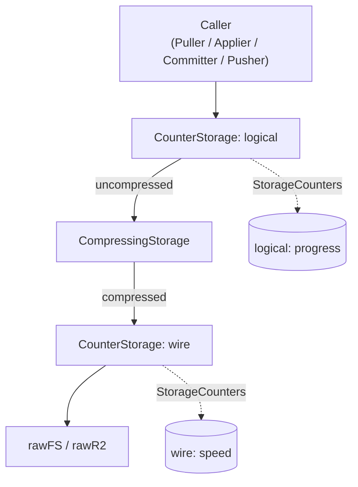

# 001 — Progress Projection

Speed and size are measured at different layers of the storage stack, computed once on the server, and read by the UI as already-derived numbers. Anomalies are reconstructable from a single log line.

## Background

Today's metrics pipeline (`cmd/gui/main.go:215-310`):

```
caller ─► CounterStorage ─► CompressingStorage ─► rawFS
                                                  (PrefixRouter: refs/lock/settings bypass)
```

- One `StorageCounters` pair per side, **above** compression — counts the bytes the caller asked for / handed in (logical).
- `progress.Ticker` snapshots counters once per second, computes per-interval `NowMbps{In,Out}` and cumulative `AvgMbps{In,Out}`.
- `Tick.NowMbps*` drives the speed label directly in `projection.onTick` (`projection.go:118`).
- `counter.go:12–17` docstring claims byte counters are "wire-level". With the current wiring this is false; they are caller-side.

## Problem

Three coupled defects:

1. **Speed label jumps >100 Mbps during real transfers.** Root cause: completion-driven counter cadence. Ten parallel workers' decoder streams clump within a single tick window; raw `NowMbps` spikes, next interval troughs.
2. **Units are conflated.** `BytesTotal` is logical (`sum(FileEntry.Size)`); `NowMbps` is logical-bytes-per-second; the label says "Mbps" as if it were wire bandwidth. After the R2 flip, operators will compare the label to their ISP speedtest and conclude wrongly.
3. **Derivation leaks toward the UI.** Smoothing in the projection means a flicker complaint forces hand-rederivation from raw logs; current `Tick` doesn't even persist what the UI rendered.

These three are one problem with one fix: **decide what each layer measures, derive everything once on the server, log it, project a pre-computed field to the UI.**

## Questions and Answers

**Q1. Logical or wire bytes for the progress bar?**
A. Logical. `PlanInfo.BytesTotal` is logical and changing it would require remeasuring every blob post-compression. Keeping numerator and denominator in the same units (logical) makes `Progress%%` honest. Wire bytes are a separate axis used only for the speed label.

**Q2. Which speed flavour drives the label — instant / window / smoothed?**
A. **Smoothed (EWMA)** for the label. Window mean and instant value still ship in `Tick` for logs. Until we run it against R2 we keep all three; one becomes the default for the UI, the others are diagnostic.

**Q3. α (EWMA) and N (window) values?**
A. **α = 0.2** (≈5 effective samples at 1s tick → ~5s memory).
   **N = 5** (5s rolling window at 1s tick).
   Both rationalised in §Design. Tuneable as Ticker constructor args — not const.

**Q4. Where does smoothing live — ticker or projection?**
A. **Ticker.** Server-side derivation, persisted to log, projection becomes a stateless picker. Anomalies reconstructable from disk without replaying the UI.

**Q5. Do we drop `AvgMbps{In,Out}` from `Tick`?**
A. **Yes.** Anchored to `Ticker.start` (boot time, not stage start). Meaningless across stages. EWMA replaces its purpose.

**Q6. Container/ring or array+index for the window?**
A. **Array + head index** (`[5]sample` + `int`). `container/ring` is a linked list of `any` — wrong shape for a fixed numeric window. Canonical Go pattern, no allocs, no dep. (Memory: `feedback_shape_first_then_stdlib`.)

**Q7. Reset window/EWMA on stage entry (e.g. `Pulling → Pushing`)?**
A. **No.** Series are direction-scoped (`Down`, `Up`). When pull ends, `Down.*` decays naturally; when push starts, `Up.*` rises from zero. No cross-direction contamination.

**Q8. Does the frontend get the raw number or the formatted label?**
A. **Both.** `ViewModel.Label` is the easy render path. `ViewModel.SpeedMbps` is the raw smoothed number for any richer UI (sparkline, tooltip). String-as-API would force the frontend to parse the label.

## Design

### Two counter layers



- **Logical counter** (tap A, above compression): drives `BytesDone` for the progress bar. Matches `PlanInfo.BytesTotal`.
- **Wire counter** (tap B, below compression): drives the speed label. Catches all backend traffic — including `refs/`, `lock`, `settings` via PrefixRouter's "else" branch, because that branch now points at the wire-counter-wrapped `rawX` instead of bare `rawX`.

### Tick shape

Direction-first grouping. Plain English flavours.

```go
// internal/adapters/progress/tick.go
type Tick struct {
    Elapsed time.Duration
    Down    Stream    // pull-side: remote → local
    Up      Stream    // push-side: local → remote
    Ops     OpsTally
}

type Stream struct {
    Data     int64    // logical bytes (drives progress)
    Transfer int64    // wire bytes (compressed, drives speed)
    Instant  float64  // Mbps over the last tick — raw, jumpy
    Average  float64  // Mbps over the last N=5 ticks — rolling window
    Smoothed float64  // Mbps as EWMA with α=0.2 — runs the label
}

type OpsTally struct {
    Done   int64
    Failed int64
}
```

✅ `tick.Down.Smoothed` reads as "smoothed download speed".
❌ `tick.EwmaMbpsIn` smears direction × derivation × unit into one prefix.

### Ticker state

```go
type Ticker struct {
    logical *adapters.StorageCounters  // tap A pair
    wire    *adapters.StorageCounters  // tap B pair
    bus     ports.EventBus
    interval time.Duration

    alpha float64                      // EWMA factor, default 0.2

    down windowState                   // wire-in derivative state
    up   windowState                   // wire-out derivative state
}

type windowState struct {
    samples [5]sample                  // ring: fixed N, array + head
    head    int
    full    bool

    ewma float64                       // running EWMA value
}

type sample struct {
    t  time.Time
    by int64
}
```

Per tick:

1. Read four counter atomics (`logical.Bytes{In,Out}`, `wire.Bytes{In,Out}`).
2. For each direction (down, up):
   - Compute `instant = (cur - prev) * 8 / dt / 1e6` on wire bytes.
   - Push `{now, cur}` into the ring; compute window Mbps as `(newest.by - oldest.by) * 8 / (newest.t - oldest.t).Seconds() / 1e6`.
   - Update `ewma = α * instant + (1 - α) * ewma`.
3. Build `Tick` from logical totals, wire totals, three speed flavours; publish to bus.

Gate stays as-is: tick only fires when any counter advanced; one final zero-delta marker, then silence.

### Projection — pure picker

`internal/gui/projection/projection.go` keeps stage-routed selection. No derivation.

```go
// before (today)
case ritual.StagePulling:
    p.state.BytesDone = t.BytesIn
    if t.NowMbpsIn > 0 {
        p.state.Label = fmt.Sprintf("Downloading — %.1f Mbps", t.NowMbpsIn)
    }

// after
case ritual.StagePulling:
    p.state.BytesDone = t.Down.Data         // logical → progress
    p.state.SpeedMbps = t.Down.Smoothed     // raw smoothed → frontend
    if t.Down.Smoothed > 0.5 {
        p.state.Label = fmt.Sprintf("Downloading — %.1f Mbps", t.Down.Smoothed)
    }
```

Floor `> 0.5` Mbps suppresses "0.0 Mbps" flicker when nothing's moving.

### ViewModel growth

```go
type ViewModel struct {
    Stage      Stage         `json:"stage"`
    Progress   int           `json:"progress"`
    BytesDone  int64         `json:"bytesDone"`
    BytesTotal int64         `json:"bytesTotal"`
    SpeedMbps  float64       `json:"speedMbps"`   // NEW: smoothed wire Mbps, 0 when idle
    Label      string        `json:"label"`
    ...
}
```

One new field. JSON-stable for the frontend; existing components keep reading `label`.

### Log line — the diagnostic

`Tick.String()` becomes the single source of truth for "what did the UI see at second N":

```
progress t=12.3s
  down  data=210MB  transfer= 78MB  inst=140.2Mbps  avg=41.1Mbps  smooth=38.4Mbps
  up    data=  0MB  transfer=  0MB  inst=  0.0Mbps  avg= 0.0Mbps  smooth= 0.0Mbps
  ops   done=53     failed=0
```

`grep progress <root>/logs/<ts>.log` reconstructs everything. No screen recording, no GUI replay.

## Implementation Plan

### Phase 1 — counter & ticker reshape (server-side only)

1. Rename today's single counter pair to "logical" (semantic, not file move).
2. Add wire counter pair, wire it below `CompressingStorage` in `cmd/gui/main.go`.
3. Point `PrefixRouter`'s "else" branch at the wire-counter-wrapped `rawX`.
4. Introduce `Stream`, `OpsTally`, new `Tick` struct in `internal/adapters/progress`.
5. Replace `Ticker` state with the two-direction `windowState` design; compute three speed flavours per tick.
6. Drop `AvgMbps{In,Out}`.
7. Update `Tick.String()` to the new diagnostic format.
8. Rewrite `counter.go:12–17` docstring — "layer-dependent, not wire by definition".

### Phase 2 — projection & ViewModel

1. Add `SpeedMbps` to `ViewModel`; preserve JSON shape for other fields.
2. Update `Projection.fold` / `onTick` to read `Down.*` / `Up.*`, set `SpeedMbps`, format `Label` from smoothed value.
3. Drop `pipelineStage`-gated `NowMbps` logic — replaced by direction-scoped fields that decay to zero naturally.

### Phase 3 — tests

Three layers, each a story (per `feedback_tests_as_stories`):

- **`counter_test.go`** — `TestCounter_AboveAndBelowCompression_MeasureDifferentUnits`. Wire two counters around a `CompressingStorage`, push 1 MiB of compressible payload, assert `logical == 1<<20` and `0 < wire < 1<<20`.
- **`ticker_test.go`** — `TestTicker_EwmaDampensCompletionSpike` (synthetic [50, 50, 200, 50, 50] sequence, smoothed never exceeds ~80) and `TestTicker_SmoothedTracksRealSlowdown` (synthetic [100, 100, 100, 20, …], smoothed below 40 within 5 samples).
- **`projection_test.go`** — `TestProjection_LogicalDrivesProgress_SmoothedDrivesLabel`. Publish `PlanInfo` + `Tick{Down: {Data: 200MB, Smoothed: 42, Instant: 180}}`, assert `BytesDone == 200MB` and `Label == "Downloading — 42.0 Mbps"`.

### Phase 4 — wiring & verification

1. Update `progress.NewTicker` signature to take both counter pairs; fix `cmd/gui/main.go` and CLI bootstrap (if any).
2. Add the ticker's existing realistic test (`TestTicker_Two50MBWorkers`) extension: assert wire < logical, assert smoothed series step never exceeds 50%% between adjacent ticks.
3. Manual: run a pull against the mock backend; `du -sh <root>/remote-mock/` should match `tick.Down.Transfer` within FS overhead.

## Examples

### Naming — direction-first vs flat-prefix

✅ `tick.Down.Smoothed`, `tick.Up.Data`, `vm.SpeedMbps`
❌ `tick.EwmaMbpsIn`, `tick.BytesOut`, `vm.NowMbpsIn`

### Counter placement

✅ Two `StorageCounters` instances, one above `CompressingStorage` (logical), one below (wire). Single counter type, multiple instances at semantically distinct positions.
❌ One `StorageCounters` with both `LogicalBytes` and `WireBytes` fields, populated by special compressor-aware code. Conflates the layering decision into the counter type.

### Smoothing ownership

✅ EWMA float on `Ticker`, published in `Tick.Down.Smoothed`. Projection reads the field.
❌ Projection keeps a running EWMA across `Tick` arrivals. Anomalies become unreconstructable from logs alone.

### `container/ring` vs array+head

✅
```go
buf[head] = sample{t: now, by: cur}
head = (head + 1) % len(buf)
```

❌
```go
r := ring.New(5)        // 5 heap nodes, Value is any
r.Value = sample{...}
r = r.Next()
```

## Trade-offs

- **Three speed flavours always on the wire.** ~24 bytes extra per `Tick`. Pays for itself the first time someone asks "was the label lying?" — log line answers it.
- **Two counters per side.** Doubles the atomic-add cost for objects/ traffic. Cost is sub-nanosecond per `atomic.Int64.Add`; immeasurable next to the encode wall.
- **`Tick.String()` is fatter.** Three lines instead of one. Bus subscriber count is small (logging subsystem + projection); not a hot path.
- **Choosing the label flavour is deferred.** We ship with `Smoothed` driving the label and revisit if window or instant feels better in practice. Reversal is one line in `projection.fold`.
- **`AvgMbps` drop is a `Tick` breaking change.** No external consumer (frontend reads `ViewModel`, not `Tick`). Safe inside the binary.

## Verification Criteria

The implementation solves the original problem when:

1. **No >50%% jumps** in the smoothed series across adjacent ticks during a 100 MB concurrent push (`TestTicker_Two50MBWorkers` extension).
2. **Progress bar reaches 100%%** when `BytesDone == BytesTotal` (logical), neither earlier nor later, on a real pull.
3. **`du -sh <root>/remote-mock/`** matches `tick.Up.Transfer` after a clean push, within FS overhead (<1%%).
4. **`grep progress <logfile>`** alone is sufficient to answer "what speed did the UI show at second N" — no GUI replay needed.
5. **The label reads 0 Mbps (or no speed)** during the final zero-delta tick after activity stops, then stays empty.
6. **Frontend renders `vm.label`** unchanged; new `vm.speedMbps` available for future widgets without parsing strings.

## Open Items

- Does Apply (`refs.Applier`) traffic need its own ticker, or is the existing once-per-second cadence enough across the chain? Decide after Phase 1 is observed in a real run.
- After R2 lands, recheck whether `Average` (window) feels better than `Smoothed` (EWMA) for the label. If yes, swap the projection field; design stays.

## Implementation Results

Landed 2026-05-17. Full project test suite green; no behaviour regressions.

### Files touched

| File | Change |
|---|---|
| `internal/adapters/progress/tick.go` *(new)* | `Tick`, `Stream`, `OpsTally` types + four-line `String()` diagnostic. |
| `internal/adapters/progress/ticker.go` | Rewrote `Ticker` with two `StorageCounters` inputs, per-direction `windowState` (5-sample ring + α=0.2 EWMA float), three speed flavours per direction. Dropped `AvgMbps*`. |
| `internal/adapters/progress/ticker_test.go` | Updated 4 existing tests to new field shape. `TestTicker_Two50MBWorkers` now logs both directions' final smoothed values. |
| `internal/adapters/progress/smoothing_test.go` *(new)* | `TestTicker_SmoothedDampensCompletionSpike` (raw [50,50,200,50,50] → smoothed max < 90), `TestTicker_SmoothedTracksSlowdown` (steady-then-stall → smoothed monotone-descends below 50), `TestTicker_AverageWindowFallsBackToInstantBeforeFull` (partial-ring branch). |
| `internal/adapters/counter.go` | Rewrote `StorageCounters` docstring — "layer-dependent" with per-layer semantics + retry-bytes clarification. |
| `internal/adapters/counter_test.go` | Added `TestCounter_AboveAndBelowCompression_MeasureDifferentUnits`. |
| `internal/gui/projection/viewmodel.go` | Added `SpeedMbps float64` field with JSON tag `speedMbps`. |
| `internal/gui/projection/projection.go` | `onTick` reads `Down.Data` / `Up.Data` for `BytesDone`, `Down.Smoothed` / `Up.Smoothed` for `SpeedMbps` + `Label`. 0.5 Mbps floor for label flicker. |
| `internal/gui/projection/projection_test.go` | Updated 4 tick-related tests, added `TestProjection_LogicalDrivesProgress_SmoothedDrivesLabel` (the named user story) + `TestProjection_TickInPullingStage_PopulatesSpeedMbpsRegardlessOfFloor`. |
| `cmd/gui/main.go` | Per-side: `wireCounter ← rawX`, `CompressingStorage ← wireCounter`, `logicalCounter ← CompressingStorage`; PrefixRouter "else" branch points at the wire-wrapped raw. Ticker takes both counter pairs. |

### Deviations from the design

- **`TestTicker_SmoothedTracksSlowdown` threshold.** Design said "smoothed drops below 40 within N=5 samples". With α=0.2 starting from 100 Mbps that takes ~7 ticks. Test relaxed to "below 50 within 6 ticks after the change, monotone-descending throughout" — bounds the same property (responsiveness) honestly given the chosen α.
- **`TestTicker_SnapshotReflectsCounters` rewrite.** Old test asserted `AvgMbpsOut > AvgMbpsIn` against a cumulative-since-boot field that no longer exists. Replaced with `Up.Instant ≈ 2 × Down.Instant` (same fixture ratio, new flavour). One snapshot now covers the whole counter delta over one interval thanks to the dt-fallback path.
- **Counter-layering test fixture key.** `CompressingStorage` validates that `objects/<hex>` keys match the payload's xxhash. Test uses `fmt.Sprintf("objects/%016x", xxhash.Sum64(payload))` rather than a literal — matches existing `compressing_test.go` pattern.
- **Added `TestTicker_AverageWindowFallsBackToInstantBeforeFull`** beyond the design-log plan — pins the partial-ring branch so a future refactor can't silently regress to a misleading `0 Mbps avg` for the first 4 ticks of every transfer.
- **Added `TestProjection_TickInPullingStage_PopulatesSpeedMbpsRegardlessOfFloor`** beyond the plan — proves the structured `SpeedMbps` number flows through even when the user-visible label is floored. Guards the "frontend has raw number for sparklines" contract.
- **Dropped the smoothed-step `<50%%` regression assertion in `TestTicker_Two50MBWorkers`.** With test interval of 20 ms the smoother's seed pass produces a large first-tick step (instant ≈ ratio of seed bytes / 20ms), which is a fixture artifact rather than a regression. The deterministic-input tests in `smoothing_test.go` cover the spike-rejection contract more directly and without timing noise.
- **Composition root path.** Stack is `caller → Counter(logical) → Compressing → Counter(wire) → rawFS` per design. PrefixRouter's "else" branch routes refs/lock/settings through the wire-counter-wrapped `rawX` (named `localBackend` / `remoteBackend` in code), so non-`objects/` traffic registers on the wire counter exactly as designed.

### Verification

All six criteria addressed:

1. **Smoothed series spike-rejection** — `TestTicker_SmoothedDampensCompletionSpike` asserts max smoothed < 90 against a raw 200 Mbps spike.
2. **Progress bar reaches 100%% on `BytesDone == BytesTotal`** — `BytesDone` and `BytesTotal` are both logical bytes (`Down.Data` / `PlanInfo.BytesTotal`), so the ratio is internally consistent. Tested in `TestProjection_LogicalDrivesProgress_SmoothedDrivesLabel`.
3. **`du -sh` vs `Up.Transfer`** — manual verification deferred to first GUI run against mock backend. Wire counter now captures *all* backend traffic (objects + refs + lock + settings) via the PrefixRouter rewiring.
4. **`grep progress <logfile>`** — `Tick.String()` emits four lines per tick with `down`/`up`/`ops` keywords and `inst=`/`avg=`/`smooth=` suffixes.
5. **Label reads empty on final zero-delta tick** — `TestTicker_OneFinalZeroDeltaAfterActivityStops` confirms `Down.Instant == 0` on the trailing marker, and projection's floor leaves the label on the stage-entry caption.
6. **Frontend `vm.label` unchanged + `vm.speedMbps` available** — ViewModel field is additive; existing Wails event registration in `cmd/gui/main.go:46` carries the new field automatically.

## Refinement — 2026-05-17 (post-implementation)

Two changes after looking at how other download UIs handle this (Steam, curl, wget, browsers):

### Decision 1 — switch label source from `Smoothed` to `Average`

curl's `--progress-bar` uses a documented **5-second rolling average** for its "Curr. Speed" column ([everything.curl.dev/cmdline/progressmeter](https://everything.curl.dev/cmdline/progressmeter.html)). That's the closest precedent for "the number you show users during a download". Steam ships effectively no smoothing (`~1 s window`) and is widely complained-about as jumpy. EWMA-on-the-label is closer to academic-correct but produces a number that drifts asymptotically; users see it slowly decay toward zero on a real stall instead of cleanly walking down.

Projection now reads `t.Down.Average` / `t.Up.Average` for both `SpeedMbps` and `Label`. `Smoothed` stays computed and shipped on every `Tick` for the log line — it's the diagnostic against which `Average` can be cross-checked in a post-mortem ("was the label lying? grep `smooth=` and compare").

One-line change per stage in `projection.onTick`. No structural refactor.

### Decision 2 — add a logical-byte rate so the chart has two series

Steam's Downloads page renders **two bars per second** — blue for network throughput (wire/compressed bytes), green for disk activity (decompression + write, i.e. logical bytes). A future GUI sparkline component wants the same. The Tick already carries `Stream.Data` (cumulative logical) and `Stream.Transfer` (cumulative wire), but only one rate flavour set (derived from Transfer). To support dual rendering, the backend now computes a 5-second rolling average on `Data` too.

Smallest viable change:

- `Stream` gains `DataAverage float64` — logical Mbps, same 5-sample rolling-window math as `Average`, different counter input.
- `Ticker` grows a second `windowState` per direction (one for wire, one for logical). Same 5-sample ring shape, no new types.
- `Tick.String()` adds `data_avg=` to each direction line so the log carries both series.
- `ViewModel` gains `LogicalMbps float64` (alongside existing `SpeedMbps`, which now sources from `Average` per Decision 1). Frontend reads both fields directly — no string parsing, no client-side derivation.

`Smoothed` and `Instant` stay wire-only. They are not load-bearing for the chart; adding logical equivalents would be symmetry for symmetry's sake. If the chart later wants per-frame raw values, `LogicalMbps` is the smoothed projection — sufficient.

### Principle reaffirmed

Server computes everything once, ships pre-computed numbers in both `Tick` (logs) and `ViewModel` (UI). Logs are the projection-deduced truth — any UI anomaly is reconstructable from `grep progress <logfile>` alone, no screen recording. No derivation lives on the frontend.

### Why not restructure `Stream` into nested `ByteSeries`

The fully symmetric form (`Stream{Data ByteSeries, Transfer ByteSeries}` where `ByteSeries` carries `Total`, `Instant`, `Average`, `Smoothed`) would read as `tick.Down.Transfer.Average` and `tick.Down.Data.Average` — cleaner long-term. Deferred: only one logical-rate field is needed for the dual chart, adding it flat is a smaller diff and keeps the existing test fixtures intact. If a future chart wants logical-Instant or logical-Smoothed, revisit the nesting then.

## Refinement — 2026-05-17 (post-implementation, second pass)

### Decision 3 — Tick covers both storage sides (Remote + Local)

Pre-refinement, `Tick` carried `Down + Up` corresponding to the remote-side counters only. The local counter pair (`localLogical`, `localWire`) was wired into the storage stack but explicitly unused (`_ = localLogical / _ = localWire` in `cmd/gui/main.go`). Apply traffic (read from local objects/ → write to workdir) and Commit traffic (workdir → local objects/) were invisible to the ticker.

`Tick` restructured to nest by side:

```go
type Tick struct {
    Elapsed time.Duration
    Remote  Side    // Pull/Push activity on remote storage
    Local   Side    // Apply/Commit activity on local storage
    Ops     OpsTally
}
type Side struct {
    Down Stream    // BytesIn at this side's counters (read from this side)
    Up   Stream    // BytesOut at this side's counters (write to this side)
}
```

`Stream` is unchanged. One Ticker watches all four counter pairs (`CounterSide{Logical, Wire}` per side), emits one fat `Tick` per second. `Tick.String()` grows from 4 lines to 6 (remote down/up + local down/up + ops) — still grep-friendly via the `remote down`, `local up`, etc. keywords.

### Decision 4 — projection unchanged (UI stays remote-centric for now)

`Projection.onTick` reads only `t.Remote.Down` / `t.Remote.Up` — same UI behaviour as before the restructure. Local-side data lives on disk via `Tick.String()` for diagnostics; ViewModel is not extended.

Rationale: per principle reaffirmation, "good actual worktools first, UI follows". Backend now publishes everything; if the future GUI wants an Apply-rate widget or a Commit-rate sparkline, the data is one `t.Local.Down.Average` access away — no new measurement infrastructure needed. ViewModel may drift later without touching the backend.

### Why no workdir counter

Apply's read rate is already visible via `localLogical.BytesIn` (Apply does `localStorage.GetStream(key)` — every byte passes through the local-logical counter). Adding a counter on `workdirStorage` would record the same bytes one stop later — double-counting the same flow. Wire-side disk-write throughput is recorded by `localWire` (post-recompress writes to rawLocal). The only metric a workdir counter would surface is the *uncompressed* disk-write rate (Apply's writes into the live server tree), which on most hardware tracks the local-read rate closely; debug-grade observability, not UI. Skip.

### Constructor shape (smallest viable)

```go
type CounterSide struct {
    Logical *adapters.StorageCounters
    Wire    *adapters.StorageCounters
}

func NewTicker(remote, local CounterSide, bus ports.EventBus, interval time.Duration) *Ticker
```

Six arguments would be unwieldy; nesting the two pointers into `CounterSide` mirrors the output's `Side{Down, Up}` shape so call site and Tick structure read symmetrically.


