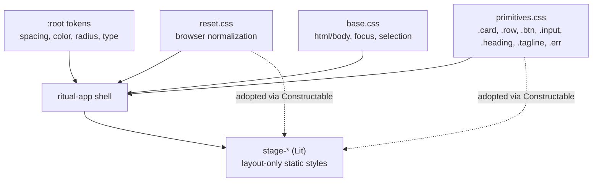

# 002 — GUI Reset: tokens + primitives, one look everywhere

- **Status:** Draft
- **Date:** 2026-05-17
- **Area:** GUI / Frontend
- **Related:** [001 Progress Projection](001-progress-projection.md), [[project_gui_plan]]

## Background

Frontend stack already on Wails + Lit + Vite + vanilla TS. Five stage
elements (`stage-idle`, `-locked`, `-downloading`, `-running`, `-uploading`)
plus `error-banner` and a `ritual-app` shell render the user-facing surface.
Global `frontend/public/style.css` (57 lines) sets a system-font fallback
chain; each stage carries a private `static styles` block (~50–80 lines)
with hardcoded sizes, colors, gradients, and radii.

## Problem

Same build looks different on macOS vs Windows. **Divergence is observed
but not yet measured** — reporter recalls "spaces and paddings" but did
not capture screenshots or DevTools readings. "Padding vs margin vs font
metrics vs box-sizing vs scrollbar gutter" is undetermined.

The hypotheses below are read off the source, not off measurements. Phase
0 of the plan confirms which ones actually fire before any code lands.

Hypothesised root causes visible in code:

1. **Font fallback divergence.** `:root` declares Inter first but falls
   through to `-apple-system, BlinkMacSystemFont, "Segoe UI", Roboto, …`.
   Inter `@font-face` declares weight 400 while bundling `Inter-Medium.ttf`
   (weight 500) — so the file rarely matches the requested weight and the
   browser picks a platform font. Different fonts → different metrics →
   different paddings.
2. **No design tokens.** Each stage hardcodes `0.75rem`, `1rem`, `2rem`,
   color literals, gradients, radii. A change in idle does not propagate;
   stages drift from each other.
3. **No shared primitives.** Input, button, row, card, heading,
   tagline, error text are reimplemented per stage. Identical-by-intent,
   not-identical-by-pixel.
4. **Platform-leaky CSS.** `prefers-color-scheme: light` block flips
   colors on macOS users who toggle light mode but is never tested.
   Native scrollbar, native focus ring, native form-control rendering all
   pass through.
5. **Body layout assumes desktop centring.** `body { place-items:center }`
   plus `min-height: 100vh` interacts oddly with Wails frameless windows
   on Win when the window is small.

User answer: scope = visual + component primitives (Lit already present),
strategy = **one look everywhere** — bundled font, custom controls, no
adaptive native chrome.

## Questions and Answers

> Q1. Use CSS variables on `:host` of `<ritual-app>` (Shadow DOM) or on
> `:root` of the global sheet?
>
> **A:** `:root` in `style.css`. Lit Shadow DOM inherits custom properties
> from the document. One source of truth, no per-component `--token-*`
> redeclaration. Component-scoped overrides still possible via `:host`.

> Q2. Keep stages as separate `LitElement`s or fold into one?
>
> **A:** Keep separate. They model orthogonal app states. Reset replaces
> their *style blocks*, not their structure.

> Q3. Introduce primitives as Lit components (`<ui-button>`) or as CSS
> classes (`<button class="btn primary">`)?
>
> **A:** CSS classes in a shared sheet plus one tiny base mixin for
> Shadow-DOM stages. Lit components for primitives invite props/events
> proliferation; the surface here is 5 stages. Classes win on LOC.

> Q4. Drop `prefers-color-scheme: light`?
>
> **A:** Yes. App is dark-only at this stage; matches "one look".

> Q5. Bundle which font and which weights?
>
> **A:** Inter, weights 400 + 500 + 600, woff2, self-hosted. Replace the
> current single `Inter-Medium.ttf` (mislabelled 400). Add explicit
> `@font-face` per weight. Set `font-family: Inter, sans-serif` with no
> system fallback after Inter — if Inter fails to load we want to see it
> in QA, not paper over it with `-apple-system`.

> Q6. Scrollbars?
>
> **A:** Custom (webkit-scrollbar) styled. Native Win scrollbar is the
> single largest visual divergence after fonts.

> Q7. Where do tokens live?
>
> **A:** `frontend/public/style.css` `:root` block. No build-time SCSS,
> no PostCSS plugin — Lit Shadow DOM reads CSS custom properties from the
> document.

> Q8. Migration order: tokens first or primitives first?
>
> **A:** Tokens first (Phase 1). Without tokens, primitives bake the same
> literals we are trying to eliminate.

> Q9. Should `static styles` survive?
>
> **A:** Yes — for layout *unique to a stage*. Repeated declarations
> (button, input, card, row, heading, tagline, error) move out. Stage
> styles shrink to ≤20 lines each.

## Design

### Layer cake



Four global sheets, loaded **reset → tokens → base → primitives**.
Tokens + base stay document-level. Reset + primitives are also adopted
into every Lit Shadow root (Shadow DOM inherits custom properties from
the host but not document rules).

### Browser reset — survey and choice

User agents disagree before our CSS runs: default `body`/`<h1>`/`<p>`
margins, `box-sizing: content-box`, `<button>` inheriting platform font
and chrome, `<input type="number">` rendered as native widget at
platform-defined width, focus-ring style, `` baseline gap. Reset
zeros these so tokens + primitives are the **only** source of visual
decisions.

Survey of currently maintained resets (2026):

| Reset                       | Last update | Philosophy            | Verdict for Wails+Lit                              |
|-----------------------------|-------------|-----------------------|----------------------------------------------------|
| **Andy Bell, "more modern"**| Sep 2023    | restrained eraser     | ✅ **picked** — preserves Lit's custom-property cascade, sets `font: inherit` on form controls |
| Josh Comeau                 | Mar 2026    | opinionated baseline  | ✅ acceptable swap — nearly equivalent coverage, more recent maintenance |
| the-new-css-reset (Shechter)| Aug 2024    | `all: unset` nuclear  | ❌ destroys inherited custom properties on `:host` — breaks Lit Shadow DOM |
| modern-normalize            | quiet       | normalize only        | ❌ keeps platform defaults we want gone            |
| Tailwind Preflight          | n/a         | coupled to Tailwind   | ❌ extraction not viable                           |
| destyle.css                 | Mar 2025    | full per-element erase| ❌ 240 lines, kills focus ring entirely            |
| sanitize.css                | Mar 2026    | normalize + opinions  | ❌ adds rules we override anyway                   |
| CSS Remedy                  | 2019        | abandoned             | ❌                                                  |
| open-props normalize        | Jan 2026    | tied to open-props    | ❌ requires the open-props token set               |

Why Bell over Shechter: `all: unset` removes inherited properties on
`:host`, including the custom-property cascade Lit relies on to pierce
Shadow DOM. Our tokens stop reaching components.

Why Bell over modern-normalize: normalize *preserves* platform defaults.
With custom controls we want them *erased*.

### Reset file (vendored)

```css
/* frontend/public/reset.css — Andy Bell base + 4 targeted additions */

/* --- Bell base --- */
*, *::before, *::after { box-sizing: border-box; }
* { margin: 0; }

html, body { height: 100%; }
html { -webkit-text-size-adjust: 100%; }
body { line-height: var(--lh-body, 1.5); -webkit-font-smoothing: antialiased; }

img, picture, video, canvas, svg { display: block; max-width: 100%; }
input, button, textarea, select { font: inherit; color: inherit; }
p, h1, h2, h3, h4, h5, h6 { overflow-wrap: break-word; }

:where(ul, ol)[role="list"] { list-style: none; }

:where(:focus-visible) { outline: 2px solid var(--border-hi); outline-offset: 2px; }
:where(:focus:not(:focus-visible)) { outline: none; }

/* --- Additions for one-look-everywhere --- */

/* 1. lock dark color scheme — kills macOS light-mode toggle */
:root { color-scheme: dark; }

/* 2. standard scrollbar (replaces -webkit-scrollbar; baseline in Chromium + WebKit 2025+) */
* { scrollbar-width: thin; scrollbar-color: var(--border) transparent; }

/* 3. strip native chrome from controls we replace */
button, input, select, textarea { -webkit-appearance: none; appearance: none;
                                  background: none; border: none; padding: 0; }
input[type="number"]::-webkit-inner-spin-button,
input[type="number"]::-webkit-outer-spin-button { -webkit-appearance: none; margin: 0; }
input[type="number"] { -moz-appearance: textfield; }

/* 4. text selection lock — only inputs select, not random UI text */
* { user-select: none; -webkit-user-select: none; }
input, textarea { user-select: text; -webkit-user-select: text; }

::selection { background: var(--accent); color: #fff; }
```

### Lit base class augmentation

Bell's reset penetrates Shadow DOM only when adopted. Plus every shadow
root needs `:host { box-sizing: border-box; display: block; }` so the
box model propagates without relying on global penetration.

```ts
// frontend/src/ui/base.ts
import { LitElement, CSSResult, css, unsafeCSS } from "lit";
import resetSheet      from "../../public/reset.css?inline";
import primitivesSheet from "../../public/primitives.css?inline";

const hostBaseline = css`
  :host { display: block; box-sizing: border-box; }
  :host *, :host *::before, :host *::after { box-sizing: inherit; }
`;

export const sharedStyles: CSSResult[] = [
  unsafeCSS(resetSheet),
  unsafeCSS(primitivesSheet),
  hostBaseline,
];

export class BaseStage extends LitElement {
  static styles: CSSResult | CSSResult[] = [...sharedStyles];
}
```

Custom properties defined on `:root` cross the shadow boundary by
default, so tokens reach components without import.

### Tokens (initial set)

```css
:root {
  /* spacing — 4px grid */
  --space-1: 4px;
  --space-2: 8px;
  --space-3: 12px;
  --space-4: 16px;
  --space-5: 24px;
  --space-6: 32px;

  /* radius */
  --radius-sm: 6px;
  --radius-md: 10px;
  --radius-lg: 14px;

  /* color (dark, single palette) */
  --bg:           #1b2636;
  --surface:     rgba(255,255,255,0.06);
  --surface-hi:  rgba(255,255,255,0.10);
  --border:      rgba(255,255,255,0.15);
  --border-hi:   rgba(120,180,255,0.60);
  --text:        rgba(255,255,255,0.92);
  --text-muted:  rgba(255,255,255,0.65);
  --accent:      #2563eb;
  --accent-hi:   #3d82ff;
  --danger:      #ff9e9e;

  /* type */
  --font-sans: "Inter", sans-serif;
  --fs-1: 14px;
  --fs-2: 16px;
  --fs-3: 20px;
  --fs-display: 36px;
  --lh-tight: 1.15;
  --lh-body:  1.5;
}
```

Pixel-fixed sizes (not `rem`) — same physical size whatever the OS does
to root font.

### Bundled font

```css
@font-face { font-family: Inter; font-weight: 400; font-style: normal;
  src: url("./fonts/Inter-Regular.woff2")  format("woff2"); font-display: swap; }
@font-face { font-family: Inter; font-weight: 500; font-style: normal;
  src: url("./fonts/Inter-Medium.woff2")   format("woff2"); font-display: swap; }
@font-face { font-family: Inter; font-weight: 600; font-style: normal;
  src: url("./fonts/Inter-SemiBold.woff2") format("woff2"); font-display: swap; }
```

No fallback after Inter except `sans-serif` (browser default, signals QA
miss).

### Primitives (CSS classes)

```css
.card     { display:flex; flex-direction:column; gap:var(--space-4);
            padding:var(--space-6) var(--space-5); background:var(--surface);
            border-radius:var(--radius-lg); }
.row      { display:flex; align-items:center; justify-content:space-between;
            gap:var(--space-4); }
.heading  { font-size:var(--fs-display); font-weight:600;
            letter-spacing:-0.02em; line-height:var(--lh-tight); margin:0; }
.tagline  { color:var(--text-muted); margin:0; }
.btn      { padding:var(--space-3) var(--space-4); border:none;
            border-radius:var(--radius-md); font:inherit; font-weight:600;
            cursor:pointer; }
.btn.primary { background:linear-gradient(180deg,var(--accent-hi),var(--accent));
               color:#fff; }
.btn:disabled { opacity:.6; cursor:progress; }
.input    { width:120px; padding:var(--space-2) var(--space-3);
            border:1px solid var(--border); border-radius:var(--radius-sm);
            background:var(--surface); color:inherit;
            font:inherit; outline:none; }
.input:focus { border-color:var(--border-hi); background:var(--surface-hi); }
.err      { color:var(--danger); font-size:var(--fs-1); margin:0; }
```

### Reaching primitives through Shadow DOM

Lit Shadow DOM does not inherit `<style>` from the document. Two options
considered:

| Option                                  | Pros                       | Cons                        |
|----------------------------------------|----------------------------|-----------------------------|
| A. Import shared sheet via Constructable `adoptedStyleSheets` | one file, automatic | needs a small base class    |
| B. Stay with light DOM (`createRenderRoot() { return this }`) | trivial    | loses style encapsulation   |

Picking **A**. A `BaseStage` exposes `static styles = [sharedSheet, ...]`
so each stage stays a thin wrapper plus its own layout-only block.

```ts
// frontend/src/ui/base.ts
import { LitElement, CSSResult, unsafeCSS } from "lit";
import shared from "../../public/primitives.css?inline";

export const sharedStyles = unsafeCSS(shared);

export class BaseStage extends LitElement {
  static styles: CSSResult | CSSResult[] = [sharedStyles];
}
```

Custom properties from `:root` of the host document already pierce Shadow
DOM, so tokens work without import.

### Scrollbar lock

```css
*::-webkit-scrollbar           { width:10px; height:10px; }
*::-webkit-scrollbar-thumb     { background:var(--border);    border-radius:var(--radius-sm); }
*::-webkit-scrollbar-thumb:hover{ background:var(--border-hi); }
*::-webkit-scrollbar-track     { background:transparent; }
```

### Drop

- `@media (prefers-color-scheme: light)` block.
- `-apple-system, BlinkMacSystemFont, "Segoe UI", …` fallback chain.
- `place-items:center` / `min-height:100vh` on `body` (move to app shell).

## Implementation Plan

### Phase 0 — Measure first (no code change)

Reset before measurement risks fixing things that weren't broken and
missing things that were.

1. Build current `main` on macOS and Windows.
2. Screenshot every stage at fixed window size (e.g. 800×600), same DPI
   scaling, both OSes. Store under `design-log/002-screenshots/baseline/`.
3. Pixel-diff macOS-vs-Win pair per stage. Record divergent regions
   (overlay PNG + bbox list).
4. For each divergent region, open DevTools on both OSes and capture:
   - computed `font-family`, `font-size`, `font-weight`, `line-height`
   - computed `padding`, `margin`, `border`, `box-sizing`
   - element `getBoundingClientRect()` width/height
5. Tabulate as `design-log/002-screenshots/diagnosis.md`:

   | Stage | Region        | macOS value | Win value | Likely cause           |
   |-------|---------------|-------------|-----------|------------------------|
   | idle  | input width   | …           | …         | font / appearance / border |
   | idle  | h1 top margin | …           | …         | UA default margin      |

6. **Gate:** only causes that actually show up in the diagnosis table
   justify reset rules. Causes that don't appear are crossed off the
   hypothesis list (kept in this design log for the record).

### Phase 1 — Tokens & font (no behaviour change)
1. Add `frontend/public/fonts/Inter-{Regular,Medium,SemiBold}.woff2`.
2. Rewrite `frontend/public/style.css`:
   - token `:root` block,
   - three `@font-face` declarations,
   - drop light-mode media query,
   - scrollbar rules.
3. Replace literal colors / sizes in current `static styles` with `var(--*)`
   — mechanical pass, no structural change. Stages still self-styled.

### Phase 2 — Primitives sheet
4. Add `frontend/public/primitives.css` with the class set above.
5. Add `frontend/src/ui/base.ts` with `BaseStage` + Constructable sheet.
6. Migrate stages one by one (`stage-idle` first; smallest):
   - extend `BaseStage`,
   - keep `static styles` for stage-only layout,
   - swap repeated declarations for shared classes in template markup.
7. Delete now-dead style blocks.

### Phase 3 — Audit pass
8. Re-screenshot every stage on macOS + Windows, same fixtures as Phase 0.
9. Pixel-diff against the Phase 0 baseline *and* against the other OS.
   Each remaining cross-OS divergence is a residual bug.
10. Convert each surviving divergence into a token or primitive entry.
11. Append "Implementation Results" with the Phase 0 diagnosis table,
    which hypotheses were confirmed/refuted, and the post-fix diffs.

## Examples

### Before (`stage-idle.ts`, partial)
```ts
static styles = css`
  .card { display:flex; flex-direction:column; gap:1rem; padding:2rem 1.5rem; }
  h1    { font-size:2.4rem; font-weight:600; letter-spacing:-0.02em; }
  input { padding:0.5rem 0.75rem; border:1px solid rgba(255,255,255,.15);
          border-radius:8px; background:rgba(255,255,255,.06); … }
  button.primary { background:linear-gradient(180deg,#3d82ff,#2563eb); … }
`;
```
❌ Drift surface: rem-vs-px mix, rgba literals, magic radii.

### After
```ts
import { html } from "lit";
import { customElement } from "lit/decorators.js";
import { BaseStage } from "../ui/base";

@customElement("stage-idle")
export class StageIdle extends BaseStage {
  render() {
    return html`
      <section class="card">
        <h1 class="heading">Ritual</h1>
        <p class="tagline">Press Start. We'll handle the rest.</p>
        <label class="row"><span>Port</span>
          <input class="input" type="number" …></label>
        <label class="row"><span>Memory (MB)</span>
          <input class="input" type="number" …></label>
        <button class="btn primary" …>Start</button>
      </section>`;
  }
}
```
✅ No private styles, no literals, behaviour unchanged.

## Trade-offs

| Choice                              | Gain                                   | Cost                                       |
|-------------------------------------|----------------------------------------|--------------------------------------------|
| Bundled Inter, no system fallback   | identical metrics macOS/Win/Linux      | +~80 KB woff2; load failure shows ugly     |
| Tokens in document `:root`          | one source of truth, Shadow-DOM-safe   | global namespace, no SCSS scoping          |
| CSS classes over Lit primitives     | minimal LOC, no event/prop API to keep | no per-primitive Shadow-DOM encapsulation  |
| `BaseStage` Constructable sheet     | shared sheet hot-swappable             | one indirection in component class graph   |
| Drop light-mode media query         | one look                                | macOS light-mode users see dark UI         |
| Custom scrollbars                   | identical Win/macOS                    | non-WebKit fallback rough (not a target)   |

## Verification Criteria

1. **Font:** DevTools → Computed → `font-family` returns Inter on macOS,
   Windows, and a clean Linux container. No `-apple-system` ever observed.
2. **Token coverage:** `grep -E '#[0-9a-f]{3,6}|rgba?\(' frontend/src/**` returns
   only token definitions in `style.css` — zero literal colors in TS stages.
3. **Spacing coverage:** `grep -E '[0-9]+(px|rem|em)' frontend/src/stages/**`
   returns only stage-unique layout values; shared spacings come from
   `var(--space-*)`.
4. **Pixel parity:** screenshots of each stage at 800×600 on macOS and
   Windows differ by < 2% per pixel-diff tool. Reference screenshots
   stored under `frontend/dist/__screenshots__/` (committed).
5. **Stage shrinkage:** each `static styles` block ≤20 lines post-migration.
6. **Smoke:** `vite build` succeeds; Wails dev build renders all stages
   without console errors.
