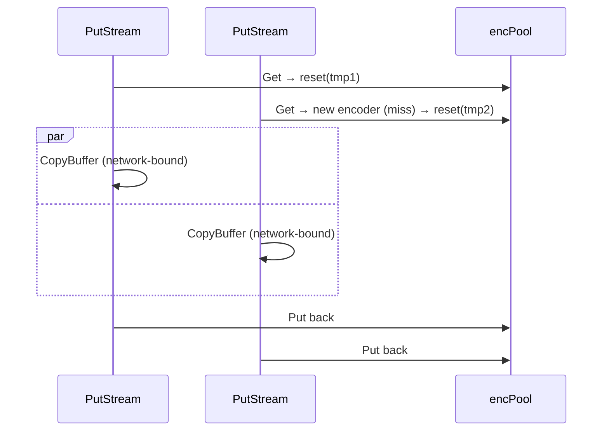

# 003 — Encoder Pool for CompressingStorage

**Date:** 2026-05-18
**Status:** Implemented

## Background

`CompressingStorage` (`internal/adapters/compressing.go`) decorates a `StorageRepository` with zstd encode on `PutStream` and zstd decode + xxhash verify on `GetStream`. Decoders already pool (`decPool`, line 38) so parallel `GetStream` calls run without contention. Encoders do not — one `*zstd.Encoder` serialised by `encMu` (lines 33–36) handles every `PutStream`.

The original asymmetry was deliberate per the type comment ("Push: one encoder serialised … Pull: a sync.Pool of decoders") on the assumption that pushes are infrequent. That assumption is wrong on **Pull**: both ends store compressed at rest, so every pulled blob calls `PutStream` on the local destination — i.e. every pulled blob takes `encMu`.

## Problem

Production pull log `~/Downloads/20260513191326.log` 19:13:33 → 19:16:05:

- `ParallelRunner` limit = 10 fans out 10 concurrent `transferBlob` calls (confirmed by `ops=18` at failure, putstream durations `12, 25, 40, 69, 111, 119, 129, 138, 149, 149 s` — staggered slot recycling).
- `CompressingStorage.PutStream` holds `encMu` for the **entire** `io.CopyBuffer(c.enc, body, …)` duration (line 121). The lock-hold is bounded by network read speed, not CPU.
- While one blob holds the lock, the other 9 R2 `GetStream` bodies sit unread. The R2 SDK / Cloudflare edge times out idle bodies → next Read returns `io.ErrUnexpectedEOF`.
- First EOF cancels the runner ctx (`ParallelRunner.captureErr`, parallelrunner.go:54). Siblings die `context canceled`. `Pulling → Failed`. No auto-recovery (separate concern, not this log).

Net: a "10-way parallel" pull is in practice ~1-way, and the unused 9 connections become a liability instead of an asset.

## Questions and Answers

**Q1: Is `zstd.Encoder` safe to reuse via `Reset(sink)` after `Close()`?**
A: Yes — klauspost/compress encoder docs: `Reset(w io.Writer)` resets internal state and binds a new sink; safe after `Close()`. Decoder side already exercises the symmetric API (`acquireDecoder` line 172, `releaseDecoder` line 185).

**Q2: How big is one encoder at `SpeedDefault`?**
A: ~few MB (window + match tables). Pool plateaus at `ParallelRunner.limit` (=10) in steady state ⇒ tens of MB total. Within budget; no caller objects.

**Q3: Does the encoder lock also serialize buffer reuse?**
A: Currently `bufPool` (line 37) is `sync.Pool` per-byte-buffer and unconditionally shared; that's already lock-free. No coupling.

**Q4: Anything else still under `encMu`?**
A: Just the `CopyBuffer` + `Close`. With the pool, both move inside `acquireEncoder` / `releaseEncoder` boundaries. No remaining critical section.

**Q5: Why not also fix re-compression on pull (decode-then-encode)?**
A: Separate change, larger scope; option (3) from the chat. Encoder pool restores the *intended* concurrency without touching the integrity contract. Decompose-then-recompose stays for a follow-up.

**Q6: Should we add retry in `transferBlob` here?**
A: No. Encoder pool removes the *correlated* failure (one slow blob starving siblings). A real single-stream EOF is still possible and still terminal. Retry lands in a separate log.

## Design

Mirror the decoder side exactly.

```go
type CompressingStorage struct {
    inner   ports.StorageRepository
    bufPool sync.Pool
    encPool sync.Pool   // replaces `enc *zstd.Encoder` + `encMu sync.Mutex`
    decPool sync.Pool
}
```

Constructor stops pre-building one encoder; first-use creates on demand and the pool retains it.

```go
func (c *CompressingStorage) acquireEncoder(sink io.Writer) (*zstd.Encoder, error) {
    if v := c.encPool.Get(); v != nil {
        enc := v.(*zstd.Encoder)
        enc.Reset(sink)
        return enc, nil
    }
    return zstd.NewWriter(sink, zstd.WithEncoderLevel(zstd.SpeedDefault))
}

func (c *CompressingStorage) releaseEncoder(enc *zstd.Encoder) {
    enc.Reset(io.Discard)   // detach previous sink; symmetric with releaseDecoder(nil)
    c.encPool.Put(enc)
}
```

`PutStream` becomes:

```go
enc, err := c.acquireEncoder(tmp)
if err != nil {
    return fmt.Errorf("failed to acquire zstd encoder for %s: %w", key, err)
}
bufPtr := c.bufPool.Get().(*[]byte)
_, copyErr := io.CopyBuffer(enc, body, *bufPtr)
c.bufPool.Put(bufPtr)
closeErr := enc.Close()
c.releaseEncoder(enc)
// rest unchanged
```

Type-comment block updates: drop the "Push: one encoder serialised by encMu" sentence; symmetric pool description for both directions.



## Implementation Plan

1. Edit `internal/adapters/compressing.go`:
   - Drop `enc`, `encMu`; add `encPool sync.Pool`.
   - Rewrite `NewCompressingStorage` — no pre-built encoder.
   - Add `acquireEncoder` / `releaseEncoder` mirroring decoder pair.
   - Rewrite `PutStream` to use the pool.
   - Update type doc-comment block.
2. Add regression test in `internal/adapters/compressing_test.go`:
   - `TestCompressingStorage_EncoderPoolNoSerialization` — N=10 concurrent `PutStream` calls into an `inner` whose `PutStream` sleeps `D`. Assert wall time < `2 * D` (would be `≥10 * D` under the old mutex). Pins the regression class, not an exact timing.
3. Run `go test ./internal/adapters/... -race -timeout 30s` and ensure pre-existing concurrent tests still pass.
4. Append "Implementation Results" to this log with deviations + pass counts.

## Examples

✅ Symmetric pool, lock-free hot path:
```go
enc, _ := c.acquireEncoder(tmp)
io.CopyBuffer(enc, body, *bufPtr)
enc.Close()
c.releaseEncoder(enc)
```

❌ Don't:
- Reintroduce a global mutex around `acquireEncoder` "for safety" — `sync.Pool` is already safe.
- Pre-fill the pool to limit — let the pool grow naturally; first call into `ParallelRunner.limit` is a one-time `NewWriter` cost amortised over the process lifetime.
- Try to share buffers between `bufPool` and the encoder's internal window — different lifetimes.

## Trade-offs

- **+** Removes the `encMu` bottleneck. R2 bodies stop sitting idle waiting for the encoder; correlated-EOF cascade goes away.
- **+** ~30-line diff. Mirrors a pattern already in the file.
- **−** Tens of MB extra resident memory in steady state. Acceptable.
- **−** Does not fix genuine single-stream EOF. Out of scope; tracked separately.
- **−** Re-compression on pull stays. Out of scope; tracked separately.

## Verification

- New regression test fails on `main`, passes after change.
- Existing `TestCompressingStorage_Concurrent` (line 163), `_ConcurrentPull` (297), `_ConcurrentPushPull` (351) stay green under `-race`.
- `TestCompressingStorage_DecoderPoolReuse` ceiling (50 allocs/call) unchanged — encoder change is on the `PutStream` path.
- Manual pull against the bucket that produced the original log: 10 concurrent putstreams show overlapping CopyBuffer windows (no longer staggered by encoder hand-off). Out-of-band confirmation only; CI does not exercise live R2.

## Implementation Results

**Date:** 2026-05-18
**Files touched:**
- `internal/adapters/compressing.go` — dropped `enc`/`encMu`, added `encPool`, `acquireEncoder`, `releaseEncoder`; rewrote `NewCompressingStorage` (no pre-built encoder); rewrote `PutStream` hot path; updated type doc-comment.
- `internal/adapters/compressing_test.go` — added `TestCompressingStorage_EncoderPoolNoSerialization` + `slowReader` helper.

**Deviations from design:** none.

**Tests:**
- `go test ./internal/adapters/... -race -timeout 30s` — all green (`adapters`, `adapters/observed`, `adapters/progress`).
- New regression test wall time: **0.07 s** for N=10, D=50 ms. Under the old encMu serialisation the same fan-out would have been ≥ N×D = 500 ms; ceiling set to 2×D = 100 ms.
- Pre-existing concurrency suite stays green: `TestCompressingStorage_Concurrent`, `_ConcurrentPull`, `_ConcurrentPushPull`, `_DecoderPoolReuse` (steady-state allocs unchanged at 22/call vs. 50 ceiling).

**Surprises:** none. The encoder pool mirrored the decoder pair with no API-side adjustments.
