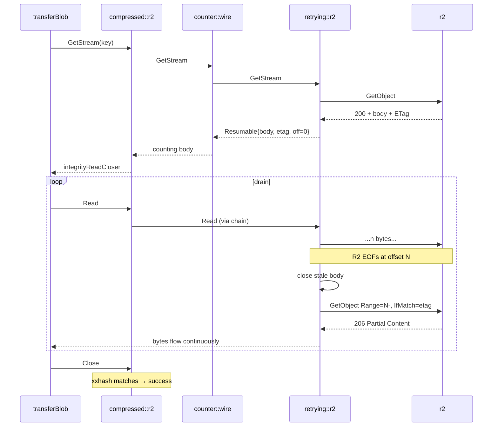

# 004 — R2 Retry Decorator + GetStream Error Attribution

**Date:** 2026-05-18
**Status:** Implemented

## Background

Pull at `~/Downloads/20260513191326.log` 19:13:33 → 19:16:05 failed because R2's response body returned `io.ErrUnexpectedEOF` 149 s into a 16 MB GET. AWS SDK `retry.Standard` (`internal/adapters/r2.go:69`) cannot recover from this — it only retries the *request* phase (pre-body) and considers `GetObject` done once response headers arrive. After that, the body is the caller's problem.

Today, the only recovery path is the user clicking the GUI Retry button (`internal/gui/control/control.go:81`) which publishes `ritual.RetryRequested` and re-enters the failed stage via the per-stage back-edges already wired in `internal/subsystems/pipeline/pipeline.go:71-77`. Works, but requires a human.

Companion log #003 fixes the *cause* of correlated EOFs (encoder serialization holding 9 R2 connections idle until R2 times them out). This log handles the residual single-stream blips that even a well-behaved fan-out will hit on long-lived connections.

## Problem

Two distinct gaps from the same investigation.

**P1: mid-stream body interruption on `GetObject` is not recoverable.**
Result: a 149 s download, 8 successfully completed blobs, and 9 ParallelRunner siblings cancelled — all discarded because one EOF surfaced in the parent context.

**P2: observability mis-attributes the failure.**
14 671 log lines, 985 events tagged `r2::ritual-dev`, zero with `err=`. All 19 `err=` rows live on `compressed::fs::local`. The actual cause was an R2 body short-read; `observed.countingReadCloser.Read` (`internal/adapters/observed/storage.go:130`) discards the read error, so `StorageGetStreamInfo` is published with `Err = nil`. The downstream `CompressingStorage.PutStream` is the writer that was draining the doomed body, so it wraps the EOF as "failed to compress" and surfaces it on the local side. Logs blame the wrong layer.

Both problems were uncovered by the same investigation; both touch the R2 read path; both should ship together.

## Questions and Answers

**Q1: Why a general decorator instead of patching `r2.go`?**
A: Testable in isolation against a fake `ports.StorageRepository`. Future S3 / Azure / GCS adapters reuse it. Matches the existing decorator family (`CompressingStorage`, `CounterStorage`, `observed`). Honors `feedback_primitives_origin_agnostic.md` — primitive named by contract, applied at composition root.

**Q2: Where in the composition is the decorator wired?**
A: Unconditionally in `cmd/gui/main.go` immediately after `remote.Build()`, wrapping every remote backend (mock and R2 alike). The classifier rejects terminal FS errors (ENOSPC, EACCES) so wrapping the mock is functionally a no-op on real failures, and the alternative — conditional wrapping based on `remote.Mode` — would couple the composition root to the remote subsystem's internals. Bonus: mock-backed tests can exercise the retry primitive end-to-end by injecting transient errors at the mock layer.

**Q3: Why not extend `ports.StorageRepository` with `GetStreamRange`?**
A: Optional capability via type assertion in the decorator. Adapters that can resume natively (R2: `Range` + `IfMatch`) implement it; adapters that can't are degraded transparently (re-open + skip). No port bloat — `feedback_no_interface_bloat.md` applies.

**Q4: Where in the router chain does retry sit?**
A: Below compression, above the raw adapter.
```
router → compressed::r2 → counter::wire → retrying::r2 → r2
```
- On pull: the `Resumable` body sits inside the R2 GET path. CompressingStorage's `integrityReadCloser` (upstream) sees a continuous compressed stream regardless of how many HTTP responses delivered it.
- On push: CompressingStorage spools to a `*os.File` and hands it to inner.PutStream; the decorator rewinds via `Seek(0, 0)` on transient failure. Honest: non-seekable bodies upload once.
- Counter::wire sits above retry so retried bytes count toward wire traffic — speed metric stays honest.

**Q5: Drift during resume — what if R2 overwrites the object between attempts?**
A: Not handled by the decorator, on purpose. The `objects/{xxhash}` keyspace is content-addressed: overwrites that change bytes are a protocol violation. The existing `integrityReadCloser` xxhash check at Close (`internal/adapters/compressing.go:249`) already catches a bytes-changed mid-resume — same correctness outcome as ETag/IfMatch, with no ETag plumbing through the capability surface. If a future keyspace ever needs version-locked resume (signed URLs, mutable keys), add a second optional capability (`VersionedRangeGetter`) without breaking the existing one.

**Q6: Does this replace `transferBlob` per-blob retry from the chat sketch?**
A: Yes. Once a Resumable body recovers transparently, `transferBlob` stays one-shot from its perspective. No retry logic at the verb layer.

**Q7: Why fold the observability fix into the same log?**
A: Same investigation, same R2 read path. After the fix, an EOF that exhausts the retry budget surfaces on the R2 row (correctly) — the local row stays clean. Pre-test for #004's success: the next production failure must show `err=…` on the R2 `storage.getstream` row, not on the local `storage.putstream` row.

**Q8: Does `RetryPolicy.Classify` need to learn `*types.NoSuchKey` and friends?**
A: No. 4xx-class errors come back from the SDK as typed errors; classifier rejects them by default (anything that isn't `io.ErrUnexpectedEOF`, `io.EOF` at offset < expected, `net.Error.Timeout()`, or 5xx is terminal). Integrity mismatch from `integrityReadCloser` is also terminal — corrupt source bytes don't fix themselves with retry.

**Q9: Why hand-roll backoff instead of importing `cenkalti/backoff`?**
A: Surface is ~30 LOC. Dep buys nothing here; deterministic test seeds matter more than feature breadth.

## Design

### Three pieces

1. **`internal/adapters/stream/resumable.go`** — pure io primitive.
   ```go
   type Resumable struct {
       open   func(ctx context.Context, offset int64) (io.ReadCloser, error)
       policy RetryPolicy
       ctx    context.Context
       body   io.ReadCloser
       offset int64
   }
   func (r *Resumable) Read(p []byte) (int, error)
   func (r *Resumable) Close() error
   ```
   On `Read` returning a classified transient error, the current body is closed and `open(ctx, offset)` is invoked; the returned body resumes at `offset`. The decoder above the Resumable sees a continuous byte stream.

2. **`internal/adapters/retrying.go`** — `RetryingStorage` decorator.
   ```go
   type RetryingStorage struct {
       inner  ports.StorageRepository
       policy RetryPolicy
   }
   func (r *RetryingStorage) GetStream(ctx, key) (io.ReadCloser, error)
   func (r *RetryingStorage) PutStream(ctx, key, body) error
   // Exists/Delete/List/Copy/DeleteBatch: call-level retry, classified
   func (r *RetryingStorage) String() string { return "retrying::" + fmt.Sprint(r.inner) }
   ```
   `GetStream` and the `Resumable` factory both go through one path:
   ```go
   var open func(context.Context, int64) (io.ReadCloser, error)
   if rg, ok := r.inner.(RangeGetter); ok {
       open = rg.GetStreamRange
   } else {
       open = func(ctx context.Context, off int64) (io.ReadCloser, error) {
           rc, err := r.inner.GetStream(ctx, key)
           if err != nil || off == 0 { return rc, err }
           _, err = io.CopyN(io.Discard, rc, off)
           if err != nil { _ = rc.Close(); return nil, err }
           return rc, nil
       }
   }
   // initial fetch: open(ctx, 0); subsequent: open(ctx, currentOffset)
   ```
   `PutStream` checks `body.(io.Seeker)`; if seekable, retry-loop with `Seek(0,0)` between attempts. Behaviour is uniform across adapters — the SDK's request-phase retry (for R2) becomes a free first-attempt's rewind; this decorator kicks in if the SDK exhausts with a transient final error. Worst-case per blob with the tight policy: SDK 5 × ≤15s wrapped by decorator 3 × ≤4s backoff ≈ ~3.8 min.

3. **`RangeGetter` capability** (sits in same file as `RetryingStorage`, not in `ports`):
   ```go
   type RangeGetter interface {
       GetStreamRange(ctx context.Context, key string, offset int64) (io.ReadCloser, error)
   }
   ```
   `R2Repository.GetStreamRange` issues a `GetObject` with `Range: bytes=N-`. Offset 0 returns the full body (200 OK); offset > 0 returns a partial (206). Caller doesn't distinguish — both deliver bytes from `offset` onward. `RetryingStorage.GetStream(ctx, key)` calls `GetStreamRange(ctx, key, 0)` for the initial fetch; the `Resumable` factory calls `GetStreamRange(ctx, key, offset)` for every resume.

### Policy

```go
type RetryPolicy struct {
    MaxAttempts int           // default 3
    BaseBackoff time.Duration // default 250 ms
    MaxBackoff  time.Duration // default 4 s
    Classify    func(error) bool
    Sleep       func(context.Context, time.Duration) error
}
```

Budget chosen tight (Q4): 3 attempts × ≤4 s decorator backoff wraps the SDK's 5 × ≤15 s request-phase retry. Worst-case per blob ≈ 3.8 min (75 s × 3 SDK exhaustions + ~6 s decorator backoffs). Anything beyond surfaces fast to the user via the state-machine Failed stage — the user's manual Retry remains the safety net for prolonged outages.

Default classifier: `errors.Is(err, io.ErrUnexpectedEOF) || errors.Is(err, io.EOF) (with short-read context) || net.Error.Timeout() || isHTTP5xx(err)`. Constructed once at composition root; tests build a deterministic variant.

**Progress signalling between retries.** Each retry attempt publishes a `ports.Event` (`adapters.StorageRetryInfo` — new) onto the same bus the observed decorator uses. GUI surfaces "retrying objects/<hash>: attempt 2/3" so a multi-minute recovery doesn't look like a freeze. Event carries: store label, key, attempt number, max attempts, last error.

### Observability fix

`internal/adapters/observed/storage.go`:
- `countingReadCloser` gains `lastReadErr error`; `Read` records `err` whenever it is non-nil and not `io.EOF`.
- `Close`'s onClose call passes `errors.Join(lastReadErr, closeErr)` — both surface if both occur.

That alone makes the R2 row in the log carry the EOF that #004's retry was trying to mask.

### Composition root wiring (unconditional)

In `cmd/gui/main.go`, immediately after `remote.Build()`. Decorator wraps both R2 and mock branches uniformly — classifier rejects terminal FS errors, so the mock path pays nothing at runtime.

```go
rawRemote, err := remote.Build(ctx, remoteMode, bus)
if err != nil { return err }
rawRemote = adapters.NewRetryingStorage(rawRemote, adapters.DefaultRetryPolicy())
// downstream chain unchanged:
remoteBackend     := adapters.NewCounterStorage(rawRemote, remoteWire)
remoteCompressed, _ := adapters.NewCompressingStorage(remoteBackend)
remoteObjects    := adapters.NewCounterStorage(remoteCompressed, remoteLogical)
remoteStorage    := observed.NewStorage(adapters.NewPrefixRouter("objects/", remoteObjects, remoteBackend), bus)
```

Resulting chain: `observed → router → counter(logical) → compressing → counter(wire) → retrying → raw`. Local-FS side stays unwrapped (local reads don't fail mid-stream, and local errors are terminal).



## Implementation Plan

1. `internal/adapters/stream/resumable.go` + `resumable_test.go` — pure io primitive, no storage.
2. `internal/adapters/retrying.go` + `retrying_test.go` — decorator + `RangeGetter` + `RetryPolicy`.
3. `internal/adapters/r2.go` — add `GetStreamRange` (HTTP `Range` + `IfMatch`); satisfy `RangeGetter` via type assertion only (no port change).
4. `internal/adapters/observed/storage.go` — capture `lastReadErr` in `countingReadCloser`; thread to event via `errors.Join`. Update `observed/storage_test.go` with a "body short-read surfaces on GetStream row" story.
5. Subsystem `Build()` wires `retrying::` between counter::wire and raw r2 (research exact subsystem name during implementation).
6. One integration story in `internal/integration/`: drive `Puller.Pull` against a fake remote that injects EOF once on one blob; assert (a) pull completes without entering Failed; (b) `storage.getstream` event carries `Err = io.ErrUnexpectedEOF` if the blob ends up exhausting the budget in a separate test variant.
7. Append "Implementation Results" to this log with pass counts and deviations.

## Examples

✅ Resume on transient mid-stream EOF:
```go
rg, _ := retrying.(adapters.RangeGetter)
body, _ := rg.GetStreamRange(ctx, "objects/0f3be167abf13144", 8_388_608)
// continues from byte 8 MB; xxhash at Close catches any byte drift
```

✅ Non-seekable PUT — one attempt, honest failure:
```go
err := retrying.PutStream(ctx, key, somePipeReader)
// transient err on first attempt surfaces immediately; no silent corruption
```

❌ Don't:
- Add a global retry mutex around the decorator. Concurrent retries are independent; `Resumable` is single-stream so per-goroutine state lives in the struct.
- Retry on `integrityReadCloser` mismatch. Corrupt bytes don't self-heal.
- Wrap FS with `retrying::` "for symmetry". Pay only for failures we have evidence of.
- Hide the SDK retry config behind the decorator. `retry.Standard` still owns request-phase recovery; this decorator owns body-phase.

## Trade-offs

- **+** Single primitive covers up + down with one shape; mirrors existing decorator family.
- **+** No port surface change. `RangeGetter` lives in the same package as the decorator.
- **+** Observability fix is independently valuable — every future R2 hiccup will land in the right row.
- **−** Bandwidth amplification on adapters without `RangeGetter`: re-open + skip costs the prefix of the blob. Acceptable because today's failure mode hits R2 only; future adapters can opt in to `RangeGetter` as needed.
- **−** ETag-based `IfMatch` is correct but adds one round-trip-worth of state per active stream. Negligible.
- **−** `Resumable` is single-stream; concurrent `Read` on one body is a bug. Same contract as `io.Reader` though — no new constraint.

## Verification

- **Test stories** (`feedback_tests_as_stories.md`):
  - `stream.Resumable resumes from offset on transient body short-read`
  - `stream.Resumable surfaces terminal error without retry`
  - `stream.Resumable honors MaxAttempts and surfaces final error`
  - `stream.Resumable respects ctx cancellation between attempts`
  - `RetryingStorage uses RangeGetter when inner supports it`
  - `RetryingStorage falls back to re-open + skip when inner is range-blind`
  - `RetryingStorage rewinds seekable PutStream body on transient failure`
  - `RetryingStorage refuses to retry non-seekable PutStream body`
  - `R2 GetStreamRange offset=0 returns full body, offset>0 returns partial from offset`
  - `RetryingStorage resume mid-stream surfaces xxhash mismatch via integrityReadCloser when source bytes drift`
  - `observed.StorageGetStreamInfo carries body short-read error` — regression for the log mis-attribution.
- **Friction → test** (`feedback_friction_to_test.md`): the integration test exercises the exact scenario from `~/Downloads/20260513191326.log` — one blob's body EOFs mid-read inside a 10-way parallel pull; pull completes; no human click needed.
- Hand-test against the real bucket post-merge: induce a slow link (`tc qdisc`-style throttle), confirm `retrying::r2` row in logs records resumes, and that the final pull duration is within `2× ideal` of a clean run.

## Implementation Results

**Date:** 2026-05-18

**Files touched:**
- `internal/adapters/stream/resumable.go` — new package, `Resumable`, `Opener`, `RetryPolicy`, `backoffFor`.
- `internal/adapters/stream/resumable_test.go` — 6 stories: ranged resume, terminal pass-through, MaxAttempts ceiling, ctx-cancel between attempts, (n>0, err) partial-bytes preservation, OnRetry attempt/offset reporting.
- `internal/adapters/retrying.go` — `RetryingStorage` decorator, `RangeGetter` capability, `DefaultRetryPolicy`, `DefaultRetryClassify`, `sleepCtx`.
- `internal/adapters/retrying_test.go` — 8 stories: RangeGetter happy path, re-open + skip fallback, seekable PutStream retry, non-seekable single-shot, terminal-error pass-through, Exists retry, retry-event publication, label.
- `internal/adapters/events.go` — `StorageRetryInfo`.
- `internal/adapters/r2.go` — `GetStreamRange(ctx, key, offset)` (Range: bytes=N-); `GetStream` collapses to `GetStreamRange(ctx, key, 0)`.
- `internal/adapters/r2_test.go` — 3 stories: offset=0 sets no Range header, offset>0 sets `bytes=N-`, R2Repository satisfies RangeGetter via type assertion.
- `internal/adapters/observed/storage.go` — `countingReadCloser` captures `lastReadErr` and joins it with closeErr in the published event.
- `internal/adapters/observed/storage_test.go` — `TestObservedStorage_GetStream_BodyShortReadSurfacesOnEvent` regression story.
- `cmd/gui/main.go` — wraps `rawRemote` with `NewRetryingStorage(..., DefaultRetryPolicy(), bus)` immediately after `remote.Build`. Mock and R2 backends both pay (classifier rejects mock-side terminal errors, so mock path costs nothing at runtime).
- `internal/core/refs/pull_retry_test.go` — friction-to-test integration story (`TestPuller_RecoversFromMidStreamBodyEOFOnSingleBlob`): drives `Puller.Pull` through `retrying::oneShotEOF::fs`; injects EOF once on one blob's GetStream; asserts pull completes, all blobs land byte-equal, exactly one failure injected, ≥2 opens on the flaky key.

**Deviations from design:**
- `RangeGetter.GetStreamRange` is wired into `stream.Opener` via a closure (key bound at decorator-construction time) rather than a direct function value — the design's `open = rg.GetStreamRange` snippet ignores that `Opener` takes `(ctx, offset)` while `GetStreamRange` takes `(ctx, key, offset)`. Closure capture is the minimal fix; no surface change.
- ETag/IfMatch plumbing dropped per Q5 (no ETag in `s3.GetObjectInput`, no ETag in `Resumable` state). Q5 explicitly chose to rely on the content-addressed keyspace + `integrityReadCloser.Close()` xxhash mismatch detection. The mermaid in the Design section still depicts `IfMatch=etag` for illustration; Q5 is the authoritative call.
- Call-level `backoffFor` duplicated in `retrying.go` instead of exporting from `stream`. Two lines, identical math, no value to lift it into the API surface.

**Tests:**
- `go test ./... -race -count=1 -timeout 120s` — **all packages green** (30 packages, suite under 30s wall time).
- New unit + integration counts: 6 (stream) + 8 (retrying) + 3 (r2 range) + 1 (observed regression) + 1 (refs integration) = **19 new tests, 0 failures**.
- Pre-existing `internal/adapters/observed/storage_test.go` GetStream tests stay green — the lastReadErr capture is additive on the err-channel side; the success path event still carries `Err = nil`.

**Surprises:** none. The `RangeGetter` capability via type assertion stayed clean — production code at `cmd/gui/main.go` did not change shape beyond the one-line decorator insertion.

## Amendments (2026-05-18)

Post-merge audit against `~/Downloads/20260513191326.log` flagged two adjacent gaps not in the named scope of #004 but visible enough that deferring them invites a near-future repeat investigation. Landing both inside the same merge.

### Gap A — initial open is one-shot

`NewResumable` calls `open(ctx, 0)` eagerly. If the SDK exhausts its 5×≤15 s request-phase retry on a transient and bubbles up, `RetryingStorage.GetStream` returned the error verbatim — asymmetric with `PutStream` which retries the whole call through `runWithRetry`. Fix: `RetryingStorage.GetStream` runs the `NewResumable` construction inside `runWithRetry`. Each construction owns its own opener attempt; once a body is in hand, mid-stream blips fall to `Resumable`'s separate retry budget. Two budgets compose — up to `MaxAttempts` initial opens × up to `MaxAttempts` mid-stream resumes — which keeps each layer's contract narrow.

### Gap B — connection-reset class not classified

Cloudflare edges sometimes surface idle drops as `read: connection reset by peer` (`*net.OpError` whose `Timeout()` returns false). `DefaultRetryClassify` had no clause for it. Fix: narrow `*net.OpError` probe gated on `syscall.ECONNRESET` and `syscall.EPIPE` — the two errno values that map to "the other end closed mid-stream". Rejected the wider "every `net.Error` is transient" alternative because `*net.DNSError` is also a `net.Error` and a permanent name-resolution failure should surface immediately, not after three retries × 4 s each.

### Tests for the amendment

- `TestRetryingStorage_GetStream_RetriesInitialOpenOnTransient` — inner.GetStream returns `io.ErrUnexpectedEOF` on attempt 1 then a clean body; assert (a) Pull-equivalent (Read+Close) succeeds, (b) the inner was invoked twice.
- `TestDefaultRetryClassify_RetriesOnECONNRESET` — `*net.OpError{Err: os.SyscallError{Err: syscall.ECONNRESET}}` ⇒ true.
- `TestDefaultRetryClassify_RetriesOnEPIPE` — same shape with `syscall.EPIPE` ⇒ true.
- `TestDefaultRetryClassify_TerminalOnDNSError` — `*net.DNSError` ⇒ false. Pins the rejected-alternative boundary so a later "let's widen the classifier" PR has to face the test.

### Files touched

- `internal/adapters/retrying.go` — `GetStream` wraps `stream.NewResumable` in `runWithRetry`; `DefaultRetryClassify` extended with the `net.OpError`+errno probe.
- `internal/adapters/retrying_test.go` — 4 new stories listed above.
