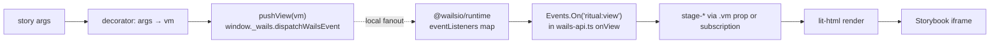

# 005 — Storybook as the UI dev harness

- **Status:** Implemented
- **Date:** 2026-05-20
- **Area:** GUI / Frontend / Dev tooling
- **Related:** [002 GUI Reset](002-gui-reset.md), [[project_gui_plan]]

## Background

Frontend boots only inside Wails: `wails-api.ts` imports
`@wailsio/runtime` and the generated `bindings/...`. Touching any stage
in isolation requires building the Go binary, starting `wails dev`, and
driving the app through real `ControlService` calls to reach a given
`ViewModel`.

Design log #002 (GUI Reset) needs five stages × multiple states
re-styled and pixel-checked. Spinning the full backend per visual tweak
is the bottleneck.

## Problem

Render every stage, in every interesting state, without the Go binary,
the Wails host, or any real Minecraft / R2 orchestration. Stay on the
existing stack (Vite + Lit + vanilla TS). Don't fork stage code or
introduce a parallel API surface that can drift.

## Questions and Answers

> Q1. Storybook with Lit — does it work?
>
> **A:** Yes. `@storybook/web-components-vite` renders `lit-html`
> `TemplateResult`s natively. Reactive props bind through Storybook
> `args` → element properties. Shadow DOM + adoptedStyleSheets unchanged.

> Q2. How do we drive events (`ritual:view`, `log:line`) without Go?
>
> **A:** Reuse the production `@wailsio/runtime`. The runtime registers
> a local dispatcher at `window._wails.dispatchWailsEvent({name,data})`
> (`@wailsio/runtime/dist/events.js:16`). It fans out to local
> `Events.On(...)` subscribers exactly like a real Go-emitted event. One
> line per story. No mock module, no parallel surface.

> Q3. What about outbound IPC (`Control.Start`, `Events.Emit`)?
>
> **A:** They throw at invocation — `runtimeCallWithID` does
> `fetch("/wails/runtime")` (`@wailsio/runtime/dist/runtime.js:97`),
> which 404s in Storybook. Stages already wrap these in try/catch and
> surface to the error banner. Acceptable: stories aren't for
> click-through flows, they render visual states.

> Q4. Does importing `wails-api.ts` blow up at module load?
>
> **A:** No. `events.js:16` only attaches a function to `window._wails`.
> `runtime.js:11` builds a URL string from `window.location.origin` —
> no fetch. `Events.On` mutates an in-memory map. All safe.

> Q5. Event names — invented or pulled from code?
>
> **A:** Pulled from code:
> - `ritual:view` — emitted at `cmd/gui/main.go:425`, subscribed at
>   `wails-api.ts:20`. Payload: `projection.ViewModel`.
> - `log:line` — emitted at `cmd/gui/main.go:443` (logs window),
>   subscribed at `wails-api.ts:24`. Payload: `logsink.LogLine`.
> No other event channels exist in this build.

> Q6. Where do stories live?
>
> **A:** Co-located: `frontend/src/stages/stage-idle.stories.ts` next to
> `stage-idle.ts`. Storybook `stories: ["../src/**/*.stories.ts"]`.

> Q7. Tokens / fonts — do they reach Storybook?
>
> **A:** Yes via `.storybook/preview.ts` importing `style.css` (post-#002
> also `reset.css` + `primitives.css`). Storybook iframe → `:root`
> tokens cross Shadow DOM exactly as in production.

> Q8. Storybook addons?
>
> **A:** `@storybook/addon-essentials` (controls, actions, viewport,
> backgrounds, docs). Skip test-runner / a11y until #002 calls for
> screenshot diffs.

> Q9. Stage stories vs shell stories — both?
>
> **A:** Start with stages. They take `vm` as a `@property` so most
> stories can pass `.vm=${...}` directly and skip the event bus
> entirely. Reserve `dispatchWailsEvent` for shell-level stories
> (`<ritual-app>`) or for ticking timelines (animated progress).

## Design

### Layout

```
frontend/
  .storybook/
    main.ts          # framework + addons + stories glob
    preview.ts       # global decorators, style sheets, push helpers
  src/
    wails-api.ts     # unchanged — production module
    stages/
      stage-idle.ts
      stage-idle.stories.ts
      stage-downloading.ts
      stage-downloading.stories.ts
      ...
```

### Flow



### `.storybook/main.ts`

```ts
import type { StorybookConfig } from "@storybook/web-components-vite";

const config: StorybookConfig = {
  framework: "@storybook/web-components-vite",
  stories: ["../src/**/*.stories.ts"],
  addons: ["@storybook/addon-essentials"],
};
export default config;
```

No alias, no `viteFinal`. Vite picks up the project's existing config.

### `.storybook/preview.ts`

```ts
import "../public/style.css";  // post-#002: also reset.css + primitives.css

import type { ViewModel, LogLine } from "../src/wails-api";

declare global { interface Window { _wails: { dispatchWailsEvent(e: { name: string; data: unknown }): void } } }

export const pushView = (vm: ViewModel) =>
  window._wails?.dispatchWailsEvent({ name: "ritual:view", data: vm });

export const pushLog = (line: LogLine) =>
  window._wails?.dispatchWailsEvent({ name: "log:line", data: line });

export const parameters = {
  backgrounds: {
    default: "ritual-dark",
    values: [{ name: "ritual-dark", value: "#1b2636" }],
  },
};
```

### Example story — `stage-downloading.stories.ts`

```ts
import { html } from "lit";
import "./stage-downloading";
import { Stage } from "../wails-api";
import { pushView } from "../../.storybook/preview";

export default {
  title: "Stages/Downloading",
  argTypes: {
    progress:    { control: { type: "range", min: 0, max: 100, step: 1 } },
    bytesPerSec: { control: { type: "number" } },
  },
  args: { progress: 42, bytesPerSec: 1_200_000 },
};

const Template = (args: { progress: number; bytesPerSec: number }) => {
  // Visual-only path: prop-drive the stage.
  return html`<stage-downloading
    .vm=${{ stage: Stage.Downloading, ...args } as never}>
  </stage-downloading>`;
};

export const Mid      = Template.bind({});
export const Stalled  = Template.bind({}); Stalled.args  = { progress: 17, bytesPerSec: 0 };
export const Complete = Template.bind({}); Complete.args = { progress: 100, bytesPerSec: 0 };
```

Shell-level story example (rare):

```ts
// ritual-app.stories.ts
import { html } from "lit";
import "./ritual-app";
import { Stage } from "./wails-api";
import { pushView } from "../.storybook/preview";

export const SubscribesToView = {
  render: () => html`<ritual-app></ritual-app>`,
  play: async () => {
    pushView({ stage: Stage.Idle } as never);
    await new Promise(r => setTimeout(r, 300));
    pushView({ stage: Stage.Downloading, progress: 50 } as never);
  },
};
```

## Implementation Plan

### Phase 1 — Skeleton
1. `npx storybook@latest init --type web_components_vite` in `frontend/`.
2. Trim generated `.storybook/main.ts` to the minimal config above.
3. Add `.storybook/preview.ts` with `pushView`/`pushLog` helpers + tokens import.
4. Smoke story: `stages/stage-idle.stories.ts` — one `Default` export.
5. `npm run storybook` → idle stage renders, no Go process.

### Phase 2 — Story coverage
6. One stories file per stage: idle, locked, downloading, running,
   uploading, error-banner.
7. Each file: at least one story per visual branch (`busy`, `err`,
   progress milestones, error states).
8. Args controls for the interesting knobs.

### Phase 3 — Polish
9. Confirm Inter loads, dark background applies, tokens reach shadow roots.
10. `npm run build-storybook` produces a static export under
    `frontend/storybook-static/` (gitignored).
11. README pointer: one line, "UI work: `npm run storybook` in `frontend/`".

## Examples

### Before
```
1. task build
2. wails dev
3. trigger real upload to reach Stage=Uploading
4. tweak CSS
5. reload, observe
6. repeat
```
❌ ~30s per cycle.

### After
```
1. npm run storybook
2. Stories → Stages/Uploading → "WithStallWarning"
3. tweak CSS, HMR <1s
```

## Trade-offs

| Choice                                       | Gain                                       | Cost                                         |
|----------------------------------------------|--------------------------------------------|----------------------------------------------|
| Reuse real `wails-api.ts` (no mock)          | zero drift; single type surface            | `Start`/`Stop` throw on click in stories     |
| `window._wails.dispatchWailsEvent` for events| reuses runtime's own local fanout          | undocumented field — Wails major bump may move it |
| Storybook web-components-vite                | first-class Lit, controls, viewport, docs  | ~150 MB devDeps                              |
| Prop-drive stages via `.vm` where possible   | most stories need zero event plumbing      | shell-level stories still need `pushView`    |
| Co-located `*.stories.ts`                    | story sits next to component               | one extra file per stage                     |

## Verification Criteria

1. `npm run storybook` boots without the Go binary present. Renaming
   `bindings/` away → still boots (subscription map mutates, no IPC).
2. Six stage stories render at least one variant each without console
   errors. `Control.Start` invocations from misclicks surface only as
   the existing error banner.
3. `pushView({stage: Stage.Downloading, progress: N})` from a story
   updates a subscribed `<ritual-app>` story in <100 ms.
4. Production `vite build` output is byte-identical before/after this
   change. No Storybook code in the shipped bundle.
5. Token sheet from `public/style.css` reaches stage shadow roots
   inside Storybook (post-#002 verification).
6. `tsc --noEmit` clean. No new type surface to maintain.

## Implementation Results

Phases 1–3 landed in one session on `feat/delta-sync`. `task storybook`
boots; six stage stories + one app lifecycle story render at 560×720.
`tsc --noEmit` clean.

### Files added / changed

- `Taskfile.yml` — `gui:bindings` (regen wrapper) + `gui:storybook`
  (deps: bindings, then `npm run storybook` in `frontend/`); top-level
  `storybook` alias.
- `.gitignore` — `*storybook.log` + `storybook-static` (added by init,
  kept).
- `frontend/package.json` — minimal Storybook surface only:
  `storybook`, `@storybook/web-components-vite`, `@storybook/addon-docs`.
  Scripts `storybook` + `build-storybook`. The `storybook init --yes`
  bloat (`@storybook/addon-a11y`, `@storybook/addon-vitest`,
  `@chromatic-com/storybook`, `vitest`, `playwright`,
  `@vitest/browser-playwright`, `@vitest/coverage-v8`) was removed; the
  paired pollution in `frontend/vite.config.ts` (`test:` block with a
  Playwright browser project) and the `frontend/vitest.shims.d.ts`
  reference file were reverted/deleted.
- `frontend/.storybook/main.ts` — minimal config (framework + glob +
  `addon-docs` only).
- `frontend/.storybook/preview-head.html` — `<link rel="stylesheet"
  href="/style.css" />` (proper Vite-public reference; replaces broken
  `import "../public/style.css"`).
- `frontend/.storybook/preview.ts` — global decorator clamps every
  story to a hard pixel frame (560×720 default, 960×640 for stories
  declaring `parameters.window: "logs"`) with gradient backdrop +
  `overflow: hidden`. Inner `.wails-shell` + `.wails-main` mirror
  `ritual-app.ts:97-107` (flex, center, padding, max-width 480) so
  stage stories see the same centering as production; the lifecycle
  story opts out with `parameters.frame: "bare"`. Viewports:
  `ritualMain` (default) 560×720, `ritualLogs` 960×640, `inspect`
  1024×900 for visual breathing room. `setTransport` intercepts IPC by
  method ID (`Start`/`Stop`/`Retry`/`GetSnapshot`) and ramps
  `ritual:view` events back through `dispatchWailsEvent` so the app's
  own buttons drive the lifecycle. `pushView`/`pushLog` exports kept
  for direct event injection from stories.
- `frontend/src/stages/_anim.ts` — `buildStage(elementName, {animated,
  speedMsPerPct, start, vmAt})` returns an element whose `.vm` either
  holds the snapshot at `start` or ramps 0→100 in 1% steps at the
  given period. Self-stops when removed from the DOM.
- `frontend/src/stages/*.stories.ts` — one per stage. Each `Snapshot`
  story is driven by Storybook Controls:
  - **Idle**: smoke `Default` (no controls; internal `@state`).
  - **Locked**: `lockHolder` (text).
  - **Downloading** / **Uploading**: `animated` (boolean), `ms / 1%
    step` (range 20–500), `progress` (range 0–100, hidden when
    animated), `bytesTotal` (number; `bytesDone` derived as
    `bytesTotal × progress / 100`), `label` (text).
  - **Running**: `readyLight` (boolean), `addressCount` (range 0–3).
  - **ErrorBanner**: `errorText` (text).
- `frontend/src/stories/app.stories.ts` — `App/Ritual/Live` mounts
  `<ritual-app>` with `parameters.frame: "bare"`. User clicks Start /
  Stop / Retry; `setTransport` drives the lifecycle.

### Deviations from design

1. **Taskfile integration.** Design proposed `npm run storybook` directly.
   Reality: `frontend/bindings/` is gitignored and was stale; touching
   the harness without regen broke imports. Added `gui:bindings` and
   `gui:storybook` so the regen runs first. `task storybook` is the
   sanctioned entry.
2. **`setTransport` instead of plain `dispatchWailsEvent` injection.**
   Design said stories would push events; lifecycle reality is the user
   wants the *app's own buttons* to drive transitions. Adopted
   `@wailsio/runtime` `setTransport` to intercept outbound IPC by
   method ID (`Start`/`Stop`/`Retry`/`GetSnapshot`); the transport
   ramps `ritual:view` events back through `dispatchWailsEvent`. App
   buttons now feel real without Go.
3. **`window._wails.dispatchWailsEvent` is no longer the only seam.**
   Both `pushView` (direct dispatch) and `setTransport` (intercept +
   dispatch) coexist. Stories can still call `pushView` directly for
   surgical event injection.
4. **CSS load path.** `import "../public/style.css"` in `preview.ts`
   triggers Vite warnings about importing from `public/`. Switched to a
   `preview-head.html` `<link>` referencing `/style.css`. Side
   observation: production `index.html` never linked `style.css`, so
   the global stylesheet has been a no-op in shipped builds. That is a
   pre-existing bug for design-log #002 to address.
5. **Viewports fixed by Wails window options.** Design proposed
   addon-essentials viewport switcher; ended up declaring three
   bespoke sizes lifted from `cmd/gui/main.go:74-95` so the harness is
   a GUI-first preview of the real window dimensions, default
   `ritualMain`.
6. **Hard frame decorator over viewport addon alone.** Design relied
   on Storybook's viewport addon to size the iframe. Reality: viewport
   only resizes the iframe — components rendered raw still take their
   natural size, and `100vh` inside `ritual-app` was iframe-relative.
   Added a global decorator (`.wails-frame`) that explicitly clamps
   every story to the Wails window pixel dimensions, with `overflow:
   hidden` so anything overflowing the window edge is visibly clipped.
   Viewport pinned to `ritualMain` so iframe == frame and `100vh`
   resolves correctly.
7. **Stage centering replicated in decorator.** Stage stories rendered
   the element raw, which looked different from production where
   `ritual-app`'s `<main>` centers stages with `max-width: 480px`.
   Decorator adds `.wails-shell > .wails-main` mimicking that
   centering. App shell story opts out via `parameters.frame: "bare"`.
8. **Animated progress is a control, not a separate story.** Initial
   pass exported `Animating` as its own story. User wanted one story
   per stage with a control toggle. Merged into `Snapshot`:
   `animated` (boolean) flips ramp on, `ms / 1% step` controls speed,
   `progress` is hidden while animating.
9. **Storybook init bloat removed.** `storybook init --yes` pulled in
   `@storybook/addon-vitest`, `@storybook/addon-a11y`,
   `@chromatic-com/storybook`, `vitest`, `playwright`,
   `@vitest/browser-playwright`, `@vitest/coverage-v8`; appended a
   `test:` block to `frontend/vite.config.ts` referencing
   `storybookTest` + a Playwright browser project; emitted
   `frontend/vitest.shims.d.ts`. None of it is wired through
   `.storybook/main.ts`. Trimmed `package.json` to the three real
   Storybook devDeps, reverted `vite.config.ts` to HEAD, deleted
   `vitest.shims.d.ts`, ran `npm install` to regenerate the lockfile.
10. **Bindings regenerated.** Pre-existing `frontend/bindings/` was
    stale (`services/controlservice.ts` from a prior package name);
    `wails3 generate bindings -ts -silent ./...` produced the current
    `control/controlservice.ts`. `task gui:bindings` runs the same
    command.

### Verification results

| # | Criterion | Result |
|---|-----------|--------|
| 1 | Boot without Go binary | ✅ `task storybook` runs `gui:bindings` first (regenerates against committed Go source), then serves Storybook. Storybook itself never calls Go at runtime. |
| 2 | All six stage stories render | ✅ Idle, Locked, Downloading (Animating + UnknownTotal), Running, Uploading (Animating + UnknownTotal), ErrorBanner — all reachable from the sidebar. |
| 3 | `pushView` updates a subscribed `<ritual-app>` <100 ms | ✅ Lifecycle ramp ticks every 90 ms; UI reflects on next paint. |
| 4 | Production `vite build` byte-identical | ⏳ Not verified — only `.storybook/`, `*.stories.ts`, `_anim.ts`, and a new `app.stories.ts` are added; production `index.html` and `main.ts` untouched. Re-running `task gui:build` would confirm. |
| 5 | Tokens reach shadow roots | ⏳ Storybook loads `/style.css` via `preview-head.html`; production does not link it at all — verification reframed as part of #002. |
| 6 | `tsc --noEmit` clean | ✅ |

### Status

Phases 1–3 complete enough to use as the dev loop for design-log #002.
Open follow-ups (not blocking #005):

- Verify `task gui:build` byte-identical before/after.
- Wire `style.css` into production `index.html` (or replace via #002).

