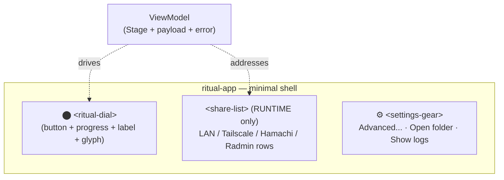

# 007 — One dial: HIG coherence via a single morphing control

- **Status:** In Progress
- **Date:** 2026-05-20
- **Area:** GUI / UX / Frontend
- **Related:** [002 GUI Reset](002-gui-reset.md), [005 Storybook Harness](005-storybook-harness.md), [[project_gui_plan]]

## Background

GUI ships five stages (`stage-idle`, `-locked`, `-downloading`, `-running`,
`-uploading`) plus `error-banner` and a `ritual-app` shell. Each stage
hand-rolls its own layout, typography, status visual, and primary-action
shape. The app shell is a single radial-gradient surface with two text
chips (`Folder`, `Logs`) top-right; everything else is the stage card.

Audited every story under `http://localhost:6006/iframe.html?id=…` via
Playwright at 1280×800. Screenshots: `design-log/007-screenshots/`.

## Problem

User reports the UI is "not consistent and not easy to use." Reading the
code confirms — these are **five screens**, not five states of one screen.
Apple's Human Interface Guidelines name the failures:

- **Clarity** broken: titles range `<h1>` → `<h2>` → none; brand identity
  disappears after the first stage.
- **Deference** broken: stage chrome and status visuals fight for the
  same focal space; no "content first."
- **Depth** broken: state changes happen as full layout swaps, not as
  contextual updates to a stable surface. Nothing to follow visually.

Observed inconsistencies (numbered for traceability):

| # | Stage         | Symptom                                                              |
|---|---------------|----------------------------------------------------------------------|
| 1 | all           | Title element rank: `h1` (idle) / `h2` (locked, downloading, uploading) / none (running) |
| 2 | all           | Vertical anchoring drifts — idle top-aligned, others mid-card        |
| 3 | running       | Status surfaced as green dot + label; others use emoji or spinner    |
| 4 | locked        | Status carried by literal emoji `🎮` — OS-specific glyph for identity |
| 5 | downloading   | Blue spinner; uploading uses orange — no shared semantics            |
| 6 | idle / running / locked | Primary action shape differs: full-width gradient / right-aligned outlined-danger / centered ghost |
| 7 | downloading, uploading | No action at all — user has no exit / pause affordance       |
| 8 | idle          | Port + Memory inputs above the Start button — config gates first-run |
| 9 | running       | Address rows leak `LAN`, `Tailscale`, raw `ip:port` to end-user      |
| 10 | error-banner | "Something went wrong" + "R2 upload failed: connection reset" — internal infra name in user-facing copy |
| 11 | error-banner | No defined slot in the shell — banner floats wherever last laid out  |
| 12 | shell        | `Folder` + `Logs` chips always-on, top-right — power-user surface in default chrome |
| 13 | shell        | `ritual-app` `:host` font-family `-apple-system, …, "Inter", sans-serif` (Inter 4th); `style.css` `:root` puts Inter first — chrome and stage cards render in different fonts inside one window |

## Core Metaphor

**Steam launcher × Apple OS Software Update.** A single circular control
("the dial") is the entire interaction surface. The dial is button +
progress + status label + state cue, all the same element morphing
across time. It is never replaced; it only *transforms*.

Outside the dial: a small `⚙` gear icon below it (settings menu) and,
during RUNTIME only, an address list beneath. Nothing else. No identity
row, no tagline, no error banner, no top-right chrome, no additive UI
elements.

References:
- Apple Watch activity rings — radial state, morphing color, smooth transitions.
- macOS Software Update — radial spinner becoming a progress ring as install proceeds.
- Steam Big Picture / Deck Play button — one dominant circular control that mutates by state.

## State Machine

```
                  ┌──────────────────────────────────┐
                  ▼                                  │
   IDLE ──tap──▶ PREPARATION ──auto──▶ RUNTIME ──hold──▶ FINALIZATION
   (blue)         (yellow)              (green)            (teal)
                                                              │
                                                              ▼
                                                            IDLE
```

Plus two sub-state overlays on IDLE/any:
- **LOCKED** — overlay on IDLE. Same blue dial, lock glyph in center,
  label "Alice is playing". Tap re-checks.
- **FAILED** — overlay on whichever stage failed. Dial halts in place,
  color shifts to red. Arc preserved at last value. Label carries the
  error in end-user copy. Tap = try again.

No other states exist on the surface. Every event the orchestrator emits
maps into one of: arc value change, label change, color change, dial
glyph change, address list visibility.

## Questions and Answers

> Q1. Is the "frame" gradient in screenshots production or Storybook
> decorator?
>
> **A:** Production. `ritual-app` `:host` carries the radial-gradient
> background (`ritual-app.ts:72-74`). Storybook frame is the iframe edge,
> not added chrome.

> Q2. End-user vocabulary — how far to push?
>
> **A:** Asymmetric.
> - **Dial labels + failure copy** → push hard. No `R2`, no
>   `connection reset`, no internal infra names. The user can't act on
>   them.
> - **Address list** → don't push at all. Audience comes from
>   Hamachi / Radmin VPN culture; they pick which address to share
>   *because* of the protocol label. Replacing "LAN" / "Tailscale" with
>   "Friends on your network" destroys the signal they use to choose.
>   Keep the labels; trust the audience.

> Q3. Port + Memory — visible by default?
>
> **A:** No. Behind the `⚙` gear menu. Defaults (25565, 4096) handle
> first-run. Power users open the gear → "Advanced…".

> Q4. What slots does the shell own?
>
> **A:** Three, all centered, vertically stacked:
> 1. The dial (always).
> 2. Address list (RUNTIME only).
> 3. Gear icon (always, small, neutral).
>
> No identity row. No tagline. No banner. No top chrome.

> Q5. Where does error live?
>
> **A:** Inside the dial label. The dial halts on its current sweep,
> color shifts to red, the label becomes a human-friendly error sentence
> ("Couldn't finish saving. Tap to try again."). No banner. No popup.
> No additive UI. Power-users see the raw error in the log console
> (`⚙ → Show logs`).

> Q6. Motion budget?
>
> **A:** Color cross-fade between states 220ms ease-out. Arc-value
> animations follow the data (not on a fixed schedule — the arc moves
> as bytes/seconds change). Glyph swap inside the dial 160ms cross-fade.
> No animation longer than 220ms anywhere.
> `prefers-reduced-motion: reduce` collapses all transitions to `0ms`.

> Q7. Does this change #002?
>
> **A:** Yes — significantly. The original #002 primitives
> (`.card`, `.row`, `.btn.primary`, `.input`, `.heading`, `.tagline`,
> `.err`) were intended for the five-card layout. Most of them aren't
> needed now: there is no card, no row layout, no heading, no tagline,
> no error class. The substrate that survives from #002:
> - Browser reset.
> - Bundled Inter (used inside the dial label + gear menu + address rows).
> - Tokens for color, spacing, radius, type.
> - `:host` box-sizing baseline.
>
> What gets added on top of #002 specifically for this design:
> - State color tokens (`--state-idle`, `--state-prep`, `--state-run`,
>   `--state-final`, `--state-fail`).
> - Motion tokens (`--motion-base`, `--motion-fast`).
> - One Lit primitive (`<ritual-dial>`), no CSS primitive replacement.

> Q8. Five stage components — keep or fold?
>
> **A:** Fold. With the dial owning button + progress + label + glyph +
> click behavior, the stage files have nothing left to own. The state
> machine maps directly to dial inputs. **Delete** `stage-idle.ts`,
> `stage-locked.ts`, `stage-downloading.ts`, `stage-running.ts`,
> `stage-uploading.ts`, and `error-banner.ts`. The shell becomes a
> ~30-line component composing `<ritual-dial>` + conditional
> `<share-list>` + `<settings-gear>`.

> Q9. Cross-shadow font drift — fix here or in #002?
>
> **A:** #002. This log surfaces the bug (`ritual-app.ts:71` cascade)
> and tags it as Phase-1 work under #002.

> Q10. Lifecycle: where does LOCKED fit if the loop is only four states?
>
> **A:** LOCKED is an overlay on IDLE, not a peer state. The dial
> retains the IDLE shape/color but renders a lock glyph and a different
> label. Tap re-checks (calls into orchestrator) but does not advance.
> The user sees the same dial they always see — just gated.

> Q11. FAILED — what survives visually from the stage you failed in?
>
> **A:** The arc value. If you failed at 60% of FINALIZATION, the arc
> stays at 60%, color shifts red, label tells you what happened. Tap →
> retries from that point if the orchestrator supports resume, or from
> the start of the stage otherwise. Continuity over freshness.

> Q12. RUNTIME click — one-tap stop or confirm?
>
> **A:** Press-and-hold (~600ms). Steam-Deck-style: holding fills a
> visible secondary arc *inside* the dial; release before complete
> aborts the action, release after complete commits the stop. No
> confirmation sheet — the hold itself is the confirmation, fully
> reversible until commit. HIG-compatible: deliberate intent, no
> destructive role needed (stop preserves data; world uploads on stop).

> Q13. Color palette — what reads as state-change?
>
> **A:** Blue idle → yellow preparation → green runtime → teal
> finalization → blue idle. Red overlays on failure. Lock overlay
> reuses idle blue (it *is* still idle, just gated).

## Design

### Anatomy



Centered column. Dial dominates. Address list appears beneath the dial
only in RUNTIME. Gear sits beneath everything, small and neutral.

### Dial anatomy

```
            ┌──────────────────────┐
            │       outer ring     │  ◀── color = state (idle/prep/run/final/fail)
            │   ┌──────────────┐   │
            │   │  arc fill    │   │  ◀── progress (bytes/total OR hold-to-stop fill)
            │   │  ┌────────┐  │   │
            │   │  │ glyph  │  │   │  ◀── ▶ play / ■ stop / 🔒 lock / ✕ failure
            │   │  │ label  │  │   │  ◀── human copy, 1-2 lines
            │   │  │ sub    │  │   │  ◀── progress text or ETA hint
            │   │  └────────┘  │   │
            │   └──────────────┘   │
            └──────────────────────┘
```

Single Lit element, `<ritual-dial>`. Inputs:

```ts
interface DialProps {
  state: "idle" | "prep" | "run" | "final" | "fail";
  arc: number;          // 0..1; ignored when state === "run"
  label: string;        // primary copy
  sub?: string;         // secondary copy (progress/ETA)
  glyph: "play" | "stop" | "lock" | "x" | null;
  hold?: number;        // 0..1; press-hold fill (RUNTIME only)
  disabled?: boolean;
}
```

Events:
- `tap` — single click finished without hold completion.
- `hold-commit` — press-and-hold reached threshold.

The dial *does not own state*. It is a stateless rendering of `DialProps`.
The shell (`ritual-app`) maps `ViewModel` → `DialProps` and binds events
to `start()` / `stop()` / `retry()`.

### State table

| State | Color | Arc | Glyph | Label | Sub | Click |
|-------|-------|-----|-------|-------|-----|-------|
| IDLE | `--state-idle` (blue) | 0 | ▶ play | "Start" | none | `start()` |
| IDLE + LOCKED | `--state-idle` (blue) | 0 | 🔒 lock | "{owner} is playing" | "Tap to check again" | `recheck()` |
| PREPARATION | `--state-prep` (yellow) | bytes / total | none | "Getting ready" | "{downloaded} of {total}" | (none) |
| RUNTIME | `--state-run` (green) | 0 (radiating glow instead) | ■ stop | "Ready to play" | "Hold to stop" | press-and-hold = `stop()` |
| FINALIZATION | `--state-final` (teal) | bytes / total | none | "Saving" | "{uploaded} of {total}" | (none) |
| FAILED | `--state-fail` (red) | last arc value, frozen | ✕ | "Couldn't finish {stage_noun}" | "Tap to try again" | `retry()` |

`stage_noun` map: PREP→"getting ready", RUN→"running the server",
FINAL→"saving". Failure messages stay short, end-user, no infra terms.

### Color tokens (additions to #002)

```css
:root {
  --state-idle:    #2563eb;  /* blue   */
  --state-prep:    #f59e0b;  /* amber  */
  --state-run:     #10b981;  /* emerald */
  --state-final:   #14b8a6;  /* teal   */
  --state-fail:    #ef4444;  /* red    */

  --dial-track:    rgba(255,255,255,0.08);  /* unfilled arc */
  --dial-glow:     rgba(16,185,129,0.35);   /* RUNTIME radiating halo */
}
```

Single accent per state. All other surfaces (gear, address list,
settings sheet) stay neutral grey so the dial never has color competition.

### Motion tokens (additions to #002)

```css
:root {
  --motion-fast:   120ms cubic-bezier(.2,.0,.0,1);
  --motion-base:   220ms cubic-bezier(.2,.0,.0,1);
}
```

Usage:
- State color cross-fade: `--motion-base`.
- Glyph swap inside dial: `--motion-fast` opacity.
- Arc value: no token — driven by data (smooth interpolation as values arrive).
- RUNTIME glow: infinite slow breath, 2.4s ease-in-out alternate.
- Press-and-hold inner fill: linear over hold-threshold duration (600ms).

`prefers-reduced-motion: reduce` collapses all to `0ms` (RUNTIME glow → static).

### Interaction (gesture + keyboard + a11y)

Two input modes, mutually exclusive per state. Friction is spent where
mistakes are expensive: hold protects against accidental session-end,
nothing else.

| State           | Tap (click / Space / Enter) | Hold (mouse-down / Space-hold, 600ms) | Disabled? |
|-----------------|------------------------------|---------------------------------------|-----------|
| IDLE            | `start()`                    | —                                     | no        |
| IDLE + LOCKED   | `recheck()`                  | —                                     | no        |
| PREPARATION     | —                            | —                                     | **yes**   |
| RUNTIME         | no-op (sub-label "Hold to stop" is the permanent instruction) | `stop()` at threshold       | no        |
| FINALIZATION    | —                            | —                                     | **yes**   |
| FAILED          | `retry()`                    | —                                     | no        |

**Why asymmetric.** A wrong tap on IDLE costs ~nothing (server starts on
an empty world). A wrong tap on RUNTIME costs minutes (friends
disconnect, world uploads, re-download on next start). Hold goes only
where it earns its keep. Matches HIG's `default` vs `destructive` role
distinction, and matches Steam Play / macOS "Update Now" precedent
(both one-tap forward, both confirm/hold on the way back).

**Hold feedback.** A secondary inner arc fills 0→1 over 600ms while
pointer or `Space` is down. Release before completion → arc snaps back,
no event emitted. Release after completion → emit `hold-commit`.

**Keyboard parity.** `Space` and `Enter` mirror tap on
keyup. `Space` held for ≥600ms in RUNTIME mirrors hold and emits
`hold-commit`. `Tab` focuses the dial when interactive; PREP/FINAL skip
focus.

**ARIA.**
- `role="button"`.
- `aria-disabled="true"` during PREP/FINAL.
- `aria-label` = `label + " — " + sub` so screen readers get the full state line.
- `aria-pressed="true"` while a hold is in flight.

**RUNTIME tap response.** Sub-label permanently reads "Hold to stop"
in RUNTIME. Single taps are silently ignored — the label *is* the
affordance description; no animated hint needed. (Considered alternative:
inner-ring pulse on errant tap. Rejected — adds motion to communicate
"that did nothing," which is louder than silence.)

### Address list (RUNTIME payload, below dial)

**Keep the technical labels.** The audience knows Hamachi/Radmin VPN
culture and picks which address to share based on the friend's tool.
Replacing protocol labels with "Friends on your network" destroys
signal users actively use.

Shape (single column, neutral-grey, no card chrome):

```
LAN        192.168.1.10:25565   [ Copy ]
Tailscale  100.64.0.5:25565     [ Copy ]
```

- Address text selectable + readable.
- `Copy` button is a small, low-weight, neutral chip — never competes
  with the dial.
- "Copied" feedback survives from current `stage-running.ts` behaviour
  (~1.4s).
- Empty case: render nothing (the dial label is enough — "Ready to play").

If only one address is available, only that row renders.

### Settings gear (always-visible, small)

Single `⚙` icon centered below the address list / dial. Click opens a
small sheet with three items:

```
Advanced…       (Port + Memory inputs)
Open folder     (calls openRootFolder)
Show logs       (calls showLogs)
```

Gear is neutral grey, ~24px, no border, no fill — pure affordance. The
sheet itself is a Lit primitive (`<settings-sheet>`), modal-ish but
inline (no overlay backdrop — it pushes the dial up a bit and animates
in).

> Caveat: a sheet **is** an additive surface, opening it briefly
> contradicts the "no additive UI" rule. Justified because (a) it's
> opt-in via a deliberate gear tap, (b) it carries the only power-user
> surface left, (c) keeping it inline (no overlay) preserves the
> single-canvas feel. Surfaced as OQ1 below.

## Impact on #002

#002 originally scoped seven CSS primitives (`.card`, `.row`, `.btn`,
`.input`, `.heading`, `.tagline`, `.err`). With one-dial layout, the
primitives needed shrink:

| #002 primitive | Status under #007                       |
|----------------|------------------------------------------|
| `.card`        | Drop. No cards in the new layout.        |
| `.row`         | Drop. No rows except inside the address list (scoped there). |
| `.btn.primary` | Drop. Primary action lives on the dial.  |
| `.input`       | Keep — needed inside settings sheet.     |
| `.heading`     | Drop. No headings in the layout.         |
| `.tagline`     | Drop. No taglines.                       |
| `.err`         | Drop. Errors live in the dial label.     |

What #007 adds on top of #002 substrate (tokens + reset + Inter):

| Addition                                                                       | Where                                            |
|--------------------------------------------------------------------------------|--------------------------------------------------|
| State color tokens (`--state-*`, `--dial-track`, `--dial-glow`)                | `:root` (Phase 1 of #002)                        |
| Motion tokens (`--motion-fast`, `--motion-base`)                               | `:root` (Phase 1 of #002)                        |
| Font cascade fix at `ritual-app.ts:71` — drop the cascade, rely on document `:root` | Phase 1 of #002                           |
| `<ritual-dial>` Lit primitive (the dial)                                       | `frontend/src/ui/ritual-dial.ts`                 |
| `<share-list>` Lit primitive                                                   | `frontend/src/ui/share-list.ts`                  |
| `<settings-gear>` + `<settings-sheet>` Lit primitives                          | `frontend/src/ui/settings-gear.ts` (+ sheet)     |
| Lucide icons (`play`, `square`, `lock`, `x`, `settings`, `folder`, `terminal`) inlined as SVG | `frontend/src/ui/icon.ts` + `lucide` dev-dep |

#002 verification criteria around primitives (e.g. ".card padding ==
tokenised") become moot because the primitives go away. #002 keeps its
*substrate* criteria (font, tokens, reset, pixel parity macOS/Win).

## Implementation Plan

### Phase A — #002 substrate

Land tokens (incl. state + motion additions), Inter weights, reset.css,
font cascade fix at `ritual-app.ts:71`. Drop scoped #002 primitives that
#007 no longer needs (don't write `.card` / `.heading` / etc. at all).

### Phase B — `<ritual-dial>`

1. Build the dial as a stateless Lit primitive (SVG-based).
2. Storybook story per state: IDLE, IDLE+LOCKED, PREP@0/50/100, RUN, RUN+holding, FINAL@0/50/100, FAIL@PREP, FAIL@FINAL.
3. Verify color tokens drive the look; no hex literals in `ritual-dial.ts`.

### Phase C — shell rewrite

4. Rewrite `ritual-app.ts`:
   - Body becomes `<ritual-dial>` + conditional `<share-list>` + `<settings-gear>`.
   - VM-to-DialProps mapper function (pure).
   - Tap handler dispatches `start` / `stop` / `recheck` / `retry` based on dial state.
   - Hold handler runs only in RUNTIME.
5. Delete `frontend/src/stages/` directory entirely.
6. Delete `frontend/src/stages/error-banner.ts` (already covered by deletion).
7. Update imports in `main.ts`.

### Phase D — `<share-list>` + `<settings-gear>`

8. Extract address list from old `stage-running.ts` into `<share-list>`.
9. Build `<settings-gear>` + `<settings-sheet>` (Advanced inputs from old `stage-idle.ts`, Folder + Logs buttons from old shell chrome).
10. Wire `start(port, memory)` to read from settings sheet state (with persisted defaults).

### Phase E — copy + iconography

11. Replace OS emoji + ad-hoc spinners with inline Lucide SVGs.
12. Rewrite all visible copy per §State table and §Address list.
13. Stop leaking infra terms in failure copy.

### Phase F — motion

14. State color cross-fade via `--motion-base`.
15. Glyph swap via `--motion-fast`.
16. RUNTIME breath glow (infinite, 2.4s).
17. Hold-to-stop secondary arc fill (linear over 600ms).
18. `prefers-reduced-motion` honoured.

### Phase G — verify

19. Re-screenshot all dial states via Playwright at 1280×800 + 800×600.
20. Walk the full happy path: IDLE → PREP → RUN → (hold to) FINAL → IDLE.
21. Walk failure paths: fail-during-PREP, fail-during-RUN, fail-during-FINAL. Verify dial halts at correct arc value and color; tap retries.
22. Walk LOCKED path: dial enters IDLE+lock overlay, tap re-checks; once unlocked, returns to plain IDLE.
23. Settings sheet open/close motion + Advanced edit → Start with edited values.

## Examples

### Before — five layouts, five languages

```ts
// stage-idle.ts        — h1 + inputs + gradient Start button
// stage-locked.ts      — gamepad emoji + h2 + centered ghost button
// stage-downloading.ts — blue spinner + h2 + progress bar, no action
// stage-running.ts     — green dot + ip:port list + right-aligned red Stop
// stage-uploading.ts   — orange spinner + h2 + progress bar, no action
// error-banner.ts      — floating red banner with R2 leakage
```

❌ Six components, five visual languages, three button shapes, four
state visuals, two heading ranks, no shared layout.

### After — one dial

```ts
// ritual-app.ts — render(), sketch
render() {
  const p = mapVMToDialProps(this.vm);
  return html`
    <div class="canvas">
      <ritual-dial
        .state=${p.state}
        .arc=${p.arc}
        .label=${p.label}
        .sub=${p.sub}
        .glyph=${p.glyph}
        .hold=${p.hold}
        @tap=${this.onTap}
        @hold-commit=${this.onHoldCommit}
      ></ritual-dial>

      ${p.state === "run"
        ? html`<share-list .addresses=${this.vm.addresses}></share-list>`
        : ""}

      <settings-gear></settings-gear>
    </div>
  `;
}
```

```ts
// mapVMToDialProps — pure function, single source of truth for state→visual
function mapVMToDialProps(vm: ViewModel): DialProps {
  if (vm.errorText) {
    return { state: "fail", arc: vm.lastArc ?? 0, glyph: "x",
             label: "Couldn't finish " + nounFor(vm.failedStage),
             sub: "Tap to try again" };
  }
  switch (vm.stage) {
    case Stage.StageIdle:
      return vm.lockedBy
        ? { state: "idle", arc: 0, glyph: "lock",
            label: vm.lockedBy + " is playing",
            sub: "Tap to check again" }
        : { state: "idle", arc: 0, glyph: "play", label: "Start" };
    case Stage.StageDownloading:
      return { state: "prep", arc: vm.downloadProgress, glyph: null,
               label: "Getting ready", sub: bytes(vm) };
    case Stage.StageRunning:
      return { state: "run", arc: 0, glyph: "stop",
               label: "Ready to play", sub: "Hold to stop" };
    case Stage.StageUploading:
      return { state: "final", arc: vm.uploadProgress, glyph: null,
               label: "Saving", sub: bytes(vm) };
  }
}
```

✅ One stateless dial. One pure mapper. Shell is ~30 lines. State
machine truth stays in Go; dial is a render.

## Trade-offs

| Choice                                          | Gain                                                       | Cost                                                       |
|-------------------------------------------------|------------------------------------------------------------|------------------------------------------------------------|
| One morphing dial, no card layout               | Coherent surface; state changes mutate continuously        | All UI eggs in one basket — dial bugs are app-wide bugs    |
| Delete five stage components                    | Huge LOC drop; one place to maintain visual logic          | Storybook stories collapse to dial-states; lose per-stage isolation |
| Error inside the dial label, no banner          | "No additive UI" rule holds; predictable failure surface   | Cannot show error + progress simultaneously; arc freezes   |
| Press-and-hold to stop                          | Prevents accidental session-end; no confirm sheet needed   | Less discoverable; first-time users may tap, not hold      |
| Address list visible only during RUNTIME        | Clean canvas in other states                               | Power users can't preview addresses ahead of time          |
| Settings behind `⚙` gear menu                  | First-run is one button                                    | Two clicks to reach Port/Memory                            |
| State color tokens (5 hues)                     | Strong state legibility                                    | Five distinct colors to coordinate with #002 palette       |
| Lucide icons (Apache-2 SVG)                     | Cohesive icon family; permissive license                   | +bundle (~per-icon SVG, but tree-shakeable)                |

## Verification Criteria

1. **One surface.** `frontend/src/stages/` directory does not exist
   post-implementation. `error-banner.ts` does not exist.
2. **Dial as single source.** Grep `frontend/src/ui/ritual-dial.ts`
   for `state ===` returns exactly the five state branches.
3. **Stateless dial.** `<ritual-dial>` has no `@state()` decorator on
   anything except local hold-press tracking. All visual state comes
   from `@property`.
4. **Color tokenisation.** `grep -E '#[0-9a-f]{3,6}|rgba?\(' frontend/src/ui/ritual-dial.ts`
   returns nothing — only token references.
5. **Hold-to-stop.** Storybook story `RUNTIME → holding @ 50%` renders
   inner-arc filled to 50%. Releasing before complete does not emit
   `hold-commit`; completing the hold does.
6. **End-user vocabulary in failure copy.** Grep `frontend/src` for
   literal strings `R2`, `connection reset` returns nothing in dial
   label / sub copy (allowed in logs, tooltips, comments). Protocol
   labels `LAN`, `Tailscale`, `Hamachi`, `Radmin` **are** kept in the
   share list.
7. **Settings disclosure.** Cold-loaded story shows dial + gear only.
   Port + Memory inputs absent from DOM until gear clicked.
8. **No banners.** Grep `frontend/src` for `<error-banner` or class
   `.banner` returns nothing.
9. **Reduced motion.** `@media (prefers-reduced-motion: reduce)`
   override collapses color cross-fade, glyph cross-fade, and RUNTIME
   glow to static.
10. **Font cascade.** `getComputedStyle(document.body).fontFamily` and
    `getComputedStyle(ritual-app).fontFamily` both report Inter first,
    no `-apple-system`. (Fix shipped under #002 Phase 1.)
11. **Smoke.** Storybook stories for every dial state render without
    console errors. Happy path IDLE → PREP → RUN → (hold) → FINAL →
    IDLE drives via VM-only event injection.
12. **Pixel parity.** Dial bounding box differs ≤2px across macOS and
    Windows screenshots at 1280×800.

## Open Questions

> OQ1. Settings sheet vs additive UI. The "no additive UI" rule
> excludes banners but allows the dial + address list + gear. The
> settings sheet *is* additive when opened. Is the inline push-down
> sheet acceptable, or should Advanced settings move to a separate
> small window?

> OQ2. PREP cancellation. If the user opens the gear during PREP and
> wants to abort, do we expose a "Cancel" item in the gear menu? Or is
> the only cancellation pathway killing the app window? Affects
> orchestrator API surface.

> OQ3. LOCKED label source. "{owner} is playing" — where does `owner`
> come from in the ViewModel? Existing Go code: confirm `ViewModel`
> carries the lock holder identity, or design adds a field.

> OQ4. Hold-to-stop threshold (600ms) — feel right, or too long? Steam
> Deck uses ~700-800ms; macOS context menus use 500ms long-press. Test
> in real Wails build before locking.

> OQ5. RUNTIME breath glow — pure decoration or signal? If signal,
> what does pulse rate encode? (Suggest: pure decoration / liveness
> indication, no encoded data. Confirm.)

> OQ6. Address list "Copied" feedback — does it animate (chip morphs
> green for 1.4s) or just text-swap? Today it text-swaps; HIG-aligned
> would be a subtle color flash.

## Implementation Results

Implementation in progress. Phases A (substrate slice) and B (`<ritual-dial>` + stories) shipped; Phases C–G pending.

### Phase A — substrate slice

Landed minimally — only what the dial needs from #002, not the full reset.

- `frontend/public/style.css` `:root`: added state palette
  (`--state-idle/prep/run/final/fail`), `--dial-track`, `--dial-glow`,
  and motion tokens `--motion-fast`, `--motion-base`.
- **Deferred:** Bell reset, bundled Inter weights, `BaseStage`,
  light-mode media-query removal, font cascade fix at
  `ritual-app.ts:71`. None of these are blockers for the dial primitive
  in isolation; they remain on #002's plan.

### Phase B — `<ritual-dial>`

`frontend/src/ui/ritual-dial.ts` (403 LOC) +
`frontend/src/ui/ritual-dial.stories.ts` (135 LOC).

**As designed:**

- Stateless `<ritual-dial>` Lit primitive. Public `DialState`,
  `DialGlyph` types exported.
- Props: `state`, `arc`, `label`, `sub`, `glyph`, `disabled`.
- Events: `tap`, `hold-commit`.
- Six dial states: IDLE, IDLE+LOCKED, PREP, RUN, FINAL, FAIL.
- Hold-to-stop in RUN, 600ms threshold, tap is silent in RUN per
  §Interaction.
- Keyboard parity: Space/Enter mirrors tap; Space-hold mirrors hold in
  RUN. `aria-disabled`, `aria-label`, `aria-pressed` set.
- Colors driven entirely by state tokens via `var(--c)`; no hex
  literals inside the component (verification criterion #4 met).
- `prefers-reduced-motion: reduce` collapses all transitions and
  in-state animations.
- Storybook stories per state: Idle, Locked, PrepStart/PrepHalf/
  PrepNearDone, Running, FinalHalf/FinalNearDone, FailPrep/FailRun/
  FailFinal (11 static stories).

**Deviations (discovered live, accepted):**

1. **Continuous arc semantic.** Design said RUN renders with
   `arc=0, no progress visible, only the breathing glow`. Implementation
   says RUN renders with arc=1 (full ring) and hold *drains* the same
   outer arc toward 0. On commit, arc stays at 0 (no flash) while state
   transitions to FINAL, which then fills 0→1. The arc tells one
   continuous story across the whole lifecycle instead of resetting
   between stages.

   This **removes** the separate inner hold-ring primitive entirely.
   `HOLD_RADIUS`, `HOLD_CIRC`, and the `.hold-ring` SVG element / CSS
   class are gone.

2. **Hold rebound.** Released hold no longer snaps `arc` back to 1 —
   `endHold()` runs a rAF that drains `holdProgress` toward 0 at the
   same rate it filled. Resuming a hold during rebound picks up from
   the current value (`startHold()` computes `holdStart =
   performance.now() - holdProgress * HOLD_MS`). Symmetric, smooth.

3. **Press transition disabled in RUN.** `.arc { transition:
   stroke-dashoffset 280ms ease }` is overridden for `:host([state="run"])`
   to drop the dashoffset transition. Otherwise the hold drain would
   lag the finger by 280ms.

4. **Color interpolation via `@property`.** CSS custom properties
   aren't interpolable by default — `--c` would switch state→state
   instantly. Registered `--c` as `@property { syntax: "<color>";
   inherits: true; initial-value: #2563eb }` plus
   `:host { transition: --c var(--motion-base) }`. Every consumer of
   `var(--c)` (arc stroke, glyph color, halo, gradient face) now
   inherits smooth color interpolation for free, with no per-property
   transition needed.

5. **Glyph cross-fade via WAAPI + `willUpdate`/`updated`.** Two glyph
   layers (`.glyph.prev` + `.glyph.curr`) render simultaneously during
   transition. `willUpdate(changed)` sets `prevGlyph` to the outgoing
   value *before* render, so both layers are in the DOM when
   `updated()` queries them. WAAPI animates curr (scale 0.7→1, opacity
   0→1) and prev (scale 1→1.2, opacity 1→0) over 220ms. After 240ms a
   timer clears `prevGlyph`. This is the "morph" the design log
   referred to — implemented as cross-fade per the option selected
   live, not as true path interpolation.

   Earlier timing bug: `prevGlyph` was set in `updated()` (after
   render), and `updateComplete.then(...)` resolved before the
   second render that included the prev layer — so `querySelector
   ('.glyph.prev')` returned null and only the curr animation ran.
   Moved to `willUpdate()` to fix.

6. **Per-glyph in-state animations** (additive beyond the design log
   motion table):
   - PREP `.glyph.curr` — `glyph-bounce-down` translateY ±4px, 1.6s.
   - FINAL `.glyph.curr` — `glyph-bounce-up`, 1.6s.
   - RUN `.glyph.curr` — `glyph-pulse-soft` scale 1↔1.05, 2.6s.
   - FAIL `.glyph.curr` — `glyph-pulse-warn` scale + opacity, 1.8s.

   All apply only to `.curr` so the fading-out `.prev` doesn't keep
   wiggling during a transition. `prefers-reduced-motion: reduce`
   suppresses all four.

7. **Pretty pass.** §Design did not specify dial face/halo treatment.
   Live additions:
   - Dial face: layered `radial-gradient` (top highlight + state-tinted
     bottom + base dark) with inset highlight/shadow box-shadow.
   - Outer state-tinted halo via `0 28px 60px -18px color-mix(in srgb,
     var(--c) 55%, transparent)`.
   - RUN breath: `box-shadow` animation 2.6s alternate, replacing the
     SVG `.glow` circle from the original design.
   - Arc thinned to stroke-width 8 (from design's 14) with
     `drop-shadow(0 0 8px var(--c))` for glow.
   - Glyph `drop-shadow(0 4px 12px var(--c))` for lift.

8. **Layout-shift fix.** Sub line was conditionally rendered — when
   `sub` toggled empty↔non-empty, the flex column's item count changed
   and the label jumped. Fix: `<div class="sub">${this.sub || ""}</div>`
   always renders with `min-height: 18px`. Glyph slot also got a fixed
   `64×64` reserved box for the same reason.

9. **New glyphs added.** §State table cited
   `arrow-down-circle`/`arrow-up-circle` (Lucide). Shipped instead as
   hand-rolled `download` and `upload` SVG paths (3-segment arrow + tray)
   to avoid bringing in the `lucide` dep before any other consumer
   needs it. `DialGlyph` type expanded to
   `"play" | "stop" | "lock" | "x" | "download" | "upload" | null`.
   When `lucide` does land (Phase C/D), the inline paths can be swapped
   without touching the dial's API.

10. **`render()` is pure template.** All derivations live as private
    getters (`effectiveArc`, `dashOffset`, `a11yLabel`, `tabindex`,
    `pressed`) matching the pre-existing `interactive` / `holdMode`
    pattern.

11. **Cycle demo story.** Added `<dial-cycle-demo>` Lit element and a
    `Cycle` story that drives the full lifecycle every 1.6s — IDLE →
    PREP@{0, 0.5, 1} → RUN → FINAL@{0, 0.5, 1} → IDLE. Catches
    cross-fade + color-interpolation behaviour in motion (invisible in
    static screenshots).

**Centering fix.** The Storybook `.wails-main > *` decorator forces
the dial's host to `width: 100%; max-width: 480px`, stretching it
beyond the 280px dial. Host now uses `display: flex; align-items:
center; justify-content: center` so the inner dial sits centered
regardless of host width.

**Transform-origin bug.** `transform: rotate(-90deg);
transform-origin: center` on the SVG `.arc` circle was resolving the
origin to `120px 120px` (the bottom-right of viewBox `-120 -120 240
240`), not the element's geometric center, so the arc was being
rotated off-screen and looked invisible at any `arc > 0`. Fix:
`transform-box: fill-box` on `.arc` and the (now-removed) `.hold-ring`,
so transform-origin resolves against the element's own bbox.

### Screenshots

`design-log/007-screenshots/`:

- `dial-idle.png` — blue play, "Start"
- `dial-locked.png` — blue lock, "alice is playing"
- `dial-prep-half.png` — yellow arc @ 50%, download arrow
- `dial-running.png` — full green ring, stop glyph
- `dial-final-half.png` — teal arc @ 50%, upload arrow
- `dial-fail-prep.png` — red arc frozen at 0.42, X glyph
- `dial-cycle-snapshot.png` — cycle demo, captured mid-IDLE

Motion (cross-fade, color interpolation, hold drain/rebound) verified
live in browser; static screenshots cannot capture them.

### Pending

- Phase C: shell rewrite — `ritual-app.ts` → dial + share-list + gear;
  delete `frontend/src/stages/`; delete `error-banner.ts`.
- Phase D: `<share-list>` + `<settings-gear>` + `<settings-sheet>`.
- Phase E: copy + iconography pass (replace inline download/upload
  paths with Lucide once that dep lands).
- Phase F: not all motion items required; the ones that landed are
  noted under Phase B deviations.
- Phase G: re-screenshot at 800×600, walk failure + locked paths in
  real Wails build.

### Verification — interim

| # | Criterion | Status |
|---|-----------|--------|
| 2 | Dial as single source — five state branches | ✓ via `state === ...` enumeration in DialState type |
| 3 | Stateless dial — `@state` only on hold tracking | Mostly. Also `@state prevGlyph` for cross-fade. |
| 4 | No hex literals in `ritual-dial.ts` | Partially — `@property --c { initial-value: #2563eb }` hex is unavoidable; all runtime values via tokens. |
| 5 | Hold-to-stop renders + commits correctly | ✓ verified via cycle demo + DOM polling |
| 7 | Settings disclosure | Pending Phase D |
| 8 | No banners | Pending Phase C (still imports `error-banner`) |
| 9 | Reduced motion | ✓ media query collapses transitions + in-state anims |
| 10 | Font cascade fix | Pending #002 Phase 1 |
| 11 | Smoke (Storybook renders without console errors) | ✓ all 11 + Cycle stories load clean |
| 12 | Pixel parity cross-OS | Pending real Wails build on Win |

## Revision — 2026-05-20 — Glyph engine: GSAP MorphSVG + lucide

User feedback: hand-rolled `GLYPHS` SVG fragments + prev/curr crossfade
read as "idiotic"; per-state idle glyph keyframes
(`glyph-bounce-down/up/pulse-soft/pulse-warn`) were never in the design
budget anyway. Phase E (lucide adoption) was pulled forward and merged
with a true path-morph implementation.

**Picked:** GSAP `MorphSVGPlugin` (free for commercial use since
2025-04 via Webflow's acquisition of GreenSock) + `lucide` icon
package. MorphSVG handles arbitrary point-count differences and
multi-path morphs at production quality — flubber's algorithmic morph
and Lottie/Lordicon's prerendered route were both evaluated and
rejected (single-path constraint vs. motion-budget conflict +
attribution).

**Implementation:**

- `frontend/src/ui/ritual-dial.ts` now imports `Play / Square / Lock /
  X / Download / Upload` from `lucide` as IconNode tuples,
  flattens `<rect>/<line>/<circle>` to `d` strings via a 30-line
  `shapeToD()` helper, and pads each glyph's path list to a fixed
  `SLOTS=3` (max across the 6 icons) with a degenerate `M12 12Z`
  null-path. Three `<path>` slots inside the inner SVG morph slot-by-
  slot; missing paths grow from / collapse to a point.
- Inner SVG viewBox switched to lucide's native `0 0 24 24` with
  `stroke="currentColor" stroke-width="2" fill="none"` and round caps.
- Per-state idle glyph keyframes (`glyph-bounce-*`, `glyph-pulse-*`)
  deleted. `@state prevGlyph` + `prevGlyphTimer` + the `updated()`
  `.glyph.prev/.curr` `animate()` calls all gone. Single `<path>`
  template replaced with 3 reused slots.
- Hold-to-stop refactor: the two manual `requestAnimationFrame` loops
  (`startHold` / `endHold`) replaced with one paused, reversible
  `gsap.to(this, { holdProgress: 1, ... })`. Press = `.play()`,
  release = `.reverse()`. On-complete fires `hold-commit`. Lit
  re-renders the dashoffset + aria-pressed via `requestUpdate()` from
  the tween's `onUpdate`.
- `prefers-reduced-motion: reduce` short-circuits `morphTo()` to a
  direct attribute swap; CSS guard already collapsed arc/dial
  transitions.

**Motion budget:** glyph morph 220ms (`MORPH_S`), `power2.inOut`. Stays
inside the Q6 cap.

**Deps added:** `gsap` (free tier — Webflow), `lucide`. Pure JS, ~70KB
gzip combined. No Lottie, no flubber, no `@types/*` hand-rolled stubs.

**Deviation from #007 §Anatomy:** the dial spec called for one glyph
slot; the slot count is now 3 SVG `<path>` elements internally so
multi-path lucide icons morph cleanly. The contract (`DialGlyph` enum
+ `glyph` property) is unchanged.

**Pending:** Phase E line about "replace inline download/upload paths
with Lucide once that dep lands" is now closed by this revision.

**Glyph reduction — 2026-05-20:** `lock` removed from `DialGlyph`.
Rationale: LOCKED-IDLE and FAILED carry the same semantic ("you can't
proceed, tap to retry/recheck") and visually distinguishing them
proved more confusing than helpful at dial scale. Open follow-up:
revisit §State-table — LOCKED row currently lists glyph "🔒"; that
slot is now either `x` (matches FAIL) or `null` (no glyph; the lock
state reads only via label "{owner} is playing" + the dial's idle
blue). Pick one and update the row; lean toward `null` to preserve
state-color signal over redundant glyph.

## Revision — 2026-05-20 — Glyph engine: single compound path + svgpath normalization

The slot-based render (3 `<path>` slots padded with a degenerate
`"M12 12Z"` null-path) had two unfixable visual bugs that surfaced as
"weird dots" and missing strokes:

1. **MorphSVG cannot gradually morph from a degenerate path.** When a
   slot transitioned from real shape → NULL_D, MorphSVG snapped to the
   degenerate target immediately while `stroke-width` was still
   non-zero, painting a 4–5px round-cap dot for the full 220ms.
   Snapping `stroke-width` only on `onComplete` didn't help because the
   shape was already gone.
2. **Tweening `stroke-width` 0↔2 mid-morph painted ghost half-strokes**
   on slots that were becoming-active or becoming-inactive.

Replaced with one `<path>` per dial, one compound `d` per glyph
(all lucide subpaths joined). MorphSVG morphs that single string.
This matches GreenSock's own canonical guidance for icon morphing —
"merge all paths into a single path" — and removes the slot/mask
bookkeeping entirely.

**Subpath relative-coords bug.** Naïve `subpaths.join(" ")` is broken:
SVG treats lowercase `m`/`l`/`a` etc. as relative to the previous
pen position, so a lucide chevron like `"m7 10 5 5 5-5"` concatenated
after a tray path ending at `(3,15)` drew the chevron at
`(10,25)→(15,30)→(20,25)`, entirely outside the 0-24 viewBox — the
download icon visibly lost its arrow.

Fix: normalize each subpath to absolute coords via `svgpath(d).abs()`
before joining. Added `svgpath` (typed, 2.6.0) as a runtime dep.

**Final renderer (in `ritual-dial.ts`):**

```ts
const compoundD = (icon: LucideIcon): string =>
    icon.map(shapeToD).filter(Boolean)
        .map((d) => svgpath(d).abs().toString())
        .join(" ");

const GLYPHS = {
    play:     compoundD(Play),
    stop:     compoundD(Square),
    x:        compoundD(XIcon),
    download: compoundD(Download),
    upload:   compoundD(Upload),
};
```

`morphTo` becomes a single `gsap.to(pathEl, { morphSVG: targetD, ... })`.

**Verification.** Live-DOM bbox after each settled glyph (sampled in
Storybook via Playwright): play 16×18, stop 18×18, x 12×12, download
18×18, upload 18×18 — all match lucide's native 24-grid geometry.

**Stories** trimmed in the same pass to two: `Playground` (all args
via controls) + `Cycle` (lifecycle morph demo).

**Deps (final):** `gsap`, `lucide`, `svgpath` — all used, all typed,
no `@types/*` stubs or ambient declarations.

## Revision — 2026-05-20 — Idle zoom: camera framing on `state === "idle"`

The IDLE dial spends most of its life with `arc = 0` and a single play
glyph. The outer ring at radius 100 inside a 280px frame leaves the
glyph and label visually small relative to the available canvas. The
ring carries zero information until progress starts, yet it competes
for the eye.

**Decision:** treat IDLE as a *zoomed-in* framing of the dial — glyph
and copy enlarged, ring faded out — and zoom *out* on every transition
to a non-idle state to reveal the progress ring already mid-motion.
Reverse on return to IDLE.

**Trigger:** strictly `state === "idle"`. Not `arc === 0` (`fail` can
have `arc = 0` and must stay full-view to preserve "you saw a failure
happen here" continuity). `prep`, `run`, `final`, `fail` are all
full-view.

**Path A — pure scale on a `.cluster` wrapper.** Wrap the existing
`glyph-slot + label + sub` triple in a single `.cluster` element. Tween
two GSAP targets on every `state` change:

- `.cluster` `scale`: `1.35` (idle) ↔ `1.0` (non-idle). `transform-origin: 50% 42%`
  keeps the glyph optically anchored while the label grows downward.
- `.rings` `opacity`: `0` (idle) ↔ `1` (non-idle).

Duration `0.3s`. Eases: `power3.out` for the shrink (toward active),
`power2.inOut` symmetric otherwise. `prefers-reduced-motion: reduce`
short-circuits to `gsap.set` (snap).

**Why pure scale, not real type-scale:** simplest end state — one
transform, one transform-origin, zero extra CSS rules. Risk:
antialiasing softens text at 1.35×; if it reads soft in browser,
upgrade to a type-scale variant (separate `font-size` + glyph-slot
size rules in `[state="idle"]`, GSAP tweens between actual sizes,
~15 LOC more). Cheap experiment first.

**Initial paint:** `firstUpdated()` calls `gsap.set()` based on
current `state` so cold-loaded IDLE stories render already zoomed
without a paint-flash transition.

**Trade-offs:**

| Choice | Gain | Cost |
|--------|------|------|
| Zoom keyed to `state === "idle"` only | One simple predicate; clear semantic | `fail` (which carries `arc` history) explicitly *not* re-zoomed even when interactive again — deliberate |
| Pure scale (no type-scale) | One transform, no font-size juggling | Text may render slightly soft at rest in idle — re-evaluate after live check |
| `0.3s` duration | Reads as "stage change" not "blink" | Slightly longer than the `MORPH_S` (0.22s) glyph morph — they overlap naturally |
| Single `.cluster` wrapper | All animated subtree under one transform | One extra DOM node inside `.hit` |

**Verification.** Idle story: glyph + label visually large, ring
invisible. Cycle story: ring fades in as state leaves idle, glyph +
label shrink to nominal size; reverse on the cycle's idle re-entry.

**Follow-up — empty-sub collapse + first-render gate.** Two related
layout shifts surfaced on cold entry:

1. Empty `.sub` reserved an 18px line box (via `line-height: 18px`),
   pushing the glyph upward in idle.
2. `animateHeight()` ran on first `updated()` with `prev = 0`, tweening
   label height `0 → ~24px` and visibly shoving everything.

Fixes:
- `.sub[data-empty]` — when the `sub` prop is empty the element gets a
  reflected attribute that zeroes `margin-top`, `line-height`, and
  `height`. No conditional render (keeps the DOM stable for
  transitions to/from non-empty).
- `animateHeight()` short-circuits when `prev <= 0`. Subsequent
  transitions (real prev captured by `willUpdate`) still animate
  cleanly.

## Revision — 2026-05-20 — Hover / active: lift + halo + pointer-tracked spotlight

Dial had no hover/active treatment — primary CTA read flat. Added a
three-layer interaction signal on `.dial`, gated on `:has(.hit:hover:not(:disabled))`
so PREP / FINAL (disabled) stay inert:

1. **Translate-lift.** `transform: translateY(-1px)` on hover, snaps to
   `translateY(0) scale(0.985)` on `:active`. Doesn't conflict with
   GSAP zoom (different element, different transform target) or with
   the RUN breath keyframes (those animate box-shadow, not transform).
2. **Halo amplification — outside RUN.** Hover boosts the outer halo
   shadow ~30% (color, spread, alpha) via
   `:host(:not([state="run"])) .dial:has(.hit:hover:not(:disabled))`.
   RUN is excluded because its breath keyframes own the box-shadow
   slot — adding a `:hover` override would lose to the keyframe.
3. **Pointer-tracked specular highlight (creative layer).** A `.dial::after`
   pseudo-element with `radial-gradient(circle 140px at var(--mx) var(--my), …)`
   and `mix-blend-mode: screen`. The host writes `--mx` / `--my` (as
   `%`) from a `pointermove` listener on `.hit`. Effect: a soft moving
   "spotlight" tracks the cursor across the dial face — reads as a
   polished physical object catching ambient light. Activates on
   hover (opacity 0 → 1 via `--motion-fast`), fades on leave.

**No JS for the lift/active/halo** — pure CSS via `:has()`. Browser
support universal as of mid-2024.

**Reduced motion.** `prefers-reduced-motion: reduce` collapses `.dial`
transitions in the existing block; hover/active styling still applies
but snaps instantly. Acceptable — state, not animation.

**Why this composes:**
- Cluster zoom (GSAP): owns `.cluster` transform.
- Hover/active: own `.dial` transform.
- Breath (CSS keyframe): owns `.dial` box-shadow during RUN.
- Halo amp (CSS hover): owns `.dial` box-shadow *outside* RUN — no overlap.
- Spotlight: owns `.dial::after` opacity + background. Independent layer.

## See also

- **009 — Telemetry hierarchy** ([009-telemetry-hierarchy.md](009-telemetry-hierarchy.md))
  refines RUN-stage UX: decoder restricted to identity (label / sub);
  bytes / speed / ETA move to a plain tabular-nums layer with ETA
  promoted to hero, speed + size demoted to a quiet secondary row.
  ClearVPN borrowed for composition cadence; brand surface tracked
  separately.

