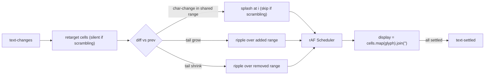

# 008 — Decoder v2

**Date:** 2026-05-21
**Status:** Approved

## Background

`decoder-text.ts` (v1) grew organically: per-slot timings, varying glyph pools, mixed responsibilities (cells + tween + glyph generation + jitter scheduler). Adequate for one element, hostile to reuse and testing.

v2 starts over with a composable engine and a thin Lit element, separately testable, configured by props.

## Problem

Need a text component that:

1. Scrambles into target text using a configurable glyph range pool.
2. On char-level text change: spawns a "stone-in-water" both-way ripple centered at the change, radius 3 (default), decoding adjacent chars.
3. Idle ambient ripples at random 2–5s intervals over current text, smaller radius, fewer rounds.
4. Tail growth: ripples the newly-added range from old end to new end.
5. Tail shrink: ripples the removed range, then drops cells.
6. Whitespace (`\s`) cells never participate.
7. Mid-flight retarget: cells currently mid-scramble keep going, target swaps silently (user never saw old value).
8. Visually random, behaviourally testable: seeded PRNG, observable lifecycle events.
9. Configurable splash: count, radius, rounds, tick duration.

## Design

### Layers (one file per role; SOLID DIP)

```
decoder-v2/
  rng.ts        # Rng interface; SeededRng (mulberry32); cryptoSeed() helper
  glyphs.ts     # GlyphSource interface; RangeGlyphSource; DEFAULT_GLYPH_RANGES
  cell.ts       # Cell { target, glyph, scrambling, inert, retarget() }
  ripple.ts     # RippleSpec; Ripple (implements Tickable)
  scheduler.ts  # Tickable; Scheduler driven by injectable clock + rAF
  index.ts      # <decoder-v2> LitElement; barrel re-exports
```

### Cell

```ts
class Cell {
  target: string;
  glyph: string;
  scrambling: boolean;
  get inert(): boolean;          // /\s/.test(target)
  retarget(next: string): void;  // silent if currently scrambling
}
```

`retarget` enforces the "alpha obscured = no restart" rule: if scrambling, only `target` changes; `glyph` keeps cycling and settles to the new target when the ripple completes.

### Ripple — the one primitive

```ts
interface RippleSpec {
  center: number;
  radius: number;
  rounds: number | [number, number];  // per-cell scramble cycles
  tickDurationMs: number;             // ms per glyph swap = propagation step
}

class Ripple implements Tickable {
  constructor(spec, cells, rng, glyphs, nowMs);
  tick(nowMs, cells): void;
  get done(): boolean;
}
```

Both-way ripple shape: each cell at distance `d` from center starts at `now + d * tickDurationMs`. Each cell then swaps glyphs for `rounds * tickDurationMs` ms and settles. Inert cells are skipped entirely; the wave passes through them without animating.

**Last-write-wins** on overlap: two ripples covering the same cell both run; whichever ticks last in a frame owns the glyph.

### Splash

A splash = `count` ripples spawned around the same center. Idle splash = one small ripple at random index. Tail rush = one ripple covering the added/removed range with radius adapted to range size.

### Scheduler

Single rAF loop driving every active `Tickable`. Clock is injectable for tests (pass `{ now, raf, caf }`). Stops itself when the queue empties; restarts when something is added.

### Element (`<decoder-v2>`)

Properties:
- `text: string` — target.
- `seed: number | null` — explicit PRNG seed; otherwise `cryptoSeed()`.
- `splashCount, splashRadius, splashRounds, splashTickMs` — char-change splash.
- `idleMinMs, idleMaxMs, idleRadius, idleRounds, idleTickMs` — ambient.
- `seedTransform: (text) => string` — extension point for the initial-rush seed (default `""`); future variants may produce same-shape encoded glyphs without modifying the element (OCP).

Events:
- `splash-start` `{ center, count }`
- `ripple-start` `{ ...spec }`
- `text-targeted` `{ text }` — after retarget pass
- `text-settled` `{ text }` — fires once when all cells settle to target

### Flow



## Trade-offs

- **Cells outlive shrinks until they ripple out**: simpler than synchronizing length walking with per-cell animation; trailing settled-empty cells are pruned on each render tick.
- **Last-write-wins**: cheaper than reference counting; visible glitch only on contrived overlapping splashes which the splash count config controls.
- **rAF (no GSAP)**: scramble is integer ticks, not eased interpolation; no need for GSAP's tween machinery. Less surface area, faster.

## Verification

- `text-settled` always fires for every `text` write that has a non-empty pipeline.
- With a fixed `seed`, the sequence of glyphs is reproducible (snapshot test).
- Setting `text = " "` produces an inert cell that never scrambles.
- Setting `text = "ab"` then `text = "ac"` immediately mid-scramble: cell 0 stays as it was (scrambling unchanged or already-settled), cell 1's target retargets without restart if currently scrambling.

## Implementation Plan

1. `rng.ts`, `glyphs.ts`, `cell.ts` — pure utilities, no DOM.
2. `ripple.ts`, `scheduler.ts` — engine with injectable clock.
3. `index.ts` — LitElement wiring, properties, event emission.
4. `decoder-v2.stories.ts` — cycle + length-grow/shrink + idle-only stories.
5. Leave `decoder-text.ts` (v1) untouched until callers migrate.

## Design Revision — 2026-05-21

Initial implementation indexed cells positionally and treated "everything after the first diff char" as changed. Two issues surfaced immediately:

1. **No shift detection** — `"Hello World"` → `"Hello Brave World"` rippled chars 6..10 *and* tail-rushed 11..16 instead of recognizing one insertion of `"Brave "`.
2. **`Cannot read properties of undefined (reading 'inert')`** — ripples held cell indices into a mutable cells array; rebuilding the array invalidated the indices.

Rewire:

- **Matrix diff** (`diff.ts`): Wagner-Fischer DP produces an edit script (`match` / `replace` / `insert` / `delete`); adjacent same-op edits are grouped. Each non-match group becomes exactly one ripple. Matched cells are kept by *identity* — their position can shift without animating.
- **Ripples hold Cell references**, not indices. Survives any cell-array rebuild.
- **Skip alpha-obscured cells at ripple construction**: cells already `scrambling` are not enrolled in a new ripple — their in-flight ripple settles them to the new target silently.
- **Cell.retarget no longer auto-snaps glyph** (except for whitespace targets, which are inert). Caller's responsibility to spawn a ripple if it wants the change visible.
- **Inserted non-WS cells start with `glyph=""`**, ripple makes them appear. Inserted WS cells snap to target (inert).
- **Deleted cells retarget to `""`**, ripple scrambles them out, then `renderTick` prunes any cell whose `target === ""` and `!scrambling`.
- **Scheduler no longer owns cells** — it just ticks `Tickable`s, each holds its own state.

Ripple radius per group = `ceil(span/2) + splashRadius`, which satisfies the "+3 chars each side" rule (default `splashRadius = 3`).

Files reflect the revision; the original Design section above is left as the agreed direction (positional model was implementation, not design).

### Length rush (2026-05-21)

For insert / delete groups, the new constraint: the visible length must converge to the target within at most `min(3, MAX_rounds)` ticks (`LENGTH_RUSH_MAX = 3`).

`RippleSpec.lengthRush?: boolean` selects the schedule strategy:

- **Wave (default, replace + idle)**: cell at distance `d` starts at `d * tickDurationMs`, rounds drawn freely from the spec.
- **Rush (insert + delete)**: eligible cells sorted by distance from center, split into chunks of `ceil(eligibleCount / budget)` where `budget = min(3, MAX_rounds_upper)`. Chunk `k` starts at `k * tickDurationMs`. Per-cell rounds are capped to `budget - tickOffset` so every cell **settles** within `budget` ticks — deletions complete (cells prune-eligible) and insertions occupy their slot within the budget.

Replace ripples still use the buffer (`radius = span + splashRadius`) for the ±3 decoder-echo aesthetic. Insert/delete ripples use a tight radius (`span` only) — buffer chars are a replace-only concept per the original requirement.

### Self-correcting end-step (2026-05-21)

`Ripple.tick`, when no schedules remain `pending`, runs `settleAll()` before flipping `finished`. Every cell that was ever in the ripple's schedules is forced to `glyph = target` and `scrambling = false`, regardless of how its individual schedule ended (inert mid-ripple, glyph source returning a stray `\s`, anything). Guarantees post-ripple invariant: every scheduled cell shows its target after the ripple completes.

