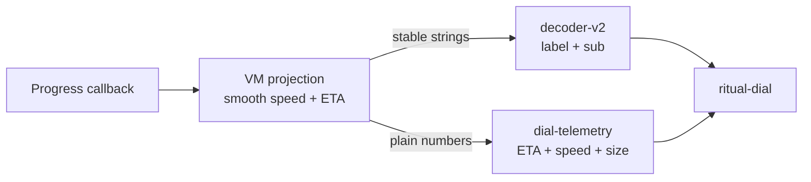

# 009 — Telemetry hierarchy: ETA-hero, plain digits, decoder = identity only

**Date:** 2026-05-21
**Status:** Implemented (verified 2026-05-29 — VM wiring live in `ritual-app.ts`; `<dial-telemetry>` fed by real ViewModel, not just Storybook)
**Refines:** [007 — HIG UX Coherence: one dial](007-hig-ux-coherence.md), [008 — Decoder v2](008-decoder-v2.md)

## Background

007 introduced the single morphing dial. RUN-stage UX surfaces three
high-churn signals through the dial's `label` + `sub` slots, which are
backed by `<decoder-v2>` (008).

Brand frame: pixel-art wizard frog levitating three engraved cyan
rune-stones over a slate altar (see [[project-brand-language]]).
Composition reference: ClearVPN's calm-HUD layout — one big number,
stable surrounding copy, glow as the live channel.

## Problem

Feeding rapidly-changing measurements through the decoder defeats both
the decoder and the readability of the numbers.

RUN signals:

1. **Transfer size** `bytesDone / bytesTotal` — monotonic, 5–30 Hz.
2. **Transfer speed** `bytes/s` — noisy, ±20% frame-to-frame.
3. **ETA** — derived from speed; jitters ±1 s every sample.

Decoder v2 is built to **settle** to a stable target (008
§Verification: `text-settled` fires when every cell matches target).
Targets that mutate faster than ripple duration (`splashRounds *
splashTickMs` ≈ 200–400 ms) produce a permanent storm:

- Every numeric update enters Wagner-Fischer as a string of replaces.
- Cells never escape `scrambling = true`; the length-rush
  self-correcting end-step (008 §Self-correcting end-step) keeps
  re-firing.
- User sees a wall of glyphs and never reads a number.

**Diagnosis:** decoder treats text as **identity** (recognize the
word); bytes/speed/ETA are **measurements** (parse the digit). One
widget cannot serve both roles:

| | Identity (decoder-friendly) | Measurement (decoder-hostile) |
|---|---|---|
| Change cadence | stage / file boundaries | sub-second |
| Reading mode | recognize the word | parse the digit |
| Wants to settle? | yes | no — never lands |
| Right typography | display, optical | tabular-nums, fixed-width |

## Questions and Answers

**Q1.** Could we just throttle the decoder's input to its settle rate?
**A.** No. Throttling caps digits at ~2–3 Hz; on a 40 MB/s transfer
bytes-done would visibly trail reality. The decoder is the wrong tool
for digits at *any* cadence; throttling masks the role mismatch.

**Q2.** Why ETA as the hero and not bytes / speed?
**A.** ETA is the only signal that answers the user's actual question
("when can I stop watching?"). Bytes-done and speed are *evidence for*
ETA; subordinate to the conclusion they support. ETA also changes
slowest of the three (cadence cap below) — promoting it to large type
does not introduce perceived flicker.

**Q3.** Why not put the ETA *inside* the ring (ClearVPN `00:04` style)?
**A.** Couples the ring's identity glyph slot to measurement, and the
dial would have to know about telemetry tokens. Keep ETA in the
telemetry layer; revisit only if the layered placement reads weak
after live check.

**Q4.** Where does smoothing live — widget or VM?
**A.** ViewModel projection. Single source of truth, testable as pure
math, no per-widget timers. Widget renders whatever the VM hands it.

**Q5.** What does the decoder do once it stops handling numbers?
**A.** Identity only — stage caption + artifact name. These change at
stage / file boundaries, ≤ 1/s. Decoder finally gets to **settle**;
each scramble *reads as an event* (the wizard reveals the rune).

## Design

### 1. Decoder = identity only

`<decoder-v2>` inside the dial accepts only stable strings:

- `label` ← stage caption (`"Downloading world"`, `"Verifying"`,
  `"Uploading deltas"`). Changes at stage transitions ≤ 1/s.
- `sub` ← artifact identity when known (`"world/region/r.0.0.mca"`),
  else empty. Changes on file-boundary crossing.

**No numbers go through the decoder. Ever.**

### 2. Telemetry layout — ETA hero, speed + size demoted

```
            ┌──────────────┐
            │     0:13     │   ← ETA: hero, large tabular, 100% opacity
            └──────────────┘
            ┌──────┬───────┐
            │42MB/s│412/980│   ← speed · size: secondary, ~60% opacity
            └──────┴───────┘
```

**Typography:**

| Slot | Size | Weight | Opacity | Variant |
|---|---|---|---|---|
| ETA | ~1.6× base | 500 | 100% | `tabular-nums` |
| speed | base | 400 | ~60% | `tabular-nums` |
| size | base | 400 | ~60% | `tabular-nums` |

Speed and size share one line with a thin separator (interpunct or
vertical rule at ~30% opacity). Plain text, no decoder, no ripple.
Crossfade only on **unit** change (`MB → GB`), never on digit churn.

Slot visibility per stage:

| Stage | label / sub (decoder) | telemetry |
|---|---|---|
| idle | "Ready" / empty | hidden |
| prep | "Preparing" / artifact | hidden |
| run | stage caption / artifact | shown |
| final | "Done" / artifact | hidden |
| fail | "Failed" / reason | hidden |

### 3. Smoothing — at the VM, not the widget

ViewModel hands the widget already-smoothed values:

- **Bytes**: pass through (monotonic; tabular-nums absorbs change).
- **Speed**: EWMA over ~1 s window, snapped to ≤ 2 significant figures
  (`42.7 MB/s`, not `42.7314 MB/s`).
- **ETA**: derived from smoothed speed; minimum render cadence
  **500 ms**; rounded to nearest second when < 1 min, nearest 10 s
  when < 10 min, nearest minute otherwise.

Jitter at the integer boundary is acceptable (`0:13 → 0:12`);
sub-second flicker is not.

### 4. Visual hierarchy follows ClearVPN cadence

- **Dial glyph + ring** — primary, live (breath, arc, color).
- **Decoder `label`** — secondary; scrambles only on stage transition
  (now actually settles, so the scramble reads as an event).
- **ETA** — secondary; one big tabular number.
- **Speed + size** — tertiary; quiet evidence row.

Attention budget: 1 live thing (ring), 1 settling thing (label, on
transitions), 1 quiet hero (ETA), 2 background numbers.

### 5. Brand fit

Layout maps onto the logo: ETA = the central, largest floating
rune-stone; speed + size = the two flanking dimmer stones. Each slot
*could* render as a small slate tile with engraved cyan digits and a
soft outer glow (own design — see [[project-brand-language]]); the
typographic hierarchy lands without that ornament being required.

### Flow



## Trade-offs

| Choice | Gain | Cost |
|---|---|---|
| Two layers (decoder = identity, plain = numbers) | Each layer fits its job; both readable | One extra slot grouping inside `.cluster` |
| ETA hero, speed + size demoted | Single answer for "when?"; quiet evidence | Speed/size require a deliberate second glance — intended, not a bug |
| Telemetry hidden outside RUN | No empty/zero strip during prep/final | One conditional in render; fade on entry/exit |
| Smoothing in VM, not widget | Pure-math testable; one source of truth | VM gains explicit speed/ETA projection (small) |
| No decoder on numbers | Eliminates the storm; restores `text-settled` semantics | Loses "everything decodes" aesthetic — ring still carries the mystique |

## Edge cases

- **ETA unknown** (no speed sample yet, or speed = 0): render `—:—` at
  full opacity; keep the slot reserved so first sample doesn't reflow.
- **ETA > 1 h**: switch format to `1h 04m`, same hero slot.
- **Speed = 0 for > N seconds** (stall): own pause/stall design — ETA
  must not silently drift to infinity here.
- **Bytes-total unknown**: show `412 MB` only (no `/ N`), no ETA hero;
  fall back to indeterminate ring (already specified in 007).

## Verification

1. RUN with synthetic 40 MB/s feed: `text-settled` fires on every
   `label` write (stage caption change), and decoder is **idle** for
   ≥ 95% of RUN duration.
2. Telemetry digits do not visibly jitter sub-second; ETA stable
   within ±1 of rounded value.
3. Side-by-side with ClearVPN screenshot: composition reads as "calm
   live HUD," not "screen full of scrambling text."
4. Storybook: `RunBusy` story drives bytes 0 → total over ~5 s with
   randomized speed; decoder remains legible end-to-end; ETA legible
   at 1 m viewing distance, speed + size require deliberate glance.

## Implementation Plan

1. **VM projection** — extend ViewModel with smoothed `speedBps`,
   `etaSeconds`, formatter helpers (`formatEta`, `formatSpeed`); unit
   tests target pure math.
2. **Strip `<decoder-v2>` from numeric paths** — `stage-downloading`,
   `stage-uploading`, and any dial `sub` consumer currently piping
   bytes/speed/ETA.
3. **New `<dial-telemetry>` element** (or three slots inside
   `ritual-dial`'s `.cluster`): ETA hero + speed/size secondary row;
   tabular-nums, no decoder.
4. **Visibility** — strip rendered only when `state === "run"`; fade
   in/out via existing `--motion-fast`.
5. **Storybook story** `RunBusy` — verifies legibility under realistic
   churn.
6. **Decoder loads on identity only** — dial `label` / `sub` receive
   stage caption + artifact name from VM; never numeric strings.

## Out of scope

- ETA-inside-the-ring (ClearVPN `00:04` overlay): defer until live
  check rules layered placement insufficient.
- Per-file vs aggregate telemetry: current ViewModel exposes one
  stream; multi-file roll-up is its own design.
- Stone-tile surface treatment for telemetry slots: covered under
  brand-language follow-ups (own log).

## Revision — 2026-05-21 — No user-facing filenames; ETA lives in the dial

Initial draft put artifact filenames (`world/region/r.0.0.mca`) in
the dial's `sub` slot — "identity" content. Rejected on review:

> Filenames are irrelevant to the end user. We never expose them.

This collapses the original `sub`-as-artifact-identity role and the
three-stones telemetry layout (ETA hero + speed + size). Replaced
with a tighter design:

### Canonical stages (per 007)

The dial's vocabulary is **user intent** — verbs around playing — not
implementation verbs around transferring:

| state | label | sub | bytes in flight? |
|---|---|---|---|
| idle | "Start" | — | no |
| **prep** | "Getting ready" | **ETA** | yes (download-before-play) |
| run | "Ready to play" | "Hold to stop" | no |
| **final** | "Saving" | **ETA** | yes (upload-after-play) |
| fail | "Couldn't finish" | "Tap to try again" | no |

Earlier draft placed ETA + telemetry under RUN. Wrong: RUN means the
player is playing — there is no transfer happening then. Transfers
live in **prep** and **final**. Those are the two stages that own the
telemetry layer.

### Updated slot map

| Slot | Carries | Treatment |
|---|---|---|
| dial label (decoder) | canonical stage caption (see table) | settles on stage transition |
| dial `sub` (plain) | **ETA** during prep + final; the canonical sub copy otherwise ("Hold to stop", "Tap to try again"); empty in idle | `tabular-nums`, no decoder |
| telemetry (below dial) | `speed · size` — dim secondary row | `tabular-nums`, ~55% opacity, **prep + final** only |

### Why ETA into the dial `sub`

- ETA is the live answer to "when does this end?" — belongs in the
  primary cluster the eye is already locked on (the dial).
- Ring (progress) + ETA (time) are the same answer told two ways —
  pairing them visually is correct.
- `sub` was already a small caption slot; ETA at 13px with
  `tabular-nums` reads correctly without enlargement (the ring carries
  the *scale* of "this is the headline").
- The telemetry strip becomes purely supporting evidence (speed +
  size), unambiguously tertiary — no longer competes with ETA.

### What changed from prior §Design

- **§1 Decoder = identity only** — still true; decoder is now removed
  from `sub` *entirely* (no decoder-v2 inside `.sub`). Only `label`
  uses the decoder.
- **§2 Telemetry layout** — ETA hero removed; component shrinks to
  one row: `speed · size`. Visibility flips to **prep + final** (not
  RUN), matching where transfer actually happens.
- **§3 Smoothing** — unchanged; VM still smooths speed and ETA.
- **Brand mapping** — adjusts: center rune-stone = dial+ring+ETA
  together; two flanking dimmer stones = speed + size below.
- **Stage vocabulary** — anchored in 007's canonical labels (Start /
  Getting ready / Ready to play / Saving / Couldn't finish). No new
  copy invented at the dial layer.

### Why not filename anywhere

Filenames / internal paths are leaky implementation detail (`.mca`
chunks, refspec UUIDs, staging-dir UUIDv4 names). They:

- Tell the user nothing they can act on.
- Anchor the UI to current storage layout — any refactor invalidates
  copy across the app.
- Make logs / screenshots noisy.

The rule generalises: **the user UI never displays internal storage
identifiers**. Stage captions carry intent ("Downloading world"); the
dial carries progress; ETA carries time. That is enough.

## Revision — 2026-05-21 — Decoder = identity reveal only

Tried wiring `<decoder-v2>` into ETA and the under-block telemetry.
Pulled back in two passes:

1. **Under-block (speed + size)** — bytes-done updates faster than
   16 ms in production (progress-callback driven), guaranteed storm.
2. **ETA in dial `sub`** — *technically* cadence-locked at 500 ms and
   would settle in ~100 ms per tick, but the cumulative motion is
   still distracting: every second a tiny scramble runs where the
   user is trying to *read* a number. Identity-reveal motion competes
   with measurement-reading.

**Rule fixed:** `<decoder-v2>` wraps strings the user *recognizes*,
never strings the user *reads on a tick*. Detected by content: if the
string contains a digit it is treated as a measurement and rendered
plain; otherwise it is identity copy and decoded. The placeholder
`--:--` (no digits) **does** decode — that is the desired "still
acquiring" reveal — and it stops jittering the instant a real ETA
arrives.

| Surface | Decoder? | Trigger |
|---|---|---|
| dial label | yes | stage boundary; canonical labels have no digits |
| dial `sub` "Hold to stop", "Tap to try again" | yes | no digits → identity copy |
| dial `sub` `--:--` (ETA acquiring) | **yes** | no digits → placeholder reveal |
| dial `sub` `00:13`, `1h 04m` (real ETA) | **no** | contains digits → measurement |
| dial-telemetry speed row | **no** | sample-rate driven |
| dial-telemetry size row | **no** | progress-callback driven |

Detection lives in `ritual-dial.render()` as `/\d/.test(this.sub)`
(plain if any digit present). Caller doesn't need to flag intent —
the slot's content speaks for itself, and `--:--` ↔ real-ETA flips
become natural decode → settle → plain transitions.

The rule is durable beyond this design log — saved as
[[decoder-cadence-rule]] (sharpened from "cadence" to "identity vs.
measurement", with the digit-presence heuristic as the operative
test).

### Stable-num primitive

Reusable width-stabilizer `<stable-num chars=N align=…>` (default
`6`) introduced in the same pass. Wraps the volatile numeric portion
of each metric (`done`, `speed.value`, dial `sub`); right-aligns by
default so digits grow leftward and the right anchor (unit / slash)
holds. Total size is not stable-num'd — it changes only at unit
boundary, never per frame, so the reservation creates an unwanted
gap with no stability gain.

## Implementation Results — 2026-05-21

Status: **Implemented** in Storybook (`Dial / Composition / Cycle`).
Real-VM wiring is the next step (009 §Implementation Plan steps 1
and 6); the widget contract below is settled.

### Files

| File | Role |
|---|---|
| `frontend/src/ui/stable-num.ts` | width-anchor primitive |
| `frontend/src/ui/telemetry-format.ts` | `formatSpeed` / `formatSize` → `{value, unit}` parts; `formatEta(seconds \| null)` → `"MM:SS"` / `"HH:MM:SS"` / `ETA_PLACEHOLDER` |
| `frontend/src/ui/dial-telemetry.ts` | under-block component (speed row + size row); decoder on identity, plain on digits |
| `frontend/src/ui/ritual-dial.ts` | `sub` slot renders via `renderSub()` — digit-presence chooses plain vs decoder; placeholder triggers fast continuous jitter |
| `frontend/src/ui/dial-composition.stories.ts` | Playground + Cycle (drives prep / run / final, simulated VM smoothing) |
| `frontend/src/ui/dial-telemetry.stories.ts` | Playground + RunBusy + TotalUnknown |

### Final decoder map (digit-presence + idle profile)

| Surface | Source | Decoder? | Idle profile |
|---|---|---|---|
| dial `label` | stage caption | yes | default — settles on stage transition |
| dial `sub` — letter copy ("Hold to stop", "Tap to try again") | state edge | yes | slow (1.4–2.8 s, radius 1) |
| dial `sub` — placeholder (`·····`, no letters & no digits) | `formatEta(null)` | yes | **fast continuous** (50–120 ms, radius = `sub.length`) |
| dial `sub` — real ETA (`00:13`, `1h 04m`) | `formatEta(seconds)` | **no** | — (plain `tabular-nums`) |
| telemetry speed.value | `formatSpeed(bps).value` | **no** when sampled, **yes** (fast placeholder) when `speedBps ≤ 0` | — / fast |
| telemetry speed.unit | `formatSpeed(bps).unit` | yes | slow (1.8–3.6 s, radius 1) |
| telemetry size.done | `formatSize.done` | **no** when sampled, **yes** (fast placeholder) when `speedBps ≤ 0` | — / fast |
| telemetry size.total | `formatSize.total` | **no** | — (plain; changes only at unit boundary) |
| telemetry size unit / `/` separator | identity | yes | slow (units 1.8–3.6 s, slash 2.4–5 s) |

The "rush-to-estimate" window is detected in dial-telemetry by
`speedBps <= 0` (no first sample yet). During rush, speed.value and
size.done render as the same `·····` placeholder used by ETA — the
identity-jitter pattern unifies across all three numerics until real
data arrives.

### Settle math used everywhere

- `splash-tick-ms = 22`, `splashRounds = [3, 5]` → per-cell settle
  ≈ 66–110 ms. Reveal completes well inside any plausible idle
  interval.
- `splash-radius = 1` for normal scrambles (changed cell + neighbors).
- Fast-placeholder branch overrides `idle-radius` to the text length
  so the ambient ripple covers the full slot — no static gap between
  ripples.

### Width stability

`<stable-num chars=6>` wraps the volatile numeric in the dial `sub`,
speed.value, and size.done. Reserves 6 character columns
(tabular-nums + `ch` unit) regardless of content. Total is rendered
plain because magnitude transitions are infrequent and the
reservation creates a visible gap between `/` and short totals (e.g.,
`/   1.0 MB`).

The placeholder `·····` (5 chars) and the typical ETA `MM:SS`
(5 chars) match the reserved 6ch slot with no shift. HH:MM:SS
(8 chars) expands the slot naturally — `min-width` is a floor.

### Verification (live, in Storybook)

- During PREP entry, sub renders `·····` jittering continuously;
  flips to plain `MM:SS` the instant first ETA arrives.
- During rush window (`speedBps <= 0`), telemetry speed and done
  show jittering placeholders; flip to plain digits on first sample.
- Widths held constant across rapid digit changes
  (verified: 240.84 px telemetry, 43.38 px sub across 6 samples
  through ETA 0:07 → 0:02).
- RUN sub copy ("Hold to stop") decoded with slow idle — readable,
  not noisy.

### What did NOT ship from earlier drafts

- ETA-hero typography below the dial (three equal stones with ETA
  large): superseded — ETA now lives in dial `sub`; under-block is
  a quiet column of `speed / done unit / total unit` only.
- Filenames / artifact paths anywhere in the UI: out per
  [[no-user-filenames]].
- Stone-tile / rune-glow surface treatment for telemetry slots:
  rejected as "off" against the dial; current layout is plain
  column with subtle opacity hierarchy.
- Decoder wrapping the *whole* under-block including digits: tried,
  pulled back — per-frame numerics are decoder-hostile. Decoder
  applies only to identity parts (units, `/`, placeholders).

### Deviations from prior design sections

- §1 "Decoder = identity only" is unchanged in spirit but sharpened:
  applied **per-substring** inside both `sub` and the under-block via
  the digit-presence heuristic, not per-widget. A single slot can
  carry decoder content (`·····`, "Hold to stop") at one moment and
  plain content (`00:13`) at the next.
- §2 "ETA hero, speed + size demoted" → ETA moved into dial `sub`;
  telemetry shrunk to two stacked rows (speed, size). No hero
  typography below the dial.
- §3 Smoothing — still belongs in the VM; the storybook cycle
  simulates EWMA speed + cadence-snapped ETA inline as proof.
- New deps: `stable-num` primitive added; no third-party additions.
