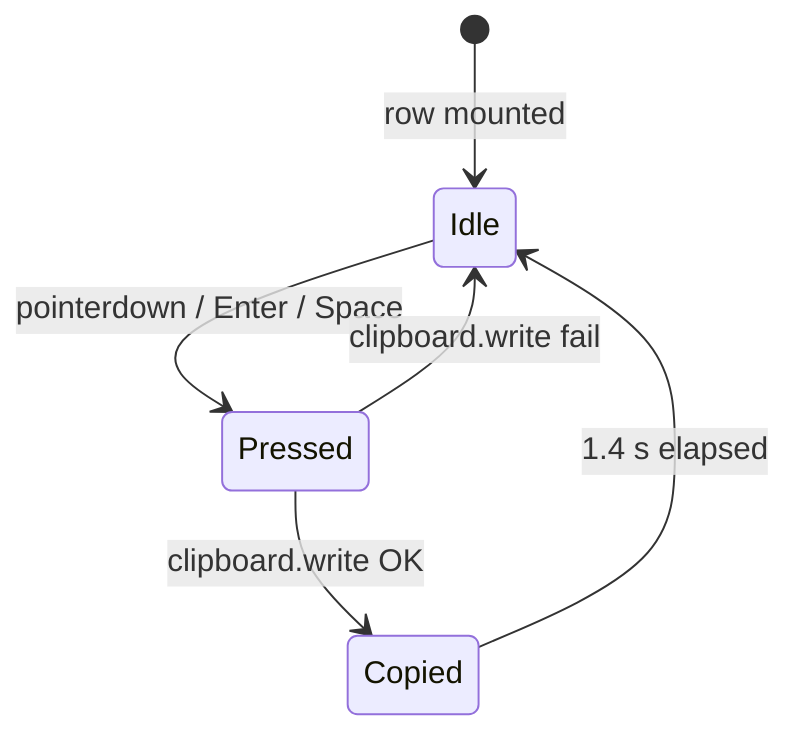

# 010 — RUN-stage addresses: copy-on-row IP list, identity-decoder reveal

**Date:** 2026-05-21
**Status:** In Progress
**Refines:** [007 — HIG UX Coherence](007-hig-ux-coherence.md), [009 — Telemetry hierarchy](009-telemetry-hierarchy.md)

## Background

The dial UX (007 → 009) replaced the five-stage card layouts with a
single morphing dial + a quiet under-block. The under-block currently
carries transfer telemetry (speed · size) **only during prep + final**
(009 §2). RUN's dial reads `Ready to play` / `Hold to stop`; nothing
else.

The old `stage-running` card surfaced a "Share to join" address list
populated from `projection.AddressProvider` (localhost first, then
each non-virtual, non-loopback IPv4 with the bound port). As the dial
supplants `stage-running`, that surface drops on the floor.

## Problem

RUN means the player can be joined. The two questions a host
actually has during RUN are:

1. **Is the server up?** — answered by the dial (label + ring + glyph).
2. **What do I tell my friends?** — currently unanswered in the dial UX.

Without (2), the host has to leave the app (check IP via OS) or trust
that whoever joins already knows the address. Both are friction at
exactly the moment the app should feel "done — go play."

## Questions and Answers

**Q1.** Why all interfaces and not just the best LAN guess?
**A.** AddressProvider already filters down to reachable IPv4s; the
host knows which interface their friends are on, the app doesn't. A
single "best" guess that's unreachable from the peer's vantage is
worse than a short row list. ([Confirmed by user 2026-05-21.])

**Q2.** Where does the list live relative to the dial?
**A.** The under-block slot below the dial, swapping in when state
flips to RUN. Same vertical rhythm as 009's telemetry slot; one slot
that switches role by stage avoids stacking a third sibling under the
dial and matches the calm composition.

**Q3.** Decoder-v2 on an address row — does this violate
[[decoder-cadence-rule]]?
**A.** No. The rule forbids decoder on strings that **tick**
sub-settle-time. Addresses are pure identity: they reveal once on RUN
entry, then sit constant for the entire session. Settling once on
reveal is the desired animation (the rune-stone engraving is read).
This is the same shape as dial `label` settling on stage transition.

**Q4.** Decoder spans digits — doesn't 009's digit-presence heuristic
forbid that?
**A.** The heuristic exists inside `ritual-dial`'s `sub` slot, where
content alternates between identity copy and live measurement on the
same slot. The address row isn't that slot — its content never
switches roles. Decoder wraps the whole row (label + address) on
reveal, then is idle. No tick, no storm.

**Q5.** Whole row clickable vs. trailing copy button?
**A.** Whole row (HIG — large, forgiving hit targets; the row is the
unit of meaning). Trailing affordance still rendered (icon, not a
button border) as a visual hint that the row copies.

**Q6.** What about `127.0.0.1:25565` — useful enough to keep first?
**A.** Yes. Solo / local-multiplayer flow; guaranteed-valid even
offline; matches the existing AddressProvider contract. Order stays
localhost → host interfaces (provider already enforces).

**Q7.** Hover / focus / active treatment?
**A.** Hover: row background lifts `rgba(255,255,255,0.04 → 0.08)`,
no transform (calmer than the dial's own translateY; under-block
remains optically below the dial). Focus follows the global
focus-visible token. Active (copying): see Q9.
*User left the hover option open ("ain't sure") — calmest default
picked; revisit if it reads underweight against the engraved-stone
brand.*

**Q8.** Decoder reveal intensity?
**A.** Resolved: **reveal once + very slow per-element idle on both
parts.** Label and address each splash → settle on row mount, then
keep a generous idle profile (6–14 s per element, radius 1). Per-row
cadence is intentionally slow because aggregate motion compounds:
with N rows × 2 spans there are 2N independent idle timers running
in parallel, so the visible cadence in the address block is roughly
1/(2N) of any single decoder's interval. At N = 3 → ≈ 1.7 s aggregate
between tweaks, at N = 1 → ≈ 10 s. Each scramble reads as a single
deliberate event, never a storm. [[decoder-cadence-rule]] holds.

**Q9.** What does a successful copy look like on the row?
**A.** Four layers fused into one motion event (~700 ms total):

1. **Breath** — single rise-and-fall pulse of the row border + outer
   glow in `--state-run` via the existing `--radiance` /
   `--radiance-hi` token chain. Row briefly picks up the dial's
   living-color identity.
2. **Icon swap** — trailing `copy` → `check` for the duration of the
   breath, then back.
3. **Address highlight** — monospaced address span flashes to full
   opacity + `--state-run` tint at the breath crest, fades with the
   release.
4. **Row micro-bounce** — GSAP `back.out` scale tween
   `1 → 1.018 → 1` over ~140 ms triggered at copy moment. Reads as
   a physical tap response on top of the optical glow.

No inline "Copied" label — the four-layer event speaks for itself.
All layers respect `prefers-reduced-motion`: breath becomes a 200 ms
opacity flip, micro-bounce suppressed, icon swap is instantaneous.

**Q8.** Keyboard support?
**A.** Each row is `role="button"`, `tabindex=0`, activates on
Enter / Space. Aria-label reads `"Copy <label> address <address>"`.

## Design

### Slot map

| Stage | Under-block content |
|---|---|
| idle | hidden |
| prep | `<dial-telemetry>` (speed + size) — unchanged |
| **run** | **`<run-addresses>` — new** |
| final | `<dial-telemetry>` (speed + size) — unchanged |
| fail | hidden |

Reuses the existing fade-in / translateY-on-enter behaviour already
applied to the telemetry slot (see `dial-composition.stories.ts`
`.telemetry-slot[data-shown]`).

### Component contract

```ts
// frontend/src/ui/run-addresses.ts
@customElement("run-addresses")
class RunAddresses extends LitElement {
  @property({ attribute: false }) addresses: JoinAddress[] = [];
}
```

Source of truth: `ViewModel.addresses` (already populated when the
projection enters StageRunning — see
`internal/gui/projection/projection_test.go:103`).

### Visual structure (per row)

```
┌──────────────────────────────────────────┐
│  localhost     127.0.0.1:25565       ⧉   │
├──────────────────────────────────────────┤
│  Wi-Fi         192.168.1.42:25565    ⧉   │
├──────────────────────────────────────────┤
│  Ethernet      10.0.0.7:25565        ⧉   │
└──────────────────────────────────────────┘
                                       ↑ copy icon (lucide `copy`)
                                          becomes ✓ + "Copied" on action
```

Typography:

| Slot | Treatment |
|---|---|
| label (`localhost`, `Wi-Fi`) | identity copy, decoder-v2 reveal + very slow idle (6–14 s per element, radius 1), ~70% opacity |
| address (`192.168.1.42:25565`) | `ui-monospace`, tabular-nums, 95% opacity, decoder-v2 reveal + very slow idle (6–14 s per element, radius 1) |
| trailing icon | lucide `copy` → `check` on action, ~55% opacity |

Width: rows fill the dial's column width (`min(420px, 100%)`) to
match the dial's optical column. Row vertical padding ≥ 12 px so the
hit target clears HIG's ~44 px touch guidance even at the smallest
window.

### Decoder usage

The reveal pattern matches dial `label` (009 §4: "scrambles only on
stage transition — now actually settles, so the scramble reads as an
event"). Each address row mounts on RUN entry, decoder-v2 plays its
splash → settle, then the row sits plain for the rest of RUN. Idle
profile is slow (1.8–3.6 s, radius 1) — identical to the under-block
unit slot in 009 §Final decoder map, ensuring the wider page rhythm
matches.

The address text contains digits but the decoder-cadence-rule's
concern (decoder on per-frame measurements) does not apply: an
address never changes during a session. The
content-based digit-presence heuristic in `ritual-dial.renderSub()`
is a same-slot mode-switch detector, not a universal ban — it does
not apply here.

### Interaction



- Whole row is the hit target (no nested `<button>`); element is
  `role="button"`, `tabindex=0`, `aria-label="Copy <label> address
  <address>"`.
- `Copied` state: four-layer event over ~700 ms — see §Q9. Breath
  (border + outer glow in `--state-run`), icon swap `copy → check`,
  address span highlight, and a GSAP `back.out` row micro-bounce
  `1 → 1.018 → 1` over ~140 ms.
- Clipboard failure: no toast, no banner; icon flashes back to copy
  and the address stays selectable for manual copy. The browser
  already surfaces permission failures; we do not duplicate.

### HIG fit

- Hit target ≥ 44 px (HIG iOS touch guidance; macOS row interactions
  use the same generous shape).
- Single primary action per row (copy); no secondary affordance
  competes — matches "Make sure controls have clear, single purposes."
- Visual feedback on every interaction (hover lift, active glow,
  Copied state) — HIG Tips, Feedback.
- Identity (label) and value (address) split into roles via opacity
  hierarchy — HIG Typography, "establish a clear hierarchy."
- No filename / path / UUID anywhere — addresses are user-meaningful
  identifiers, distinct from leaky storage identifiers banned by
  [[no-user-filenames]].

### Brand fit

Rows read as horizontally-laid rune-stones beneath the dial — the
three (or more) flanking stones from the brand-language composition,
re-cast as the "things the wizard hands you for the journey." Cyan
glow on the dial picks up only on row hover, never ambient — the
dial remains the visual centre.

## Trade-offs

| Choice | Gain | Cost |
|---|---|---|
| Under-block slot swapped by stage | One slot, two roles; no extra column rhythm | Slot component dispatches by stage (small switch in ritual-app or a wrapper) |
| All reachable IPs as rows | Honest about host topology; user picks per peer | Two or three rows take vertical space — acceptable, RUN under-block is otherwise empty |
| Whole row clickable | HIG-grade hit target; quicker for users | Row needs `role="button"` + keyboard handling; can't be a `<ul><li>` of plain text |
| Decoder-v2 on row reveal | Continuity with dial label settle; brand-coherent | Adds decoder mount per row; cost is one-shot per session, not per frame |
| Trailing icon (not bordered button) | Calmer; row is the button | Slightly less affordance than a bordered button — compensated by hover lift |

## Edge cases

- **Zero addresses**: AddressProvider always returns at least
  localhost (addresses.go:70). The empty-list branch from
  `stage-running.ts:43` is not reachable in practice but the
  component renders nothing if list empty (defensive, not user-facing).
- **Clipboard API unavailable / denied**: silent fall-through to
  "selectable text" — `user-select: text` on the address span so the
  user can highlight + ⌘C / Ctrl+C manually. No banner.
- **Very long address strings** (IPv6 literal in future, or port >
  65535 typo): row wraps under address column; label column stays one
  line via `white-space: nowrap`.
- **Reduced motion**: decoder-v2 already honors
  `prefers-reduced-motion`; row hover lift uses transform — also
  suppressed under reduced motion via existing token.

## Verification

1. RUN entry in real app: under-block contains `<run-addresses>` with
   ≥ 1 row; each row plays decoder reveal once, then sits idle.
2. Click any row → clipboard contains exact `address` string; row
   shows "Copied" affordance for ~1.4 s.
3. Tab through addresses; Enter / Space copies the focused row. Aria
   label announces label + address.
4. Toggle prep → run → final live: telemetry / addresses / telemetry
   swap cleanly with the existing fade.
5. Reduced-motion: rows render plain text, copy still works, no
   decoder splash.
6. Stage-running.stories.ts ALL_ADDRESSES three-row fixture renders
   identically under the dial in a new
   `dial-composition` "Run with addresses" story.

## Implementation Plan

**Scope confirmed: Storybook only.** Legacy `stage-running.ts`
continues to ship its card; the dial migration that switches the live
RUN screen will pull `<run-addresses>` in as part of its own work.

1. **New component** `frontend/src/ui/run-addresses.ts` —
   contract above; decoder-v2 on label + address (reveal + slow idle);
   copy logic ported from `stage-running.ts:12-22`; row breath
   animation in `--state-run`.
2. **Storybook stories** `run-addresses.stories.ts` — Playground
   (address count slider), Empty (defensive render), CopyFlow (manual
   trigger to show the breath + Copied affordance without needing a
   real clipboard grant).
3. **Composition story** — extend `dial-composition.stories.ts`
   `Cycle` so RUN renders `<run-addresses>` in the under-block slot,
   and add `Playground` arg or new story `RunWithAddresses` for the
   static composition.
4. **No app wiring in this log.** `ritual-app.ts` / `stage-running.ts`
   stay on the card layout. The follow-up dial migration mounts the
   under-block slot as: `<dial-telemetry>` for prep / final,
   `<run-addresses>` for run.

## Out of scope

- Replacing `stage-*` components in `ritual-app.ts` with the dial
  composition — that's the broader dial migration.
- IPv6 / link-local UX — AddressProvider already filters them out;
  revisit if/when scope expands.
- QR code for join address — possible future; not required for the
  laconic "what do I share?" answer.
- Auto-detect best primary interface and pin it to the top with a
  star / highlight — speculative; AddressProvider order is enough.

## Implementation Results — 2026-05-21

Status: **Implemented in Storybook.** App wiring still deferred to the
broader dial migration (per Implementation Plan §4).

### Files

| File | Role |
|---|---|
| `frontend/src/ui/run-addresses.ts` | new component |
| `frontend/src/ui/run-addresses.stories.ts` | Playground / Empty / SingleLocalhost / FullList |
| `frontend/src/ui/dial-composition.stories.ts` | `Cycle` swaps under-block to `<run-addresses>` on RUN; added static `RunWithAddresses` story; renamed `.telemetry-slot` → `.under-slot` |

### Deviations from prior design sections

- **Trailing icon** now uses **GSAP `MorphSVGPlugin`** on a single
  `<path class="icon-path">` per row (mirroring `ritual-dial.ts`
  compoundD pattern) — not a Lit-driven SVG re-render swap. Lucide
  `Copy` and `Check` are compiled once to `D_COPY` / `D_CHECK` at
  module load; row morphs between them in 220 ms on copy / release.
  Honors `prefers-reduced-motion` by setting `d` directly.
- **Morph-back timing** lock-stepped to the breath: morph-back fires
  at `BREATH_MS - ICON_MORPH_MS` so the icon completes its
  `check → copy` morph at the same instant the breath ends. Earlier
  draft had morph-back run at the breath's end, extending visible
  motion past the highlight window.
- **Breath duration** widened from 700 ms → **1000 ms** for a more
  legible "Copied" highlight. `BREATH_MS = 1000`,
  `MORPH_BACK_DELAY_MS = 1000 - 220 = 780 ms`. Whole copied event
  remains tightly framed inside one window; bounce + click→breath
  start unchanged.

### Iteration 2026-05-21 — heading dropped, uptime adopted, rows go bare

Live screenshot review flagged three issues with the first cut:

1. **Redundant status copy.** Dial sub already conveys "Ready to play";
   a header "Server is running" repeated the idea. Resolved by
   removing the heading text entirely.
2. **Address block read as a detached panel.** Original draft had row
   backgrounds + borders + a divider line. Briefly stripped all of
   that to bare-text rows — but on review the backgrounded panel rows
   read better (more affordance that each row is its own copy
   target, more brand-coherent rune-stone feel). Reverted to
   backgrounded rows; the heading divider was the actual disconnect.
3. **Uptime was disconnected.** Now lives as a small dim
   `tabular-nums` line centered directly above the address rows
   (replacing the heading row). Acts as the address-block's only
   chrome.

Additionally:

- The component **owns its own uptime ticker.** Sole contract is a
  `start-offset` attribute (default `0`) — component captures
  `performance.now()` on `connectedCallback`, runs
  `setInterval(1000)`, renders `start-offset + elapsed` via
  `formatEta`. No external `uptimeSeconds` / `startedAtMs` prop
  — earlier two-prop attempt was undone once it was clear there
  is no backend signal feeding this view; pure UI ticker is the
  right shape until a real `serverStartedAt` lands in the ViewModel.
- Uptime caption typography upsized (`11px → 15px`,
  `line-height: 20px`, opacity bumped to ~55%) so it reads as a
  small but legible counter, not a metadata footnote.
- "Hold to stop" **stays on dial sub** (rejected merging uptime into
  the dial sub) — the gesture cue is the discoverability path for the
  hold interaction; removing it would silently break that.
- Copied state keeps the `--state-run` breath glow (box-shadow) +
  icon morph + address highlight; the row background tint that was
  part of the panel look is gone with the panel.
- **Row spacing tightened** from initial HIG-iOS 44 px floor to a
  desktop-optimised 28 px minimum (5 px × 10 px padding, 12 px
  body type, 14 px icon). Mouse-first surface; the 44 px floor was a
  touch heuristic. Rows still respect Fitts' law via full-width
  click area + keyboard activation. Container max-width 380 px.
- **No address-highlight text-shadow** intensity beyond a quick tint
  flash; full opacity already differentiates the copied row.
- **Address selectability** under failure: dropped from CSS scope —
  the whole row is `user-select: none` to keep keyboard activation
  clean. Clipboard failure leaves the row idle without affordance;
  if this becomes a real friction we revisit.

### Verification

1. `npx tsc --noEmit` clean.
2. `npm run build-storybook` clean (no warnings beyond Storybook's
   own DocsRenderer chunk-size note).
3. Stories present: `Run / Addresses` (Playground, Empty,
   SingleLocalhost, FullList) and `Dial / Composition`
   (RunWithAddresses + Cycle now drops `<run-addresses>` into RUN).
4. Live in Storybook: clicking a row → icon morphs `copy → check`
   via MorphSVG, row plays `--state-run` breath + GSAP back.out
   bounce, decoder-v2 idle continues throughout.

### Iteration 2026-05-21 — staggered entry & exit

Once the cycle composition pinned the dial position (011 §Pivot
to anchoring), the under-slot's content swap read as a hard cut
into and out of the addresses block. The reserved column had room
for a real entrance — `<run-addresses>` now plays a staggered
slide-up on mount and a staggered slide-down on unmount.

| Stage of life | Motion | Easing | Per-element duration | Stagger | Direction |
|---|---|---|---|---|---|
| Enter (mount) | `y: 12 → 0`, `opacity: 0 → 1` | `back.out(1.4)` | 360 ms | 55 ms, from start | uptime caption first, rows top-to-bottom |
| Exit (about to unmount) | `y: 0 → 12`, `opacity: 1 → 0` | `power2.in` | 280 ms | 55 ms, from end | rows bottom-to-top, uptime caption last |

The "from-end" stagger on exit gives the inverse of entry —
visually the block "peels back" the way it arrived.

Wiring:

- `RunAddresses.firstUpdated()` → `playEnter()` runs the
  `gsap.from` against `.uptime, .row` shadow children. Self-driven;
  no parent coordination needed for entry.
- `RunAddresses.playExit()` is a **public** method returning the
  GSAP tween. Required because Lit removes the element from the DOM
  synchronously when `showAddresses` flips false — to animate exit
  we need the parent to **delay the unmount** until the tween
  finishes.
- Exposed constant `RUN_ADDRESSES_EXIT_TOTAL_S` =
  `ROW_EXIT_S + ROW_STAGGER_S * 6` so the parent reserves a
  safe wait window without coupling to the per-row duration.
- `DialCompositionCycle`'s timeline inserts, between the run hold
  and the swap to final: `tl.call(playExit)` →
  `tl.to({}, { duration: RUN_ADDRESSES_EXIT_TOTAL_S })` →
  `tl.call(swap-to-final)`. The element stays mounted during the
  wait window, then unmounts cleanly with its rows already
  invisible.
- `prefers-reduced-motion`: both enter and exit short-circuit to
  no-op (rows appear and disappear with the under-slot's existing
  240 ms opacity fade).

Why not also stagger out the prep-stage telemetry on the
prep→run transition? Telemetry is a single short strip; a single
240 ms slot fade already reads as one event. Staggering one
element is an empty gesture. Scope kept to addresses.

**Update later same day:** telemetry got the symmetric treatment
after all — see next iteration.

### Verification (entry & exit)

1. `npx tsc --noEmit` clean.
2. `Cycle` story: prep→run shows uptime caption rising in first,
   rows cascading top-to-bottom in ~0.5 s.
3. `Cycle` story: run→final shows rows peeling out bottom-to-top
   in ~0.5 s, then telemetry fades in (slot fade unchanged).
4. Reduced motion: rows appear / disappear without slide.
5. Dial position is unchanged throughout — frame `min-height: 480
   px` (011) holds the dial steady while rows slide in/out below.

### Iteration 2026-05-21 — telemetry inverse stagger

Once addresses had a real entrance, telemetry's silent swap on
both transitions (idle→prep enter, prep→run exit, run→final enter,
final→idle exit) felt mute by comparison. Promoted telemetry to
the same orchestration with **inverted slide direction** so the
two under-slot occupants read as a symmetric pair rather than the
same motion twice.

| Component | Slide vector | Stagger source | Interpretation |
|---|---|---|---|
| `<run-addresses>` | `y: +12 → 0` (from below) | top→bottom enter, bottom→top exit | "rune-stones rise from below the altar" |
| `<dial-telemetry>` | `y: -12 → 0` (from above) | top→bottom enter, bottom→top exit | "measurements settle down from the dial above" |

Both use the same durations (360 ms enter `back.out(1.4)`,
280 ms exit `power2.in`) and 55 ms inter-row stagger — symmetry
in tempo, inversion in direction. With telemetry's two rows, the
exit window is short (`280 + 55*2 = 390 ms`); a constant
`DIAL_TELEMETRY_EXIT_TOTAL_S` is exported alongside
`RUN_ADDRESSES_EXIT_TOTAL_S` so the parent's wait reservations
stay decoupled from the per-row tween shape.

Cycle timeline gained two more `playExit → wait → swap` triplets:

| Transition | What exits | Wait constant |
|---|---|---|
| prep → run | telemetry rows slide up | `DIAL_TELEMETRY_EXIT_TOTAL_S` |
| run → final | address rows slide down | `RUN_ADDRESSES_EXIT_TOTAL_S` (existing) |
| final → idle (loop) | telemetry rows slide up | `DIAL_TELEMETRY_EXIT_TOTAL_S` (replaces the trailing 0.4 s dwell) |

`idle → prep` has no exit — idle's under-slot is empty — so prep's
telemetry simply mounts and plays enter via `firstUpdated`.

### Verification (telemetry stagger)

1. `npx tsc --noEmit` clean.
2. `Cycle` story: idle→prep shows two telemetry rows dropping in
   from above; prep→run reverses — telemetry rows lift up and out,
   then addresses rise in from below.
3. run→final mirror: addresses peel out down, telemetry drops in
   from above.
4. final→idle (loop tail): telemetry rows lift out, then idle
   shows blank under-slot.
5. Reduced motion: both components short-circuit; under-slot
   reverts to its 240 ms slot fade.

### Bugfix 2026-05-21 — telemetry didn't re-enter after the first cycle

Live cycle run showed prep telemetry invisible on the **second**
iteration onward. Cause: the under-slot template was a two-branch
ternary `showAddresses ? addresses : telemetry` — so the telemetry
element was always the same Lit instance whenever
`!showAddresses`, regardless of `showTelemetry`. After the
final-stage `playExit` left it at `y: -12, opacity: 0`, the next
prep reused that instance, `firstUpdated` did not refire, and the
leftover transform kept it hidden.

Fix: extract `underSlotChild()` with flat early returns —

```ts
private underSlotChild() {
    if (this.showAddresses) return html`<run-addresses ...>`;
    if (this.showTelemetry) return html`<dial-telemetry ...>`;
    return null;
}
```

Mirrors `ritual-app.ts:36` `stageBody()`'s switch shape. Now
telemetry actually unmounts on `showTelemetry=false`, so each
prep / final mount gets a fresh element with a fresh
`firstUpdated` → `playEnter`.

### Iteration 2026-05-21 — time placement unified into dial `sub`

Two time surfaces had drifted apart: ETA inside the dial `sub`
during PREP/FINAL (13px, attached-to-progress pattern); server
uptime above the address rows during RUN (15px mono, hero-counter
pattern). Same `formatEta()` formatter, two anchors, two sizes.

HIG read: Apple splits "time" by role (counter-as-content vs
time-as-progress-metadata), but enforces a single anchor for
recurring data of the same kind across an app (Foundations →
Consistency / Layout). Within Ritual, both surfaces are "the time
of this moment" — same role, one anchor wins.

Picked dial `sub` as the canonical slot. It already morphs per
stage and already carries ETA during transfers; promoting it to
also carry uptime during RUN is the smallest move and keeps the
eye on the dial cluster.

| stage | dial `sub` |
|---|---|
| idle  | empty |
| prep  | ETA `00:13` |
| run   | uptime `00:03` |
| final | ETA `00:08` |
| fail  | "Tap to try again" (unchanged) |

Changes:

- `run-addresses.ts` — dropped `startOffset` prop, `uptime`
  state, the 1 s ticker, the `.uptime` div + CSS. Stagger now
  targets `.row` only; `RUN_ADDRESSES_EXIT_TOTAL_S` recomputed
  against an explicit `STAGGER_SLOTS` constant.
- `dial-composition.stories.ts` — RUN entry calls `startUptime()`
  which writes `formatEta(elapsed)` into `sub` every 1 s; RUN exit
  + `disconnectedCallback` call `stopUptime()`. RUN dwell split
  out into its own `RUN_HOLD_S = 3` so the counter visibly ticks
  `00:00 → 00:03` before addresses peel out (idle dwell stays at
  `HOLD_S = 1.4`).
- `run-addresses.stories.ts` — dropped `startOffset` arg + the
  `LongUptime` story.
- Static `RunWithAddresses` story uses `.sub=${formatEta(73)}` to
  preview a representative uptime.

"Hold to stop" gesture cue dropped from the cycle. Earlier
revision (Iteration 3 above) had pinned it to `sub` deliberately;
new rule is that `sub` carries time across all stages, so the
gesture cue surrenders the slot. Discovery now rides on the
ring-fill-on-press (`holdProgress` → `dashOffset` in
`ritual-dial.ts:88-95`) — Apple-style no-label gesture, Steam's
persistent-label pattern dropped for now. If first-time hosts
miss it in live use, fallback is a hover/focus swap on `sub`
("Hold to stop" appears on pointer-over the dial; uptime is the
resting state). Not implemented yet — wait for live signal.

### Verification

1. `npx tsc --noEmit` clean.
2. `Cycle` story: PREP `sub` shows ETA counting down, swap to
   RUN flips `sub` to `00:00` and ticks `00:01 → 00:03`, swap to
   FINAL flips back to ETA. No uptime line above the address
   rows.
3. Address rows still play their staggered enter/exit; dial sub
   width holds via `<stable-num chars=6>` across the ETA → uptime
   → ETA transitions.
