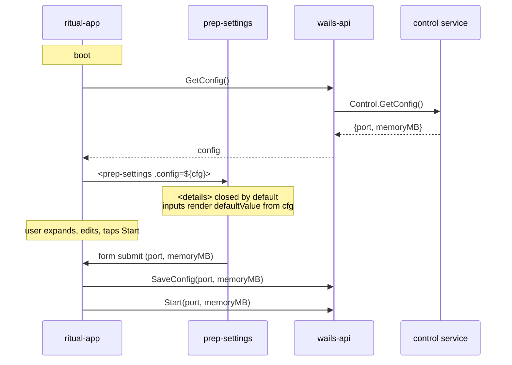

# 014 — Prep Advanced Settings

**Date:** 2026-05-23
**Status:** Implemented
**Unblocked by:** [015 Design system](015-design-system.md) — `<rune-field>` + `<rune-disclosure>` shipped.
**Phase A:** `Prep` + `GetPrep` exposed on `ControlService`; Save piggybacks the existing `Start` save path.
**Phase B:** `<prep-settings>` composing `<rune-disclosure>` + `<rune-field>` × 2; story coverage.
**Phase C:** `ritual-app` loads prep on connect, renders `<prep-settings>` during idle, reads on Start tap; `DEFAULT_PORT` / `DEFAULT_MEMORY_MB` constants removed.
**Verification:** typecheck + Storybook clean. Manual end-to-end (edit → restart → confirm persist) still owed.
**Builds on:** [007 HIG Coherence](007-hig-ux-coherence.md), [013 Dialed Cutover](013-dialed-gui-cutover.md)
**Retires:** 007 OQ1 "settings behind ⚙ gear" — gear plan dropped.

## Background

Pre-cutover `stage-idle.ts` carried port + memory inputs alongside the Start button. Cutover (`a834743`) deleted the stage; `ritual-app.ts` now calls `start(25565, 4096)` with hardcoded defaults. 007 deferred settings to a gear popover — but popovers add a second surface, modality, and JS state.

## Problem

Idle screen has no way to override port / memory. Hardcoded defaults are wrong for any user whose router, firewall, or RAM differs from baseline. Need a settings surface that is:

- Native to the dial composition (no popovers, no modals).
- Idle-only (server params are bind-time, not runtime).
- Persistent across restart (Apple HIG: settings stick).
- Stateless on the frontend — HTML does the disclosure work.

## Questions and Answers

**Q1.** Disclosure surface — `<details>` vs gear popover?
**A.** `<details>`. Gear retired. Native open/close, no controller, no popover layer.

**Q2.** Persistence model — ephemeral `@state` (old behavior) or written to Go config?
**A.** Persist to Go config. Loaded on app boot, written on Start click (one round-trip; no live save). Survives restart.

**Q3.** Edit window — IDLE only or also LOCKED / FAILED?
**A.** IDLE only. Server config is bind-time; PREP/RUN/FINAL/LOCKED freeze the inputs (server already bound or another process owns them).

**Q4.** Validation feedback — native browser tooltip or HIG inline hint?
**A.** HIG inline hint. Hint slot under each row; reveals on invalid input with reason text; Start button disabled while any row invalid.

**Q5.** What two settings ship in this log?
**A.** `port` (1..65535, default 25565) and `memoryMB` (min 512, step 512, default 4096) — restoring the exact prior surface, no new fields.

**Q6.** Default state of the `<details>` — open or closed?
**A.** Closed. HIG progressive disclosure: defaults visible (Start button), complexity on demand.

**Q7.** What's the persistence path on the Go side?
**A.** Extend the existing config subsystem with two fields; expose `GetConfig() / SaveConfig(port, memoryMB)` on the control service. Wails binding regenerates from the Go signature.

## Design

### Composition

```
ritual-shell
└── ritual-dial         (idle: label=Start, glyph=play)
    └── (after dial, idle-only:)
        <prep-settings>           ← new component, IDLE-only render
          └── <details>
                <summary>Advanced</summary>
                <fieldset>
                  port row   + hint slot
                  memory row + hint slot
                </fieldset>
```

`<prep-settings>` is mounted only when `vm.stage === StageIdle`. No JS state for open/closed — `<details>` owns it. Inputs are uncontrolled (`defaultValue` from loaded config); their values are read by `ritual-app` on Start click via `querySelector` or via a `submit` event from the form.

### Wire path



`SaveConfig` and `Start` are sequential, not interleaved — config writes first so a crash between save and bind still preserves the user's choice.

### HTML shape

```html
<prep-settings>
  <details>
    <summary>
      <span class="chevron"></span>
      <span class="label">Advanced</span>
    </summary>

    <form>
      <label class="row">
        <span class="row-label">Port</span>
        <input name="port" type="number" min="1" max="65535"
               required value="25565" />
        <small class="hint" data-for="port"></small>
      </label>

      <label class="row">
        <span class="row-label">Memory</span>
        <input name="memoryMB" type="number" min="512" step="512"
               required value="4096" />
        <span class="suffix">MB</span>
        <small class="hint" data-for="memoryMB"></small>
      </label>
    </form>
  </details>
</prep-settings>
```

### State source of truth

| Concern             | Owner                         |
|---------------------|-------------------------------|
| open / closed       | `<details>` (DOM)             |
| current field value | `<input>` (DOM)               |
| validity            | `:invalid` pseudo-class (CSS) |
| persisted value     | Go config (disk)              |
| in-flight changes   | nowhere — read on submit      |

No Lit `@state`, no event store, no `:host([open])` mirror.

### Animation (HTML-driven)

Reveal uses `interpolate-size: allow-keywords` + `transition: height` on `details[open]`, plus opacity fade on the fieldset. No JS measurement, no FLIP, no GSAP. Closed → open is one CSS rule.

```css
prep-settings details::details-content {
  block-size: 0;
  opacity: 0;
  transition: block-size var(--motion-base), opacity var(--motion-base);
  interpolate-size: allow-keywords;
  overflow: clip;
}
prep-settings details[open]::details-content {
  block-size: auto;
  opacity: 1;
}
```

Fallback for engines without `::details-content` / `interpolate-size`: instant open (acceptable — Wails is Chromium and supports both).

### HIG hint rule

- Hint hidden when input is `:placeholder-shown` (empty initial) **or** `:valid`.
- Hint revealed when `:invalid` and not pristine.
- Hint copy is field-specific, written in the component template (CSS reads `data-for` to position; copy lives in template, not CSS):
  - port: "Port must be 1–65535."
  - memoryMB: "Memory must be ≥ 512 MB, in 512 MB steps."
- Start button reads `form.checkValidity()` on each `input` event (one listener) and toggles its disabled state. Single line of imperative code; everything else is CSS.

### Brand alignment

Inputs use existing stone+engraving tokens (`--stone-edge`, `--stone-bevel`, `--rune-hi`). Summary chevron is a rune-stone glyph, not a unicode arrow. No glass, no blur. ([brand language](../.claude/projects/-Users-ykunytskyy-Documents-perpetio-go-ritual/memory/project_brand_language.md))

## Implementation Plan

### Phase A — Go config persistence
1. Add `Port int`, `MemoryMB int` to the config struct used by the control service.
2. Implement `GetConfig() (Config, error)` and `SaveConfig(port, memoryMB int) error` on the control service. Defaults applied if file missing / fields zero.
3. Regenerate Wails bindings (`wails generate`).
4. Test: round-trip — save, restart process, load returns saved values.

### Phase B — `<prep-settings>` component
1. New file `frontend/src/ui/prep-settings.ts`. Lit element with one `@property({ type: Object }) config`.
2. Render the `<details>` + form shape above. No internal `@state`.
3. CSS uses existing tokens; no new ones unless a hint color is missing — if so, add `--hint-warn` to `theme.css`.
4. Single `input` listener calls `form.checkValidity()` → updates a `:disabled`-bound button (`<button form="…" disabled?>`). Disabled is a real attribute on the Start trigger, not a class.
5. Storybook: one story showing closed/open/invalid states.

### Phase C — Wire into `ritual-app`
1. On `connectedCallback`, call `getConfig()` → store in `@state config`.
2. Render `<prep-settings .config=${this.config}>` only when `vm.stage === StageIdle`.
3. Start click handler reads `prep-settings` form values → `saveConfig(port, mem)` → `start(port, mem)`. Remove hardcoded defaults from `start()` call.
4. Delete `DEFAULT_PORT` / `DEFAULT_MEMORY_MB` constants from `ritual-app.ts`; defaults live in Go config now.

### Phase D — Verification
1. Manual: edit port to invalid (e.g. 70000) — hint appears, Start disables.
2. Manual: edit memory to 4500 — hint appears (not a 512 multiple), Start disables.
3. Manual: edit valid values, click Start, kill app, relaunch — values persist.
4. Manual: enter RUN — `<prep-settings>` unmounts (stage ≠ Idle).
5. Storybook visual regression: closed / open / invalid.

## Examples

### ✅ Good — HTML drives disclosure

```ts
render() {
  return html`
    <details>
      <summary>Advanced</summary>
      <form>…</form>
    </details>
  `;
}
```

No `@state open`. No `toggle()`. No `@click`.

### ❌ Bad — JS-mirrored open state

```ts
@state() private open = false;
// ...
<button @click=${() => this.open = !this.open}>Advanced</button>
${this.open ? html`<form>…</form>` : nothing}
```

Reintroduces a second state machine that `<details>` already implements correctly.

### ✅ Good — uncontrolled inputs

```html
<input name="port" type="number" value=${this.config.port}>
```

DOM owns the value. Read on submit.

### ❌ Bad — controlled inputs

```html
<input .value=${this.port}
       @input=${e => this.port = +e.target.value}>
```

Per-keystroke renders, per-keystroke re-validation — for two fields that get read once at Start.

## Trade-offs

- **`<details>` instead of gear popover** — gives up free Floating UI-style positioning and any future "settings shelf" reuse outside idle. Acceptable: idle is the only edit window per Q3.
- **Uncontrolled inputs** — values not observable to other components. Acceptable: only `ritual-app` reads them, and only at Start.
- **Persistence on Start click, not on field blur** — user can edit a value, never click Start, and the change is lost. Matches "server config is bind-time" framing (Q3) — if you don't start, you didn't decide.
- **Save-then-Start sequence not transactional** — if `SaveConfig` succeeds and `Start` fails, config is updated but no run happened. Acceptable: the user's next Start uses the saved value, which is what they wanted.
- **Native `<details>` animation is Chromium-recent** — `::details-content` + `interpolate-size` are Chromium ≥129. Wails uses the host WebView2/WKWebView; if a deployed user is on an older Chromium, they get instant open. Not a regression vs. today (no settings at all).

## Verification Criteria

The implementation solves the original problem when:

1. A user can change port + memory from the IDLE screen without opening a modal or popover.
2. Values survive restart of the app.
3. Invalid values surface inline hints and disable Start, with no error toasts.
4. `<prep-settings>` renders nothing post-IDLE (no leakage into RUN telemetry layout).
5. No Lit `@state` exists for `open` or for in-flight input values.
6. Removing `DEFAULT_PORT` / `DEFAULT_MEMORY_MB` constants from `ritual-app.ts` does not regress any code path.

## Open Questions

- **OQ1.** Should `SaveConfig` also be called on `<details>` close (autosave on collapse) so unsubmitted edits aren't lost on accidental refresh? Default answer: no — keeps the "decide on Start" framing — but worth confirming with the user.
- **OQ2.** Hint copy — keep terse English literals in the template, or route through a future i18n layer? Default: literals now; revisit when i18n is on the roadmap.
