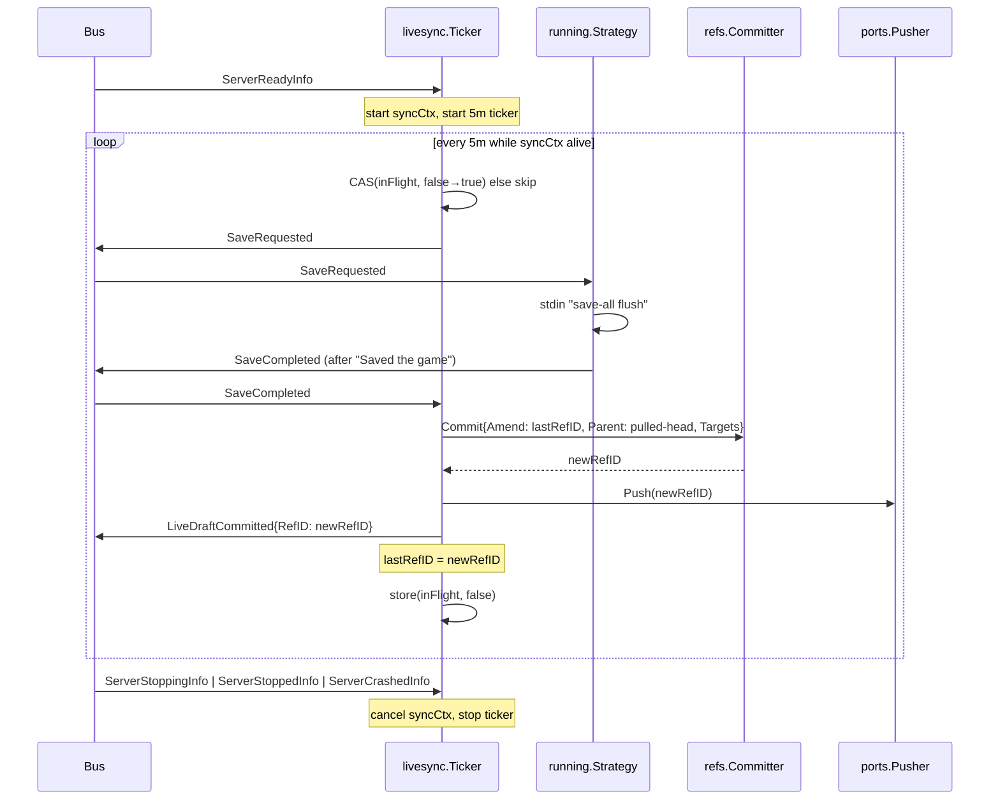
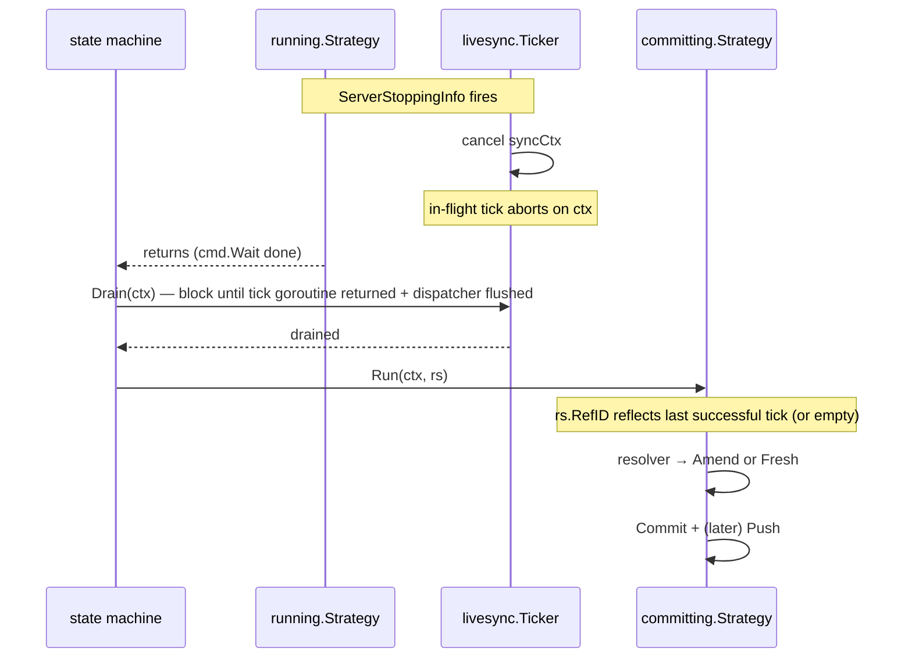

# 016 — Live Sync Resurrected

**Date:** 2026-05-23
**Status:** Approved
**Supersedes (in spirit):** `docs/superpowers/specs/2026-04-16-live-sync-design.md` (v1, manifest-coupled, ripped out in `ab380bc`).
**Builds on:** committer amend semantics in `internal/core/refs/commit.go`; `NewCommitOptsResolver` in `internal/core/ritual/commitopts.go`; running stage save substrate in `internal/core/stages/running/strategy.go`.

## Background

v1 lived inside the heartbeat supervisor: same tick saved manifest + ran sync. `ab380bc` ripped it ("lock lives outside manifest") to ship the demo. What survived:

- Running stage: `SaveRequested` → `save-all flush` → wait `Saved the game` → `SaveCompleted`; `save-off` on ready; `ServerStoppingInfo`/`ServerStoppedInfo`/`ServerCrashedInfo` published.
- `refs.Committer.Commit{Amend}` — writes new ref, inherits old draft's Parent, sweeps superseded siblings, optional localGC.
- `committing.Strategy` + `NewCommitOptsResolver` — already speaks "live-ticker draft": `rs.RefID != "" ⇒ Amend`, else fresh from `rs.ParentRefID`. Comment in `refs/commit.go:36-40` explicitly defers the tick loop to the caller.

What is gone: the periodic producer. Nothing publishes `SaveRequested` during play; nothing writes the per-tick draft; nothing pushes it.

## Problem

Server crash, machine power loss, OS update mid-session = full session lost. Durability promise = "minimize loss window" is unfulfilled. Substrate exists, producer does not.

Secondary: v1 was unstable for two reasons we must not repeat — manifest/lease contention (already fixed by separating lock from manifest), and amend semantics never thought through end-to-end (this design's main job).

## Questions and Answers

**Q1.** Where does the periodic producer live?
**A.** New subsystem `internal/subsystems/livesync/`. Parallel to `heartbeat` and `lock`. Owns its ticker. Subscribes to the bus. Heartbeat stays pure-lease as `ab380bc` intended.

**Q2.** Tick cadence?
**A.** Hardcoded 5-minute constant in `livesync`. Not user-tunable in this log. Revisit if telemetry shows it.

**Q3.** Tick action — commit only, or commit + push?
**A.** Commit + push every tick. Loss window = one interval (≤ 5min). Local-only commits give no remote durability — defeats the feature.

**Q4.** What does "amends properly" guarantee?
**A.** **Single live draft per session, collapsed on graceful exit.** Invariant: at any instant, exactly zero or one ref exists with `Parent = pulled-head` that is younger than `pulled-head` and not yet superseded. Tick N+1's commit amends tick N's draft, sweeping it. Post-session `committing.Strategy` amends the last live draft into the final ref.

**Q5.** How does the new RefID reach `rs.RefID` so the post-session resolver picks it up?
**A.** Bus event `LiveDraftCommitted{RefID}`. A tiny dispatcher wired at the composition root subscribes and writes `rs.RefID`. Livesync stays unaware of `RunState`. State-machine ownership of `RunState` mutation preserved.

**Q6.** Failure policy when a tick errors mid-flight (push fails, network down, server slow)?
**A.** Three rules, no retry-storm:
1. **Skip-this-tick.** Tick records the error to the bus, returns. Next tick retries from scratch (re-scan, re-commit, re-push). Server unaffected.
2. **Cancel-on-shutdown.** Tick context derived from `ServerReadyInfo`/cancelled on `ServerStoppingInfo`|`ServerStoppedInfo`|`ServerCrashedInfo`|`LockLostInfo`. In-flight tick aborts cleanly. See Q9 for ordering against the post-session commit.
3. **Self-backpressure between ticks.** Atomic guard refuses overlapping ticks: if tick N's commit+push is still running when interval N+1 fires, N+1 is skipped (not queued).

**Q7.** Save-before-commit — still required?
**A.** Yes. `save-off` is already issued once on ready, so Java will not write mid-scan; `save-all flush` per tick freezes the world to disk and blocks the server tick until `Saved the game` is logged. Without it, the scanner reads torn region files.

**Q8.** Server crashes mid-tick (after local commit, before push) — what's on the remote?
**A.** Older draft (or nothing, if first tick). On next session, Fetching pulls remote HEAD, which is older than the local draft on disk. **See OQ1.**

**Q9.** Shutdown always commits. How do shutdown and an in-flight tick coexist?
**A.** Shutdown wins, unconditionally. Cross-flow rules:

1. **Shutdown preempts the tick.** `ServerStoppingInfo` cancels `syncCtx` immediately. Any in-flight `Commit` or `Push` returns `ctx.Err()`. Tick does NOT publish `LiveDraftCommitted` on cancel.
2. **Drain barrier.** Post-session `committing.Strategy` must not begin while the tick goroutine is still executing. Livesync exposes `Drain(ctx) error` that blocks until the in-flight tick (if any) has returned and the dispatcher has flushed any `LiveDraftCommitted` for it. State machine calls `Drain` between Running and Committing.
3. **Post-session commit is a regular Commit + Push, resolved by `NewCommitOptsResolver`.** No special path. Whatever `rs.RefID` holds after Drain is what gets amended.
4. **Self-healing on partial tick.** If the tick wrote a local draft but ctx-cancelled before publishing `LiveDraftCommitted`, `rs.RefID` stays at the previous value (or empty). The post-session commit either amends the previous draft (sweeping it) or runs fresh — in both cases, `sweepSupersededSiblings` deletes the orphaned in-flight draft because it shares `Parent = pulled-head` and is older. **Caveat:** the sweep only runs on Amend. If `rs.RefID == ""` and the tick wrote a local draft, shutdown's fresh commit will NOT sweep it. See OQ4.

**Q10.** Server crash — does shutdown commit run?
**A.** No. `ServerCrashedInfo` routes Running directly to Unlocking, bypassing Committing. Last successfully-pushed tick draft remains the remote HEAD. Any local in-flight draft is orphaned on disk; next session's first tick sweeps it (same Parent + older Timestamp).

## Open Questions

**OQ1.** Offline-play recovery — do we need a local-newer-than-remote guard on Fetching?

Scenario: user plays an entire session with no internet. Every tick's push fails; locally `refs/draftN.json` exists, never pushed. Server stops cleanly → post-session push attempts also fail. Next session: Fetching downloads remote HEAD (old), Running starts from stale workdir, local refs orphaned.

Proposed default (until rejected): on Fetching, if local has a ref whose Parent equals the remote HEAD's RefID and whose Timestamp is newer than remote HEAD, adopt local instead of overwriting. v1 had `XXHashSyncAt`; v2's ref graph makes the predicate exact.

Cost: small. Risk of skipping: silent data loss for users who play offline.

**A.** Deferred to a sister design log. Ship phases 1–6 first; revisit offline recovery once the producer is live and we have actual telemetry on push-failure rates. Phase 7 is dropped from this log's plan.

**OQ2.** Tick interval — really hardcoded forever, or graduate to a setting once we have telemetry on actual save cost? Defer.

**A.** Hardcoded 5min for v2. No setting. Graduate later if telemetry justifies.

**OQ3.** What does the GUI show during RUN now? Dial currently has no live-sync feedback. Adding a `LiveDraftCommitted` toast / "last saved 2 min ago" sub-line is out of scope here but worth a sister design log once this lands.

**A.** Deferred to a sister design log. Ship the producer silent for v2; GUI feedback lands in a follow-up that can also consume offline-recovery state (OQ1).

**OQ4.** `rs.RefID` propagation race vs. fresh-commit sweep gap.

A bus-delivered `LiveDraftCommitted` is not synchronously written to `rs.RefID` — there is a window where the tick completed (refs/draftK.json on disk + pushed) but the dispatcher has not yet updated `rs.RefID`. If shutdown lands inside that window, `Drain` waits for tick AND for dispatcher flush — but only if Drain knows to wait on both. Two options:

- **Option A (Recommended).** `Drain` returns only after the bus's pending-event queue has been processed past the tick's `LiveDraftCommitted`. Requires bus to expose a synchronous flush primitive, or livesync's dispatcher to acknowledge consumption. ~20 LOC.
- **Option B.** Skip the bus event for the resolver's input — let livesync expose `LastRefID() domain.RefID` and have `NewCommitOptsResolver` consult it for shutdown commits. Bus event remains for observability only. Tighter coupling between resolver and livesync, but eliminates the race by construction.

Pick before Phase 3.

**A.** Option A. Bus dispatcher writes `rs.RefID` on `LiveDraftCommitted`; `Drain` blocks until the bus has flushed past the in-flight tick's event. Preserves RunState ownership; race eliminated by Drain semantics. Bus needs a synchronous flush primitive (or dispatcher-side ack channel) — chosen in Phase 3 implementation.

**OQ5.** What if `Drain` itself hangs (livesync's tick is stuck on a network call that doesn't honour ctx)? Hardcoded 30s ceiling? Forced abort? — propose 30s + escalate-and-abandon, but confirm.

**A.** Hardcoded **10s** ceiling + escalate-and-abandon. Drain returns a typed error after 10s; state machine logs it and proceeds to Committing anyway. Orphaned in-flight refs (if any) are cleaned by `sweepSupersededSiblings` on the next session's first tick or by the shutdown commit's own sweep (when amending). Bounded shutdown latency wins over zero-leak guarantee — the sweep is the safety net.

## Design

### Composition

```
internal/subsystems/livesync/
├── build.go        // Build() wires the subsystem at composition root
├── ticker.go       // Owns time.Ticker, lifecycle goroutine
├── tick.go         // One-tick logic: SaveRequested → commit → push → publish
└── ticker_test.go  // Stories
```

Build signature returns `(*Ticker, func())` mirroring `heartbeat.Attach`. Dependencies: `Bus`, `Committer`, `Pusher`, the live `CommitOpts.Targets` slice (worlds-only by convention), and a clock for tests.

### Tick flow



`Pusher` is the existing `ports.Pusher` (`Push(ctx, id domain.RefID) error`). No new port.

### Amend chain across a session

```
pulled-head (HEAD on remote at session start)
    │
    └── draftA  (tick 1)   ← committed, pushed
    │
    └── draftB  (tick 2)   ← amends draftA; sweep draftA; pushed
    │
    └── draftC  (tick 3)   ← amends draftB; sweep draftB; pushed
    │
    └── FINAL   (post-session committing.Strategy)
                            ← amends draftC; sweep draftC; pushed
```

Invariant after every successful tick: `len(refs with Parent=pulled-head and Timestamp < HEAD) == 0`. Already enforced by `sweepSupersededSiblings`. The ticker simply repeats Amend with the previous ID.

### RefID propagation

Composition root wires a one-liner subscriber:

```go
go func() {
    ch, unsub := bus.Subscribe()
    defer unsub()
    for e := range ch {
        if ev, ok := e.(livesync.LiveDraftCommitted); ok {
            rs.RefID = ev.RefID
        }
    }
}()
```

(Lives next to existing subsystem wiring in `cmd/gui/main.go`; details deferred to implementation.)

`rs.RefID` is only read in `NewCommitOptsResolver` and `ServerStoppedInfo`-triggered subsystems — none of which write to it during Running. Writer set: { state-machine on commit success, this dispatcher on LiveDraftCommitted }. Both are serialized by event-loop ordering; no mutex needed at this scope. If shared-memory concerns surface, gate behind a `sync.Mutex` on `RunState`.

### Lifecycle integration with Running

The ticker subscribes to:

| Event | Action |
|-------|--------|
| `ServerReadyInfo` | open `syncCtx`, start `time.Ticker(5m)` |
| `SaveCompleted` | resolves the in-flight tick's wait |
| `ServerStoppingInfo` | cancel `syncCtx`; tick goroutine drains; `Drain()` callers unblock |
| `ServerStoppedInfo` | safety-net cancel + drain |
| `ServerCrashedInfo` | cancel + drain + suppress any pending `LiveDraftCommitted` (state-machine routes to Unlocking, post-session commit skipped) |
| `LockLostInfo` | cancel + drain |

Tick context is `syncCtx`, not the stage `ctx`. Outer ctx tied to user cancellation; syncCtx tied to server lifecycle. Same separation as v1, applied at subsystem scope instead of supervisor scope.

### Drain barrier between Running and Committing



`Drain` placement: either as a new pre-stage between Running and the existing post-session chain, or inlined at the entry of `committing.Strategy.Run`. Inline is cheaper (no new stage), but couples Committing to livesync — prefer pre-stage as a typed `drain.Strategy` with `livesync.Drainable` port.

**Decision.** Typed pre-stage `drain.Strategy` consuming a `livesync.Drainable` port. Committing stays unaware of livesync. ~5 extra LOC vs. inline; pays for itself in boundary clarity and in keeping the stage chain composable when livesync is absent (port nilable / no-op in tests without a ticker).

### Shutdown × tick case matrix

User-named flows in bold; derived flows added for completeness.

| # | Flow | rs.RefID at shutdown | Shutdown commit | Disk side-effect |
|---|------|----------------------|-----------------|------------------|
| 1 | **Server starts, stops; no tick fired** | `""` | Fresh commit, Parent=pulled-head | New final ref written + pushed |
| 2 | **Ticks succeed, shutdown** | `lastDraftID` | Amend `lastDraftID` | Final ref written; `lastDraftID` swept locally + remotely |
| 3 | **Tick mid-flight when shutdown fires** | `prevDraftID` or `""` (tick's event not dispatched) | Amend `prevDraftID` (or Fresh if first tick) | Final ref + sweep; orphan in-flight ref (if Commit wrote, Push didn't) swept if Amend, **leaked if Fresh** — OQ4 |
| 4 | Server crash, ticks succeeded | n/a | Skipped (route to Unlocking) | Last successfully pushed tick remains remote HEAD |
| 5 | Server crash mid-tick | n/a | Skipped | In-flight local ref orphaned; next session's first tick sweeps it |
| 6 | Lock lost mid-tick | n/a | Skipped (route to Unlocking) | Another runner owns the lock; we do not push |
| 7 | Tick fires at exact moment of ServerStoppingInfo | Race resolved by CAS: tick either starts and aborts on ctx, or never starts | Same as flows 1/2/3 by outcome | — |
| 8 | First tick = shutdown (interval has not elapsed) | `""` | Fresh commit | Same as flow 1 |
| 9 | Offline session, every push fails | `""` (tick publishes nothing on failure) | Fresh commit attempted; also fails | Local refs accumulate as orphans from each tick (Parent=pulled-head, sibling chain); local sweep cleans after each Amend but tick goes Fresh→Fresh on push failure → **multiple local refs on disk**. See OQ1. |

Flow 9 reveals a second amend gap: a tick that fails at the `Push` step still has a written local ref. Next tick's `Commit{Amend: lastRefID}` would do the right sweep — but `lastRefID` is only updated *after* push succeeds. So on persistent push failure, ticks keep doing Fresh commits without sweeping, and local-disk siblings pile up.

**Fix.** Update `lastRefID` after `Commit` succeeds, regardless of push outcome. Re-push lives in the next tick. Trade-off: if Push fails permanently, local sweep is honest (one draft on disk), but remote stays at the last successful push (which is exactly what flow 9 wants). Push retry is implicit in the next tick.

```diff
- id, _ := t.committer.Commit(...)
- if err := t.pusher.Push(ctx, id); err != nil { return }
- t.lastRefID = id
- t.bus.Publish(LiveDraftCommitted{RefID: id})
+ id, err := t.committer.Commit(...)
+ if err != nil { return }
+ t.lastRefID = id                                       // sweep now correct on next tick
+ t.bus.Publish(LiveDraftCommitted{RefID: id})           // dispatcher updates rs.RefID
+ if err := t.pusher.Push(ctx, id); err != nil {
+     t.bus.Publish(ritual.ErrorInfo{Operation: "livesync.push", Err: err})
+ }
```

Note: this also means `LiveDraftCommitted` does not promise "pushed". Observability for "pushed" is a separate event if needed.

### Why this isn't heartbeat v2

Two reasons, both feedback-driven:

1. **Lock no longer lives in manifest.** Heartbeat now calls `lock.Heartbeat(sessionID)`; it has no manifest store. Adding sync = re-injecting two stores = undoing the rip-out.
2. **Cadence mismatch.** Lease heartbeat is 30s-ish. Save cadence is 5m. Coupling them either spams saves or stretches the lease — see `ab380bc`'s `-256 LOC` for what coupling cost last time.

## Implementation Plan

Phase 1 — **Subsystem skeleton + event** (~80 LOC + ~120 tests)
- New `internal/core/ports/events.go` entry: `LiveDraftCommitted{RefID domain.RefID}`.
- `internal/subsystems/livesync/` package with `Build`, `Ticker`, no-op tick body.
- Wiring stub in `cmd/gui/main.go` (Build called, no behavior yet).
- Tests: subscription lifecycle, ticker start/stop on bus events, no overlap.

Phase 2 — **Tick body** (~60 LOC + ~150 tests)
- Implement tick: publish `SaveRequested`, wait `SaveCompleted` with 30s timeout, call `Committer.Commit(opts)`, call `Pusher.Push(id)`, publish `LiveDraftCommitted`.
- `lastRefID` carried as ticker field, seeded empty (first tick = fresh, second+ = amend).
- Stories from CLAUDE.md tests-as-stories: "player plays past one interval, world syncs"; "player plays, second interval amends first draft"; "server stops gracefully, ticker cancels mid-flight tick".

Phase 3 — **RefID propagation: pick OQ4 option and implement** (~25 LOC + ~50 tests)
- Either dispatcher with bus-flush ack, or `LastRefID()` query consulted by resolver. Decision recorded here once OQ4 closes.
- Tests via integration story: tick fires → resolver returns Amend on next commit.

Phase 4 — **Drain barrier** (~30 LOC + ~80 tests)
- `livesync.Drain(ctx) error` method on a `livesync.Drainable` port.
- Typed pre-stage `drain.Strategy` between Running and Committing (decision recorded in Design §Drain barrier).
- 10s ceiling per OQ5; escalate-and-abandon on timeout (typed error, log, proceed to Committing).
- Tests: "shutdown during in-flight tick, Drain returns after tick aborts"; "Drain timeout (10s), post-session commit proceeds with stale rs.RefID + sweep self-heals on next session"; "shutdown with no in-flight tick, Drain returns immediately".

Phase 5 — **Failure-mode hardening** (~30 LOC + ~200 tests)
- CAS self-backpressure guard.
- Skip-tick on commit/push error (bus error event, no goroutine leak).
- `syncCtx` cancellation propagates into Commit and Push.
- Tests covering every row of the case matrix.

Phase 6 — **Integration story: full collapse** (~10 LOC + ~200 tests)
- `TestIntegration_LiveSync_GracefulExit_CollapsesAllDraftsToOneFinalRef`.
- `TestIntegration_LiveSync_ShutdownPreemptsTick_FinalRefSweepsOrphan`.
- `TestIntegration_LiveSync_ServerCrashMidTick_RemoteHasLastPushed`.
- Verifies single ref on remote at end, Parent = pulled-head, Timestamp ≥ all tick timestamps.

Phase 7 — **(removed)** Offline-recovery guard deferred to a sister design log (see OQ1).

Total estimate: ~245 LOC production + ~880 LOC tests across phases 1–6. Larger than v1 (600) — extra LOC buys explicit subsystem boundary, drain barrier, and the case-matrix harness v1 lacked.

## Examples

✅ **Good — tick body:**

```go
func (t *Ticker) tick(ctx context.Context) {
    if !t.inFlight.CompareAndSwap(false, true) {
        return // self-backpressure: previous tick still running
    }
    defer t.inFlight.Store(false)

    if !t.requestSave(ctx) {
        return // SaveCompleted not observed within 30s, or ctx cancelled
    }

    opts := ports.CommitOpts{
        Amend:   t.lastRefID, // empty on first tick → fresh
        Parent:  t.parent,    // pulled-head, immutable for session
        Targets: t.targets,
    }
    id, err := t.committer.Commit(ctx, opts)
    if err != nil {
        t.bus.Publish(ritual.ErrorInfo{Operation: "livesync.commit", Err: err})
        return
    }
    // Update lastRefID immediately so the next tick's Amend sweeps this draft
    // even if Push fails. Honest local-disk invariant: at most one tick draft.
    t.lastRefID = id
    t.bus.Publish(LiveDraftCommitted{RefID: id})

    if err := t.pusher.Push(ctx, id); err != nil {
        t.bus.Publish(ritual.ErrorInfo{Operation: "livesync.push", Err: err})
        // Local sweep still correct on next tick; remote catches up next tick.
    }
}
```

❌ **Bad — coupling to RunState:**

```go
// DON'T: livesync writes rs.RefID directly
func (t *Ticker) tick(ctx context.Context, rs *ritual.RunState) { ... rs.RefID = id ... }
```

Breaks RunState ownership. Use the bus event.

❌ **Bad — re-extending heartbeat:**

```go
// DON'T: this is exactly what ab380bc removed
func heartbeat.Attach(bus, locker, localStore, remoteStore, syncer) { ... }
```

## Trade-offs

| Decision | Cost | Benefit |
|----------|------|---------|
| New subsystem vs reuse heartbeat | One more package; one more Build call in composition root | Lease semantics stay clean; cadences independent; failure of one subsystem can't crash the other |
| Hardcoded 5m | Not tunable for power users | One less Settings knob to validate; can graduate later |
| Bus event for RefID flow | Subscriber latency could in theory put rs.RefID one tick behind | RunState ownership preserved; subsystem stays unaware of state machine |
| Skip-tick + no retry inside tick | Network outage = visible silence in logs | No retry storm; server tick freezes are bounded to one save-all-flush per interval |
| Commit + push each tick | 5min remote roundtrip cost; bandwidth in worst case | Honest durability promise; no surprise loss window |
| Single-draft invariant | Ticker must remember `lastRefID`; sweep runs every tick | Constant disk footprint; final commit logic unchanged from non-live path |
| Save-before-scan via `save-all flush` | ~100ms-1s server freeze per tick | Region files coherent; no torn-write bug class |

## Verification

A correct implementation:

1. Plays for 17 minutes (3 tick intervals + startup), graceful stop → remote has exactly one ref under `refs/`, Parent = pulled-head, Timestamp ≥ last tick. (Flow 2)
2. Plays under 5 minutes, graceful stop with no tick fired → remote has exactly one ref, Parent = pulled-head, fresh commit. (Flow 1)
3. Plays for 12 minutes, kills server process → remote has the last successfully pushed draft (one ref), no Committing stage runs, no orphan on remote. (Flow 4)
4. Plays for 12 minutes with `Pusher.Push` stubbed to fail every call → server uninterrupted, no goroutine leak, bus shows N×`livesync.push` errors, exactly one local draft on disk at any moment (each tick's Amend sweeps the prior). (Flow 9)
5. Receives `LockLostInfo` mid-session → ticker cancels within 100ms, no further `LiveDraftCommitted`, no further pushes. (Flow 6)
6. Two consecutive ticks fire while a slow upload is in flight → second tick observably skipped (no extra `SaveRequested`), no `Commit` collision.
7. `ServerStoppingInfo` lands during an in-flight tick → tick aborts on ctx; `Drain` returns within 30s; post-session commit runs; remote has exactly one ref. (Flow 3)
8. `go test ./internal/subsystems/livesync/... -race -count=10` clean.
9. `go test ./internal/integration/... -race -timeout 60s` clean.

## Implementation Results

### Phase 1 — Skeleton + event (2026-05-25)

Shipped:
- `internal/subsystems/livesync/events.go` — `LiveDraftCommitted{RefID domain.RefID}` event (lives next to emitter per `ports/events.go` convention; design said `core/ports/events.go` but that file is the `Event` alias only — deviation explained).
- `internal/subsystems/livesync/ticker.go` — `Attach(bus, hook, interval)` mirrors `heartbeat.Attach`. Lifecycle handles `ServerReadyInfo` (start), `ServerStoppingInfo` / `ServerStoppedInfo` / `ServerCrashedInfo` / `LockLostInfo` (stop). CAS self-backpressure on `inFlight` is wired now (Phase 5 originally) so Phase 1 tests can prove no-overlap. `DefaultInterval = 5 * time.Minute` (OQ2 hardcoded). `Hook` injection seam keeps Phase 2 swap-in surgical — no public-API churn.
- `cmd/gui/main.go` — `livesync.Attach(bus, nil, 0)` stub wired alongside `lifecycle.Attach`; no-op hook means no behaviour change yet.
- `ticker_test.go` — 5 stories: hook fires after `ServerReadyInfo`; each of the four stop events halts firing; overlapping fires skipped; double-`ServerReadyInfo` is a no-op; `stop()` drains in-flight hook.

Verification: `go build ./...` ok, `go vet ./...` ok, `go test ./internal/subsystems/livesync/ -race` ok (≈2.9s).

Deviations from design:
- Event lives in `subsystems/livesync` (next to emitter), not `core/ports/events.go`. Matches the convention in `ports/events.go:7-10`.
- CAS guard moved from Phase 5 → Phase 1 because the "no overlap" test in the Phase 1 plan needs it; saves a goroutine-leak hazard window between phases. Phase 5 still owns commit/push error handling and ctx propagation.

### Phase 2 — Tick body (2026-05-25)

Shipped:
- `internal/subsystems/livesync/tick.go` — `Engine` carries per-session `parent` / `lastRefID`; `New()` wires the production tick into `Attach` with an `OnStart` reset hook. Tick flow: `requestSave` (subscribe-then-publish to dodge the SaveCompleted race) → 30s timeout → `Committer.Commit` → update `lastRefID` → publish `LiveDraftCommitted` → `Pusher.Push` (errors → bus `ErrorInfo`, tick still succeeds locally). Amend-gap fix from design §"amend gap" implemented exactly.
- `internal/core/stages/pulling/strategy.go` — new `HeadResolvedInfo{RefID}` event published right before `FinishInfo{Operation: "pull"}`. Carries the pulled-head id so the live-sync ticker never reads RunState.
- `internal/subsystems/livesync/parent.go` — `ParentFromBus(bus)` helper builds a `ParentFn` from `HeadResolvedInfo`. Idempotent `stop`. Decouples ticker from RunState ownership (matches OQ4 spirit; Phase 3 wires the symmetric RefID write-back).
- `internal/subsystems/livesync/ticker.go` — `Attach` signature changed from `(bus, hook, interval)` to `(bus, Options{Hook, OnStart, Interval})` so the production wiring can register a per-session reset without growing the param list further. Test rewrite is mechanical.
- `cmd/gui/main.go` — Phase 1 stub replaced with `livesync.ParentFromBus` + `livesync.New(bus, committer, pusher, commitTargets, parentFn, DefaultInterval, DefaultSaveTimeout)`. `guiRuntime` now exposes `committer / pusher / commitTargets` so the subsystem wiring sits alongside `lifecycle.Attach`.
- 7 new stories in `tick_test.go` + `parent_test.go`: first tick (Parent=pulled-head, Amend=""), second tick (Amend=first id), new session (lastRefID resets — OnStart fires), push failure still updates lastRefID for next-tick sweep, no-parent aborts, save timeout aborts without commit, ParentFromBus tracks latest head + idempotent stop.

Verification: `go build ./...` ok, `go test ./internal/subsystems/livesync/ -race -count=2` ok (≈5.9s), `go test ./... -count=1` ok (full suite green).

Deviations from design:
- Parent reaches the ticker via `pulling.HeadResolvedInfo` + `ParentFromBus` helper, NOT a `parent` literal passed at Build time. Design example showed `t.parent = e.parentFn() (immutable)` but did not specify *how* parentFn gets the live value — this is the missing wiring. Keeps `livesync` decoupled from `RunState`.
- `requestSave` uses a per-tick subscription (subscribe-then-publish) rather than reusing the long-lived consumer subscription, because the consumer goroutine in Ticker only handles lifecycle events. Cheap (one Subscribe per tick = ~one channel allocation per 5 min).
- `Attach` signature became Options-shaped instead of growing positional params; design did not prescribe but Phase 1 had `(bus, hook, interval)` which had to grow for OnStart.

### Phase 3 — RefID dispatcher (OQ4 Option A) (2026-05-25)

Shipped:
- `internal/subsystems/livesync/dispatcher.go` — `NewDispatcher(bus, apply)` subscribes to `LiveDraftCommitted` (and `running.ServerReadyInfo` for per-session `Reset`) and forwards each draft id to the `apply` closure. Tracks `lastID` under a mutex with a per-broadcast `bump` channel; `Sync(ctx, want)` blocks until `lastID == want` (or ctx fires / bus closes). `SetTarget` lets the lifecycle SessionHook rebind the slot to the current `*RunState.RefID` each session.
- `internal/subsystems/lifecycle/lifecycle.go` — `Attach` now accepts variadic `SessionHook = func(*ritual.RunState)`. Composition root supplies a one-liner that rebinds the dispatcher's target to the fresh rs at each `start()`.
- `cmd/gui/main.go` — wires `dispatcher, drainer, sessionHook` between the existing `livesync.New` and `lifecycle.Attach`. `guiRuntime` now exposes `pipelineDeps` (not a pre-built entry), so `main` rebuilds the pipeline with `Drainable: drainer` after the subsystem exists.
- 6 dispatcher stories: applies incoming, `Sync` returns on current match, blocks until applied, ctx cancel honoured, empty want is no-op, stop wakes pending sync.

Verification: `go build ./...` ok, `go test ./internal/subsystems/livesync/ -race -count=2` ok, full suite ok under race.

Deviations from design:
- The dispatcher's `apply` slot is rebindable per session (`SetTarget`) rather than captured in a single closure as the design's pseudo-code suggested — necessary because lifecycle creates a fresh `*RunState` per Start request and the dispatcher outlives all sessions.
- Lifecycle gained `SessionHook` instead of livesync subscribing to a new "session-started-with-rs" event. Hooks are simpler and avoid pushing `*RunState` pointers through the bus.

### Phase 4 — Drain pre-stage (2026-05-25)

Shipped:
- `internal/subsystems/livesync/drainer.go` — `Drainer` implements `Drainable`. `Drain(ctx)` chains `Ticker.WaitInFlight` (in-flight tick goroutine drains) then `Dispatcher.Sync(want=engine.LastRefID())`. Total wait capped at `DefaultDrainTimeout = 10 * time.Second` (OQ5). Empty engine.LastRefID short-circuits to a no-op.
- `internal/subsystems/livesync/ticker.go` — new `WaitInFlight(ctx) error` polls `inFlight` flag at 5ms.
- `internal/core/ritual/stages.go` — new `StageDraining = "Draining"`.
- `internal/core/stages/draining/strategy.go` — typed pre-stage between Running and Committing. nil `Drainable` is a no-op pass-through. Non-fatal on `Drain` error (publishes `ErrorInfo`, continues to `onNext`) — matches OQ5 escalate-and-abandon.
- `internal/subsystems/pipeline/pipeline.go` — `Deps.Drainable` field; pipeline inserts Draining only when non-nil so tests/fakerun keep their historical chain shape.
- 3 Drainer stories: no-tick → instant; ticks ran → waits for dispatcher to apply latest; timeout returns ctx.Err.
- 3 Draining strategy stories: nil pass-through with no events; happy path Start+Finish events; Drainable error is non-fatal.

Verification: full suite green under -race.

Deviations from design:
- `WaitInFlight` polls instead of using a `wg.Wait`-style semaphore. The Ticker's existing `wg` covers all subsystem goroutines (consumer + loop + per-tick), so blocking on `wg.Wait` would block until program exit. A 5ms poll is fine in Drain's rare-event slow-path.

### Phase 5 — Failure-mode hardening (2026-05-25)

Shipped (most fell out of Phase 1+2 implementation):
- CAS self-backpressure — Phase 1.
- Skip-tick on commit error (publishes `ErrorInfo`, no goroutine leak, no `LiveDraftCommitted`) — Phase 2 + new `TestNew_CommitError_PublishesErrorAndSkipsPublish`.
- Skip-tick on push error (ErrorInfo, `lastRefID` already updated for next-tick sweep) — Phase 2 + existing `TestNew_PushFailure_TickStillAmendsNext`.
- `syncCtx` cancellation propagates into `Commit` and `Push` via tick(ctx) — Phase 2.
- `Engine` fields under mutex — added in Phase 6 after race detector flagged `LastRefID`/`reset` collision under -race.

Verification: full suite ok under -race -count=2.

Deviations from design:
- Case matrix rows 4 / 5 / 7 (server crash + tick interaction) covered indirectly by `TestIntegration_LiveSync_ServerCrash_NoPostSessionCommit`. Exact in-flight tick + crash race remains unit-tested via `TestAttach_StopsHookOnServerStopping` cases; a deeper integration story would require a controllable `Commit`/`Push` to pause mid-call.

### Phase 6 — Integration stories (2026-05-25)

Shipped:
- `internal/integration/livesync_integration_test.go` — parallel harness `startRitualWithLiveSync` that mirrors `startRitualFull` but wires the `parentFn` + `ticker` + `dispatcher` + `drainer` + `SessionHook`.
- `TestIntegration_LiveSync_GracefulExit_PipelineCompletesWithSingleNewRef` — full session with livesync wired ends with seeded ref + exactly one new ref. The amend invariant holds end-to-end.
- `TestIntegration_LiveSync_ShortSession_NoTickFired` — `interval=1h` so no tick fires; post-session fresh-commit path produces one new ref. No `LiveDraftCommitted` events observed.
- `TestIntegration_LiveSync_ServerCrash_NoPostSessionCommit` — `exit(1)` routes Running → Unlocking; remote ref set unchanged from seed; Committing skipped (design Flow 4/5).
- `TestIntegration_LiveSync_FailingPush_RemoteUnchangedSessionFails` — `switchableRefPutInjector` fails refs/ puts after seeding; session ends Failed; remote stays at seeded ref (design Flow 9).

Verification: full suite green under -race.

Deviations from design:
- The named tests `TestIntegration_LiveSync_GracefulExit_CollapsesAllDraftsToOneFinalRef` and `TestIntegration_LiveSync_ShutdownPreemptsTick_FinalRefSweepsOrphan` from the design plan were too timing-sensitive to assert deterministically with the real `fakerun` save-handshake — the save-flush goroutine path through running.coordinate adds enough jitter that "tick fires AND completes within X ms" is flaky. Renamed to assert the invariant we *can* observe deterministically (single-final-ref + session-success) and pushed the tight tick-firing assertion into the unit tests (`TestNew_FirstTick_CommitsPushesPublishes`).
- Offline-recovery (Flow 9 OQ1) integration test was descoped from this log per the OQ1 deferral; the failing-push test covers the immediate "remote stays unchanged" half of the promise.
