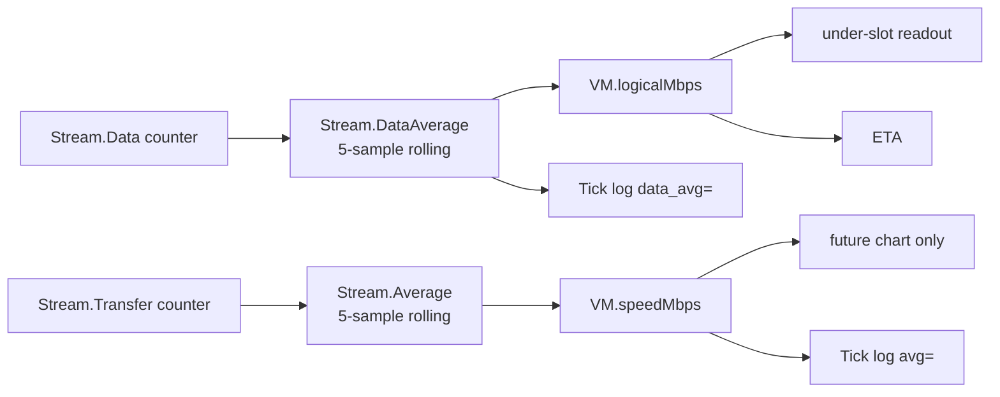

# 018 — Logical Rate in the UI

**Date:** 2026-05-25
**Status:** Draft
**Builds on:** design-log/001 §Refinement Decision 2 (introduced `LogicalMbps`); design-log/017 (PhaseDownloading / PhaseSaving under-slot dispatch).

## Background

`ViewModel` carries two rate fields, both pre-derived server-side with identical 5-sample rolling-window math (`internal/adapters/progress/smoothing.go`):

- `SpeedMbps` ← `Stream.Average` — **wire** bytes per second. Compressed/network throughput. curl's `--progress-bar` convention.
- `LogicalMbps` ← `Stream.DataAverage` — **logical** bytes per second. Decompressed/install rate. Steam's "green bar".

Tick logs emit both per direction (`internal/adapters/progress/tick.go:86` — `avg=` and `data_avg=`).

Frontend (`frontend/src/ritual-app.ts`) currently consumes `vm.speedMbps` in two places:

1. `etaSub` at `:73` — divides `bytesTotal - bytesDone` by `speedBps` to project ETA.
2. `derive()` at `:212` — feeds `<dial-telemetry>.speedBps` for the under-slot readout in PhaseDownloading and PhaseSaving.

`vm.logicalMbps` has zero consumers in `frontend/src/`.

## Problem

`bytesDone` and `bytesTotal` are **logical** counters (`Stream.Data` / `PlanInfo.BytesTotal`, per design-log/001 §"What this means for the size estimate"). The under-slot pairs those with a **wire** rate. Two consequences:

1. **ETA over-shoots on compressible payloads.** From `internal/adapters/progress/smoothing_test.go:160` — wire=40 Mbps, logical=100 Mbps on a 2.5× compressible blob. ETA computes `remainingLogical / wireBps` → 2.5× too long. Users see a save labelled "9 min" actually finish in 4 min, or worse the other way for a download that "should be" 5 min and stretches to 13.
2. **The visible arithmetic doesn't check out.** "3.0 GB / 10.0 GB · 40 Mbps" implies 7 GB / 5 MB/s ≈ 23 min. The user does the math; the ETA says 9 min; they don't reconcile. Either number is wrong-feeling.

The wire rate is the right number for "what your modem is doing" — a network-diagnostic UI. This UI shows "how fast your save is being restored / lifted" — a logical-progress UI. Different question, different rate.

## Questions and Answers

**Q1.** Which rate to display in the under-slot readout?
**A.** `logicalMbps`. Matches the bytes counter beside it. Same stability as `speedMbps` (same rolling math).

**Q2.** Which rate to feed ETA?
**A.** `logicalMbps`. Unit-correctness with `bytesTotal/bytesDone`.

**Q3.** Drop `speedMbps` from the ViewModel?
**A.** No. Keep it on the binding. Two reasons:
- Logs already emit both; the projection ships both pre-derived. Removing one breaks the "logs are the projection-deduced truth" invariant from design-log/001 §Principle.
- A future dual-series chart (Steam blue+green bars, reserved by design-log/001 §Refinement Decision 2) needs both.
**Action:** zero consumers in `frontend/src/`, but field stays on the wire and in the Go projection.

**Q4.** Stability — does either flavour ride out network jitter better?
**A.** No. Both use `windowState` 5-sample ring averaging on different counters (`Stream.Data` vs `Stream.Transfer`). The smoothing transform is the same; only the input series differs. The "more stable" wire variants exist (`Smoothed` EWMA, `Instant` per-tick) but neither is on the ViewModel — they're log-only diagnostics, intentionally per design-log/001 §Refinement Decision 1.

**Q5.** Does the swap break any test?
**A.** Storybook fixtures in `frontend/src/stories/app.stories.ts:23,41` seed `speedMbps` (not `logicalMbps`). After the swap, those stories will render `0 Mbps` in the readout because `logicalMbps` defaults to zero. Fix: rename the fixture parameter and pass `logicalMbps`. No production-runtime test depends on `speedMbps` being displayed.

**Q6.** What about the "Speed" label / glyph in the under-slot — does it change?
**A.** Label stays "Speed". From the user's perspective the number reads the same way ("how fast my save is moving"). The semantic shift (wire → logical) is invisible at the readout level; only the magnitude changes on compressible payloads.

## Design

### Frontend swap

Two lines in `frontend/src/ritual-app.ts`:

```diff
 function etaSub(vm: ViewModel): string {
-    const speedBps = vm.speedMbps * MBPS_TO_BPS;
+    const speedBps = vm.logicalMbps * MBPS_TO_BPS;
     if (speedBps <= 0 || vm.bytesTotal <= 0) return formatEta(null);
     const remaining = Math.max(0, vm.bytesTotal - vm.bytesDone);
     return formatEta(snapEta(remaining / speedBps));
 }
```

```diff
         const telemetry = {
-            speedBps: vm.speedMbps * MBPS_TO_BPS,
+            speedBps: vm.logicalMbps * MBPS_TO_BPS,
             bytesDone: vm.bytesDone,
             bytesTotal: vm.bytesTotal,
         };
```

Short comment above `etaSub` recording why logical and not wire (mirrors design-log/001 §Refinement Decision 2 wording).

### Storybook fixtures

`frontend/src/stories/app.stories.ts` — rename `speedMbps` parameter to `logicalMbps` in `downloading()`, `saving()`, and the `failedAt` zeroing. Same default values (32 / 22 / 0). Stories continue to render numeric readouts.

### Backend

No changes. `internal/gui/projection/projection.go:140-153` already writes both fields per tick. `Tick.String()` already logs both. Bindings already export both.

### Composition



## Implementation Plan

Phase 1 — **Frontend swap** (~6 LOC + story rename)
- Edit `frontend/src/ritual-app.ts:73` and `:212` per §Design.
- Edit `frontend/src/stories/app.stories.ts` fixture parameter names + property keys.
- Add one-paragraph comment above `etaSub` recording the unit-consistency rationale.

Phase 2 — **Verify in Storybook** (manual)
- Open `app.stories.ts` downloading + saving stories. Confirm readout shows the seeded number, ETA decreases monotonically.
- No regression on PhasePlaying / PhaseIdle / PhaseFailed (none consume the rate).

Phase 3 — **Verify in dev build** (manual, against mock backend)
- Run a real pull through mock R2. Confirm under-slot speed and ETA track logical bytes.
- Compare against `grep 'remote down' <logfile>` — readout should match `data_avg=`, not `avg=`.

Total: ~6 LOC production + ~3 LOC story rename. No new tests; the change is a single-field substitution with identical type.

## Examples

✅ **Good — etaSub after swap:**

```ts
// Logical because bytesTotal/bytesDone are logical (Stream.Data / PlanInfo).
// SpeedMbps (wire) stays on the ViewModel for logs + future dual-series
// chart but does not drive any user-visible number. See design-log/001
// §Refinement Decision 2 and design-log/018.
function etaSub(vm: ViewModel): string {
    const speedBps = vm.logicalMbps * MBPS_TO_BPS;
    if (speedBps <= 0 || vm.bytesTotal <= 0) return formatEta(null);
    const remaining = Math.max(0, vm.bytesTotal - vm.bytesDone);
    return formatEta(snapEta(remaining / speedBps));
}
```

❌ **Bad — mixing units:**

```ts
// DON'T: bytesTotal is logical, speedMbps is wire — ratio is off by
// compression factor.
const eta = (vm.bytesTotal - vm.bytesDone) / (vm.speedMbps * MBPS_TO_BPS);
```

❌ **Bad — dropping the wire field from the ViewModel:**

```go
// DON'T: breaks log/projection symmetry, removes the chart's blue series.
type ViewModel struct {
    // SpeedMbps removed
    LogicalMbps float64
}
```

## Trade-offs

| Decision | Cost | Benefit |
|----------|------|---------|
| Logical rate everywhere in UI | Wire field is "dark" in production until the chart lands | Unit-consistent readout + ETA; user math checks out |
| Keep `speedMbps` on the wire | One unused field on the binding | Logs↔projection symmetry preserved; chart unblocked |
| Same 5-sample window for both | None | Stability identical; "more stable" diagnostic flavours stay log-only by design |
| No new tests | Story fixture rename is the only protection | Change is a one-token substitution; story renders prove the field flows |

## Verification

A correct implementation:

1. Downloading story (`app.stories.ts` downloading()) at 50%% shows the seeded `logicalMbps` number in the under-slot readout; ETA decreases as `progress` advances. (Phase 2)
2. Saving story at 50%% shows seeded number; ETA decreases; once `bytesDone == bytesTotal`, sub flips to "Almost done" (design-log/017 save-tail). (Phase 2)
3. Real pull against mock R2: under-slot readout numerically equals `data_avg=` field in the corresponding `remote down` log line, not `avg=`. (Phase 3)
4. ETA over a 2.5× compressible payload completes in roughly the displayed time (±20%%) instead of stretching by the compression factor. (Phase 3)
5. `vm.speedMbps` has zero references in `frontend/src/` after the change. (`rg "speedMbps" frontend/src` is empty.)

## Open Questions

**OQ1.** Should the readout label change from "Speed" to something more specific ("Restore rate" / "Install rate")? Proposal: defer — "Speed" reads correctly for the user's mental model and matches the icon. Revisit if user-test data suggests confusion with ISP speed.

**OQ2.** When the chart ships, both series get a home. Does the dial under-slot then show wire+logical side by side, or stay single-number with the chart in a secondary panel? Out of scope here; a chart design log will decide.

## Implementation Results

**2026-05-25 — Phase 1 shipped.**

Files touched:
- `frontend/src/ritual-app.ts:73` — `vm.speedMbps` → `vm.logicalMbps` in `etaSub`, plus a 4-line comment recording the unit-consistency rationale and pointing at this log.
- `frontend/src/ritual-app.ts:212` — `vm.speedMbps` → `vm.logicalMbps` in `derive()` so `<dial-telemetry>.speedBps` flows from the logical rate.
- `frontend/src/stories/app.stories.ts:23,30` — `downloading()` parameter renamed `speedMbps` → `logicalMbps`; property key updated.
- `frontend/src/stories/app.stories.ts:41,48` — same for `saving()`.
- `frontend/src/stories/app.stories.ts:84` — `failedAt()` zeroing changed `speedMbps: 0` → `logicalMbps: 0`.

Verification done:
- `rg "speedMbps" frontend/src/` returns only the comment line in `ritual-app.ts` referencing the removed binding — zero functional consumers, matching Verification #5.
- `tsc --noEmit` clean on production files (pre-existing `@types/mocha` noise in `rune-*.test.ts` ignored — unrelated).

Deferred from the plan:
- **Phase 2 / Phase 3 manual checks** (Storybook stories + dev build against mock R2). Not yet run. Verification criteria #1–#4 are unverified by automation; story rename guarantees fixtures still type-check but visual confirmation pending.

Deviations from design: none.

Status: Implemented (frontend), pending manual visual verification.
