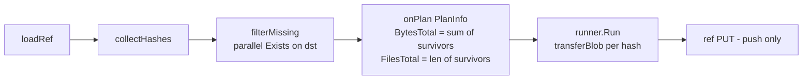

# 019 — PlanInfo announces the delta, not the ref total

**Date:** 2026-05-25
**Status:** Implemented
**Builds on:** design-log/001 §"What this means for the size estimate" (introduced `PlanInfo` as bar denominator); design-log/018 (logical-units ETA, exposed the consequences of an inflated denominator).

## Background

`PlanInfo.BytesTotal` is the denominator for every user-visible transfer number — progress bar, ETA, "X / Y GB" caption. It is emitted once per Push/Pull, before the first blob streams, and fed into the projection at `internal/gui/projection/projection.go:119`.

Today it is computed as **the sum of every unique-hash blob in the ref**:

```go
// internal/core/refs/pull.go:77   (mirror in push.go:72)
p.onPlan(ritual.PlanInfo{
    Operation:  "pull",
    BytesTotal: sumSizes(ref.Objects),
    FilesTotal: len(items),
})
```

`sumSizes` dedupes by hash within the ref but does **not** consult the destination. The per-blob `Exists` gate that actually decides what moves runs later, inside `transferBlob` (`internal/core/refs/transfer.go:37–42`).

Codified in two tests that assert this on purpose:

- `internal/core/refs/pull_test.go:382` — *"BytesTotal must announce the full ref budget regardless of skip-gate hits — the bar represents 'what the ref points at', not 'what we transferred this run'."*
- `internal/core/refs/push_test.go` — twin assertion.

## Problem

The visible numbers don't match the work. On a typical re-sync (most blobs already on the other side), `BytesDone` plateaus at the delta — say 200 MB — while `BytesTotal` says 2 GB. Three downstream lies:

1. **Bar finishes at <100%.** `BytesDone / BytesTotal ≈ 10%` when the run actually completed. The UI calls it done while the dial still reads 10%.
2. **ETA inflated by the dedup ratio.** Design-log/018 just fixed ETA to use logical units. The remaining lie is the *numerator*: `(bytesTotal − bytesDone) / logicalBps` — with an inflated `bytesTotal`, ETA over-shoots proportionally. 10× dedup → 10× wrong ETA on the first sample.
3. **"X / Y" readout is wrong on both sides.** "0.20 / 2.00 GB" while the run is genuinely complete invites the user to wait or cancel-and-retry.

Anchoring tests:

```text
--- FAIL: TestPuller_OnPlan_BytesTotalIsDeltaAfterLocalExistsGate
    expected: 16   (one missing blob)
    actual  : 28   (full ref total: 4+8+16)
--- FAIL: TestPusher_OnPlan_BytesTotalIsDeltaAfterRemoteExistsGate
    expected: 16
    actual  : 28
```
(see `internal/core/refs/{pull,push}_test.go` — new red tests on `feat/delta-sync`.)

## Questions and Answers

**Q1.** Pre-flight or refine-in-flight? And is it cached across runs?
**A.** Pre-flight, never cached. Refining `PlanInfo` mid-run (emit full total, then re-emit delta) means the bar's denominator changes under the user — and design-log/001's projection comment says `OnPlan must fire exactly once`. Pre-flight pays a one-time cost before the bar appears; the bar shows the true denominator from frame one.

Critically, the pre-flight `Exists` pass runs **on every** `Push`/`Pull` invocation, not once per process lifetime. The destination's state changes between runs — another machine pushed, a blob was scrubbed after a faulty transfer, a manual delete on R2 — so a cached "missing" set goes stale fast and would re-introduce the very lie this log removes. The cost is bounded (Q7) and the recalculation is cheap relative to the transfer it gates.

**Q2.** How is the pre-flight implemented?
**A.** **`dst.List("objects/")`, once.** `Exists` is HEAD-class but still one RTT per blob; at 1 k blobs / concurrency 10 / 50 ms ≈ 5 s of dead time before the bar appears, scaling linearly with file count. `List` answers the same question — "which hashes does the destination have?" — in a single paginated call:

1. `keys, err := dst.List(ctx, "objects/")` — one paginated request (≤1000 keys/page on R2 ListObjectsV2).
2. Build `known := set(strip("objects/", keys...))`.
3. `missing = src.items where item.Key ∉ known`.

Cost: O(N / page-size) RTTs. For 1k blobs → 1 RTT. For 10k → ~10 RTTs. For 100k → ~100 RTTs but still 10× faster than per-blob Exists at concurrency 10. **Beats the Exists fan-out by an order of magnitude on the only axis that varies.** R2 tuning (HTTP/2 multiplexing, `MaxIdleConnsPerHost`, bumped concurrency) would also help `Exists`, but only by constant factors — `List` wins the asymptotics.

Alternative considered — `List("refs/")` + parse each ref → union of referenced hashes — gives the same shape but pays K extra small GETs and answers a slightly wrong question (refs say "what was referenced", objects say "what's actually there"). For orphan blobs (referenced by a deleted ref but objects/ still has them) and scrubbed-but-referenced blobs (ref points at vanished bytes), the objects-list path is exact; the refs path miscounts. Picked the simpler, more-accurate version.

The runtime per-blob `Exists` gate inside `transferBlob` (Q4) stays the authority; pre-flight is advisory. The only remaining inaccuracy is the race window between pre-flight `List` and per-blob transfer — bounded by transfer duration, self-correcting via the runtime gate.

**Q3.** Where does the delta filter live — in `Pusher`/`Puller`, in `transfer.go`, or as a `BlobRunner` decorator?
**A.** A free function next to `collectHashes` in `pull.go` (used by both directions, same as `sumSizes`):

```go
func collectKnownHashes(ctx context.Context, dst ports.StorageRepository) (map[string]struct{}, error) // dst.List("objects/") → set
func filterMissing(items []ports.BlobItem, known map[string]struct{}) []ports.BlobItem
```

Order preserved on filter so the weight-desc dispatch in the transfer `BlobRunner` still works.

**Q4.** What about the `transferBlob` per-blob `Exists` gate — keep or remove?
**A.** Keep. It's the authority — a race between pre-flight and transfer (another writer landed the blob in between, or our own ref-diff missed an orphan / mis-counted a scrubbed entry per Q2) collapses to a no-op at the destination. Pre-flight is an *announcement* optimisation; the runtime gate remains the contract.

**Q5.** What happens when **zero** blobs need transferring (everything already present)?
**A.** `BytesTotal = 0, FilesTotal = 0`. Projection treats this as "complete on arrival": progress = 100%, bar fills instantly. Today's test (`pull_test.go:362` — "fires even when all blobs already present locally") expects `BytesTotal = 4` (the full ref total) and the comment says *"the bar resolves to 100%% instantly instead of 0%% indefinitely"*. Under delta semantics, `0 / 0` must explicitly resolve to 100% in the projection; otherwise the bar would NaN or stick.

**Q6.** Pre-flight is parallel `Exists`; can it surface errors before any blob has streamed?
**A.** Yes — and that's the right behaviour. A storage that can't answer `Exists` can't be trusted to answer `PutStream` either. Fail-fast pre-flight beats failing mid-blob with a half-announced plan.

**Q7.** Does this slow the happy path?
**A.** Cost = `ceil(N_blobs_on_dst / 1000) × List_RTT`. For ≤ 1000 blobs on dst → 1 RTT (~100 ms to R2, <1 ms to local FS). For 10k → ~10 RTTs. For 100k → ~100 RTTs but still 10× faster than per-blob Exists at concurrency 10. Trade-off: a few hundred ms of pre-bar delay against a bar that doesn't lie. The current behaviour pays this latency too — it's just hidden inside the run while the bar shows wrong numbers.

**Q8.** Does anything besides the bar/ETA/caption consume `BytesTotal`?
**A.** `grep BytesTotal` shows:
- `internal/gui/projection/projection.go:119` — copies into `ViewModel.BytesTotal` (UI consumers).
- `internal/adapters/progress/ticker.go` — does **not** read it (Ticker is rate-only).
- Tests.
No backend consumer derives behaviour from it. Safe to change semantics in one place.

**Q9.** Does compression affect the delta math?
**A.** No. `BytesTotal` lives in logical units (ref `Objects[].Size` is uncompressed-input bytes); the delta is computed by dropping whole blobs at the logical layer; both `BytesTotal` and `BytesDone` stay logical. Design-log/001 §"logical / wire" stack is unchanged.

## Design

### Composition



### Changes

**`internal/core/refs/pull.go`**

```go
items, pathByHash := collectHashes(ref.Objects)

known, err := collectKnownHashes(ctx, p.to)
if err != nil {
    return fmt.Errorf("pull %s: pre-flight list: %w", id, err)
}
missing := filterMissing(items, known)

if p.onPlan != nil {
    p.onPlan(ritual.PlanInfo{
        Operation:  "pull",
        BytesTotal: sumWeights(missing),
        FilesTotal: len(missing),
    })
}

err = p.runner.Run(ctx, missing, func(ctx context.Context, hash string) error { … })
```

Mirror in `push.go` — `dst` is `p.to` for push too.

**New helpers (in `pull.go` next to `collectHashes`):**

```go
// collectKnownHashes lists every blob currently in dst's objects/ store and
// returns their hashes as a set. Used by Pusher/Puller to filter the source
// ref's blob list before announcing PlanInfo, so the bar denominator reflects
// what will actually move. The runtime per-blob Exists gate in transferBlob
// remains authoritative — this set is advisory.
func collectKnownHashes(ctx context.Context, dst ports.StorageRepository) (map[string]struct{}, error) {
    keys, err := dst.List(ctx, "objects/")
    if err != nil {
        return nil, err
    }
    known := make(map[string]struct{}, len(keys))
    for _, k := range keys {
        known[strings.TrimPrefix(k, "objects/")] = struct{}{}
    }
    return known, nil
}

func filterMissing(items []ports.BlobItem, known map[string]struct{}) []ports.BlobItem {
    missing := make([]ports.BlobItem, 0, len(items))
    for _, it := range items {
        if _, present := known[it.Key]; present {
            continue
        }
        missing = append(missing, it)
    }
    return missing
}
```

Order preserved so weight-desc dispatch in the transfer runner still puts heaviest first.

**`sumWeights` helper** replaces direct re-use of `sumSizes(ref.Objects)`:

```go
func sumWeights(items []ports.BlobItem) int64 {
    var total int64
    for _, it := range items {
        total += it.Weight
    }
    return total
}
```

`sumSizes` deleted — no remaining callers.

**Projection — handle 0/0 as complete:**

`internal/gui/projection/projection.go` progress derivation must treat `BytesTotal == 0` as 100% (not 0%, not NaN). Single-line guard in whatever computes `Progress` from `BytesDone / BytesTotal`.

### Test updates

Two existing tests change from red-to-the-truth to green-with-new-truth:

- `pull_test.go:332 TestPuller_OnPlan_AnnouncesByteAndFileBudgetSummedFromRefObjects` — rename to `…AnnouncesDeltaWhenLocalIsEmpty`; assertion unchanged (empty local → delta == full ref).
- `pull_test.go:362 TestPuller_OnPlan_FiresEvenWhenAllBlobsAlreadyPresentLocally` — flip `BytesTotal` from `4` to `0`; flip `FilesTotal` from current (assumed 1) to `0`; update comment from *"the bar represents what the ref points at"* to *"the bar represents what will move; zero means complete on arrival"*. Add a sibling assertion that the projection resolves `Progress` to 100% when both are zero.
- Same surgery on the two `push_test.go` twins.

The new red tests (`TestPuller_OnPlan_BytesTotalIsDeltaAfterLocalExistsGate`, push twin) go green without modification.

## Implementation Plan

Phase 1 — **Backend filter + helpers**
- Add `filterMissing` + `sumWeights` in `pull.go`.
- Delete `sumSizes`.
- Pre-flight call sites in `pull.go` and `push.go` before `onPlan`.
- All existing non-OnPlan tests run green (delta path is transparent to them; the runtime `Exists` gate stays the contract).

Phase 2 — **Update the four `OnPlan` tests** to delta semantics. The two new red tests stay green; the two flipped tests go green; the two "empty side" tests stay green by construction.

Phase 3 — **Projection 0/0 → 100% guard.** Add a unit test in `projection_test.go` for the all-present case.

Phase 4 — **Manual verify against mock R2.** Run a no-op pull (cache already complete) and confirm the dial fills to 100% without a delay-then-jump artifact; run a partial pull (half blobs cached) and confirm the bar lands at 100%, ETA decreases monotonically, "X / Y" matches what actually streams.

Total: ~60 LOC production + ~30 LOC test churn. No port-surface changes; no new event types.

## Examples

✅ **Good — happy path after fix:**

```text
ref points at 2.00 GB across 1200 blobs
 800 blobs already on dst (1.80 GB worth)
PlanInfo { BytesTotal: 0.20 GB, FilesTotal: 400 }
… transfer …
BytesDone = 0.20 GB → Progress = 100%, ETA decreased monotonically.
```

❌ **Bad — today's behaviour:**

```text
PlanInfo { BytesTotal: 2.00 GB, FilesTotal: 1200 }
… transfer skips 800 …
BytesDone = 0.20 GB → Progress = 10%, "done" event fires while bar shows 10%.
```

❌ **Bad — refine-in-flight alternative:**

```text
PlanInfo { BytesTotal: 2.00 GB }      ← bar jumps to 10%
PlanInfoRefined { BytesTotal: 0.20 GB } ← bar jumps to 100%, then back?
```
Breaks projection's single-anchor contract (design-log/001 §"OnPlan must fire exactly once") and looks broken in the UI.

## Trade-offs

| Decision | Cost | Benefit |
|----------|------|---------|
| Pre-flight `dst.List("objects/")` pass | 1 List RTT per ≤1000 blobs on dst before bar appears | Bar denominator is the truth; ETA + caption become reliable |
| `List` instead of N parallel `Exists` | None — same `StorageRepository` port surface | O(N/1000) RTTs instead of O(N/concurrency); R2 tuning unnecessary |
| Drop `sumSizes`, derive total from filtered items | Two test renames | Single source of truth: `PlanInfo` describes what the runner will actually do |
| Projection treats 0/0 as 100% | One-line guard | Empty-delta path renders cleanly instead of NaN / stuck-at-0 |
| Keep `transferBlob`'s per-blob `Exists` gate | None | Pre-flight is an announcement; runtime gate stays the authority — protects against races and stale pre-flight in long runs |

## Verification

A correct implementation:

1. New red tests `TestP{ull,ush}er_OnPlan_BytesTotalIsDeltaAfter…ExistsGate` go green. (Phase 1)
2. Flipped tests (`…FiresEvenWhenAllBlobsAlreadyPresent…`) green with `BytesTotal == 0`, `FilesTotal == 0`. (Phase 2)
3. Projection test: `BytesTotal == 0` and `BytesDone == 0` → `Progress == 100`. (Phase 3)
4. Manual: re-sync where 90% of blobs are already on dst — bar fills to 100% on what actually transfers; ETA matches wall-clock within ±15%. (Phase 4)
5. Manual: full no-op sync (everything already present on both sides) — dial flashes to 100% within one tick of the run starting; no "starts at 10% / ends at 10%" artefact. (Phase 4)
6. No regression in `go test ./internal/core/refs/...` outside the four `OnPlan` tests touched in Phase 2.

## Open Questions

**OQ1.** Should pre-flight emit its own observability beat (e.g., `PreflightStartedInfo` / `PreflightCompletedInfo`) so the UI can show "Checking remote…" rather than a blank bar? Proposal: defer. Pre-flight on realistic ref sizes is sub-second to a few seconds; if telemetry shows users staring at a blank bar for >2 s, add a `StageChecking`-equivalent beat in a follow-up.

**OQ2.** ~~Optimise to a single `List("objects/")` when N exceeds a threshold?~~ Resolved: this *is* the implementation. See Q2 — `List` is always cheaper than per-blob `Exists`, no threshold needed.

**OQ3.** Should `PlanInfo` carry both numbers — the full ref total (for "this ref describes X bytes total") and the delta (for "Y bytes will move") — so a future UI can show *"800 MB of 2 GB already on disk"*? Proposal: defer. Today nothing wants it; adding a field that no consumer reads is design-log/032 dead weight.

## Implementation Results

**2026-05-25 — Phases 1–3 shipped.** Manual verification (Phase 4) deferred.

Files touched:
- `internal/core/refs/pull.go` — added `collectKnownHashes` (calls `dst.List("objects/")`), `filterMissing`, `sumWeights`; removed `sumSizes`; wired `Pull` to run the pre-flight list and announce delta-based `PlanInfo`. New import: `strings` for `TrimPrefix`.
- `internal/core/refs/push.go` — same wiring in `Push`. No new helpers (re-uses pull.go's three).
- `internal/adapters/r2.go:238` — **R2 `List` paginated.** Pre-fix called `ListObjectsV2` once and silently dropped keys past #1000 (S3 protocol cap). Bug existed before #019 but #019 depended on full results. Loop now follows `ContinuationToken` until `IsTruncated == false`.
- `internal/gui/projection/projection.go:118` — on `PlanInfo`, set `Progress = 100` when `BytesTotal == 0 && FilesTotal == 0` (empty-delta anchor), else reset to `0` so a fresh non-empty plan starts at zero arc.
- `frontend/src/ritual-app.ts:67` — `arcFromBytes` falls back to `progress / 100` when `bytesTotal <= 0`, so empty-delta pulls/pushes render complete-on-arrival.

Tests:
- New red→green: `TestPuller_OnPlan_BytesTotalIsDeltaAfterLocalExistsGate`, `TestPusher_OnPlan_BytesTotalIsDeltaAfterRemoteExistsGate` (added in the design phase to anchor the bug; now passing under the fix).
- Renamed + re-messaged: `TestPuller_OnPlan_AnnouncesByteAndFileBudgetSummedFromRefObjects` → `…AnnouncesFullRefBudgetWhenLocalIsEmpty`; same for push twin. Assertions unchanged (delta == full ref when dst is empty) but messages reframed around the delta principle.
- Flipped: `TestPuller_OnPlan_FiresEvenWhenAllBlobsAlreadyPresentLocally` → `…FiresWithZeroBudgetWhenAllBlobsAlreadyPresentLocally`; `BytesTotal` expectation changed from full-ref `4` to `0`; `FilesTotal` from implicit-full to `0`.
- New: `TestProjection_PlanInfoWithZeroDelta_AnchorsProgressTo100` — covers the projection guard. Updated sibling `TestProjection_PlanInfoDuringPulling_PopulatesBytesTotalAndFilesTotal` to assert `Progress == 0` on non-empty plans.

`go test ./...` clean.

Deviations from design:
- **Stronger empty-delta guard than written.** Design said projection treats `0/0` as 100%; implementation makes `BytesTotal == 0 && FilesTotal == 0` the explicit signal and sets `Progress = 100`. Frontend reads `progress / 100` only when `bytesTotal <= 0`, so non-empty-plan states (`bytesTotal > 0`) are unaffected. Non-empty plans also reset `Progress = 0` to avoid a stale `100` leaking from a prior empty pull into a subsequent non-empty push.
- **R2 `List` pagination fix** wasn't called out in the design plan; uncovered during implementation when verifying `List` is the right call. Fold-in rather than a separate log because (a) the bug is dormant without #019 — nothing in the codebase currently calls `List("objects/")` — and (b) the fix is mechanically trivial (one `for` loop).
- **No `sumSizes` deletion regret.** Doc-block in §Design referenced "delete `sumSizes` — no remaining callers"; the only call sites were in `Pull`/`Push`, both swapped to `sumWeights(missing)`. Confirmed via `rg sumSizes internal/core/refs` returning empty.

Deferred:
- **Phase 4 manual verification** — partial-delta re-sync against mock R2 and zero-delta no-op sync. Verification criteria #4 + #5 unmet by automation; story rename + unit tests guarantee the fixtures still type-check but the visual confirmation of bar-fill behaviour is pending.
- **Stage-transition reset of `BytesTotal`/`Progress` between Pulling → Pushing.** Pre-existing artefact (the values from a completed pull bleed into the early frames of push before push's PlanInfo arrives). Not introduced by this PR; deferred until/unless visible in Phase 4.
