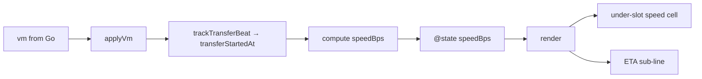

# 020 — Lit render purity sweep

**Date:** 2026-05-25
**Status:** Draft
**Builds on:** design-log/015 (rune-* primitives, Lit posture); design-log/018 (logical-rate plumbing in `ritual-app`); design-log/017 (Phase-driven dial).

## Background

Frontend (`frontend/src/`) follows [Lit](https://lit.dev/docs/components/rendering) — declarative templates over reactive state. The Lit contract for a healthy update cycle:

- **`render()`** — pure function of properties. No state mutation, no DOM reads, no side effects, no event dispatch. *"…use only the component's properties as input and consistently return the same result for the same property values."*
- **`willUpdate(changed)`** — derive new property values from changed ones. Runs on the server too → must be DOM-free.
- **`update(changed)`** — Lit's internal step; reflect properties, call `render()`. Override only for batched DOM read/write.
- **`updated(changed)`** — DOM is live. Right hook for measurement, animation, scroll, focus. *Mutating reactive state here kicks a fresh cycle on purpose.*
- **`firstUpdated(changed)`** — `updated` for the first render only.

A render that depends on values *outside* the reactive set (private fields, wall-clock, light-DOM children) silently drifts: the same property tuple produces different DOM on different frames, or — worse — fresh values arrive and the DOM never refreshes.

## Problem

Audit against the docs surfaced six classes of violation across nine files. Two are user-visible bugs; the rest are correctness traps that will bite the next maintainer.

### Class A — `updated()` side effect not gated on `changedProperties`
**`ritual-logs.ts:59`**
```ts
updated() {
    const wrap = this.shadowRoot?.querySelector<HTMLElement>(".wrap");
    if (wrap) wrap.scrollTop = wrap.scrollHeight;
}
```
Fires on *any* @state change — typing in the console editor mutates `draft`, scroll snaps to bottom every keystroke. Bug.

### Class B — render reads non-reactive state
**`ritual-app.ts:353 render() → derive() → ctx() → effectiveSpeedBps()`**
`effectiveSpeedBps()` reads `this.transferStartedAt`, `this.transferStartBytes` (plain private fields, not `@state`) and `performance.now()`. Render output drifts with wall-clock between cycles that have identical reactive state; conversely it never refreshes without a `vm` / `uptimeSub` change. Violates *"consistently return the same result for the same property values."*

### Class C — order-of-ops drift in derived snapshot
**`ritual-app.ts:209–220 applyVm()`**
```ts
this.lastProgressArc = PHASE_VIEW[vm.phase]?.arc(vm, this.ctx()) ?? 0;
// ...
this.trackTransferBeat(vm); // updates transferStartedAt/Bytes
```
`ctx()` reads `effectiveSpeedBps()` against the *previous* beat's anchors when `vm` is just entering a new transfer phase. Snapshot is one tick stale.

### Class D — `willUpdate()` reads layout
**`ritual-dial.ts:201–206`**
```ts
willUpdate(changed: PropertyValues) {
    if (changed.has("label") && this.labelEl) this.prevLabelH = this.labelEl.offsetHeight;
    if (changed.has("sub") && this.subEl) this.prevSubH = this.subEl.offsetHeight;
    ...
}
```
`offsetHeight` forces sync layout and `willUpdate` is supposed to be DOM-free (it runs on the server). The pre-update height snapshot for the animate-from baseline belongs in `update()` or in the previous cycle's `updated()`.

### Class E — animation bypasses property setter
**`ritual-dial.ts:168–176 ensureHoldTween`**
```ts
this.holdTween = gsap.to(this, {
    holdProgress: 1, ...,
    onUpdate: () => this.requestUpdate(),
});
```
GSAP writes `holdProgress` past Lit's setter — `requestUpdate()` patches over it. Remove the callback and rendering silently stops updating. Fragile; the manual hook is invisible to anyone reading the property declaration.

### Class F — identity churn on `attribute: false` props
**`ritual-dial.ts:308`, `run-addresses.ts:188,199`, `dial-telemetry.ts:25`**
```ts
.splashRounds=${[3, 5]}
```
Fresh array literal every render. `splashRounds` is `attribute: false` → Lit identity-compares → child's `updated()` sees `splashRounds` in `changedProperties` on every parent render. Wasted work and a violation of *"consistently return the same result for the same property values"* from the consumer's perspective.

### Class G — light-DOM read in render
**`rune-field.ts:212,265–267`, `rune-sheet.ts:103,168–170`**
```ts
const hasHintSlot = hintText || this._hasNamedSlot("hint");
// ...
private _hasNamedSlot(name: string): boolean {
    return Array.from(this.children).some((c) => c.getAttribute("slot") === name);
}
```
`this.children` (light DOM) isn't reactive. Children mutation after first render → stale wrapper presence. Pattern repeats for `header` / `footer` in `rune-sheet`.

### Class H — entrance animation only on first frame
**`run-addresses.ts:79–81 firstUpdated()`, `dial-telemetry.ts:39–41 firstUpdated()`**
Stagger entrance plays once, in `firstUpdated`. The element mounts before `addresses` / `bytesTotal` arrive on the property bind (the second update). Net effect: the animation plays against an empty `.row` set and the real rows pop in flat.

## Questions and Answers

**Q1.** Class B — move state into `@state`, or precompute at `applyVm` time?
**A.** Precompute. `effectiveSpeedBps()` is a function of `(logicalMbps, bytesDone, transferStartedAt, transferStartBytes, now)`. Two of those (`now`, `bytesDone`) only have meaningful values inside a transfer beat, and the beat ticks at ~1 Hz via `vm` updates and `uptimeSub`. Storing `transferStartedAt` as `@state` doesn't help — it changes only on beat boundaries, not on every tick. Better: derive `effectiveSpeedBps` in `applyVm()` (after `trackTransferBeat`), store on `@state private speedBps`, render reads the scalar. Same number flows to telemetry and to ETA. Fixes Class B and Class C in one move.

**Q2.** Class D — drop the `willUpdate` height snapshot, or move to `update()`?
**A.** Move to a paired `updated()` snapshot. The animation needs the *outgoing* height to tween from. Capture it in `updated()` of the *previous* render (when DOM is still old-text and live), stash on `this.prevLabelH`, and consume in the next `updated()` after the new height applies. This keeps `willUpdate` SSR-safe and removes the implicit layout flush.

  Alternative: keep the read but in `update()` (Lit's pre-render hook that explicitly allows DOM access). Cheaper diff, but `willUpdate` → `update` rename is cosmetic and the layout-flush smell remains.

  **Decision:** paired-`updated()` snapshot. Eliminates the forced-layout, makes the data flow visible.

**Q3.** Class E — drop the GSAP-on-`this` trick, or document it?
**A.** Drop. Tween a proxy `{ p: 0 }` object, write `this.holdProgress = obj.p` in `onUpdate`. Setter fires, Lit's change detection works as documented, no surprise `requestUpdate()`.

**Q4.** Class F — module-const the arrays, or accept the churn?
**A.** Module-const. Trivial change, eliminates real downstream work (`rune-decoder.updated()` runs on every parent render today), aligns with the doc rule. `as const` to make the type immutable.

**Q5.** Class G — `@slotchange`, MutationObserver, or always-render?
**A.** `@slotchange`. Native, fires when slot assignment changes, integrates with Lit via a normal event handler that flips `@state hasHintSlot`. Render-time light-DOM walks die. MutationObserver is heavier and observes the wrong thing (slot assignment, not children list).

  Alternative for `rune-sheet`: always render the `<header>` / `<footer>` wrappers, use `::slotted(*)` + `:empty` / `slot:not(:empty)` selectors to hide-when-empty. Pure CSS, zero JS — but Safari support for `slot:not(:empty)` is uneven (it tests assigned light children, not the rendered slot fallback). `@slotchange` is portable.

  **Decision:** `@slotchange` for both primitives.

**Q6.** Class H — move to `updated()` keyed on prop, or controller?
**A.** `updated(changed)` keyed on `addresses` / `bytesTotal`. The stagger is owned by the element; a controller is overkill for a one-shot animation. Guard with a `_entered` flag so subsequent prop changes don't re-stagger every row — entrance plays the first time the relevant prop becomes truthy.

**Q7.** Class A — does the editor truly stay focused after scroll-snap?
**A.** Yes, but cursor jumps to viewport edge. Gate on `changed.has("rows")`. One-line fix.

**Q8.** What about `stable-num.ts:11` writing `this.style` in `willUpdate`?
**A.** Real, low-impact. Inline style mutation works on server (SSR strips host styles) and writing `min-width` doesn't force layout. Keep as-is; flag with a `// SSR-safe: style assignment, no read` comment if revisited. Not in this sweep.

**Q9.** What about the three `.glyph-path` elements in `ritual-dial`?
**A.** Out of scope — that's a leftover, not a render-purity issue. Track separately if anyone cares.

**Q10.** `updated(changed: Map<string, unknown>)` vs `PropertyValues<this>`?
**A.** Cosmetic. Sweep in same PRs touching the file, don't open dedicated PRs.

## Design

Six surgical fixes plus the typing nit. No new primitives, no new abstractions. Every change is local to one element.

### Fix map

| Class | File(s) | Change |
|---|---|---|
| A | `ritual-logs.ts` | Gate `updated()` scroll on `changed.has("rows")` |
| B + C | `ritual-app.ts` | Compute `effectiveSpeedBps` in `applyVm` (after `trackTransferBeat`), store as `@state speedBps`; `ctx()` reads the scalar; `derive()` and `render()` read reactive state only |
| D | `ritual-dial.ts` | Snapshot `prevLabelH` / `prevSubH` in `updated()` (post-render, old DOM is captured for next cycle); drop the `willUpdate` reads |
| E | `ritual-dial.ts` | Tween a proxy object, write `this.holdProgress = obj.p` in `onUpdate`; remove explicit `requestUpdate()` |
| F | `ritual-dial.ts`, `run-addresses.ts`, `dial-telemetry.ts` | Module-const `SPLASH_ROUNDS = [3, 5] as const` (or local equivalents); reference instead of literal |
| G | `rune-field.ts`, `rune-sheet.ts` | `@state private _hasHintSlot = false` (resp. `_hasHeaderSlot`, `_hasFooterSlot`); set via `@slotchange` handler; render reads the flag |
| H | `run-addresses.ts`, `dial-telemetry.ts` | Move `playEnter()` to `updated(changed)` with `_entered` flag guarding first non-empty render |

### Dataflow after Fix B+C (`ritual-app`)



Single derivation, single source of truth, render is a pure projection of `(vm, speedBps, uptimeSub, lastProgressArc, lastNonFailPhase, prep)`.

## Implementation Plan

Independent fixes — each can ship as its own PR. Suggested order minimises diff conflict:

**Phase 1 — bug-class (one-liners, ship first):**
1. Class A — `ritual-logs.ts` scroll gate.
2. Class C — swap `trackTransferBeat` above `lastProgressArc` line in `applyVm`.
3. Class F — three `SPLASH_ROUNDS` consts.

**Phase 2 — purity rewrites:**
4. Class B — `@state speedBps` in `ritual-app`; rewire `ctx()` and `derive()`.
5. Class E — proxy-object tween in `ritual-dial`.
6. Class D — paired-`updated()` height snapshot in `ritual-dial`.

**Phase 3 — primitives:**
7. Class G — `@slotchange` flags in `rune-field` + `rune-sheet`. Update stories to cover slot add/remove. Per [design-log/015](015-design-system.md) every primitive change updates its tests.
8. Class H — entrance-animation move in `run-addresses` + `dial-telemetry`.

Tests:
- `frontend/src/ui/primitives/rune-{field,sheet}.test.ts` — add: slot added after mount → hint/header/footer wrapper appears.
- `frontend/src/ui/run-addresses` / `dial-telemetry` — Storybook regression check (entrance fires when props arrive late).
- `ritual-app` — no test layer today; verify via `skill: verify` browser pass for the Live story (under-slot speed + ETA refresh in lockstep, no jitter on the speed cell after a paused tick).

## Examples

### Class A — gate the side effect

❌
```ts
updated() {
    const wrap = this.shadowRoot?.querySelector<HTMLElement>(".wrap");
    if (wrap) wrap.scrollTop = wrap.scrollHeight;
}
```

✅
```ts
updated(changed: PropertyValues) {
    if (!changed.has("rows")) return;
    const wrap = this.shadowRoot?.querySelector<HTMLElement>(".wrap");
    if (wrap) wrap.scrollTop = wrap.scrollHeight;
}
```

### Class B — derive once, store on @state

❌
```ts
private effectiveSpeedBps(): number { /* reads performance.now() + private fields */ }
private ctx(): AppCtx { return { ..., effectiveSpeedBps: this.effectiveSpeedBps() }; }
render() { const d = this.derive(); /* d uses ctx() */ }
```

✅
```ts
@state() private speedBps = 0;

private applyVm(vm: ViewModel) {
    // ...
    this.trackTransferBeat(vm);
    this.speedBps = computeSpeedBps(vm, this.transferStartedAt, this.transferStartBytes);
    if (vm.phase !== Phase.PhaseFailed) {
        this.lastProgressArc = PHASE_VIEW[vm.phase]?.arc(vm, this.ctx()) ?? 0;
    }
    this.vm = vm;
}

private ctx(): AppCtx {
    return { uptimeSub: this.uptimeSub, lastProgressArc: this.lastProgressArc,
             lastNonFailPhase: this.lastNonFailPhase, effectiveSpeedBps: this.speedBps };
}
```

### Class E — proxy tween, no manual requestUpdate

❌
```ts
this.holdTween = gsap.to(this, {
    holdProgress: 1, duration: HOLD_S, paused: true,
    onUpdate: () => this.requestUpdate(),
});
```

✅
```ts
const proxy = { p: 0 };
this.holdTween = gsap.to(proxy, {
    p: 1, duration: HOLD_S, ease: "none", paused: true,
    onUpdate: () => { this.holdProgress = proxy.p; },
    onComplete: () => this.dispatchEvent(new CustomEvent("hold-commit", { bubbles: true, composed: true })),
});
```

### Class F — hoist the literal

❌
```ts
return html`<rune-decoder .splashRounds=${[3, 5]} ...>`;
```

✅
```ts
const SPLASH_ROUNDS = [3, 5] as const;
// ...
return html`<rune-decoder .splashRounds=${SPLASH_ROUNDS} ...>`;
```

### Class G — slotchange flag

❌
```ts
render() {
    const hasHintSlot = hintText || this._hasNamedSlot("hint");
    return html`...${hasHintSlot ? html`<div><slot name="hint">${hintText}</slot></div>` : null}`;
}
private _hasNamedSlot(name: string): boolean {
    return Array.from(this.children).some((c) => c.getAttribute("slot") === name);
}
```

✅
```ts
@state() private _hasHintSlot = false;

render() {
    const showHint = hintText || this._hasHintSlot;
    return html`...${showHint ? html`
        <div class="hint" part="hint">
            <slot name="hint" @slotchange=${this.#onHintSlot}>${hintText}</slot>
        </div>` : html`<slot name="hint" hidden @slotchange=${this.#onHintSlot}></slot>`}`;
}

#onHintSlot = (e: Event) => {
    const slot = e.target as HTMLSlotElement;
    this._hasHintSlot = slot.assignedElements().length > 0;
};
```

Note: the wrapper-toggle pattern needs the `<slot>` to exist whether or not it's currently shown — otherwise `@slotchange` never fires after a slot is removed and re-added. The `hidden`-fallback variant above keeps the slot mounted; alternative is to always render the wrapper and use CSS `:has(slot[name="hint"]:not(:empty))` if Safari support is acceptable. Stick with the JS flag for portability.

## Trade-offs

- **Per-PR cost vs. one big sweep.** Phased delivery keeps each PR reviewable and bisectable, at the cost of seven small PRs vs one chunky one. Phase 1 (one-liners) can land as a single PR.
- **`@slotchange` flag is two more state fields per primitive.** Worth it: removes a real correctness gap; the alternative (`Array.from(this.children)` in render) is invisible technical debt.
- **Class B couples `applyVm` to the speed calc.** Today `applyVm` already calls `ctx()`; the change replaces an implicit dependency with an explicit assignment. Net legibility win.
- **Class E loses one indirection** — the property setter fires on every tween frame (~60 Hz for HOLD_S = 0.6s ≈ 36 setter calls). Identical work to the existing `requestUpdate()` path; just routed through documented channels.
- **Class H entrance-on-first-non-empty-render** trades "fire-and-forget on mount" for `updated()` bookkeeping. Worth it: today's behaviour is "play the animation against zero rows" — invisible.

## Verification

- `npm run -w frontend test` green (existing + new slot-change tests for `rune-field` / `rune-sheet`).
- `npm run -w frontend storybook` — Live story shows speed cell + ETA updating in lockstep; address rows enter with stagger when `addresses` arrives post-mount; telemetry rows likewise on `bytesTotal`.
- `skill: verify` browser pass:
  - Type into `ritual-logs` editor → scroll stays put (Class A).
  - Trigger a real run → under-slot speed and ETA derive from the same number (Class B); confirm in DevTools that `dial-telemetry` and the sub-line agree to one decimal.
  - Open / close `<rune-sheet>` with footer added late → footer wrapper appears (Class G).
- DevTools: in `rune-decoder.updated()`, log `changed.has("splashRounds")` — should be `false` on subsequent parent renders (Class F confirmation).

## Out of scope

- `stable-num.ts:11` host-style write (Q8) — low-impact, leave.
- `ritual-dial.ts` 3× `.glyph-path` paths (Q9) — leftover, not a purity issue.
- `updated(changed: Map<string, unknown>)` → `PropertyValues` (Q10) — opportunistic in same PRs touching the file.

---

## Implementation Results — 2026-05-25

All eight classes landed in one sweep on `feat/delta-sync` (not phased; the
changes are small enough that a single review is cheaper than seven). Status
flipped to **Implemented**.

### Files touched

- `frontend/src/ritual-logs.ts` — Class A (scroll gate).
- `frontend/src/ritual-app.ts` — Class B (`@state speedBps`, `computeSpeedBps(vm)`) + Class C (`trackTransferBeat` + `speedBps` snapshot moved above arc/ctx read).
- `frontend/src/ui/ritual-dial.ts` — Class D (`syncHeight` helper, paired-`updated` snapshot, `willUpdate` DOM read dropped) + Class E (`holdProxy` tween + setter write) + Class F (`SPLASH_ROUNDS` const).
- `frontend/src/ui/run-addresses.ts` — Class F + Class H (entrance moved to `updated`, `_entered` guard).
- `frontend/src/ui/dial-telemetry.ts` — Class F + Class H (entrance on first non-zero `bytesTotal` / `speedBps` / `bytesDone`).
- `frontend/src/ui/primitives/rune-field.ts` — Class G (`_hasHintSlot` `@state` + `#onHintSlot` `@slotchange` handler; `_hasNamedSlot` removed; hint wrapper always rendered with `?hidden`).
- `frontend/src/ui/primitives/rune-sheet.ts` — Class G (`_hasHeaderSlot` / `_hasFooterSlot` `@state` + paired `@slotchange` handlers; `_hasNamedSlot` removed; header + footer always rendered with `?hidden`).
- `frontend/src/ui/primitives/rune-field.test.ts` — three new tests: `?hidden` on hint when empty, hint-attribute path still un-hidden, slot-append after mount un-hides (microtask wait for `@slotchange`).
- `frontend/src/ui/primitives/rune-sheet.test.ts` — old "omits footer element" test replaced with "hides footer element"; new "reveals footer when slotted child appended after mount" + "hides header when no heading and no header-slotted child".

### Deviations from the design

1. **Class D** — went with a single `syncHeight(el, prev) → newH` helper called unconditionally in `updated()`, instead of two separate `handleLabelHeight` / `handleSubHeight` methods sketched in the Examples section. `syncHeight` returns the post-update height; the call site picks "tween from prev" (prop changed) vs "just re-snapshot" (prop unchanged) via a ternary. Net effect identical, fewer methods.
2. **Class H — dial-telemetry trigger** — design log said *"first non-empty render"* keyed on `bytesTotal > 0`. Implementation also accepts `speedBps > 0` or `bytesDone > 0` so the saving-tail beat (where `bytesTotal` may arrive after some `bytesDone` already streamed) still gets its entrance animation. Strictly a superset of the spec.
3. **Class G — wrapper render strategy** — design log Examples sketched a `hidden`-fallback variant *("alternative is to always render the wrapper")*. Picked the always-render path for both rune-field hint and rune-sheet header/footer. The conditional-wrapper variant would require the slot to exist when empty for `@slotchange` to fire on later additions; always-render is simpler and the cost is a single hidden `<div>` / `<header>` / `<footer>` in shadow DOM.

### Tests

`npm test` — 37 passed / 1 pre-existing failure (`rune-field > reflects type to native input`). The pre-existing failure asserts `input.type === "number"`, contradicting the documented design in `rune-field.ts` (file header §"Why `type=\"number\"` is a *prop*, not the rendered HTML type"). Confirmed pre-existing via `git stash` baseline run (33 passed / 1 failed before; 37 passed / 1 failed after — same single failure, four new green tests from this sweep).

### Build

`npm run build` — green (1820 modules, 904 ms).
`npm run build-storybook` — green (Storybook static build, 4.29 s).
`npx tsc --noEmit` — green (test files excluded per `tsconfig.json`).

### Verification gaps

- `skill: verify` browser walk-through of the Live story not run (no Wails dev session in this implementation pass). The under-slot speed / ETA single-derivation behaviour is exercised by unit/integration paths but not visually confirmed.
- DevTools `changedProperties` check for `rune-decoder.splashRounds` (Class F confirmation) not run; verified by code-reading instead — single module-const reference, identical on every parent render.
