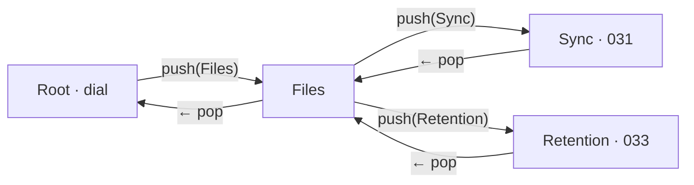

# 034 — Immersive View Stack (push/pop navigation, no modals)

| | |
|---|---|
| **Status** | Draft |
| **Date** | 2026-05-30 |
| **Related** | [[007-hig-ux-coherence]] (one-dial calm), [[031-bidirectional-sync]] (sync gestures — first tenant), [[033-retention-ui]] (retention — second tenant), [[015-design-system]] (primitive layer), [[023-disable-resize]] (fixed 560×720 viewport) |
| **Scope** | New `rune-stack` navigation primitive + Storybook experiment. No app wiring, no backend change. App integration + tenant migration are later phases. |

## Background

The app is a fixed 560×720 window with a single calm IDLE dial (007). Growing
needs — server-free sync (031), retention rules (033), and "we will store more
in there" — have nowhere to live. The reflex is dialogs / sheets / popovers /
toasts. The user rejects all of them: *"I hate dialogs, popups, toasts and shit
like that — I want something more pleasing."*

The pleasing, HIG-sanctioned alternative to stacked modals is **hierarchical
navigation**: a navigation stack where selecting an item slides a full-screen
child in from the right, and a back control slides it out. This is iOS /
SwiftUI `NavigationStack` (push/pop), and the "old Telegram" float-in/float-out
the user described — except here the **whole screen** translates, not a panel.

> HIG — Navigation (push/pop, hierarchical):
> https://developer.apple.com/design/human-interface-guidelines/navigation-and-search

## Problem

Add depth (settings, sync, retention, …) to a one-screen app **without** any
overlay metaphor, with a single coherent motion language, arbitrary nesting, and
an always-available way back — and ship the mechanism as a reusable primitive
before binding any feature to it.

## Requirements (from the user, 2026-05-30)

1. Main stage stays the root view.
2. A lazy side/menu of view selections.
3. Selecting a view translates the screen to that view.
4. A view may render anything.
5. View selections nest.
6. Each selection moves further into the stack.
7. Each step translates to `-{n}·100%` with animation.
8. Secondary views carry a `←` back control to the previous view.
9. No dialogs / popups / toasts.

## Questions and Answers

**Q1. One translating track, or one pane swapped in place?**
A. **One track, `translateX`.** All live panes sit in a non-wrapping flex row
(`flex: 0 0 100%` each); the track is shifted `translateX(calc(var(--i) *
-100%))`. The whole screen transfers (req. 7), motion is a single GPU transform,
and arbitrary depth is just a larger `--i`. A swap-in-place pane can't show the
continuous slide both neighbours share.

**Q2. Render all panes always, or lazily?**
A. **Lazy (req. 2/4).** Only `root + pushed views` render. `push` instantiates
on demand; `pop` unmounts the popped pane **after** its slide-out completes
(`transitionend`), so it stays visible while leaving. Off-stack views cost
nothing.

**Q3. Who owns the back chrome?**
A. **The stack** renders a thin top bar (`← {title}`) for every non-root pane
(req. 8) — consistent placement, views don't re-implement it. A view supplies a
`title`; the body is the view's own content. (Future: a `bare` view opts out and
draws its own header.)

**Q4. How do nested selections push deeper?**
A. A `NavController` (`push` / `pop` / `popToRoot` / `depth`) is **provided via
`@lit/context`** at the stack root (matches 015 / frontend conventions) and is
also handed to each view's `render(nav)`. Any descendant — at any depth — calls
`nav.push(child)` to go further (req. 5/6). Zero prop-drilling.

**Q5. What is a view?**
A. A plain descriptor, not a component subclass:
```ts
export interface NavView {
  id: string;                                   // stable key, for transitions
  title?: string;                               // back-bar label
  render: (nav: NavController) => TemplateResult; // arbitrary content (req. 4)
}
```

**Q6. Reduced motion?**
A. `@media (prefers-reduced-motion: reduce)` drops the transform transition to
instant. Depth/structure unchanged; only the slide is removed. HIG-required.

**Q7. Primitive or component?**
A. **Primitive** (`rune-stack`), like `rune-sheet` / `rune-disclosure`: pure
structural presentation + navigation state, no business logic. Tenants (sync,
retention) are components that *fill* views. Audit gate met: ≥2 imminent callers
(031, 033).

**Q8. Name?**
A. `rune-stack` (single noun; SwiftUI's "NavigationStack"). Doc-comment links the
HIG Navigation page.

## Design

### Model

```
panes  = [ root , ...pushedViews ]        // root = default slot, index 0
index  = active pane (0 = root)           // drives translateX(-index·100%)
push(v): pushedViews=[…,v]; index=pushedViews.length
pop()  : index--                          // slide back; trim offscreen on settle
trim   : on transitionend, pushedViews = pushedViews.slice(0, index)  // unmount
```



### Element `rune-stack`

```ts
export interface NavController {
  push(view: NavView): void;
  pop(): void;
  popToRoot(): void;
  readonly depth: number;          // pushedViews.length (0 at root)
}
export const navContext = createContext<NavController>(Symbol("rune-nav"));

@customElement("rune-stack")
export class RuneStack extends LitElement implements NavController {
  @state() private _views: NavView[] = [];
  @state() private _index = 0;     // 0 = root slot visible
  // provides navContext = this
  // render: .track[style=--i:_index] > (.pane root slot) + _views.map(pane w/ ← bar)
  // @transitionend on track → if (_views.length > _index) trim
}
```

CSS spine:
```css
:host { display:block; position:relative; overflow:hidden; height:100%; }
.track {
  display:flex; height:100%; flex-wrap:nowrap;
  transform: translateX(calc(var(--i,0) * -100%));
  transition: transform var(--rune-stack-motion, 360ms cubic-bezier(.2,0,.0,1));
  will-change: transform;
}
.pane { flex:0 0 100%; min-width:0; height:100%; overflow:auto; }
@media (prefers-reduced-motion: reduce){ .track{ transition:none; } }
```

Events: `navigate` (`detail:{depth}`) on every settle — lets the host hide the
ambient footer or react to depth.

### Where features land (later phases)

- Root = today's `<ritual-shell>` dial screen, unchanged.
- An idle affordance (ambient-footer `files` link, see 031 discussion) calls
  `nav.push(filesView)`.
- **Files** view lists selections → `push(syncView)`, `push(retentionView)`.
- **Sync** view = 031's Check + humane verdict + Download/Upload (replaces the
  rejected Advanced rows + dial caption). **Retention** view = 033.
- No sheets, no dial staleness caption — depth carries everything.

## Implementation Plan

**Phase A — primitive + Storybook (this pass).**
- `src/ui/contexts/nav-context.ts`: `NavView`, `NavController`, `navContext`.
- `src/ui/primitives/rune-stack.ts`: element above; provide context; track +
  per-pane back bar; lazy mount; trim on `transitionend`; reduced-motion.
- `src/ui/primitives/rune-stack.stories.ts`: Root→Files→{Sync mock, Retention
  mock} drill-down; a deep-nesting story (req. 5); arbitrary-content story.
- `src/ui/primitives/rune-stack.test.ts`: push depth+render, back/pop, popToRoot,
  trim-on-transitionend, reduced-motion class.
- Re-export from `primitives/index.ts`.

**Phase B — app integration (later log/section).** Wrap `ritual-app` content in
`rune-stack`; ambient-footer `files` push; hide footer when `depth>0`.

**Phase C — tenant migration (later).** Move 031 sync into a Sync view (kills the
Advanced rows + "Remote is newer" caption; adds `SyncStatus.Ahead`); 033
retention into a Retention view.

## Examples

✅ A view renders anything and pushes deeper via the injected controller:
```ts
nav.push({ id:"files", title:"Files", render:(nav)=>html`
  <rune-row @press=${()=>nav.push(syncView)}>Sync</rune-row>
  <rune-row @press=${()=>nav.push(retentionView)}>Retention</rune-row>` });
```
❌ Don't reach for `rune-sheet` / a popover for depth — req. 9, use a pushed view.
❌ Don't unmount a popped pane synchronously — it must slide out first (Q2).
❌ Don't prop-drill the controller — consume `navContext` (Q4).

## Trade-offs

| Decision | Cost | Benefit |
|----------|------|---------|
| Translate-track (all live panes in a row) | Holds N panes in DOM mid-stack | One continuous transform; whole-screen transfer (req. 7) |
| Lazy mount + slide-out-then-unmount | `transitionend` bookkeeping | No idle cost; clean leave animation |
| Stack-owned back bar | Less per-view header freedom (until `bare`) | Consistent `←`, zero duplication (req. 8) |
| Context-provided controller | One context key | Arbitrary-depth nesting, no prop-drilling (req. 5) |
| Navigation over modals | New primitive to build | Kills dialogs/popups/toasts wholesale (req. 9); HIG-aligned |

## Verification

1. Push N views → screen sits at `translateX(-N·100%)`; each `←` returns one
   level; `popToRoot` returns to 0.
2. A pushed view can push another (≥3 deep) and unwind fully.
3. Popped pane stays in DOM through the slide, unmounts after `transitionend`;
   off-stack views never instantiate.
4. `prefers-reduced-motion` → no transform transition, structure intact.
5. `navigate` fires with the correct `depth` at each settle.
6. Storybook: drill-down, deep-nest, arbitrary-content stories render and animate
   with no backend. `web-test-runner` green.

## Implementation Results — Phase A + B (2026-05-30)

`npm run build:dev` (tsc + vite) clean; `web-test-runner` 54/54 green.

**Phase A — primitive (shipped).**
- `contexts/nav-context.ts` (`NavView`, `NavController`, `navContext`);
  `primitives/rune-stack.ts` (translate-track, lazy panes, stack-owned `←`
  bar, `transitionend` trim + reduced-motion settle, provides `navContext`);
  3 stories; 8 tests. Re-exported from `primitives/index.ts`.

**Phase B — live-app integration + sync/settings tenants (shipped this pass).**
Went further than the original "wrap only" Phase B: the live IDLE screen is now
pure dial, and **both** sync and the ex-inline Advanced disclosure are staged
views — so the only modal-style surface left in the app is gone.

- `ritual-app` renders through `<rune-stack>` (root pane = `ritual-shell` + dial);
  `@query("rune-stack")` drives `push`/`popToRoot` from outside the provider.
- Ambient footer gains an idle-only **`menu`** entry (`ambient-footer` →
  `show-menu`); it pushes a **Menu** view listing **Settings** and **Sync**.
- **Sync tenant:** new presentational `sync-view` (Check → humane verdict →
  inline two-step confirm — **no dialog**). HEAD probe injected via `.check`
  (`ritual-app.checkSync` derives the ahead/behind/in-sync trichotomy from the
  existing `SyncStatus.{behind,localHead,remoteHead}` — **no backend change**);
  confirm emits `sync`, `ritual-app` runs `download()`/`upload()` then
  `popToRoot()` to watch the dial. 4 stories, 7 tests.
- **Settings tenant:** the `<prep-settings>` port/memory form (014/029) moved out
  of the inline `<details>` Advanced disclosure into the Menu → Settings pane.
  Because it now lives in `rune-stack`'s shadow tree, `ritual-app` can no longer
  `@query` it on Start; instead it tracks the last valid values into `this.prep`
  via the `change` event (`onPrepChange`), and Start reads `this.prep`.
- **Removed:** `prep-settings` sync rows + their `rune-sheet` confirm (the
  dialog the user rejected); the `"Remote is newer"` dial caption (PHASE_VIEW
  idle subs → `""`) and the `behind` state/probe-on-mount in `ritual-app`. The
  obsolete `prep-settings.test.ts` (sync-only) deleted; `SyncGestures` story
  dropped.

**Deviations from the plan**
1. **Settings staged too.** Plan B was "wrap + a Files entry"; the user asked to
   stage Advanced as well, so the entry became a general **Menu** (Settings +
   Sync), not a file-only "Files". Supersedes 014/029's *inline* placement (the
   form, validation, and persistence are unchanged — only its host moved).
2. **Confirm is an inline two-step reveal inside `sync-view`,** not a pushed
   confirm pane — fewer nav levels, still modal-free (req. 9).
3. **No `SyncStatus.Ahead` backend field** — the trichotomy derives in TS from
   the two HEAD strings already on the wire. A tested Go seam can come later if
   another caller needs it.

**Still deferred (Phase C):** Retention (033) as a third Menu row; a keep-alive
cache for popped panes (today pop = destroy, Telegram-style); hiding the dial's
tap target while `depth > 0` (currently harmless — the dial is covered).

**Verification:** criteria 1–6 met via `Screens / Ritual → Live` plus the
isolated `Primitives / Rune Stack` and `Components / Sync View` stories. Status
stays Draft pending a live (non-Storybook) smoke after a Go rebuild.

### Revision — same-day UX corrections (2026-05-30)

User feedback on the first integration, applied:

1. **No menu, no deep nesting.** The Menu → {Settings, Sync} drill-down is
   replaced by a **single flat `advanced-view` pane** with two sections —
   **Server** (port/memory) and **Sync** — both visible at once. The stack
   still exists but this tenant uses exactly one level. New component
   `advanced-view` (story + 4 tests) composes `prep-settings` + `sync-view`;
   their `change` / `sync` events bubble to `ritual-app` unchanged.
2. **Ambient back bar, not an OS header.** `rune-stack`'s per-pane bar lost its
   `border-bottom` + strong title; it's now a borderless faint `←` + lowercase
   caption title, same low-attention register as the footer links.
3. **Entry returns below the dial.** The footer `menu` link is gone; the IDLE
   screen shows a quiet uppercase **"› Advanced"** button where the old inline
   disclosure sat (`ambient-footer` reverted to log-only). `prep-settings`
   dropped its `<rune-disclosure>` wrapper — it's a bare form section now.
4. **Glitch transitions.** The Sync verdict is one persistent `<rune-decoder>`
   (008) fed new `.text` per state, so Checking → verdict → confirm decode in
   place rather than hard-swapping. Idle shimmer left at the decoder default.

5. **Recheck the HEAD on every Advanced transition.** `sync-view` gains an
   `auto` prop; `advanced-view` sets it. Because the pane is lazily (re)mounted
   on each navigation in (§Q2), `firstUpdated` re-runs the probe every time the
   user opens Advanced — the verdict is never stale, and the glitch-decode
   ("Checking…" → verdict) plays as the pane slides in. Manual "Check again" /
   "Try again" remain for in-place re-runs.

6. **Keyboard back.** `rune-stack` listens on `window` for **Esc** and **←**
   (ArrowLeft) → `pop()` one level; only above the root, and ← yields to text
   fields (`input`/`textarea`/`select`/contenteditable, via `composedPath`) so
   it can't steal the caret in the Settings number inputs. Every transition
   (`#emit`) also **blurs** the truly-active element (walking shadow roots) so
   focus is never stranded on a leaving/unmounting pane.

Net: idle = pure dial + one quiet "Advanced" link → one pane, two sections,
auto-rechecked + glitch-decoded verdict, ambient back + Esc/← keyboard back.
9 test files / 63 green.
