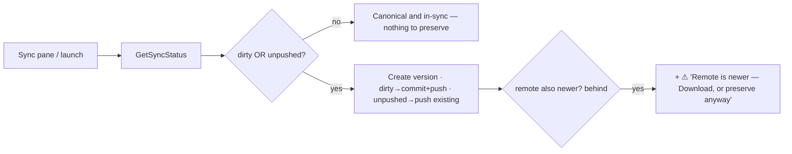

# 035 — Create version (make local state canonical)

**Date:** 2026-05-30
**Status:** Implemented
**Refines / partially supersedes:** [[031-bidirectional-sync]] — reframes the "Upload" flow as **ref creation** and changes its lineage source (remote HEAD → local). Keeps 031's pipeline mechanics, Download, and `GetSyncStatus` staleness.
**Related:** [[016-live-sync-resurrected]] (the only current ref producer), [[019-plan-info-delta]] (same workdir-vs-ref scan machinery), [[034-immersive-view-stack]] (Advanced → Sync pane host), [[036-skip-sync-session]] (its inverse — run with no sync; offline work becomes a version here once back).

## Background

The operator works **outside a play session**: edits server files (adds a mod), or steps back to an earlier state, then wants that state to become **canonical for everyone** — the version teammates get on their next pull. 031 called this "Upload" and modeled it as *push-when-local-is-newer*. That model is wrong for this user.

The reframe (user, 2026-05-30): **this is just ref creation.** There is no "upload" without creating a ref. Creating a ref = snapshotting the current workdir as a new ref that becomes HEAD. It is *cheap*, must be *failsafe but never blockable*, and works from **wherever you stand** — including a rolled-back state you want to make canonical again.

**Governing principle — user data is sacred (user, 2026-05-30).** Preservation is the product's purpose. The app **detects any uncanonical local state and offers a recovery path to preserve it — even retrospectively** (after offline play, a [[036]] skip-sync session, or a crash), *managing the mechanics so the user just confirms*. The castle-on-a-plane: built offline, lands, **one tap carries it over with no losses**. So the offer is not narrowly "you have edits to upload" — it is **"you have local work that isn't safely canonical yet; preserve it."**

The Upload **pipeline** (031: `Checking → Probing → Acquiring → Committing → Pushing → Retain → Unlock`) already does the mechanics. What's wrong is (a) **when it's offered**, (b) **what it parents on**, and (c) **that it misses already-committed-but-unpushed work** (Q7).

## Problem

**1. The trigger never fires.** `ritual-app.ts:386` computes the offer from a HEAD-timestamp compare:
```ts
ahead: s.localHead > s.remoteHead   // a committed-but-unpushed ref
```
That state is produced only by a failed livesync push ([[016]]). The operator who edits files on disk has `localHead == remoteHead` and a **dirty working tree** → `ahead = false` → no offer. The head compare alone is *insufficient*: it must be **joined with `workdir ≠ local HEAD ref`** (dirty). The head compare itself stays useful for the *unpushed* case (Q7) — but it can't be the only signal.

**2. The lineage points the wrong way.** 031 parents a new ref on **remote HEAD** (the Probing stage). If you stepped back to ref `A` and create `D`, parenting on remote HEAD `C` makes the breadcrumb claim `D` was built on `C` — but `D`'s content is `A`'s. Lineage should follow **where you stand**, so the future history/rollback feature ([[031]] OQ2) reads the truth.

## Questions and Answers

**Q1. New pipeline, or reuse 031's Upload?**
**A. Reuse the pipeline, change two things:** the trigger (Q2) and the parent source (Q3). Rename the concept to **Create version** end-to-end ("Upload" implied newer-than-remote, which is gone).

**Q2. When is "Create version" offered?**
**A. Whenever local work isn't safely canonical on the remote** — i.e. `dirty || unpushed` (Q7):
- **dirty** — workdir ≠ local HEAD ref (uncommitted edits). Detection: scan workdir, diff hashes against the local HEAD ref's `Objects` (Q5).
- **unpushed** — local HEAD ref is ahead of remote HEAD (`localHead > remoteHead`): committed work that never reached the remote — from a [[036]] skip-sync/offline session or a crash. Detection: the head compare `GetSyncStatus` already does.

Only when **clean AND in-sync** (`!dirty && localHead == remoteHead`) is there nothing to preserve. **Boolean offer — never show a changed-file count** (user, 2026-05-30); the count is noise, the offer is the signal.

**Q3. What does a new version parent on?**
**A. Where you stand — the local HEAD / current ref**, not remote HEAD. Step back to `A`, edit, create `D` → `D.Parent = A`, `D` newest ⇒ HEAD; `C` becomes an abandoned branch (still on disk until retention). In the normal synced case `local == remote`, so this coincides with 031. Mechanically: point the existing `probing` stage's `HeadResolver` at **local** storage instead of remote — `rs.ParentRefID = local HEAD`, the unchanged `CommitOptsResolver` does the rest. (Reverses [[031]] §Q1.)

**Q4. Blockable? What about being behind / conflicts?**
**A. Never blocked. Failsafe, not cockblocked** (user, 2026-05-30). Creating a ref destroys nothing — old refs (incl. a newer remote `C`) remain on storage; the new ref just becomes HEAD by timestamp. So when `Behind` (remote moved since), show a **non-blocking warning** — *"Remote is newer — Download latest, or create anyway"* — and still allow the create. The operator chooses: make-mine-canonical now, or pull-then-rebuild. (The session lock at `Acquiring` is the one legitimate gate — a running player blocks publish; that's correct, not a cockblock.)

**Q4b. The `behind`-warning offers Download, which prunes local-only files ([[031]] §Q2). Doesn't that destroy unpreserved work — against the sacred-data principle?**
**A. Only in one narrow case, and it's an anomaly we don't engineer around** (user, 2026-05-30). Download overwrites the **workdir**, never the **local refs** — so any work already *in a ref* survives. The only loss is **dirty edits made while idle** (no server ⇒ no livesync tick ⇒ never committed); that's an **anomaly**, not a flow — the cue informs, the operator decides.

**Q4c. So what *do* we do about publishing-while-behind?**
**A. Render the warning loud — that's the whole intervention** (user, 2026-05-30). Publishing coordination is a **human problem**: who publishes when, over whose work, is human reasoning the app cannot and should not arbitrate. The consequence (your version becomes latest; the newer remote is buried, then retention ages it out) is **well-established and informed**. So: **no guard, no block, no confirm gymnastics** — just don't whisper it. The behind-warning is a **prominent warning** (warning color/weight), not the muted echo used for the passive "Unpublished changes" cue. Loud text in, human judgment out.

**Q5. How is dirtiness computed — cheaply?**
**A.** Reuse the commit scan. A `LocalDirtyProber`:
1. `head, err := localHeadResolver(ctx)`; `ErrNoHead` ⇒ any files on disk are dirty (seed).
2. Read `refs/{head}.json` → unmarshal `domain.Ref` (the `apply.go`/`collect.go` pattern) → `ref.Objects map[path]Object{Hash,Size}`, `ref.Targets`.
3. `since := time.Parse(domain.RefIDFormat, head)` — the RefID *is* the commit timestamp.
4. `MtimeScanner(workdir, since, previous=ref.Objects→FileEntry).Scan(ref.Targets)` — re-hashes only files mtime-newer than the last commit; everything else carries its hash forward. No full GB re-hash, no blob upload, no ref write.
5. `dirty = any path added / removed / hash-changed`. Returns boolean only.

**Q6. Where does the offer live, and is there an IDLE cue?**
**A.** The action lives in **Advanced → Sync** (`sync-view`, 034) — user-confirmed home. **Yes to a passive IDLE cue** (user, 2026-05-30): when `dirty || unpushed`, a muted **`<rune-decoder>`** (008 glitch-in) reading *"Unpublished changes"* sits **below the "…Advanced ▸" link** — *not* in the dial `sub` (that slot is 031's "Remote is newer" staleness cue). No button; it points the operator into Advanced → Sync. Hidden only when clean **and** in-sync. Label/copy locked in OQ2.

**Q7. Does the offer also catch already-committed-but-unpushed work (the 035/036 seam)?**
**A. Yes — preserve retrospectively** (user, 2026-05-30: "we offer recovery paths and manage the rest… preserve even retrospectively"). A crashed normal-session push ([[016]]) leaves `localHead > remoteHead` with a **clean** workdir; a `dirty`-only offer would miss it and the work would sit unpreserved. (A [[036]] skip-sync session, by contrast, writes no ref — its work surfaces as **dirty**, the other arm of this same offer.) So "Create version" lights up on `dirty || unpushed`, and the **action adapts**:
- **dirty** → commit (Parent = local HEAD) **then** push.
- **unpushed only** (clean) → **push the existing local HEAD ref**; no new commit (re-committing identical content just churns a redundant ref).
Same one tap, same "make it canonical" outcome — the castle carries over with no losses.

## Design

### Verdict, corrected



`dirty || unpushed` decides the offer (Q7); `Behind` only adds a warning (never blocks). `unpushed` and `behind` are head-exclusive, so the warning co-occurs only with `dirty`.

### Backend (`internal/gui/control/control.go`)

```go
type SyncStatus struct {
    Behind     bool   `json:"behind"`    // remote HEAD newer — informational warning (Q4)
    Unpushed   bool   `json:"unpushed"`  // local HEAD ahead of remote — committed, not pushed (Q7)
    Dirty      bool   `json:"dirty"`     // workdir differs from local HEAD ref — uncommitted edits (Q5)
    LocalHead  string `json:"localHead"`
    RemoteHead string `json:"remoteHead"`
}                                         // no DirtyFiles count (Q2)

// LocalDirtyProber: resolve local HEAD ref, scan workdir against its Objects,
// report whether anything diverges. Injected at composition; nil ⇒ Dirty=false.
type LocalDirtyProber func(ctx context.Context) (dirty bool, err error)
```
`Behind = remote > local`, `Unpushed = local > remote` (031's lexical-is-chronological head compare yields both). `GetSyncStatus` runs the head prober (031) **and** the dirty prober under the existing timeout; either error degrades that half to false (031's never-show-an-error invariant holds).

### Pipeline (`internal/subsystems/pipeline/`)

`BuildUpload` → **`BuildCreateVersion`**: identical to 031 except `probe := probing.New(d.LocalHeadResolver, acquire, failProbe)` (local, not remote) so `Parent = local HEAD` (Q3). `ritual.UploadRequested` → `ritual.CreateVersionRequested`; lifecycle route + `Flow` value renamed (`FlowUpload` → `FlowCreateVersion`, still maps to `PhaseSaving` per 031's direction-aware addendum). `Acquiring` lock, `Pushing`, `Retain×2`, `Unlock` unchanged.

**Adapt to dirty-vs-unpushed (Q7).** The `Committing` stage already short-circuits an identical snapshot cheaply (content-addressed; an unchanged workdir re-stores the same blobs and the new ref's `Objects` equal HEAD's). Simplest correct path: **always run `Committing`** — when `unpushed && !dirty`, it produces a ref with identical `Objects`, and `Pushing` then publishes the unpushed lineage either way. If the redundant-ref churn proves real (retention noise), gate it: a `dirty`-keyed edge that skips `Committing → Pushing` directly when clean. Default to always-commit (one graph, no branch); revisit under retention (OQ4). Either way the **outcome is identical** — remote HEAD advances to the local work.

### Frontend

`ritual-app.ts` `checkSync`:
```ts
const s = await getSyncStatus();
return { behind: s.behind, ahead: s.dirty || s.unpushed };  // any uncanonical local state; behind no longer gates
```
`sync-view.ts`: `ahead` branch action → **"Publish"** (OQ2; parallel to the existing "Download", honest across both dirty *and* unpushed where "Create version" isn't). When `behind && ahead`, render **Publish** plus a **loud warning** — *not* the muted echo style; a prominent warning treatment (warning color/weight) reading *"The remote is newer. Publishing makes your version the latest and buries the newer one."* with a secondary "Download latest" beside it. **Non-blocking** (Q4c). Confirm body carries the data-sacred framing: *"Publish your local worlds as the version everyone gets. Your current state becomes the latest — nothing is lost."*

`ritual-app.ts` IDLE template: below the "…Advanced ▸" link, a muted `<rune-decoder>` bound to an `unpublished` `@state` (= `dirty || unpushed`, folded from the launch/refresh `getSyncStatus`) — text *"Unpublished changes"* when set, empty otherwise (`renderSub`-style: never hand `""` to the decoder, per 020/028). No new component, no new pipeline.

## Implementation Plan

Backend first, then the frontend remap + copy.

**L1 — dirty prober + SyncStatus** (`control/`, +tests). `SyncStatus.Dirty` + `SyncStatus.Unpushed` (Unpushed = `local > remote`, computed in the head prober alongside Behind); `LocalDirtyProber`; `NewLocalDirtyProber(localHead, refReader, scanFactory, targets)`; `GetSyncStatus` runs both probers, dirty error ⇒ `Dirty:false`. Tests: clean+in-sync⇒nothing, edited⇒dirty, added/removed⇒dirty, out-of-Targets⇒not-dirty, `ErrNoHead`+files⇒dirty, **clean+local-ahead⇒unpushed** (Q7), probe-error⇒degrades.

**L2 — pipeline + lifecycle rename** (`pipeline/`, `lifecycle/`, +tests). `BuildCreateVersion` (local-HEAD probe, always-commit per Q7); `CreateVersionRequested`; `Flow` rename; route. Integration: `CreateVersion_ParentsOnLocalHead` (step-back: workdir from `A`, local HEAD `A`, remote HEAD `C` ⇒ `D.Parent==A`, `D` HEAD, `C` untouched). `CreateVersion_PushesUnpushedCleanRef` (workdir clean, local HEAD ahead of remote ⇒ remote advances to local HEAD; the castle-on-a-plane recovery).

**L3 — composition** (`cmd/gui/main.go`). Build `NewLocalDirtyProber` over `localHeadResolver` + local `StorageRepository` + an `MtimeScanner` factory + commit `Targets`; pass to `NewControlService`. Wire `BuildCreateVersion` (local head resolver) into `Entries`.

**U1 — frontend remap + copy** (Storybook). `checkSync` → `ahead = s.dirty || s.unpushed`; IDLE `unpublished` cue ("Unpublished changes") below Advanced; `sync-view` **"Publish"** action + behind-and-dirty dual affordance (Publish primary, Download secondary) + data-sacred confirm body; bindings regen (`SyncStatus` gains `dirty`/`unpushed`); Storybook fixtures: `dirty:true` shows the action, `unpushed:true` (clean) also shows it, `dirty:true,behind:true` shows action+warning. `sync-view.test.ts` covers all three.

## Examples

✅ Operator adds a mod → Sync pane → workdir dirty vs local HEAD → **Publish** → commits (Parent = local HEAD) + pushes → canonical for everyone. No session, no play.
✅ **Castle-on-a-plane**: built offline under [[036]] skip-sync (which saves nothing — the server autosaved worlds to disk) → lands → workdir reads **dirty** → Sync shows the offer → one tap **commits + pushes** → carried over, no losses. (The `unpushed` trigger covers the *other* recovery: a crashed normal-session push left a clean-but-unpushed ref — Q7.)
✅ Operator steps back to `A`, tweaks, creates `D` → `D.Parent = A`, `D` is HEAD — the rolled-back path is canonical again; truthful lineage.
✅ Behind + dirty → version offered with a "Remote is newer" warning; operator may Download-and-retry *or* preserve anyway. Never blocked.
❌ Don't gate the create on `Behind` — preservation is failsafe, never cockblocked (Q4).
❌ Don't miss unpushed-but-clean work — user data is sacred; preserve retrospectively (Q7).
❌ Don't show a changed-file count (Q2).
❌ Don't parent on remote HEAD — lineage must follow where you stand (Q3).
✅ The launch `getSyncStatus` runs both probers so the IDLE cue is correct on cold start: the head compare (`unpushed`/`behind`) is trivial, and the `dirty` scan is mtime-bounded (walk = cheap stats; hashing only files touched since the last commit). Re-runs on Sync-pane entry for freshness.

## Trade-offs

| Decision | Cost | Benefit |
|----------|------|---------|
| Offer on `dirty \|\| unpushed` | A workdir scan + a head compare on launch | **No local work goes unpreserved** — edits *and* offline/crashed commits both recover (the governing principle) |
| Parent = local HEAD | Reverses [[031]] §Q1; abandoned remote branches accumulate until retention | Truthful lineage; "continue off that path" works |
| Never block; behind = warning only | Operator can publish over a newer remote (it survives on disk, recoverable until retention prunes) | Failsafe, not cockblocked; offline/rollback always preservable |
| Always-commit on Create version | A redundant identical ref when `unpushed && !dirty` | One graph, no `dirty`-branch; outcome identical (OQ4 gates if churn bites) |
| Boolean offer, no count | Can't say "N files" | Less noise; matches "never show changed files" |
| Reuse 031 pipeline, swap probe + names | A rename sweep | Tiny surface; lock/push/retain/confirm all reused |

## Verification

1. Clean workdir **and** local==remote → `Dirty:false, Unpushed:false`, no offer, no IDLE cue.
2. Edit one in-`Targets` file → `Dirty:true` → IDLE cue + **Create version** → commit (Parent=local HEAD) + push → new remote HEAD.
3. Out-of-`Targets` edit → `Dirty:false` (scope honored).
4. `ErrNoHead` (empty local) + files → `Dirty:true` (seed; Parent="").
5. Step-back: workdir == `A`, local HEAD `A`, remote HEAD `C` → create → `D.Parent==A`, `D` HEAD, remote `C` still present.
6. **Unpushed recovery (clean):** local HEAD ahead of remote, workdir == local HEAD → `Unpushed:true, Dirty:false` → offer shown → Create version **advances remote to local HEAD** (castle-on-a-plane).
7. Behind + dirty → action offered **and** "Remote is newer" warning; preserve-anyway succeeds; Download-and-retry also available.
8. Dirty probe error (unreadable ref) → `Dirty:false`, no throw (degrade); head compare still yields `unpushed`/`behind`.
9. Untouched large region file since last commit → not re-hashed (mtime carry-forward).
10. `go test ./internal/gui/control/... ./internal/subsystems/pipeline/... -race` clean; `web-test-runner` green.

## Open Questions

**OQ1.** ~~Resting-IDLE cue~~ **Resolved 2026-05-30:** yes — muted `<rune-decoder>` *"Unpreserved changes"* **below the Advanced link** (not the dial `sub`), shown on `dirty || unpushed`. Minor follow-up: 031's "Remote is newer" still sits in the dial `sub` — consider converging both cues into the one below-Advanced status line for consistency (defer).

**OQ2.** ~~Label/copy~~ **Resolved 2026-05-30:** action **"Publish"** (parallel to "Download"; honest across both `dirty` *and* `unpushed`, where "Create version" lies for the unpushed/recovery case); IDLE cue **"Unpublished changes"**; the data-sacred framing lives in the confirm body — *"Publish your local worlds as the version everyone gets. Your current state becomes the latest — nothing is lost."* (The doc title keeps "Create version" as the internal concept name; the user-facing verb is Publish.)

**OQ3.** `MtimeScanner` factory seam — fresh stateless scanner per probe (`previous` = HEAD ref Objects each call) vs a shared instance. Confirm against the session scanner wiring in `main.go` at L3.

**OQ4.** Retention vs lineage — a new ref parented on local HEAD leaves the superseded remote branch (`C`) on storage; remote retention ([[031]] Retain) may eventually prune it, orphaning a lineage link. Acceptable now (nothing reads the chain — [[031]] OQ2); revisit when navigable history lands.

## Implementation Results — Backend (2026-05-30)

Backend shipped; frontend Phase U1 (Publish label, dirty/unpushed cue, behind-warning treatment, bindings) **deferred** — the GUI I/O channel degraded mid-session.

**Landed**
- `control.SyncStatus` +`Unpushed`+`Dirty` (kept `Behind`/`LocalHead`/`RemoteHead`); JSON tags `unpushed`/`dirty`.
- `NewHeadSyncProber` now also sets `Unpushed = local > remote` (the lexical-is-chronological compare already yielded both directions — design-log/035 §Q7).
- `control.NewLocalDirtyProber(localHead, readRef, scan, seedTargets)` + the `RefReader` / `WorkdirScan` / `LocalDirtyProber` seam types. Resolves local HEAD, reads `refs/{id}.json`, seeds an mtime scan from the ref's `Objects` (RefID = commit timestamp → `since`), diffs by path/hash (`entriesDiffer`). `ErrNoHead` ⇒ seed (dirty iff any in-scope file on disk; readRef not consulted). Errors surface for the caller to degrade.
- `GetSyncStatus` runs head prober **and** dirty prober independently; each error degrades its half to false (never an error to the IDLE screen — [[031]] OQ3). Now nil-tolerant on *either* prober.
- `NewControlService` gained the `dirty LocalDirtyProber` arg (4th, before `logs`).
- `pipeline.Deps.LocalHeadResolver` + `BuildUpload` probes it (local, not remote) → `Parent = local HEAD` (§Q3). Wire name stays `Upload`/`UploadRequested`/`FlowUpload`; **rename to CreateVersion deferred** to cut churn (§deviation 1).
- `cmd/gui/main.go`: builds `readRef` (localStorage `GetStream` + json) + `workdirScan` (`adapters.NewMtimeScanner` over `config.RootPath`) → `NewLocalDirtyProber`; passes it into `NewControlService`; sets `Deps.LocalHeadResolver = localHeadResolver`.

**Tests added**
- `internal/gui/control/dirty_test.go` — 13 tests: clean / edited / added / removed / no-head-seed (asserts readRef *not* called) / no-head-empty / readRef-error-surfaces / scan-error-surfaces; `GetSyncStatus` dirty-surfaces / dirty-error-degrades / head+dirty merge / unpushed pass-through. `go test ./internal/gui/control/... -race` → exit 0.
- Existing `bidirectional_sync_integration_test.go` wired with `LocalHeadResolver`; `TestUpload_PopulatedRemote_ParentsOnHead` **still passes unchanged** — its scenario seeds local==remote (synced state), so local-parent coincides with the old remote-parent assertion exactly as §Q3 predicts ("normal synced case local == remote"). No assertion rewrite needed.

**Deviations from plan**
1. **`Upload`→`CreateVersion` rename deferred** (§L2): functional change (local-parent probe) landed under existing wire names to avoid touching 034's shipped `sync-view`/bindings + 031 tests. User-facing "Publish" label is a U1 concern. The doc's renamed symbols are aspirational; the code keeps `BuildUpload`/`UploadRequested`/`FlowUpload`.
2. **Always-commit on Publish not specially gated** (§Q7 / Pipeline note): `BuildUpload` always runs `Committing`; for the unpushed-clean case it re-stores identical content (content-addressed, cheap) and pushes. The `dirty`-keyed skip-commit edge was not added (OQ4 churn deemed not worth a second graph). Outcome identical — remote advances to local work.
3. **No new `pipeline_test.go`** — builders exercised by integration + full suite (existing convention).
4. **Frontend U1 unstarted** (not partial): `checkSync` remap (`ahead = dirty || unpushed`), the "Publish" label, the loud behind-warning, the "Unpublished changes" cue, bindings regen, stories + `sync-view`/`prep-settings` tests — all deferred to a follow-up pass with a working GUI toolchain.

**Verification:** `go build ./...` clean; `go test ./... -race` → **exit 0 (37 packages ok, 0 FAIL)**; `go test ./internal/gui/control/... -race` → exit 0 incl. the 13 new dirty tests.

**Status:** backend complete + suite-green (criteria 1–10 §Verification met at the Go layer; the UI halves of 2/6/7 live in U1). Not flipped to Implemented — pending U1 + live smoke.

## Implementation Results — Frontend / U1 (2026-05-30)

U1 shipped. `npm run build:dev` clean (1828 modules, 0 TS errors); `npm test` → **69 passed, 0 failed** (10 files); `go build ./...` still clean (no Go touched).

**Landed**
- Wails bindings regenerated/verified: `controlservice.ts` `Start(port, memoryMB, skipSync)` (Call ID preserved); `models.ts` `SyncStatus` gains `unpushed`/`dirty` (default false).
- `wails-api.ts`: `start(port, memoryMB, skipSync = false)` (default keeps non-skip callers safe).
- `ritual-app.ts`: `checkSync` → `ahead = s.dirty || s.unpushed` (§Q7, drops the old head-timestamp `localHead > remoteHead`); muted `<rune-decoder>` **"Unpublished changes"** below the Advanced link on `dirty || unpushed`, empty-guarded (§Q6/OQ1); both `start` calls thread the real skipSync; FAILED-view **"Skip sync & run locally"** hint (036 §Q7).
- `prep-settings.ts`: transient "Skip sync this session" checkbox (`@state`, default false each mount, **not** persisted), surfaced to the host via the `change` detail + a `skipSyncEnabled()` getter; stays free of `wails-api`.
- `sync-view.ts`: action label **"Publish"**; ahead copy "You have local changes to publish." (no count); `behind && ahead` → Publish **primary** + a **loud** (non-muted `.warn`) "Remote is newer — publishing buries the newer one" + secondary "Download latest" (§Q4b/§Q4c); data-sacred confirm body.
- `.storybook/preview.ts`: `GetSyncStatus` fixture exercises `dirty`/`unpushed`; Start mock takes the 3rd arg.
- Tests: `sync-view.test.ts` (Publish renders for ahead; behind+ahead shows warning + action) and `prep-settings.test.ts` (skip-sync transient, surfaced, defaults off).

**Deviations**
1. **FAILED-view hint gates on coarse `Phase`, not fine stage** (§Q7 documented fallback): the projection ViewModel exposes only the `Phase` enum, not Checking/Pulling/Acquiring/Pushing. The hint shows when the pre-fail phase ∈ {downloading, saving} (the sync-bearing buckets) and excludes lock-held conflicts. No backend change — exactly the fallback the design permitted; noted in a `ritual-app.ts` comment.
2. **`Upload`→`CreateVersion` wire rename still deferred** (per backend deviation 1): user-facing label is "Publish"; the event/method/flow stay `upload`/`Upload`/`FlowUpload`.

**Unverified:** live Wails smoke (app launched, real Publish/skip-sync round-trip) — not run; build+unit/component tests only. Storybook not rendered visually (fixture type-checks via `build:dev`).

**Status:** all phases (backend L1–L4 + U1) shipped; `go test ./... -race` and `npm test` both green. Flipped to **Implemented**. Remaining before "done-done": live smoke test, and (optional) the deferred wire rename + a `dirty`-gated skip-commit (OQ4).
