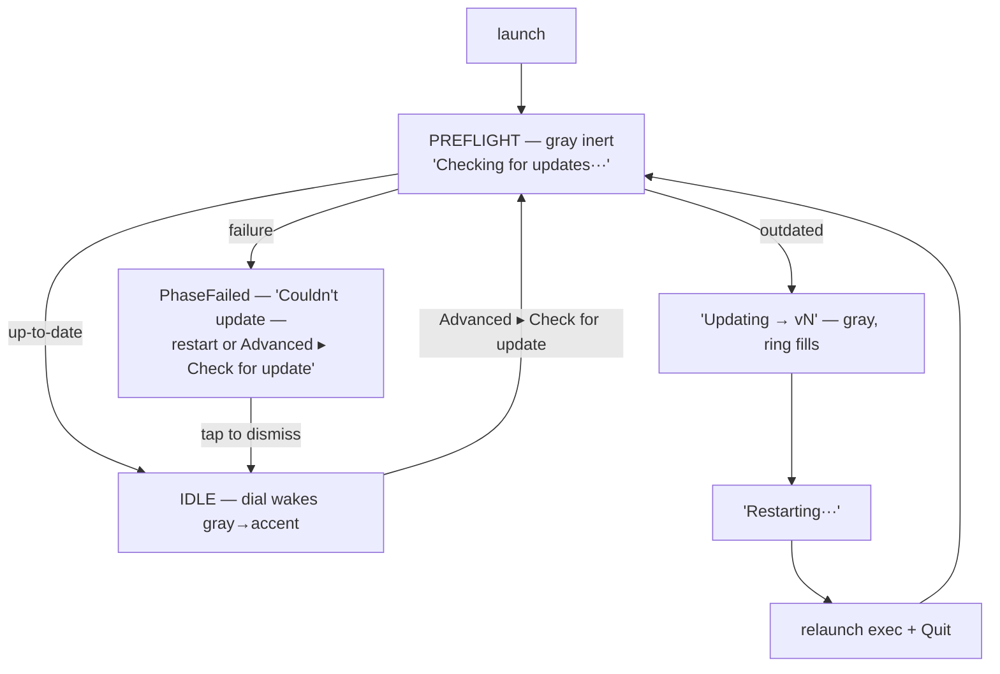

# 037 — Autoupdate as a Preflight dial stage

**Date:** 2026-05-30
**Status:** Draft

## Background

Pre-2.0 (CLI era) Ritual self-updated. The mechanism lived in
`internal/core/services/updater_ritual.go` (`RitualUpdater`, `UpdaterService`
port). It was deleted wholesale in `046045a` — *not* because it was wrong, but
as collateral in "remove v1 publishing/backup/retention tail"
(`docs/superpowers/plans/2026-04-25-...`): it read `RitualVersion` off the
remote `ManifestStore`, so it fell when the manifest layer fell.

Survived the cut:

- `config.AppVersion` — semver from `VersionMajor/Minor/Patch`
  (`internal/config/config.go`, currently `2.0.0`); single source of truth,
  also feeds the Windows resource via `cmd/genversioninfo`.
- Orphaned consts with zero callers: `RemoteBinaryKey = "ritual.exe"`,
  `ReplaceFlag`, `CleanupFlag`, `UpdateFilePattern`, `UpdateFileGlob`,
  `UpdateProcessDelayMs`.

Lost: version check + download + replace + restart, and the pure semver
compare `IsVersionOlder`/`parseVersion`.

## Problem

Restore autoupdate. But the old code was **CLI- and Windows-exec-shaped** and
will not survive contact with the Wails GUI:

1. `fmt.Printf`'d progress to a console that no longer exists (windowed app).
2. Restarted via a 3-process dance (spawn temp exe `--replace-old` → self-copy
   → respawn `--cleanup-update` → delete temp). Brittle, three hops.
3. `os.Exit(0)` directly — no Wails lifecycle, no window teardown.
4. Version source (`ManifestStore`) is gone.

**Scope (set with requestor this session):** macOS **out of scope** (no `.app`
bundle / notarization / Sparkle). **Windows primary**, Linux secondary. End
state is a **single executable binary** — puts us in the "self-updating Go
daemon" bucket, not the Electron-folder-app bucket. The replace is
one-file-swaps-one-file. Binaries delivered from **Cloudflare R2** (the
existing remote backend, design-log/030), not GitHub releases.

## Research summary

- **Electron (Squirrel.Windows / electron-updater)** — machinery (delta
  packaging, stub exe, installer re-run) exists to update a *multi-file* app.
  We ship one binary; adopting it imports a solution to a problem we don't
  have. Worth stealing only the **generic feed** idea: a small metadata file in
  object storage + the artifact alongside it.
  ([electron-builder auto-update](https://www.electron.build/auto-update))
- **[minio/selfupdate](https://github.com/minio/selfupdate)** — `Apply(io.Reader, Options)`
  does an **atomic in-process replace**: writes `.target.new`, then renames
  `target → .target.old`, `.target.new → target`, deletes `.old`. On Windows
  you **can rename a running .exe** (just not overwrite its bytes), so this
  works *without a second process*. SHA256 verification + rollback
  (`RollbackError`) built in. **Does not restart** — caller's job. This single
  fact collapses the old 3-process choreography into one `Apply()` + one
  relaunch.
- **Wails v3** — **no full-restart API** (`WindowReload*` reload the frontend
  only; [discussion #2223](https://github.com/wailsapp/wails/discussions/2223)).
  Relaunch = OS-level `exec` + `Quit()`. A [single-instance plugin](https://v3alpha.wails.io/guides/single-instance/)
  exists (named mutex on Windows / dbus on Linux) but is **not enabled** in
  `cmd/gui/main.go`, so relaunch is a plain `exec` with no lock race to fight.

## Questions and Answers

**Q1 — Library or bespoke replace?** Use `minio/selfupdate` for the byte-level
replace + checksum + rollback (the tested version of the old
`handleReplace`/`copyFile`). Keep a thin layer for feed fetch, version compare
(resurrect `IsVersionOlder`), and relaunch.

**Q2 — UI surface?** **A new leading dial stage, `Preflight`** — not a chip,
banner, toast, or notification (rejected per 007/034). Autoupdate becomes a
*stage in the existing state machine*: the dial boots **gray and inert**
(disabled — gray *means* "system working, hands off") with a caption narrating
what it does, then morphs into IDLE (up-to-date) or into updating→restart
(outdated). Same surface, same morph language as every other phase.

**Q3 — Common path (already up-to-date)?** **Always show** the gray "Checking
for updates···" beat (~1s) every launch, then wake to IDLE. Consistent ritual;
goal "always give feedback" honored every time.

**Q4 — Outdated path: auto or ask?** **Auto-apply, narrated, mandatory.** No
skip / no "later". Gray dial flows Checking → "Updating → vN" (ring fills) →
"Restarting···" → relaunch. Rationale: a stale binary could mishandle the
shared refs/R2 format, so clients must be on a compatible version before
touching shared state.

**Q5 — Failure (offline OR apply-failed)?** **Best-effort mandatory** — never
trap the user. Route into the **existing `PhaseFailed` stage** (017's single
failure pathway: glyph `x`, informative label, "Tap to dismiss"). Copy informs
the retry paths: *restart the app, or Advanced ▸ Check for update*. Tap →
**open IDLE, fully operable**. (Mandatory is the default attempt, not a lock.)
A failed *check* (offline / R2 down) overlaps [[036-skip-sync-session]]'s
sync-stage-failure surface — the same FAILED view can carry its "Skip sync &
run locally" hint, so the two features share one failure affordance rather than
competing for the dial.

**Q6 — Manual re-check?** Advanced gains a **"Check for update"** action →
**full Preflight takeover** (identical path to launch). One code path, one
mental model: the gray dial always means the same thing. *(An earlier "disable
online sync" escape idea is not added here — that capability already exists as
[[036-skip-sync-session]]'s per-session "Skip sync this session" toggle, which
launches local-only and so also sidesteps the mandatory-update gate. This log
reuses it rather than inventing a second offline switch.)*

**Q7 — Version feed, now that ManifestStore is gone?** *Initial proposal
(superseded — see Resolved):* a tiny `update/latest.json` pointer object in
the same R2 bucket + a flat `bin/<goos>-<goarch>/ritual…` artifact, fetched
through the existing `StorageRepository.GetStream`.

**Resolved (session 2026-06-03) — no feed file; listing-derived latest;
hash in the key name.** Reuse the repo's own HEAD idiom: `pulling.HeadResolver`
derives HEAD by **listing `refs/` and taking the max** with *no pointer file*.
Apply the same here — semver-sorted instead of lexical-timestamp-sorted:

```
bin/<goos>-<goarch>/<version>/<sha256>[.exe]      ← the artifact; leaf name IS its sha256

bin/windows-amd64/2.0.0/9f86d0…41.exe
bin/windows-amd64/2.1.0/c1a2b3…7f.exe             ← latest = max <version> via IsVersionOlder
bin/linux-amd64/2.1.0/5e4d3c…90                   ← Linux rides later, zero schema change
```

- **Discovery:** `List(ctx, "bin/<goos>-<goarch>/")`, parse the `<version>`
  path segment, pick the max via the resurrected `IsVersionOlder` (semver-aware
  — `2.10.0 > 2.9.0`, which a lexical sort gets wrong). The winning key's **leaf
  is the expected sha256**; hand those bytes to `minio/selfupdate`.
- **Why no `latest.json` / no sidecar (decision):** the pointer reintroduces a
  two-write window + drift — the exact thing listing-derived HEAD avoids. The
  **hash is intrinsic to the key**, so there is nothing to keep in sync and
  no separate integrity object to fetch. One object per version dir; its mere
  presence is the atomic ready-marker (no write-ordering discipline, no partial
  sidecar state). A corrupt upload would have to hash to its own name —
  `minio` rejects the mismatch and rolls back.
- **No `size` carried remotely (deviation):** the original feed shipped `size`
  to fill the dial ring. We deliberately store no metadata, so the Updating
  ring is **byte-count / indeterminate** (no denominator) rather than a precise
  %. Accepted — see §Observability + §Trade-offs.
- **`os` selects:** the *client* reads `runtime.GOOS+"-"+runtime.GOARCH` and
  lists only its own prefix (never sees other platforms). `minio` replaces
  `os.Executable()`, so the remote leaf name (`.exe` or not) is cosmetic.
- **Same bucket, isolated prefix:** `bin/` sits outside `objects/`+`refs/`, so
  the GC `Collector` never sweeps it and `PrefixRouter` routes it to raw (no
  compression → byte-exact for the sha). Replaces the dead `RemoteBinaryKey`.
- **Re-publish of an existing `<version>`:** `cmd/publish` clears any prior
  object under that version dir first, so a version dir holds exactly one
  artifact (no ambiguous two-object pick). See Phase F.

**Q8 — Observability?** **Mandatory: fully debuggable from the single
`<root>/logs/<ts>.log`.** Achieved by reusing existing primitives, not a
bespoke logger — see §Observability.

**Q9 — Install location / elevation?** *(Open — see §Open questions.)* In-place
rename needs no elevation if the binary is user-writable (portable exe or
per-user install); an NSIS Program-Files install needs admin to overwrite its
own exe. "Single executable binary" framing implies portable — confirm.

**Q10 — Code signing / SmartScreen?** Deferred. Unsigned binaries trip
SmartScreen on first run regardless of update path; an existing trusted install
relaunching a freshly-written unsigned exe is the same trust posture as today.
`build/windows/Taskfile.yml` already has a placeholder `sign:` task for later.

## Design

### UI flow (locked)



Every launch shows Preflight. Manual "Check for update" re-enters the same
Preflight. Failure never blocks IDLE.

### State-machine additions

New phases on `projection.ViewModel` (`internal/gui/projection/viewmodel.go`):

- `PhasePreflight = "preflight"` — gray inert dial, "Checking for updates···".
- `PhaseUpdating  = "updating"`  — gray, ring fills from bytes, "Updating → vN".
  ("Restarting···" is a sub-copy of `PhaseUpdating` once `Apply` succeeds.)
- Failure reuses `PhaseFailed` (017) with update-flavored label.

New `vm.TargetVersion string` for the "→ vN" copy. New TS `DialState`
`"preflight"` (gray) + color token; the existing `fail`/`idle` states are
reused.

### Backend: new subsystem + observed decorator

```go
// internal/core/ports/ports.go — resurrected, trimmed
type UpdaterService interface {
    // Check returns the available update, or (Update{}, false) if current.
    Check(ctx context.Context) (Update, bool, error)
    // Apply downloads + replaces the running binary, then relaunches and quits.
    // Does not return on success (process is replaced).
    Apply(ctx context.Context, u Update) error
}

type Update struct {
    Version string // parsed from the <version> path segment
    Key     string // full R2 object key of the artifact
    SHA256  string // the key's leaf name — integrity is intrinsic to the key
}
```

```go
// internal/subsystems/selfupdate/updater.go — pure port impl, no bus
type Updater struct {
    remote   ports.StorageRepository // the OBSERVED + counter-wrapped remoteStorage
    current  string                  // config.AppVersion
    prefix   string                  // "bin/<goos>-<goarch>/" — the client's own platform
    relaunch func() error            // exec(os.Executable()) + wailsApp.Quit()
}

func (u *Updater) Check(ctx) (Update, bool, error) {
    keys := u.remote.List(ctx, u.prefix)               // List logged by observed
    up := latest(keys)                                 // parse <version>/<sha> per key, max via IsVersionOlder
    if up.Version == "" { return Update{}, false, nil } // empty prefix → nothing to update to
    return up, IsVersionOlder(u.current, up.Version), nil
}

func (u *Updater) Apply(ctx, up Update) error {
    body := u.remote.GetStream(ctx, up.Key)            // streamed; RAM flat; wire-counter pulses ring
    defer body.Close()
    sum, _ := hex.DecodeString(up.SHA256)              // sha from the key leaf
    if err := selfupdate.Apply(body, selfupdate.Options{Checksum: sum}); err != nil {
        return err // observed.Updater publishes UpdateApplyInfo{Err}; minio rolled back, binary intact
    }
    return u.relaunch()
}
```

`IsVersionOlder`/`parseVersion` lifted verbatim from the deleted
`updater_ritual.go` into `selfupdate/version.go` (pure, no manifest dep).
`latest(keys)` is a pure helper in `selfupdate/feed.go` (parse + max), unit
tested against fixture key lists — no storage needed.

### Observability (§Q8 — debuggable from one log file)

The single log file *is* the bus: `logging.Build(bus, workRoot)` writes every
published event to stdout + `<root>/logs/<ts>.log`. So "observable like the
others" = "publish everything to the bus," reusing existing primitives:

1. **Decorator pattern, mirrored.** Plain `selfupdate.Updater` (no bus) +
   `observed.NewUpdater(inner ports.UpdaterService, bus)` in
   `internal/adapters/observed/updater.go`, publishing one Info event per call —
   exactly like `observed.NewLocker`/`NewRetention`/`NewCheck`. Events live in
   `observed/updater_events.go`:
   - `UpdateCheckInfo{From, To, Outdated, Err}`
   - `UpdateApplyInfo{Version, Bytes, Err}`
   - `UpdateRestartInfo{Version}`
   - `UpdateFailed{Stage, Err}` (failure is an event, not just a return).
2. **Observed storage.** The `Updater` is handed the already-`observed.NewStorage`-
   wrapped `remoteStorage` (not `rawRemote`). The `List` (Check) + artifact
   `GetStream` (Apply) emit `StorageListInfo` / `StorageGetStreamInfo` to the log
   for free. The artifact key is non-`objects/`, so `PrefixRouter` routes it to
   raw — only the **wire** counter ticks on it, *not* the logical counter
   (`Stream.Data` reads 0 for it). Combined with carrying no remote `size`
   (§Q7), there is no byte denominator, so the Updating ring is **indeterminate
   / byte-count**, not a precise %. The wire counter + `transferwatch` arming
   still pulse liveness so the dial never looks frozen mid-download.
3. **One stream, two sinks.** Projection folds `Update*` events → ViewModel
   (`PhasePreflight`/`PhaseUpdating`, `TargetVersion`); `logging.write`
   formats the same events → disk. The gray-dial UX and the on-disk audit trail
   are the same events and cannot drift.
4. `logging.write`'s type-switch gains cases for the new events; a
   `transferwatch`-style arming marks the download window transfer-active so
   `progress.Ticker` keeps pulsing during the `GetStream` even when the link
   stalls (deviation from the original "ring fills from `Tick`" — no `size`
   means no fill target; the pulse is liveness, the bytes count up).

### Wiring (`cmd/gui/main.go`)

- Build `selfupdate.Updater` from `remoteStorage` + a `relaunch` closure
  capturing `wailsApp`; wrap in `observed.NewUpdater(_, bus)`.
- Fire the startup `Check` as a **pre-IDLE step**: publish
  `UpdateCheckInfo`-driven Preflight state, run `Check` in a goroutine (does not
  block `wailsApp.Run()`); outdated → `Apply` (publishes progress, then
  relaunch + `Quit`); else → idle.
- Manual path: `control.Service.CheckForUpdate()` runs the same
  `Check`/`Apply`, publishing the same events → same dial. `Dismiss` already
  exists (reused for `PhaseFailed`).

### Cleanup

Delete dead `config.go` consts (`RemoteBinaryKey`, `ReplaceFlag`,
`CleanupFlag`, `UpdateFilePattern`, `UpdateFileGlob`, `UpdateProcessDelayMs`) —
replaced by the `bin/<os-arch>/<version>/<sha>` layout (§Q7). Keep `AppVersion`.

## Implementation Plan

- **Phase A — pure core.** `selfupdate/version.go` (resurrect
  `IsVersionOlder`/`parseVersion` + fresh version tests — the deleted file's
  tests covered `streamToFile`/`copyFile`, not the compare, so write new ones).
  `selfupdate/feed.go` `latest(keys)` parse-and-max helper + tests over fixture
  key lists. `Update` struct + `UpdaterService` port in `ports.go`. No wiring.
- **Phase B — service.** `Updater{Check, Apply}` over an injected
  `StorageRepository` + platform `prefix` + `relaunch func`. Add
  `github.com/minio/selfupdate` to go.mod. Unit-test `Check` (key list →
  decision, mock storage); test `Apply` download+checksum against a temp-file
  integration test stopping before/around real `selfupdate.Apply`.
- **Phase C — observability.** `observed.NewUpdater` +
  `observed/updater_events.go`; `logging.write` cases; `observed_test`. Verify
  events render in a captured log.
- **Phase D — projection + GUI wire.** New `PhasePreflight`/`PhaseUpdating` +
  `vm.TargetVersion`; projection folds `Update*` events. `control.CheckForUpdate`.
  `cmd/gui/main.go`: build `Updater`, fire startup Check, `relaunch` closure.
  Delete dead config consts. `transferwatch`-style ticker arming for the
  download window.
- **Phase E — frontend + Storybook (all stories, no exceptions —
  frontend/CLAUDE.md).**
  - `ritual-dial.ts`: new gray `DialState` + token.
  - `ritual-dial.stories.ts`: `PreflightChecking`, `PreflightUpdating`
    (ring + "Updating → v2.1 · 42%"), `PreflightRestarting`, `FailedUpdate`.
  - `ritual-app.ts`: `PHASE_VIEW` rows for `preflight`/`updating`; failure copy.
  - `prep-settings.ts` + `.stories.ts`: "Check for update" row variant.
  - `app.stories.ts`: composition stories — launch→preflight→idle, failure→idle.
  - `*.test.ts` per `@web/test-runner` for new states.
- **Phase F — publish pipeline (separable; NOT blocked by Q9 — that's
  client-side elevation).** New `cmd/publish` Go tool, not shell `aws s3 cp`:
  imports `internal/config` (version) + `internal/adapters` R2 (same
  `RITUAL_R2_*` creds + same `StorageRepository.PutStream` the client reads
  through — no second tool, no layout drift). Steps:
  1. `version := config.AppVersion` — **no `--version` flag.** This is the same
     compiled const the GUI binary baked at the same commit, so the published
     `<version>` path and the binary's self-report **cannot diverge** (the
     anti-loop invariant — see §Trade-offs). Taskfile `publish:` **always
     rebuilds before pushing** so a stale artifact can't sneak a mismatched
     version in.
  2. sha256 the built artifact; `DeleteBatch` any prior objects under
     `bin/<os-arch>/<version>/` (re-publish = replace, one object per dir);
     `PutStream` → `bin/<os-arch>/<version>/<sha256>[.exe]`.
  3. Taskfile `publish:` target chains `gui:build` → `cmd/publish`.

  **Task integration (automatable — the requirement this session).** The root
  `Taskfile.yml` already (a) auto-loads `.env.{RITUAL_ENV}.local` and exports
  `RITUAL_R2_*`, and (b) switches bucket via `RITUAL_ENV` (`dev`→`prod`). So
  `cmd/publish` inherits the **same creds the GUI uses, zero extra config**, and
  the publish target is a thin, CI-callable wrapper:

  ```yaml
  publish:
    desc: Build the host-OS GUI binary and publish it to R2 under bin/<os>-<arch>/<version>/<sha>.
    cmds:
      - task: gui:build                     # sequential: build runs to completion first…
      - go run ./cmd/publish -artifact {{.BIN_DIR}}/{{.APP_NAME}}{{.EXE}} -os {{OS}} -arch {{ARCH}}
    vars:
      EXE: '{{if eq OS "windows"}}.exe{{end}}'
  ```

  Sequential `cmds` (not `deps`) so the build→publish order is explicit. The Go
  build step is **not fingerprint-cached** (`build:native` has no
  `sources:`/`generates:`; the `go build` runs every invocation and
  `generate:versioninfo` re-stamps from the consts), so `task publish` can never
  push a stale binary under a freshly-bumped version — the invariant holds at the
  build layer, not just by convention.

  - **Target passed in, not inferred.** `cmd/publish` takes `-os/-arch/-artifact`
    rather than reading its own `runtime.GOOS` — so a cross-compiled build
    (Windows binary on a mac CI host) publishes under the *artifact's* platform,
    not the publisher's. Version still comes from `config.AppVersion` (host-
    independent, same const).
  - **CI shape:** a release job runs `task publish RITUAL_ENV=prod` after the
    version consts are bumped. Bumping the consts is the one human/automatable
    pre-step (a later `task version:bump` or a tag→ldflags injection can own it;
    out of scope here). `task test` + `task lint` gate it as today.
  - **Idempotent + safe to re-run:** re-running the same version replaces the
    single object under that version dir (step 2); a newer version just adds a
    dir. No pointer to update, so a half-finished CI run leaves the prior latest
    intact.
  Note: no publish path exists today — `RemoteBinaryKey` had zero writers.

## Examples

✅ Layout in R2 (no feed file — the key *is* the metadata):
```
bin/windows-amd64/2.0.0/9f86d0…41.exe     ← prior version, retained
bin/windows-amd64/2.1.0/c1a2b3…7f.exe     ← latest = max <version> via IsVersionOlder; leaf = sha256
```
Check lists `bin/windows-amd64/`, parses `2.1.0` from the path, hands the leaf
`c1a2b3…7f` to `minio` as the expected checksum.

✅ Clean relaunch (Windows + Linux, single binary):
```go
exe, _ := os.Executable()
cmd := exec.Command(exe)            // no flags — minio already swapped the bytes
cmd.Stdout, cmd.Stderr = os.Stdout, os.Stderr
_ = cmd.Start()
wailsApp.Quit()                     // graceful window teardown, then process exits
```

✅ One event, two sinks:
```
UpdateCheckInfo{From:2.0.0 To:2.1.0 Outdated:true}
  → projection: Phase=updating, TargetVersion=2.1.0   (dial: gray ring, "Updating → v2.1")
  → logging.write: "[15:04:05] update: 2.0.0 → 2.1.0 (outdated)"   (<root>/logs/<ts>.log)
```

❌ Old way (do not restore): temp exe + `--replace-old` self-copy +
`--cleanup-update` + `os.Exit(0)` + `fmt.Printf` to a non-existent console.

❌ A toast / banner / modal "Update available" notification (violates 007/034).

## Trade-offs

- **minio/selfupdate vs bespoke:** +1 dependency, −~150 LoC of fragile process
  choreography, −6 config consts; gains checksum + rollback free.
- **Preflight-as-stage vs notification:** reuses the dial + morph language and
  the failure pathway; cost is a new phase + a ~1s beat on every launch (chosen
  deliberately for consistent feedback).
- **Mandatory (best-effort):** protects shared-state version compat, but a
  failed update still drops to a usable IDLE — so a known-outdated client can
  touch shared state until it next updates. Accepted (don't trap the user).
- **R2-bucket vs GitHub releases:** keeps the R2 transport (zero new auth/SDK),
  at the cost of running our own publish step (Phase F).
- **Listing-derived vs `latest.json` pointer:** no pointer to drift, no
  two-write window, hash-in-key = self-verifying; cost is a `List` per Check
  (cheap — a handful of release keys) and no remote `size` (indeterminate ring).
- **Version-identity invariant (anti-loop):** publish derives `<version>` from
  the same `config.AppVersion` const the binary bakes, and the build is never
  fingerprint-skipped — so a published path can't advertise a version the bytes
  don't self-report. The dangerous failure (path > baked → infinite re-update)
  is structurally impossible; the benign one (forgot to bump → no-op) is safe.
- **No code signing yet:** SmartScreen friction unchanged from today; flagged.

## Verification criteria

1. App at `2.0.0` against a bucket holding `bin/<os-arch>/2.1.0/<sha>` enters
   Preflight→Updating; holding only `2.0.0` wakes straight to IDLE. `latest()`
   picks `2.10.0` over `2.9.0` (semver, not lexical). (`Check`/`latest` unit
   tests + manual.)
2. `Apply` against a key whose leaf sha ≠ the bytes fails, does **not** replace
   the binary (rollback intact), and routes to `PhaseFailed`. (Integration test.)
3. After a successful `Apply`, the relaunched process reports the new
   `config.AppVersion`; exactly one process survives; no leftover `.old`/temp.
   (Manual Windows smoke.)
4. A full check→update→fail cycle is reconstructable from
   `<root>/logs/<ts>.log` alone (storage GetStream + `Update*` events present).
5. No `fmt.Printf`/stdout dependence; all progress/outcome flows bus →
   {ViewModel, log}.
6. Every new dial state + the Advanced action render in Storybook.

## Open questions for requestor

- **Q9 (client-side only — NOT a Phase F blocker):** Portable single exe, or
  NSIS-installed (Program Files)? Decides whether the in-place rename needs an
  elevation path. Does not affect the publish layout, so Phase F can land first.
- ~~**Q7 confirm:** feed shape / key layout.~~ **Resolved 2026-06-03** — no feed
  file; listing-derived latest; `bin/<os-arch>/<version>/<sha>`; hash in the key
  name (see §Q7 Resolved + §Examples + Phase F).
- **Q4 nuance:** on a *running* server (not just launch), should the manual
  "Check for update" be disabled, given Apply restarts the process? (Lean:
  disable Check while `PhasePlaying`.)
