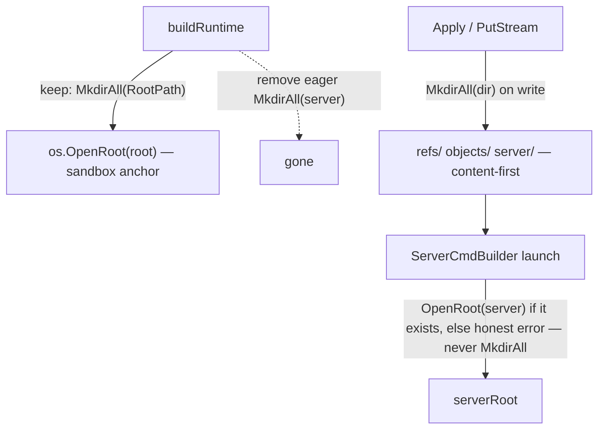

# 040 — Lazy directory creation (no empty folders on boot)

**Status:** Implemented
**Date:** 2026-06-04

## Background

`buildRuntime()` eagerly `MkdirAll`s several directories under the working
root before any of them holds content. Content-bearing dirs (`refs/`,
`objects/`) already materialise lazily inside `FSRepository.PutStream`
(`internal/adapters/fs.go:70`) — they appear only when a blob is first written.
The startup `MkdirAll` calls are the inconsistent exception.

## Problem

Empty folders are created on every launch regardless of whether they ever
receive a file. Audit of all eager directory creation in non-test code:

| Dir | Path | Site | Empty at create? |
|-----|------|------|------------------|
| Root | `~/k10wl/<app>` | `cmd/gui/main.go:271` | No — `logs/` lands immediately |
| Server | `<root>/server` | `cmd/gui/main.go:432` | **Yes** — populated only by a later Apply |
| Logs | `<root>/logs` | `logging.go:42` | No — the session `.log` is written the same instant |
| Mock remote | `<root>/remote-mock` | `remote/build.go:140` | **Yes** (mock mode only) — dev artifact |

`<app>` = `ritual` (prod) / `ritualdev` (dev).

**Principle (user directive):** directories should materialise on demand —
created only when something is written into them. There is no reason to leave
empty folders on a fresh host. Mirror the `PutStream` pattern everywhere.

## Why the eager calls exist (the `os.OpenRoot` constraint)

Three of the four are not gratuitous — they exist to satisfy `os.OpenRoot`:

```go
os.MkdirAll(config.RootPath, …)          // main.go:271
workRoot, _ := os.OpenRoot(config.RootPath)  // main.go:274  ← requires the dir to exist

os.MkdirAll(serverPath, …)               // main.go:432
serverRoot, _ := os.OpenRoot(serverPath)     // main.go:435  ← requires the dir to exist
```

`os.OpenRoot` (the Go 1.24 sandbox boundary used for all path-confined I/O)
**fails if the target dir does not exist** — it does not create it. So any dir
we want to wrap in an `os.Root` must be `MkdirAll`'d first. The eager calls are
a side-effect of opening sandbox roots at composition time, not a deliberate
"pre-seed the layout" choice.

`logs/` is created just-in-time already (line 42 immediately precedes
`os.Create(path)`), so it never stays empty — arguably already compliant.

## Questions and Answers

**Q1. Is the root itself (`~/k10wl/<app>`) in scope?**
It is opened as the top-level `os.Root` that every other path lives under, and
it always receives `logs/<ts>.log` within the same `buildRuntime` call, so it
is never empty in practice. Proposal: keep one `MkdirAll(RootPath)` as the
single justified eager create (the sandbox anchor), documented inline. Removing
it would force a lazy-open wrapper on the hottest path for zero observable gain.
**A (2026-06-04): Keep the root eager.** It is the sandbox anchor and never
stays empty (`logs/` lands immediately), so it does not violate "no *empty*
folders." The only sanctioned eager `MkdirAll`.

**Q2. `server/` — defer to where?**
Two options:
- **(2a) Lazy server-root open.** Move `MkdirAll(serverPath)` +
  `os.OpenRoot(serverPath)` out of `buildRuntime` into a lazy accessor that
  runs the first time the server is actually launched (or the first write to
  `server/`). By launch time an Apply (pull) has normally created `server/`
  already, so the `MkdirAll` becomes a no-op and the dir is content-first.
- **(2b) Create-on-write only.** Drop the server-root `os.Root` entirely and
  route server-file writes through the existing RootPath `FSRepository` (which
  already `MkdirAll`s subdirs in `PutStream`). Bigger blast radius —
  `ServerCmdBuilder` currently owns a dedicated `serverRoot`.

**A (2026-06-04): 2a — lazy server-root.** Smallest change, preserves the
`serverRoot` sandbox, kills the empty-folder smell. `MkdirAll`+`OpenRoot` move
into a lazy accessor on `ServerCmdBuilder`, run on first launch.

**Q3. Skip-sync (036) interaction?** A `BuildLocalSession` run does no Apply, so
on a *truly fresh* host `server/` would not exist when launch is attempted —
but there is nothing to run anyway (no `start.bat`). Lazy creation must surface
a clean "no server files" error rather than silently creating an empty dir and
launching nothing. **A (2026-06-04): Clean error, no dir.** The lazy accessor
surfaces an honest "no server files" error and creates **nothing** — skip-sync
on an empty host genuinely can't run. No empty `server/` left behind on this
path either (a `MkdirAll`-then-fail would reintroduce the smell).

**Q4. `remote-mock/`?** Mock-mode dev artifact. **A (2026-06-04): Out of
scope.** Dev/test-only, never ships to users, lowest priority — leave
`mockRemoteDir()` eager; not worth the churn.

## Design (resolved 2026-06-04)

1. **Principle, documented in code:** directories are created by the writer
   (`PutStream`-style `MkdirAll(filepath.Dir(key))`), not pre-seeded at boot.
   The only sanctioned eager `MkdirAll` is the sandbox root (Q1), justified by
   the `os.OpenRoot` constraint and the immediate `logs/` write.

2. **`server/` → lazy (Q2a).** Remove `main.go:432`. `ServerCmdBuilder` gets a
   lazy server-`os.Root` accessor invoked on first launch. Two sub-cases the
   accessor must distinguish (Q3):
   - **server/ exists** (the normal path — a prior Apply created it and wrote
     `start.bat`): `OpenRoot(serverPath)`, launch.
   - **server/ absent** (fresh-host skip-sync, no Apply): surface an honest
     "no server files" error and create **nothing** — do *not* `MkdirAll`,
     since that would leave an empty `server/` behind. The dir is only ever
     materialised by the Apply that writes into it (via the RootPath
     `FSRepository.PutStream`, which already `MkdirAll`s subdirs on write).

3. **`remote-mock/`:** no change (Q4 — out of scope, dev artifact).

4. **`logs/`:** no change (already just-in-time, never empty).

5. **Root:** no change (Q1 — keep eager).



## Implementation Plan

- **Phase A** — Verify `os.OpenRoot` create-on-open semantics with a focused
  test (does it ever auto-create? confirm: no). Lock the constraint that drives
  the design.
- **Phase B** — `server/` lazy accessor in `ServerCmdBuilder` (or a small
  `lazyRoot` helper); delete `main.go:432`. Update/add tests asserting a fresh
  root has **no** `server/` until a write occurs.
- **Phase C** — `remote-mock/` lazy (if Q4 in scope).
- **Phase D** — Document the principle (inline comment at the surviving root
  `MkdirAll`; one line in CLAUDE.md or this log's results).

## Verification criteria

On a clean host, after `buildRuntime()` completes but **before** any
pull/launch:
- `~/k10wl/<app>/` exists and contains **only** `logs/` (+ the session log).
- `~/k10wl/<app>/server/` does **not** exist.
- After a successful Download/Apply, `server/`, `refs/`, `objects/` exist
  (content-first).
- A regression test asserts the absence of `server/` post-`buildRuntime`,
  pre-Apply.

## Trade-offs

- **Pro:** no empty folders; consistent "writer creates the dir" rule across
  the whole storage layer; a fresh `~/k10wl/<app>` is honest about what has
  actually happened.
- **Con:** lazy server-root adds a one-time check on first launch and a
  nil-until-used field (small complexity). The error surface for "launch on an
  empty host" moves from "empty dir, nothing runs" to an explicit error (Q3) —
  this is an improvement, not a regression.
- **Con:** the root `MkdirAll` (Q1) survives as a documented exception; the
  principle is "no *empty* folders," and the root is never empty.

## Implementation Results (2026-06-05)

Shipped the resolved design with **zero deviations**. Single-commit change,
two files + tests.

**Backend — `internal/adapters/cmdbuilder.go`:**
- `ServerCmdBuilder` no longer takes a pre-opened `*os.Root`. Constructor
  signature changed `NewServerCmdBuilder(workRoot *os.Root, …)` →
  `NewServerCmdBuilder(serverPath string, …)`; validation message
  `workRoot cannot be nil` → `server path cannot be empty`.
- New lazy `root()` accessor (mutex-guarded, cached) opens the server sandbox
  on **first `Build`**, not at composition. `os.OpenRoot` on an absent dir
  fails with `IsNotExist` → honest `"no server files at <path> — run a sync
  first"`; it never `MkdirAll`s, so no empty `server/` is left behind (Q3).
  The `Apply` that writes the install materialises `server/` via the existing
  RootPath `FSRepository.PutStream`.

**Composition — `cmd/gui/main.go`:**
- Deleted the eager `os.MkdirAll(serverPath)` + `os.OpenRoot(serverPath)`
  (old `:441-447`). Now just `serverPath := filepath.Join(config.RootPath,
  config.ServerDir)` passed by string. Inline comment documents the surviving
  root anchor as the only sanctioned eager create (Q1, Phase D).

**Scope held to design:** `remote-mock/` left eager (Q4, out of scope);
`logs/` unchanged (already JIT); root `MkdirAll` kept (Q1).

**Tests (`cmdbuilder_test.go`):** retargeted all constructors to pass a path;
`_NilWorkRoot` → `_EmptyServerPath`. Added `TestServerCmdBuilder_Build_NoServerDir`
(Phase A + verification): `Build` on an absent server path returns a
`"no server files"` error **and** asserts `os.Stat(serverPath)` is
`IsNotExist` — the dir must not be created on launch. `go build ./...`,
`go vet ./...`, full `go test ./...` all green.

**Verification criteria met:** post-`buildRuntime` pre-Apply, `server/` does
not exist (regression test); after Apply it appears content-first via
`PutStream`; fresh-host skip-sync surfaces a clean error instead of an empty
dir + silent no-op launch.
