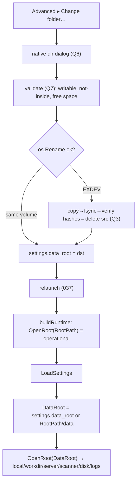

# 041 — Work folder selection (movable files root, fixed operational root)

**Status:** Draft
**Date:** 2026-06-04

## Background

Everything lives under one root: `config.RootPath = ~/<GroupName>/<AppName>`
(`~/k10wl/ritual`; `ritualdev` in dev), computed in `config.init()` from
`os.UserHomeDir()` (`internal/config/config.go:134`). `buildRuntime()`
(`cmd/gui/main.go:270`) composes the whole graph around it:

```
MkdirAll(RootPath) → os.OpenRoot(RootPath) → FSRepository{local,workdir}
  → scanners → conditions disk-check → settings.json → server-root → logs
```

Read sites for `config.RootPath` (non-test): `config.go`,
`domain/settings.go` (`SettingsPath`), `remote/build.go:139` (mock dir),
`conditions/conditions.go:32` (disk check), `control.go:388`
(`OpenRootFolder` reveal), `cmd/gui/main.go`.

## Problem

Users cannot choose where the **heavy** data (worlds, server install, content
blobs, logs) lives. It is pinned to the home volume. Real needs: home volume
too small, keep game data off the OS drive, use a larger/faster/external disk.

Goal: Advanced settings exposes **Open folder** and **Change folder**.
Changing the folder **physically moves the files** to the new location.

## Two paths (per user directive)

The user named two distinct things — keep them separate:

| Path | Term | Location | Holds | Moves? |
|------|------|----------|-------|--------|
| **Operational path** | `RootPath` (fixed) | `~/k10wl/<app>` | `settings.json` (+ its `data_root` field), small operational JSONs (prep-history #027) | **No** — required, always at home |
| **Files path** | `DataRoot` (selectable) | from `settings.data_root` (default = `RootPath/data`) | `objects/` (blobs), `refs/`, `server/` (install + worlds), **`logs/`** | **Yes** — the heavy files |

**No env var.** Resolution is purely: `settings.data_root` if set, else the
default `~/k10wl/<app>/data` (a `data/` subfolder of the operational path —
files and operational state are separate from boot). The operational path
stays at home and is never user-moved.

**No legacy support (user directive).** Prior single-root installs (heavy dirs
directly under `~/k10wl/<app>`) are **not** migrated and **not** adopted
in place. The default files root is `~/k10wl/<app>/data`; an empty one
re-materialises from the remote via Download (remote is source of truth).
No migration code, no dual-layout detection.

Because `settings.json` lives at the **fixed** operational path and is loaded
before the files root opens, there is no bootstrap chicken-and-egg: the
`data_root` field is read from a file whose location is always known.

## Questions and Answers (resolved 2026-06-04)

**Q1. Where is the files-path pointer stored?**
**A: A `data_root` field in `settings.json`** (operational path). It is a
user-editable setting like port/memory. Resolution: `settings.data_root` if a
non-empty absolute path, else default `RootPath/data`. No separate pointer
file, **no env override** (the two paths — operational vs files — are the only
inputs). **No legacy migration** — the default is the `data/` subfolder; old
flat-layout roots are not adopted.

**Q2. Change folder = move, or copy?**
**A: MOVE.** Primary path is `os.Rename(src, dst)` — atomic, instant,
no duplicate bytes — when source and destination are on the **same volume**.
Only when `os.Rename` returns `EXDEV` (cross-device — the common case for
"move to another disk") fall back to **copy → fsync → verify → delete-source**.
Either way the old location is not left behind. (This replaces the draft's
unconditional copy-verify-flip dance — rename is the right primitive; copy is
the fallback, not the default.)

**Q3. Cross-device fallback — integrity + safety.**
When copy is forced:
- **Integrity:** `objects/` is content-addressed (filename = content hash,
  #025) — re-hash each copied blob, assert filename == hash; `refs/` re-parsed.
  A single mismatch aborts and the **source is kept** (no `data_root` flip),
  so the original stays active and intact.
- **Order:** copy into `<dst>/.ritual-incoming` → verify → rename into place
  (same volume) → write `settings.data_root` → **delete source**. A crash
  before the settings write leaves the original active; after it, at worst an
  orphan source copy (recoverable, never lost).
On the `os.Rename` happy path none of this is needed — the move is atomic.

**Q4. Logs.**
**A: Logs move with the files root** (live under `DataRoot/logs`). Subtlety:
the current session's log file is open while running. The move runs with the
server **stopped** and is immediately followed by a relaunch, so the log sink
is **closed before the move** (Windows cannot move an open file); the new
session writes to `DataRoot/logs` at the new location.

**Q5. Restart required?**
The graph binds to the files root at composition (`os.OpenRoot`, both
`FSRepository`s, scanner, disk-check, server-root, log sink). **A: Yes.**
After a successful move + `data_root` write, **relaunch** via the
[[037-autoupdate]] exec-relaunch path. Disallowed while a session is RUNNING.

**Q6. Native folder dialog.**
**A (user directive): default primitives.** OS-native directory picker
(Wails v3 `application.OpenFileDialog` with directory selection) — no custom
in-app browser. Exact v3 signature verified in Phase A (one external unknown).

**Q7. Validation of the chosen folder.**
Reject: non-directory, non-writable, the **current** files root, or a path
*inside* the current files root. Warn on non-empty target. On the copy
fallback, check free space ≥ size to move (reuse disk-check inputs).
**A:** all of the above; inline errors, no silent `MkdirAll` of a bad path.

**Q8. Open folder.**
**A:** "Open folder" reveals the **files root** in the OS file manager
(existing `revealFolder`, re-pointed from `RootPath` to `DataRoot`).

**Q9. `config.RootPath` — keep global?**
**A:** Keep `RootPath` = operational path (fixed, semantics unchanged → zero
churn for settings). Add `config.DataRoot` (var), resolved in `buildRuntime`
from `settings.data_root`, defaulting to `RootPath/data`. Re-point only the heavy
read sites (mock dir, disk check, reveal, `local`/`workdir` storage, scanner,
log sink) to `DataRoot`. No DI refactor.

## Design

### 1. Settings (`internal/core/domain/settings.go`)

```go
type Settings struct {
    // … existing fields …
    DataRoot string `json:"data_root"` // files path; empty ⇒ default (= RootPath/data)
}
```
Validation: empty (default) or an absolute path. `DefaultSettings` leaves it
empty so the resolved default files root is `RootPath/data`.

### 2. Config (`internal/config`)

```go
// DataRoot is the heavy-files root; defaults to RootPath and may be relocated.
var DataRoot string

// ResolveDataRoot returns settings.DataRoot if a non-empty absolute path,
// else filepath.Join(RootPath, "data"). No env input, no legacy adoption.
func ResolveDataRoot(s *domain.Settings) string
```

### 3. Composition (`cmd/gui/main.go`)

```
configRoot := os.OpenRoot(config.RootPath)        // settings.json (fixed)
settings   := domain.LoadSettings()
config.DataRoot = config.ResolveDataRoot(settings)
dataRoot   := os.OpenRoot(config.DataRoot)         // local, workdir, server, logs
```
`FSRepository{local,workdir}`, `FullScanner`, `MtimeScanner`, server-root,
disk-check, mock dir, **log sink** → **dataRoot**. `settings.json` → configRoot.

### 4. Move (`internal/subsystems/relocate` — new)

```go
// MoveFilesRoot relocates objects/ refs/ server/ logs/ from src to dst.
// Fast path: os.Rename (same volume, atomic). On EXDEV: copy → fsync →
// verify content-addressed blob hashes → rename-into-place → delete src.
// Source preserved until the copy verifies. Emits progress on the bus.
func MoveFilesRoot(ctx, src, dst string, progress func(done, total int64)) error
```

### 5. Control API (`internal/gui/control/control.go`)

```go
func (c *ControlService) GetWorkFolder() WorkFolder // {Path, IsDefault bool}
func (c *ControlService) OpenWorkFolder() error     // reveal DataRoot (Q8)
func (c *ControlService) ChangeWorkFolder() error   // dialog → validate → close log → MoveFilesRoot → set data_root → relaunch
func (c *ControlService) ResetWorkFolder() error    // move back to default → relaunch
```
`ChangeWorkFolder` is **no-op while RUNNING**: closes the log sink, runs
`MoveFilesRoot`, writes `settings.DataRoot`, exec-relaunch (#037).

### 6. Frontend (Advanced)

New `<work-folder>` section in `advanced-view.ts` (sibling of versions /
retention, [[034-immersive-view-stack]] layout): current files-root path
(ellipsised), **Open folder**, **Change folder…**, **Use default**. Change
opens the native dialog (Q6), shows move progress, then the app relaunches.
Host injects `get`/`open`/`change`/`reset` thunks (versions/retention pattern).



## Implementation Plan

- **Phase A** — Verify Wails v3 directory-dialog API (Q6) + reusable
  exec-relaunch helper from a control method. Lock the external unknown.
- **Phase B** — `domain.Settings.DataRoot` field + validation;
  `config.DataRoot` + `ResolveDataRoot`; split `buildRuntime` into operational
  vs files-root opens; re-point heavy sites incl. log sink. Tests: default
  (empty → `RootPath/data`), explicit absolute path, settings/operational state
  still at RootPath, logs land under DataRoot. No legacy-adoption path.
- **Phase C** — `relocate.MoveFilesRoot`: `os.Rename` fast path; `EXDEV`
  copy+fsync+blob-hash-verify+delete fallback; abort-on-mismatch keeps source.
  Tests: same-volume rename, simulated cross-volume copy, corrupted-blob
  detection, failed-copy leaves source intact, permission-denied surfaced.
- **Phase D** — Control: `GetWorkFolder` / `OpenWorkFolder` /
  `ChangeWorkFolder` / `ResetWorkFolder`; RUNNING-gate; close-log-before-move;
  move-progress events; relaunch.
- **Phase E** — Frontend `<work-folder>` section + story + tests; wire thunks.
- **Phase F** — Integration test: start from a **non-default** files root
  (`settings.data_root` preset), Download/Apply, Change to a third folder,
  verify integrity + worlds load.

## Verification criteria

- Empty `data_root` → `config.DataRoot == ~/k10wl/<app>/data`; `settings.json`
  + operational JSONs stay at `~/k10wl/<app>` (not under `data/`).
- `settings.data_root = /vol/x` launch → `config.DataRoot == /vol/x`;
  worlds/blobs/logs land there; `settings.json` stays at `~/k10wl/<app>`.
- Change folder in Advanced → files moved (rename if same volume, else verified
  copy+delete), `settings.data_root` updated, old location cleared, app
  relaunches at the new root.
- **Integrity (copy path):** every destination `objects/` blob re-hashes to its
  filename; `refs/` parse; world loads in-game.
- **Cross-volume:** moving to a different physical disk succeeds via the copy
  fallback.
- **Failure safety:** a move interrupted before `settings.data_root` is written
  leaves the original data fully intact and active.
- **Permissions:** a non-writable target is rejected with a clear error, no
  partial copy left behind.
- "Use default" moves files back to `~/k10wl/<app>` and relaunches.
- Change disallowed while a session is RUNNING.

## Trade-offs

- **Pro:** heavy files go anywhere (bigger/faster/external disk) while required
  operational state stays put; `data_root` in `settings.json` (always at the
  fixed operational path) means no bootstrap chicken-and-egg; clean default
  layout (`RootPath/data`) with no legacy-migration code to carry; native
  dialog; `os.Rename` makes same-volume moves instant and atomic.
- **Con:** the cross-device fallback (copy+verify+delete) is the complex part —
  essential and well-tested, but only exercised when actually crossing volumes.
- **Con:** changing the root requires a relaunch (Q5); matches autoupdate UX.
- **Con:** two roots instead of one — re-points the heavy read sites incl. the
  log sink, and splits the `os.OpenRoot` open in two. Contained; `settings.json`
  path semantics unchanged.
