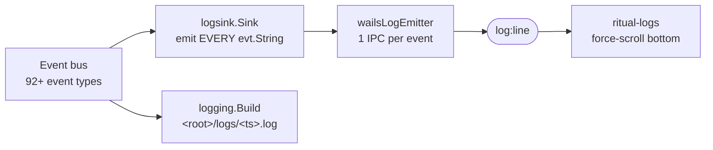
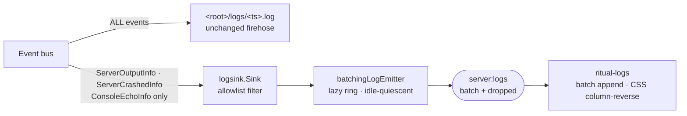

# 042 — Server logs console (MC-only wire, tail-follow UI, Storybook)

The logs window mirrors the **entire** ritual event bus. For a user running a Minecraft world that is noise — they want the **server console**, not internal sync/storage/update telemetry. Narrow the wire to MC server output, rework the UI to be minimal and stop hijacking the scroll, and ship the missing Storybook story.

## Background

Pipeline today (`internal/gui/logsink/logsink.go`, `cmd/gui/main.go:493/595`, `frontend/src/ritual-logs.ts`):



- `logsink.Run` emits one `LogLine{Ts, Level, Msg=evt.String()}` for **every** bus event (`logsink.go:65`): lifecycle, storage ops, projection ticks, update checks, sync stages — all of it.
- The only true MC output is `running.ServerOutputInfo{Line}` (raw stdout/stderr, `strategy.go:235`). A crash surfaces a Go error via `running.ServerCrashedInfo`.
- The on-disk `<root>/logs/<ts>.log` (`logging.go`) carries the **same full bus stream** — the postmortem source of truth.
- UI: `updated()` sets `scrollTop = scrollHeight` on every row (`ritual-logs.ts:59-63`) → the view yanks to the bottom whenever a line lands, so reading scrollback during active output is impossible.
- Console input echoes back through the bus as a `ConsoleInput` event rendered via a magic `"console input: "` prefix match (`ritual-logs.ts:12`, `running/events.go:61`).
- No `ritual-logs.stories.ts` exists — violates frontend/CLAUDE.md ("Storybook is a first-class citizen").

## Problem

1. **Wrong content.** The console shows the engine's internal chatter, not the Minecraft server. The thing a server admin actually needs (`Done (5.2s)!`, `<player> joined the game`, crash stacks) is buried under storage/sync/update events.
2. **Scroll hijack.** Every new line force-scrolls to bottom; you cannot scroll up to read while the server is talking.
3. **Over-rendered.** Each line clones the 500-row array into `@state rows` and re-renders the whole `<ol>` (`ritual-logs.ts:65-68`) — the burst pathology of [[006-log-delivery-latency]] (still Draft, never shipped).
4. **Redundant chrome.** We stamp our own `ts` + `level` badge onto lines that already carry MC's own `[12:34:56] [Server thread/INFO]:` prefix.
5. **No story.** Can't develop or visually spec the console in isolation.

## Questions and Answers

**Q1. What exactly goes on the wire?**
A. **`ServerOutputInfo` only**, plus **`ServerCrashedInfo`** as an error line. Rationale: MC's own stdout already contains readiness (`Done (X)!`), stop (`Stopping the server`), join/leave, and most errors — so synthetic lifecycle markers (`server ready`, `server stopping`) would be redundant with the raw lines. The one thing *not* in stdout is a Go-side crash (non-ctx `cmd.Wait` error) — keep that as the lone error-level injection. Everything else (sync, storage, update, lifecycle) stays off the wire.

**Q2. Where does all the other telemetry go?**
A. **Unchanged — `<root>/logs/<ts>.log` keeps the full bus stream** (`logging.go`). We split surfaces: the on-disk file is the diagnostic firehose (everything, for postmortems); the GUI console is the **product surface** (MC server only). No information lost; the filter is GUI-only.

**Q3. Filter in logsink, or a new dedicated subscriber?**
A. **In `logsink.Sink.Run`** — type-switch, emit only the allowlist. `logsink` already imports nothing that forbids `core/stages/running` (no cycle: `running` never imports `gui`). One small change at the existing seam; `logging.Build` is independent and untouched.

**Q4. Keep `LogLine{Ts, Level, Msg}` and the `log:line` event?**
A. **Rename to reflect the new contract** (`project_no_backwards_compat` — free to break). Payload `logsink.ServerLog{Ts int64, Kind string, Level Level, Text string}`: `Kind` is `"out"` (server output) or `"in"` (echoed console command — see Q8); `Level` is `""` for normal output and `"error"` only for a crash (backend-flagged, since a crash isn't a parseable MC line). Normal WARN/ERROR tinting is **not** carried on the wire — derived frontend-side (Q7). Batched event `server:logs` (see Q5) carries `{lines: ServerLog[], dropped: int}`.

**Q5. Do we need 006's Go-side batching ring now?**
A. **Yes — build it now (decided).** Reuse 006's `batchingLogEmitter` shape: a lazy-timer ring that is **idle-quiescent** — parks on a `wake` channel, **zero wakeups when no events** (no ticker, no polling: "no DoS when there are no requests"). Coalesces lines into one `server:logs` IPC per ~16ms (or at a size cap), drop-oldest on overflow with a `dropped` count. Because Go now coalesces into ≤~60 small batches/sec, **the frontend drops rAF entirely** — it appends each delivered batch directly (also demand-driven, no self-perpetuating loop). World-pregen floods can't backlog Wails IPC. **Supersedes [[006-log-delivery-latency]]** (006's storage-fan-out burst source is off the wire; this is its batching mechanism applied to the now-narrow MC stream).

**Q6. How do we stop the scroll hijack?**
A. **Tail-follow via CSS scroll anchoring — no JS `scrollTop` writes (decided).** The list is a flex `column-reverse` container with newest **prepended**, so staying pinned to the bottom is automatic CSS behaviour; reading scrollback (scrolling up) does not get yanked back. An `IntersectionObserver` on a bottom sentinel (event-driven, no scroll-polling) toggles a **"Jump to latest ↓"** pill when the user is scrolled up; the pill calls `scrollIntoView()`. Auto-resume (scrolling back to bottom re-pins) falls out of the CSS for free.

**Q7. How minimal should a row be, and where is severity classified?**
A. **Raw line, monospace, one element.** Drop our `ts` column and `level` badge for output rows — MC already prints its own timestamp and `/INFO|WARN|ERROR]` tag. WARN/ERROR tint **is** applied (decided), but classified **frontend-side** via substring match on MC's own `/WARN]` / `/ERROR]` tags — a presentation concern, kept out of Go. Crash rows arrive with `Level:"error"` on the wire (backend-flagged) and are always tinted; `Kind:"in"` rows get the `›` input styling.

**Q8. Console input echo?**
A. **Backend-driven via stdin recognition (decided) — UI renders nothing optimistically.** New event `running.ConsoleEchoInfo{Text}` published in `coordinate()` **only on a successful `ConsoleInput` stdin write** (recognition = confirmed write, not an optimistic guess). It rides the allowlist → `ServerLog{Kind:"in", Text}` → rendered as the `›` row. The frontend stays 100% wire-driven; delete the local-echo path and the `"console input: "` prefix coupling Explore flagged. `sendConsole()` still publishes `ConsoleInput` to run the command; the server's own response returns as normal `ServerOutputInfo`.

**Q9. Empty-state copy?**
A. Was "mirrors the Ritual event bus" — now false. Use **"Server console — output appears here while the world is running."**

## Design



### Go: `logsink` allowlist

```go
// ServerLog is one line of the Minecraft server console.
type ServerLog struct {
    Ts    int64  `json:"ts"`
    Kind  string `json:"kind"`  // "out" server output | "in" echoed command
    Level Level  `json:"level"` // "" normal | "error" crash (backend-flagged)
    Text  string `json:"text"`
}

func (s *Sink) Run(ctx context.Context) {
    defer s.unsub()
    for {
        select {
        case <-ctx.Done():
            return
        case evt, ok := <-s.ch:
            if !ok {
                return
            }
            line, ok := serverLine(s.now(), evt)
            if !ok {
                continue // not MC console — file sink still records it
            }
            s.emitter.Emit(line)
        }
    }
}

func serverLine(now time.Time, evt ports.Event) (ServerLog, bool) {
    ts := now.UnixMilli()
    switch e := evt.(type) {
    case running.ServerOutputInfo:
        return ServerLog{Ts: ts, Kind: "out", Text: e.Line}, true
    case running.ServerCrashedInfo:
        return ServerLog{Ts: ts, Kind: "out", Level: LevelError, Text: e.String()}, true
    case running.ConsoleEchoInfo:
        return ServerLog{Ts: ts, Kind: "in", Text: e.Text}, true
    }
    return ServerLog{}, false
}
```

New `running.ConsoleEchoInfo{Text string}` (in `running/events.go`), published in `coordinate()` right after the user command is written to stdin:

```go
if ci, ok := e.(ConsoleInput); ok {
    line := strings.TrimRight(ci.Text, "\r\n")
    if strings.TrimSpace(line) != "" {
        if writeStdin(line+"\n") == nil {
            publish(bus, ConsoleEchoInfo{Text: line}) // recognition = confirmed write
        }
    }
}
```

### Go: idle-quiescent batching emitter (006 mechanism)

`wailsLogEmitter` → `batchingLogEmitter` per [[006-log-delivery-latency]] §Design: a ring + lazy-timer `loop`. At idle the loop parks on `wake` — **zero wakeups, no ticker**. First `Emit` into an empty ring arms a single ~16ms deadline; subsequent `Emit`s coalesce into that window; a size cap preempts the timer. Overflow drops oldest and counts it. Each flush: `logsWindow.EmitEvent("server:logs", ServerLogBatch{Lines, Dropped})`. Window-scoped — main window never sees it. `application.RegisterEvent[logsink.ServerLogBatch]("server:logs")`.

### Frontend: batch-append, CSS-anchored tail-follow

No rAF (Go already coalesced). The list uses CSS `column-reverse` so it stays pinned to the bottom with **zero JS scroll writes**; newest is prepended; an `IntersectionObserver` toggles the pill.

```ts
@customElement("ritual-logs")
export class RitualLogs extends LitElement {
    @query("ol") private list!: HTMLOListElement;
    @query(".sentinel") private sentinel!: HTMLElement;
    @state() private count = 0;
    @state() private atBottom = true; // sentinel visible ⇒ following the tail

    connectedCallback() {
        super.connectedCallback();
        this.unsub = onServerLogs((b) => this.append(b)); // server:logs batches
    }

    firstUpdated() {
        // event-driven; no scroll polling
        this.io = new IntersectionObserver(
            ([e]) => (this.atBottom = e.isIntersecting),
            { root: this.list, threshold: 1 },
        );
        this.io.observe(this.sentinel);
    }

    private append(b: ServerLogBatch) {
        const frag = document.createDocumentFragment();
        if (b.dropped > 0) frag.appendChild(gapRow(b.dropped));
        for (const l of b.lines) frag.appendChild(renderLine(l)); // tint via /WARN]|/ERROR] substring
        this.list.prepend(frag);                                  // column-reverse ⇒ newest at bottom
        while (this.list.childElementCount > RING_CAPACITY) this.list.lastElementChild!.remove();
        this.count = this.list.childElementCount;
    }
}
```

- `renderLine`: single monospace `<li>`; class from `kind` (`row-input` for `"in"`) and, for `"out"`, a frontend substring check → `lvl-warn` / `lvl-error`; wire `Level:"error"` (crash) forces `lvl-error`.
- "Jump to latest ↓" pill rendered when `!atBottom`; `@press` → `this.list.scrollTop = 0` (column-reverse bottom).
- Header keeps `count`; empty-state copy updated (Q9).

### Storybook

`frontend/src/ritual-logs.stories.ts` driven via the [[005-storybook-harness]] `pushLog` helper (rename to `pushServerLog`, dispatch `server:log`):

- **Empty** — placeholder copy.
- **Streaming** — 200 realistic MC lines (`[hh:mm:ss] [Server thread/INFO]: …`) to show the monospace stream + tail-follow.
- **ScrolledUp** — pre-scrolled up, lines arriving → "Jump to latest" pill visible, no hijack.
- **Crash** — an error line tinted.
- **InputEcho** — a › input row interleaved with output.

## Implementation Plan

1. **`internal/core/stages/running/events.go`** — add `ConsoleEchoInfo{Text string}` + `String()`. **`strategy.go`** — publish it in `coordinate()` on a successful `ConsoleInput` stdin write.
2. **`internal/gui/logsink/logsink.go`** — rename `LogLine`→`ServerLog` (add `Kind`, `Msg`→`Text`); add `ServerLogBatch{Lines, Dropped}`; replace blanket emit with `serverLine` allowlist (`ServerOutputInfo`, `ServerCrashedInfo`, `ConsoleEchoInfo`); drop `deriveLevel`. Import `core/stages/running` (no cycle).
3. **`cmd/gui/main.go`** — `wailsLogEmitter`→`batchingLogEmitter` (006 lazy ring; start `loop` in `guiRuntime.start`, stop on shutdown); `RegisterEvent[logsink.ServerLogBatch]("server:logs")`; window-scoped `EmitEvent("server:logs", …)`. `logging.Build` untouched.
4. **`frontend/bindings`** — regen (new batch event + type).
5. **`frontend/src/wails-api.ts`** — `onLog`→`onServerLogs(handler: (b: ServerLogBatch)=>void)`, event `server:logs`. Keep `sendConsole`.
6. **`frontend/src/ritual-logs.ts`** — batch append (drop `@state rows`/`pushRow`/`updated` hijack); CSS `column-reverse` list + prepend; `IntersectionObserver` sentinel → `atBottom`; "Jump to latest" pill; **delete** local echo + `CONSOLE_INPUT_PREFIX` (echo now arrives as `kind:"in"`); drop ts/level chrome for output rows, frontend substring tint; new empty copy.
7. **`frontend/.storybook/preview.ts`** — `pushLog`→`pushServerLogs` (dispatch `server:logs` batch).
8. **`frontend/src/ritual-logs.stories.ts`** — new (5 stories above).
9. **Tests**
   - `logsink_test.go`: publish a mixed set (storage/sync/lifecycle + `ServerOutputInfo` ×N + `ServerCrashedInfo` + `ConsoleEchoInfo`) → emitter sees **only** the N output + 1 error (`Level:"error"`) + the echo (`Kind:"in"`), in order; non-MC events produce **zero** emits.
   - `logemitter_test.go` (006-style): burst at 0-interval → expected flush count, no drops, order preserved; **idle quiescence** — 1s with no `Emit` ⇒ zero `EmitEvent` calls and zero `wake` wakeups (load-bearing assertion for "no DoS when idle"); overflow ⇒ first batch carries `Dropped>0`.
   - Regression: drive the same fixture through `logging.Attach` → on-disk file still records the **full** set (filter is GUI-only).
   - Frontend (`@web/test-runner`): (a) batches append, no full re-render, DOM bounded at 500; (b) at bottom → new lines stay visible (CSS); (c) scrolled up → IO reports `!atBottom`, pill appears, view does not jump; (d) pill `press` → back to bottom; (e) `kind:"in"` → `›` row; (f) `/ERROR]` substring → error tint.

## Examples

✅ Console shows what an admin expects:
```
[14:02:11] [Server thread/INFO]: Done (5.214s)! For help, type "help"
[14:02:48] [Server thread/INFO]: k10wl joined the game
› time set day
[14:02:53] [Server thread/INFO]: Set the time to 1000
```

❌ Today — engine internals drown the server:
```
storage.put objects/ab… (1.2 MB)
Pulling → Acquiring
update check: up to date
[Server thread/INFO]: Done (5.214s)!   ← the one line they wanted
storage.list refs/ (47)
```

✅ Scroll up while the server streams → stays put (CSS `column-reverse`), "Jump to latest ↓" pill offered.
❌ Today → view snaps to bottom on every line; reading scrollback impossible.

## Trade-offs

- **Server lifecycle markers gone from the console** (we rely on MC's own stdout for readiness/stop). Acceptable: the dial already renders lifecycle/phase (017); duplicating it as text is noise. Crash is the kept exception (not in stdout).
- **Imperative DOM inside Lit** (same justification as 006): the row list is an append-only stream, not a model — Lit's diff has nothing to optimize. Lit still owns shell, footer, pill, empty state.
- **`column-reverse` quirks.** Newest must be **prepended** (not appended) and the ring trims `lastElementChild`; short lists fill from the bottom. Accepted as the price of zero-JS bottom-pinning (Q6 directive: CSS anchoring, no `scrollTop` writes).
- **Split severity authority.** Crash `error` is wire-borne (backend-flagged); normal WARN/ERROR tint is frontend substring. Deliberate (Q7): a crash isn't a parseable MC line, but ordinary severity is presentation.
- **No backwards compat** on the `log:line`→`server:logs` event / `LogLine`→`ServerLog` type — internal wire, single consumer.

## Verification

1. **Content.** Start a world; the console shows only MC server lines (+ `›` echoed commands), no `storage.*`/`Pulling`/`update check` noise. The on-disk `<root>/logs/<ts>.log` still contains the full bus stream (diff vs a pre-change fixture run — unchanged).
2. **No hijack.** While the server streams output, scroll up — the view stays (CSS); "Jump to latest" appears; tapping it (or scrolling to bottom) resumes following.
3. **Idle quiescence.** With no events for ≥1s, the batching emitter fires **zero** `EmitEvent` calls and **zero** goroutine wakeups (no polling at rest).
4. **Echo recognition.** A typed command appears as a `›` row **only after** the backend confirms the stdin write (driven by `ConsoleEchoInfo`, not optimistic).
5. **Crash visible.** Kill the server process out-of-band → one error-tinted line appears.
6. **Storybook.** All five `ritual-logs` stories render; ScrolledUp shows the pill and does not auto-scroll.
7. **Perf.** Stream 2000 lines as fast as the bus allows; UI stays responsive, ring holds at 500, IPC bounded to ≤~60 batches/s (vs one-per-line today).
