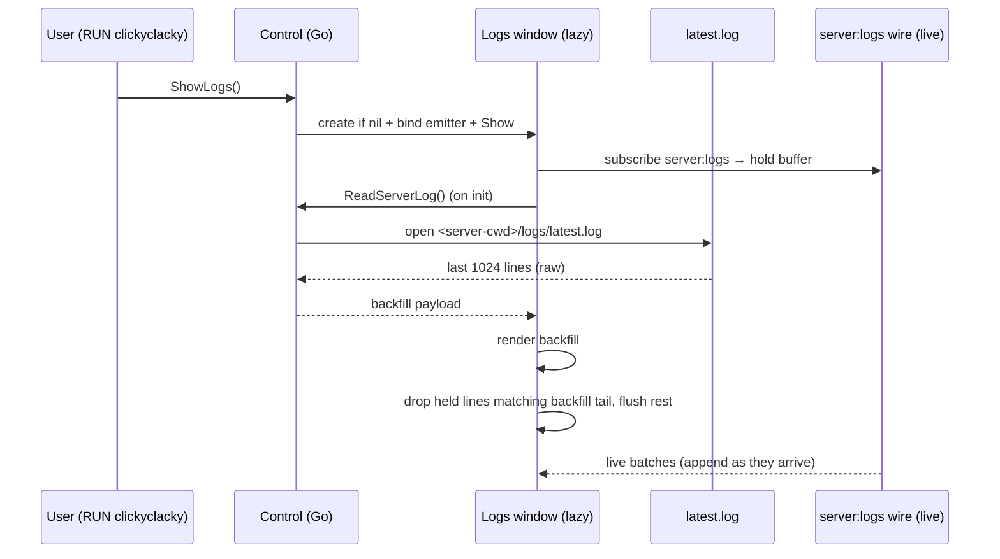

# 043 — Server logs: RUN-stage-only access + lazy on-demand backfill

**Date:** 2026-06-05
**Status:** Implemented (2026-06-05; Phase F live smoke pending)
**Related:** [[042-server-logs-console]] (the MC-only console + `server:logs` wire this builds on), [[010-run-addresses]] (the under-slot clickyclacky pattern to mirror), [[017-stage-bucket-honesty]] (Phase taxonomy — `PhasePlaying`), [[007-hig-ux-coherence]] (no global chrome, calm dial), [[040-lazy-directory-creation]] (lazy-not-eager principle).

## Background

[[042-server-logs-console]] narrowed the logs window to **MC server console only** and made it 100% wire-driven (`server:logs` batches), showing **raw monospace rows** (MC carries its own ts/level; frontend only substring-tints WARN/ERROR). Current wiring:

- **Global entry, always-on:** `<ambient-footer>` renders a `log` button (`frontend/src/ui/ambient-footer.ts`), no stage gating. Emits `ambient-action:"logs"` → `ritual-app.ts:557` → `showLogs()` → `Control.ShowLogs()` (`control.go:371`). The footer also has a `folder` button (out of scope — keep it).
- **Eager hidden window:** the logs window is created **at startup**, hidden (`cmd/gui/main.go:83`, `Hidden:true`, `/logs.html`), then `logEmitter.bind(logsWindow)` + `SetLogsWindow` at `main.go:117-118`. It exists for the whole app lifetime whether or not anyone ever opens it.
- **No backfill, no history.** `logsink` is a stateless filter→forward; the `batchingLogEmitter` ring (cap 1024) coalesces IPC and **drains on flush**. A window opened after the server booted shows a blank pane — the boot log is gone.
- **Server output → bus → wire:** `scanOutput` (`internal/core/stages/running/strategy.go:235`) publishes `ServerOutputInfo{Line}` per stdout/stderr line; logsink forwards the allowlist (`ServerOutputInfo` + `ServerCrashedInfo` + `ConsoleEchoInfo`) to the window.
- **MC writes its own file.** Server cwd = `filepath.Dir(scriptPath)` (`adapters/cmdbuilder.go:78`), where `scriptPath = <root>/server / settings.StartScript`. NeoForge/Paper write `<server-cwd>/logs/latest.log` (truncated/rotated to dated `.gz` **per server start**, so `latest.log` == the current run). Local-only, not committed.

## Problem

1. **Global logs access is dishonest chrome.** A `log` button in IDLE/PREP/FAILED opens an empty/stale console — clutter that violates the calm-dial principle ([[007]]). Logs only matter while a server is alive.
2. **No in-stage affordance.** RUN shows addresses but offers no in-place way to peek at the console.
3. **Blank-on-open + eager waste.** The window is pre-built for the whole session (eager) yet opens blank mid-run (no backfill) — worst of both: always allocated, never useful at the moment you need it.

## Goal

- Remove the **global** logs affordance.
- Add **one subtle RUN-stage clickyclacky** ([[010]] idiom) that opens the console — the *only* path to logs.
- Make logs **lazy**: no eager window; on open, do **one on-demand raw read** of MC's `latest.log` for backfill, then continue live. **No in-memory accumulation.**

## Design principle (user directive)

> No eager log windows. Logs are lazy. No memory wasted retaining lines. One lazy read on demand backfills the session; we don't parse — we read top-to-bottom and pass it through; then fill from the runtime live as we go.

Flow: **init window → request read → read `latest.log` → pass data → fill from runtime (live wire) as we go.**

## Questions & Answers

**Q1. Which phase exposes the open-logs affordance?**
A: `PhasePlaying` only — same gate as `<run-addresses>` (`ritual-app.ts:162`). Lives beside the addresses in the under-slot.

**Q2. Remove the whole footer or just the logs button?**
A: Just the `log` button. Keep `folder`. (Whether a lone-folder footer survives is a separate question — deferred.)

**Q3. Window lifecycle now that it's lazy?**
A: **Created on first open**, not at startup. On close → **hide** (cheap reuse), not destroy. Each open **re-reads** `latest.log` fresh (clear → backfill → live), so the window is always stateless w.r.t. prior opens. Zero windows until the first RUN-stage request.

**Q4. Backfill source — RESOLVED (user directive).**
A: **(B′) lazy on-demand single raw read of `<server-cwd>/logs/latest.log`.** No in-memory ring (rejected — memory waste), no MC-format parsing (read top-to-bottom, ship as-is; 042 already renders raw rows). `latest.log` rotates per server start ⇒ it *is* the current session ⇒ no `.gz` handling for the live case.

**Q5. Path resolution + missing file.**
A: Resolve at read time: `cwd = filepath.Dir(<root>/server / settings.StartScript)`, then `cwd/logs/latest.log` (`config.LogsDir`). If absent/unreadable (loader hasn't written yet, exotic script): return empty → console shows live-only, no error chrome. Backend owns resolution (frontend never sees a path).

**Q6. Large-file guard — RESOLVED.**
A: **Tail the same amount the console shows.** The UI retains `RING_CAPACITY = 1024` rows at the tail (`ritual-logs.ts:5`; `HARD_CEILING = 4096` only while scrolled up). Backfill reads the **last 1024 lines** of `latest.log` — reading more would just be trimmed on first paint. Share the constant (export it / mirror in Go) so backfill tail == live trim. Full file always remains on disk at `logs/latest.log`; no separate MB cap, no truncation marker (the tail == what'd be visible anyway). Implementation: read from EOF backward to 1024 newlines (or read-all then slice for simplicity — revisit only if files get pathological).

**Q7. The read↔live seam — RESOLVED (cross-reference).**
A: No tolerated seam — dedup is trivial and needs no parsing. File and live wire are the **same stdout**, so overlapping lines are **byte-identical strings**. Order: **subscribe→hold buffer → read file → render backfill → drop any held line whose exact text matches the backfill tail → flush the remainder → continue live.** Cross-reference = exact string compare over the small overlap window. No gap, no dup.

**Q8. Frontend read trigger — pull, not push.**
A: On window init, `<ritual-logs>` calls a new control method `ReadServerLog()` (returns the raw backfill payload), renders it, *then* subscribes live. Pull-on-demand keeps it memory-free and matches the user's "req read → read → pass data" flow.

## Design

### Part 1 — Remove global access
- Delete the `log` button + its branch from `ambient-footer.ts`; keep `folder`.
- `ritual-app.ts:557` handler: drop the `"logs"` case (folder-only).

### Part 2 — RUN-stage clickyclacky
- New `PhasePlaying`-gated affordance in the under-slot, beneath the address rows. Reuse the [[010]] row idiom: `role="button"`, `tabindex=0`, faint trailing console icon (`--text-faint` at rest), hover-lift + focus-ring + click micro-bounce. Click → `showLogs()` (no clipboard).
- Discrete element (e.g. `<run-console-link>`) so `<run-addresses>` keeps single responsibility; both mount in the `"addresses"` branch of `underSlotChild` (`ritual-app.ts:562`). Label decode-in on reveal (rune-decoder), consistent with addresses.

### Part 3 — Lazy window + on-demand backfill
- **3a Lazy window:** drop the eager `NewWithOptions(Hidden:true)` + `bind` + `SetLogsWindow` at startup. `ShowLogs()` lazily constructs the window via an injected factory on first call, binds the emitter, then `Show()/Focus()`; close→hide for reuse.
- **3b On-demand read:** new control `ReadServerLog() (payload, error)` resolves `<server-cwd>/logs/latest.log`, reads the **last `RING_CAPACITY` (1024) lines** raw (Q6), returns them as the backfill payload. Frontend calls it on `<ritual-logs>` init.
- **3c Live handoff (seamless, Q7):** `<ritual-logs>` **subscribes first** into a hold buffer, *then* calls `ReadServerLog()`, renders the backfill, **drops held lines whose exact text matches the backfill tail** (cross-reference, no parsing), flushes the remainder, and continues live. On re-open: clear → re-subscribe → re-read → cross-ref → live.

## Implementation Plan

- **Phase A — strip global:** remove footer `log` button + handler case; update `ambient-footer.stories.ts`; confirm no IDLE logs path (`grep`).
- **Phase B — RUN affordance:** `<run-console-link>` component + story + tests; wire into `PhasePlaying` under-slot; click → `showLogs()`.
- **Phase C — lazy window:** convert startup eager-create to a factory invoked on first `ShowLogs()`; bind emitter at creation; close→hide. Go test: no window before first call; window reused on second.
- **Phase D — on-demand read:** `ReadServerLog()` control + server-cwd/latest.log resolution + last-1024 tail; Go tests (resolve path from StartScript, missing-file→empty, tail count).
- **Phase E — frontend subscribe-first + backfill:** `<ritual-logs>` subscribes `server:logs` into a hold buffer → calls `ReadServerLog()` → renders → cross-references (drops held lines matching backfill tail) → flushes → live; clear-on-reopen; tests for seam (no gap/no dup) + no double-paint on reopen.
- **Phase F — smoke:** real running world; open mid-session → boot log present from the file, live tail continues; close + reopen → fresh re-read; stop server → affordance gone, an already-open window untouched; confirm app boots with **no** logs window allocated.

## Examples

✅ RUN, server playing → faint `▤ console` row under the addresses; click lazily builds the window, which reads `latest.log` once and shows boot-to-now, then tails live.
✅ App start / IDLE / FAILED → **no logs window exists** and no logs affordance anywhere; the dial is the only chrome.
❌ (today) startup pre-builds a hidden logs window that may never open.
❌ (today) IDLE shows a footer `log` button opening an empty pane; mid-session open is blank (boot log lost).

## Trade-offs

- **Gain: zero memory + zero eager allocation.** Nothing retained in RAM; no window until requested. Backfill is a transient read, GC'd after ship.
- **Gain: no MC-format coupling.** Raw passthrough — we never parse MC's line format; survives loader differences.
- **Lose: cross-restart console in-app.** Reading `latest.log` gives the *current* run only (MC rotates on start); older runs live in `logs/*.gz` + the [[042]] full-bus `<root>/logs/<ts>.log` for forensics. Accepted.
- **Seam: solved, not tolerated.** Subscribe-first + exact-text cross-reference against the backfill tail = no gap, no dup; cheap because both streams are the same byte-identical stdout.
- **Risk: depends on MC writing `latest.log`** at the resolved cwd. Graceful empty fallback if absent ⇒ degrades to live-only, never errors.
- **Cost: a per-open file read** (size-guarded). Bounded; only on explicit user action.

## Verification criteria

1. App boots with **no logs window allocated** (lazy); window appears only after the RUN clickyclacky.
2. No logs affordance in IDLE/PREP/FAILED/SAVING; only `PhasePlaying`. `grep` finds no global/footer path to `showLogs()`.
3. Opening mid-session shows the last 1024 lines from `latest.log`, then continues live with **no gap and no duplicate** at the seam.
4. Re-opening re-reads fresh (no stale duplication from a prior open).
5. Missing/unreadable `latest.log` ⇒ live-only console, no error UI.
6. Stopping the server removes the affordance but leaves an already-open window intact.

---

## Implementation Results (2026-06-05)

All phases shipped. **Backend** `go vet` clean, all `./internal/...` + `./cmd/...` tests pass. **Frontend** `tsc` clean, `web-test-runner` all green (142 tests), production build bundles `index.html` + `logs.html`.

### What landed
- **Phase A — strip global:** deleted `frontend/src/ui/ambient-footer.ts`; removed its mount + relay from `ritual-shell.ts`; removed `onAmbientAction` + `@ambient-action` wiring and the dead `openRootFolder` import from `ritual-app.ts`; cleaned the `@ambient-action` demo line from `dial-composition.stories.ts`.
- **Phase B — RUN affordance:** new `frontend/src/ui/run-console-link.ts` (`press`-emitting row mirroring `run-addresses`) + `.stories.ts` + `.test.ts` (4 tests); wired into the `PhasePlaying` under-slot via a `.run-cluster` (addresses + console link) with `onOpenConsole → showLogs()`.
- **Phase C — lazy window:** `ShowLogs` builds the window lazily on first call via `SetLogsWindowFactory` (cached, mutex-guarded); removed the eager startup window in `cmd/gui/main.go` (factory creates + close→hide hook + binds the console emitter). Tests in `internal/gui/control/logs_test.go`.
- **Phase D — on-demand read:** `ControlService.ReadServerLog()` + `SetConsoleReader`; reader in `cmd/gui/consolelog.go` resolves `<server-cwd>/logs/latest.log` (cwd = `filepath.Dir(serverPath/StartScript)`), tails last 1024 lines, missing-file→nil. Tests in `cmd/gui/consolelog_test.go` (5).
- **Phase E — subscribe-first + backfill:** `ritual-logs.ts` subscribes into a hold buffer, calls `readServerLog()`, renders backfill, drops the seam overlap (`seamOverlap`, exact text compare), flushes the remainder, then appends live. `readServerLog` binding added to `wails-api.ts`. `seamOverlap` unit tests added (5).

### Deviations from the design
1. **Constructor unchanged.** `NewControlService` kept its 6th `logs` param (still accepted, nil everywhere) rather than dropping it — avoided churning ~15 test call sites. The lazy factory is injected via `SetLogsWindowFactory`, not the constructor.
2. **Footer removed wholesale, not "keep folder".** The footer's *only* control was the `log` button; the `folder`/`openRootFolder` action was already dead (nothing emitted it). So the whole `ambient-footer` was deleted. The Go `OpenRootFolder` method + its `wails-api` binding are left intact for a future folder affordance ([[041-work-folder-selection]]).
3. **Re-open shows the already-live console (no per-open re-read).** Q3 envisioned a fresh re-read each open. In practice the window is created lazily once, then close→hide keeps it mounted and **subscribed**, so the live wire keeps it current in the background — backfill runs once on first open (`connectedCallback`), and re-open just `Show()`s an already-live console. Simpler, still never blank mid-run. Trade-off: a second server run in the same app launch accumulates in the same window (bounded by the 1024-row ring) rather than resetting — acceptable; the affordance is only reachable while playing.

### Pending
- **Phase F live smoke:** not run here (needs the real Wails GUI + a running MC world). To verify: (a) app boots with no logs window allocated; (b) lazy-window creation from the `ShowLogs` service call works on the Wails main thread (the one runtime risk — window creation mid-IPC); (c) backfill shows boot-to-now from `latest.log` then tails live with no seam dup; (d) Windows can read `latest.log` while MC holds it open (else degrades to live-only). Status stays "Implemented (Phase F pending)" until smoked.
