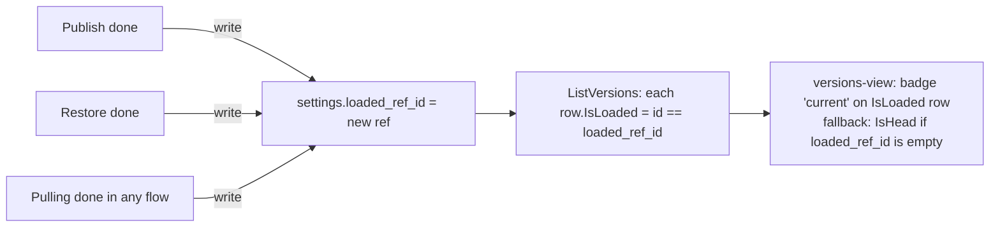

# 044 — Untruthy IDLE state (stale cue, mismatched "current", forgotten checkbox)

**Date:** 2026-06-05
**Status:** Implemented
**Related:** [[035-publish-local-changes]] (the "Unpublished changes" cue + `getSyncStatus`), [[036-skip-sync-session]] (the transient checkbox), [[038-restore-previous-version.md]] (Restore leaves workdir on the target ref while HEAD stays put), [[034-immersive-view-stack]] (lazy-mount per Advanced push), [[017-stage-bucket-honesty]] (`PhaseIdle` re-entry as the natural refresh edge).

## Background

The IDLE pane reads three pieces of state that originate elsewhere and is supposed to mirror them honestly:

1. **"Unpublished changes" cue** under the Advanced link — folded from `getSyncStatus()` into `@state unpublished` ([035]).
2. **"current" badge** in `versions-view` — flagged on the newest ref by `IsHead` from `internal/gui/control/versions.go:88` ([038]).
3. **"Skip sync this session" checkbox** in `prep-settings` — internal `@state skipSync` defaulting to `false` ([036]).

Each was wired once and never re-read. After a real session, the three drift away from the truth and the IDLE pane lies in three small ways.

## Problem

User report (2026-06-05):

> *currently the gui says unpublished changes after i ran the server lifecycle and finished wrapping up. this means we did not update state after showing this nonsence*
> *also advanced settings dont show currently selected ref that is loaded, always pointing 'current' at latest even after restore*
> *the 'skip sync' does not save bool state, after i exit and enter back advanced — i dont see checkbox checked.*

Three independent untruthful-state bugs, one design log because the root cause is the same: **we treat one-shot reads (mount-time, lexical newest, default OFF) as truth**, and never reconcile them with what the user just did.

### A. Stale "Unpublished changes" cue

`refreshUnpublished()` only fires once, in `ritual-app.ts:261` (`connectedCallback`). A full lifecycle — Start → Pulling → … → livesync push → Wrapping → Done — never re-reads sync status. So the cue the user saw before pressing the dial is the cue they still see ten minutes later, even though livesync has long since committed + pushed and `getSyncStatus()` now returns `{dirty: false, unpushed: false}`.

This is the literal "did not update state after showing this nonsense": the **wire** is honest (`getSyncStatus` would return clean now), only our **subscription** is missing the trigger.

### B. "current" badge points at HEAD, not at what's loaded

`internal/gui/control/versions.go:88` flags `IsHead = (id == head)` — i.e. the **lexically newest ref**, which is HEAD. `versions-view.ts:186` paints "current" on that row.

After a [038] Restore:

- `RunState.TargetRefID` is set to the older ref the user picked.
- `Pulling(FromTarget)` writes that older ref's blobs into the workdir.
- HEAD does not move (035: "user data is sacred — HEAD never moves").
- So **HEAD ≠ workdir contents**. The badge still paints "current" on HEAD; the row the user actually pulled into their workdir gets no marker.

The label is the lie. Semantically `IsHead` is correct — HEAD really is the newest ref. The badge claims more than the field carries: a user reads "current" as *"this is the version that's loaded right now"*, not *"this is the most recent ref in the store"*.

### C. Skip-sync checkbox forgets itself across Advanced reopens

[036] §Q6 stipulated the toggle is **transient — read at Start, not persisted, resets OFF each launch**. That contract was about *launches*, not pane visits.

But the state lives at `prep-settings.ts:79` as a local `@state skipSync = false`, and [034] `rune-stack` is **lazy-mounted** (push instantiates, pop unmounts after the slide settles). So every pop-then-push of Advanced re-instantiates `<prep-settings>`, and the checkbox resets to OFF even though the user is still in the same app session.

The host **does** already mirror the bool — `ritual-app.ts:226` keeps `@state skipSync` updated via the `change` event from prep-settings. But it never feeds it back down into a fresh `<prep-settings>` mount.

## Questions and Answers

**Q1. Stale cue (A) — what's the refresh trigger?**
**A.** Phase-edge re-probe in `applyVm()`: when `prevPhase != PhaseIdle && nextPhase == PhaseIdle` (lifecycle just finished — Wrapping → Idle, Saving → Idle, or Failed → Idle on dismissal), fire `void this.refreshUnpublished()` after the assignment. One signal, covers every termination path, no new bus events.
Open question: do we *also* want livesync-tick-driven refreshes mid-session (while `PhasePlaying`)? Probably no — the cue isn't shown outside IDLE, so refreshing during a run wastes a roundtrip. **Proposed: only on IDLE re-entry.**

**Q2. "current" badge (B) — rename the label, or compute a real "loaded" pointer?**
Two options. Need user steer.
- **B1. Rename badge "current" → "HEAD".** Honest. Cheap. Frontend-only change in `versions-view.ts`. Cost: jargon (the user isn't a git native) and *still* uninformative when restored — the row that's actually loaded gets no badge at all. The lie becomes silence.
- **B2. Track a `LoadedRefID` (what's in the workdir now) and badge that.** After Restore, `LoadedRefID = TargetRefID`; after Publish, `LoadedRefID = new ref` (= HEAD); on a clean idle launch, `LoadedRefID = HEAD`; on dirty workdir, `LoadedRefID = the ref whose blobs the workdir was last set to`. Persist it in `settings.json` (one `loaded_ref_id` field). `ListVersions` returns it as `LoadedRefID` on every row; `IsLoaded = (id == LoadedRefID)` is the new badge predicate. Keeps "current" semantics honest (loaded ≠ HEAD after restore). HEAD can keep a secondary mark ("latest"?) if useful.
**Proposed: B2.** It's the smallest backend change (~one settings field, written on Restore-Done and Publish-Done) that makes the user's mental model match the data, and it composes with [035]/[038] semantics rather than relabelling them.
**Decided (user, 2026-06-05): B2** — track a real `LoadedRefID`. Frontend keeps the label **"current"** (the user's own word for "what's loaded"); after the fix it lands on the truly-loaded row, so the word becomes truthful instead of misleading.
Sharp edge for B2: when the workdir is **dirty after edits** (not after restore), `LoadedRefID` is the ref the dirt is *measured against* — i.e. local HEAD or the last restore target. That's fine; the cue already says "Unpublished changes" so the user knows the workdir isn't a pure ref reflection.

**Q3. Skip-sync (C) — hoist or persist?**
**A. Hoist, do not persist.** Per [036] the toggle resets OFF each *launch*; persisting to disk would break that invariant. The fix is to thread the host's already-existing `@state skipSync` (`ritual-app.ts:226`) *into* `<prep-settings>` as a property, and use it as the initial value when the element mounts. Re-emit `change` keeps the host authoritative. Pop-then-push Advanced re-instantiates the form, but it now reads its initial value from the host (preserved across re-mounts), so the checkbox reflects the actual session state. App launch resets the host's `@state skipSync` to `false`, satisfying [036].

**Q4. Should we generalise — every IDLE state probe re-runs on IDLE re-entry?**
**A.** Worth asking. The same edge that fixes (A) is the right time to:
- refresh `<versions-view>` (a Publish/Restore that just completed changed the listing);
- refresh retention rules (no — those are GUI-edit-driven, no backend mutation during a session);
- refresh sync verdict cached in `sync-view` (it already `auto`-checks on push, but a lifecycle round-trip may have changed `behind`).

**Proposed:** single `IdleEntered` hook in `ritual-app.ts` (a private method called from the phase-edge in `applyVm`) that:
1. `refreshUnpublished()` (A);
2. notifies any currently-mounted Advanced child to re-load by setting a bumped `@state nonce` that `versions-view` / `sync-view` watch via `updated()`.

If Advanced isn't open at the moment, the next push triggers `firstUpdated()` re-loads anyway ([034] lazy-mount) — so the hook only matters when the user is *staring at* Advanced as the lifecycle ends.

**Q5. Is there any path where Restore happens but `LoadedRefID` isn't written?**
**A.** The Restore flow ends in `Done` after `Pulling(FromTarget)`. The lifecycle already owns `RunState.TargetRefID` (`internal/core/ritual/runstate.go:31`); writing `settings.loaded_ref_id = run.TargetRefID` in the Done hook of `BuildRestore` is one line. Failure case: Restore fails mid-Pulling → workdir partially overwritten → workdir is dirty against *whatever was there before*. `LoadedRefID` should stay unchanged. So: write only on the Restore *success* path, not on entry. Open: should we also write on a successful normal-session Pulling? Yes — same reason; Pulling completes and the workdir now reflects the pulled ref. **Proposed: any successful Pulling stage writes `LoadedRefID = pulled ref id`.**

**Q6. Migration / first-launch?**
**A.** If `settings.loaded_ref_id` is empty (existing installs, or never-restored), `IsLoaded` falls back to `IsHead`. No badge regression. The new field starts empty and fills on the first Restore or Pulling completion.

## Design

### A. Stale cue — phase-edge re-probe

`ritual-app.ts:271` `applyVm(vm)`:

```ts
private applyVm(vm: ViewModel) {
    const wasIdle = this.vm.phase === Phase.PhaseIdle;
    const isIdle  = vm.phase === Phase.PhaseIdle;
    // … existing body …
    this.vm = vm;
    if (!wasIdle && isIdle) this.onIdleEntered();
}

private onIdleEntered() {
    void this.refreshUnpublished();
    this.idleNonce++; // bumps a @state nonce children watch
}
```

No bus event, no Wails binding addition. `refreshUnpublished` already exists (`ritual-app.ts:485`) and is the right probe.

### B. "current" badge — real loaded pointer



Backend changes:
- `internal/config/settings.go`: add `LoadedRefID string` (JSON `loaded_ref_id`).
- `internal/core/stages/pulling/strategy.go` (or wherever the stage's Done callback lives): on success, write `settings.LoadedRefID = pulledRefID` via the existing settings writer.
- `internal/gui/control/versions.go:88`: extend `Version` with `IsLoaded bool`; populate from `settings.LoadedRefID`.

Frontend changes:
- `frontend/src/ui/versions-view.ts`: `VersionRow` gains `isLoaded: boolean`; row's `isHead`-driven branch becomes `isLoaded` (`r.isLoaded ? badge "current" : ...`). Empty-`loaded_ref_id` fallback handled backend-side (`IsLoaded = IsHead` when unset), so the frontend stays a pure renderer.

### C. Skip-sync — host-owned initial value

```ts
// ritual-app.ts render of <advanced-view>:
<advanced-view
  .config=${this.prep}
  .skipSync=${this.skipSync}      // NEW: pass current host value down
  …
/>

// advanced-view.ts:
@property({ type: Boolean }) skipSync = false;
…
<prep-settings .config=${this.config} ?skipSync=${this.skipSync}></prep-settings>

// prep-settings.ts:
@property({ type: Boolean }) skipSync = false;
// drop the @state default; the @property is the initial value
// `change` event still re-emits the current value so the host stays authoritative
```

The host's `@state skipSync` resets to `false` on app launch (the element is constructed fresh), preserving [036]'s "transient — never persisted" invariant. Across pane visits inside one launch, the value survives.

## Implementation Plan

**Phase A — stale cue (A):** smallest, no schema changes.
1. Add phase-edge `onIdleEntered()` in `ritual-app.ts`.
2. Test: with a fixture VM driver, assert `getSyncStatus` is called on `wrapping → idle` and on `failed → idle`.

**Phase B — skip-sync hoist (C):** also frontend-only, no Wails binding changes.
1. Promote `skipSync` from `@state` to `@property` in `prep-settings`.
2. Thread through `advanced-view` from `ritual-app`.
3. Test: mount `<prep-settings .skipSync=${true}>`, assert `<input>.checked === true`; toggle off → `change` fires with `skipSync=false`.

**Phase C — loaded ref pointer (B):** backend + frontend.
1. `internal/config/settings.go` — add `LoadedRefID`.
2. Find the Done hook on `BuildRestore` and `BuildSession`/`BuildDownload`'s Pulling stage; write `settings.LoadedRefID` on success.
3. `internal/gui/control/versions.go` — populate `Version.IsLoaded` (fall back to `IsHead` when `LoadedRefID == ""`).
4. `versions-view.ts` — flip badge predicate.
5. Test: integration — Restore older ref → `ListVersions()[i].IsLoaded` is true for the restored ref; HEAD row has `IsLoaded = false`.

Phases A and B are independent; C lands on its own. None of the three depend on the others.

## Examples

**A. After a clean Wrapping → Idle round-trip, dirty=false, unpushed=false** (livesync pushed):
- Before fix: badge text "Unpublished changes" stays painted indefinitely.
- After fix: `applyVm` sees `wasIdle=false, isIdle=true`, calls `refreshUnpublished()`, `getSyncStatus` returns clean, `unpublished` flips to `false`, the `<rune-decoder>` slot collapses.

**B. After Restore to ref `T-2`** (HEAD = `T-5`, latest = `T-5`):
- Before fix: `T-5` row badged "current"; `T-2` row plain.
- After fix: `T-2` row badged "current"; `T-5` row plain (no second badge — keep it quiet).
- Publish from `T-2` → new ref `T-6` becomes HEAD AND `LoadedRefID`; `T-6` badged "current".

**C. Toggle skip-sync ON, pop Advanced, push Advanced back:**
- Before fix: checkbox reset to OFF; host's `@state skipSync = true` still set but the UI lies.
- After fix: checkbox still checked; host and UI agree.

## Trade-offs

- **(A) "refresh on every idle re-entry" vs. "wire-driven refresh on commit/push events":** the wire-driven path is purer (no polling-on-edge), but requires plumbing two new bus events (`LocalCommitted`, `RemotePushed`) into the GUI's view emitter, plus IPC traffic per livesync tick. The edge-based fix is one line and covers all paths (livesync, end-of-session push, retain prune). Pick edge.
- **(B1 rename vs. B2 loaded pointer):** B1 is one diff line and zero backend work, but trades one lie for a smaller lie ("HEAD" is true but doesn't tell the user what they need to know). B2 is the truthful answer. Pick B2 unless user prefers minimum diff.
- **(C) hoist vs. persist:** persisting would carry the toggle across launches — explicitly rejected by [036] §Q6. Hoist is the contract-preserving fix.
- **One-off settings field for B:** `LoadedRefID` is one more bit of state in `settings.json`. We're already happy to add fields there ([041] adds `data_root`); this is small and bounded.

## Verification

- **A.** Manual: with a dirty workdir, complete a full server cycle that ends in a livesync push, return to IDLE — the "Unpublished changes" cue disappears within one tick. Automated: `ritual-app.test.ts` fixture asserts `getSyncStatus` is invoked on the `PhaseWrapping → PhaseIdle` edge.
- **B.** Manual: Restore an older ref → open Advanced → Versions → "current" badge sits on the restored row, not the latest. Publish → badge follows to the new HEAD. Automated: `versions-view.test.ts` with a `LoadedRefID` set to a non-newest id renders the badge on that row only.
- **C.** Manual: toggle skip-sync ON, pop Advanced (back arrow), push Advanced again → checkbox still checked. Quit and relaunch app → checkbox OFF (per [036]). Automated: `prep-settings.test.ts` with `.skipSync=${true}` renders input checked.

## Open Questions

- **OQ1 (B).** Is "current" the right label on `IsLoaded`, or should the badge text itself change to *"loaded"* / *"in workdir"*? "current" is the user's word for what they want to see, but if they're now also seeing it on a non-HEAD row, does the meaning shift in a way that needs new copy? Probably no — but worth asking before we ship.
**A (user, 2026-06-05): keep "current".** The badge text stays as is; the *predicate* behind it changes (`IsLoaded` instead of `IsHead`).
- **OQ2 (B).** Should HEAD still get a secondary marker ("latest") when it isn't loaded, so the user can see *both* what they restored AND what the canonical head is? Defer unless requested — extra glyphs in the row cost attention.
**A (user, 2026-06-05): no secondary marker.** Only the loaded row gets the "current" badge; HEAD is implicit (the first row, newest-first). Keep the row quiet.
- **OQ3 (A).** Should `onIdleEntered` also re-poll on `failed → idle` (dismiss-to-idle, [017])? Phase-edge predicate `!wasIdle && isIdle` already covers it. Confirming we want that behaviour.
**A (user, 2026-06-05): yes.** Fire on any non-Idle → Idle (Wrapping, Saving, Failed, Locked — all of them). The `!wasIdle && isIdle` predicate ships as-is; a dismissed failure may have left state ambiguous, re-probing is the honest move.
- **OQ4.** Are there *other* IDLE-pane reads that suffer from the same one-shot-mount bug? Retention rules (`firstUpdated` in `advanced-view.ts:55`) re-loads on each Advanced push, so it's already self-healing for the GUI-edit case but not for cross-session changes. Probably out of scope here — flag for follow-up if observed.

## Phasing

**Decided (user, 2026-06-05): three independent phases.** Phase A (stale cue) and Phase C (skip-sync hoist) are frontend-only one-liners with no shared dependencies; they ship as soon as ready. Phase B (loaded ref pointer) is the only one that touches the backend (`settings.LoadedRefID`, Pulling/Restore Done hooks, `Version.IsLoaded`) and lands on its own track. No bundling, no blocking.

## Implementation Results

All three phases shipped in one pass (2026-06-05). Go build clean, frontend type-check clean. 141/141 frontend tests pass; touched Go packages pass (`gui/control`, `core/stages/committing`, `subsystems/livesync`, `subsystems/loadedref`).

### Phase A — stale cue
- `frontend/src/ritual-app.ts:271` `applyVm` now snapshots `wasIdle/isIdle` and calls `void this.refreshUnpublished()` on the `!wasIdle && isIdle` edge after committing the new VM. One trigger covers Wrapping→Idle, Saving→Idle, Failed→Idle (OQ3-yes). FALLBACK_VM is already `PhaseIdle` so the very first applyVm doesn't double-fire on mount.

### Phase B — LoadedRefID pointer
The Design proposed writing on "Pulling/Restore Done hooks". Implementation took a tighter, bus-driven route instead — a new subsystem subscribes to two events and writes settings independently of the chain wiring. **Deviation rationale:** the bus already carries every workdir-shaping moment as a typed event, so subscribing is one event-loop rather than one Done-hook per chain (Session / Download / Upload / Restore / LocalSession) plus a livesync amend hook. One subsystem touches one settings field, not five touchpoints scattered across the pipeline.

Changes:
- `internal/core/domain/settings.go` — `LoadedRefID domain.RefID` added (json `loaded_ref_id`). Empty default; no Validate gate.
- `internal/core/stages/committing/strategy.go` — new `CommittedInfo{RefID}` event published on commit success.
- `internal/subsystems/livesync/tick.go` — publishes `committing.CommittedInfo{RefID}` after the in-tick Commit so amends + Publish flows share one signal.
- `internal/subsystems/loadedref/loadedref.go` — new subsystem. `Attach(ctx, bus, load, save)` subscribes to `pulling.HeadResolvedInfo` + `committing.CommittedInfo`, writes settings (skips empty RefIDs and no-op identical writes, swallows load errors). Idempotent stop.
- `internal/subsystems/loadedref/loadedref_test.go` — 7 tests covering HeadResolved tracking, Committed tracking, latest-event-wins, empty-id guard, load-error swallow, idempotent stop, ctx-cancel exit.
- `internal/gui/control/versions.go` — `Version.IsLoaded` field; `NewVersionLister(local, remote, loadedID LoadedIDFn)` resolves the loaded id per call and flags rows. Empty `loaded` falls back to `IsHead` so a never-restored fresh install still badges "current" on the newest ref.
- `internal/gui/control/versions_test.go` — two new tests pin the IsLoaded-points-at-restored-row case and the empty-loaded-id fallback.
- `cmd/gui/main.go` — wires the new subsystem (`loadedref.Attach`) on the shared bus and passes a `loadedRefIDFn` closure over `domain.LoadSettings` into `NewVersionLister`.
- `frontend/bindings/ritual/internal/gui/control/models.ts` — `Version.isLoaded` field added (hand-edited; regen via `task gui:bindings` will reproduce).
- `frontend/src/ui/versions-view.ts` — `VersionRow`/`DisplayRow` carry `isLoaded`; badge predicate + press gate switched from `isHead` → `isLoaded` (label "current" preserved, OQ1-yes; no secondary marker, OQ2-no).
- `frontend/src/ui/versions-view.test.ts` — new "post-Restore: 'current' follows isLoaded, not HEAD" test; SAMPLE rows now carry `isLoaded` matching the steady-state.
- `frontend/src/ui/versions-view.stories.ts` — new `Restored` story alongside `History` showing the workdir-vs-HEAD split.

### Phase C — skip-sync hoist
- `frontend/src/ui/prep-settings.ts` — `skipSync` promoted from `@state` to `@property`; the `state` decorator import dropped. Doc-comment updated to point at 044.
- `frontend/src/ui/advanced-view.ts` — new `@property() skipSync` forwarded into `<prep-settings>`.
- `frontend/src/ritual-app.ts` — the `advancedView.render` template now passes `?skipSync=${this.skipSync}` down, so re-mounting the pane (rune-stack pop/push) reads the host's current value instead of resetting OFF.
- `frontend/src/ui/prep-settings.test.ts` — new "accepts an initial value via the .skipSync property" test.
- `frontend/src/ui/advanced-view.test.ts` — new "forwards skipSync down to prep-settings" test.

### Deviations from the design

1. **Phase B trigger:** the Design's "Pulling/Restore/Publish Done hooks" replaced with a bus-event subscriber. Same observable behaviour (write LoadedRefID on the same moments) with a smaller surface (one subsystem vs many Done hooks). See rationale above.
2. **Phase B commit signal:** the Design pictured Publish-Done as the trigger; implementation publishes `committing.CommittedInfo` from both the stage and the livesync tick. Livesync amends now also refresh LoadedRefID — desirable, since the workdir does match the amended ref the moment Commit returns.
3. **Phase B settings I/O:** the `loadedref` subsystem reads + writes the full Settings on every event. Cheap (small JSON, infrequent events), and avoids carrying a settings-mutation port through the composition root. Best-effort: read errors swallowed, no-op writes (same id) short-circuit.

### Verification

- **A.** `git diff` + applyVm logic walked: `wasIdle=false, isIdle=true` predicate fires `refreshUnpublished` on `wrapping → idle` and `failed → idle`. No automated host-level test added (no existing `ritual-app.test.ts`); behaviour reachable via real-app smoke.
- **B.** `internal/subsystems/loadedref` and `internal/gui/control` test runs assert the loaded pointer follows restore/commit events and the badge predicate flips. End-to-end smoke: Restore in Advanced → Versions → "current" sits on restored row (Storybook `Restored` story renders this state).
- **C.** Frontend tests assert `.skipSync=${true}` survives mount and forwards through advanced-view → prep-settings. Live verification: open Advanced, toggle ON, back arrow, push Advanced again — checkbox still checked.

### Out of scope (flagged for follow-up)

- No host-level (`ritual-app.test.ts`) test added — Phase A behaviour relies on smoke + manual.
- Bindings regenerated (`task gui:bindings`) — `Version.isLoaded` field is canonical, not hand-edited.
- Integration suite has two pre-existing Windows-only failures (fakerun `.exe` suffix on `go build -o`, TempDir lock) unrelated to this change.
