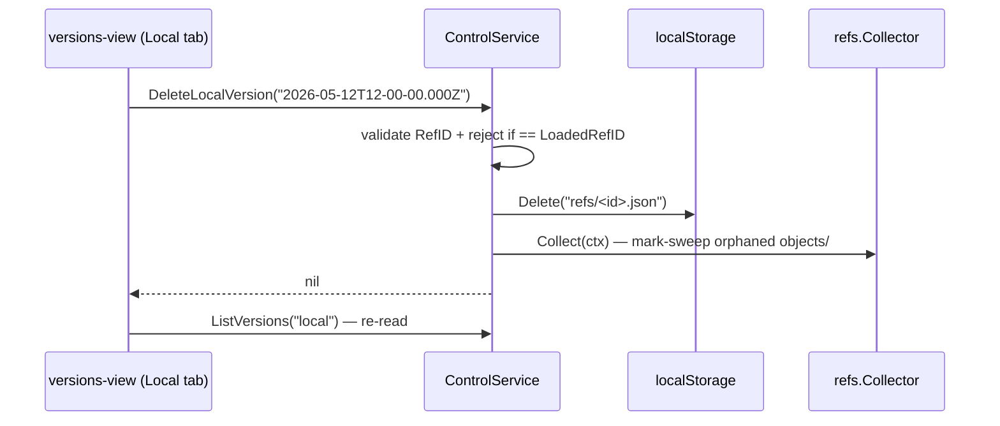

# 045 — Versions & retention ops (delete, tabs, revert, apply-now, total-on-disk)

**Date:** 2026-06-05
**Status:** Implemented
**Related:** [[038-restore-previous-version]] (`ListVersions`, `Restore`, `BuildRestore`), [[039-retention-control-plane]] (Get/Set retention, scope-driven `NewRefsRetention`), [[035-publish-local-changes]] (dirty || unpushed semantics, Publish flow), [[033-retention-ui]] (Borg-style picker), [[044-untruthy-idle-state]] (`LoadedRefID`, `IsLoaded` badge), [[031-bidirectional-sync]] (Download/Upload pipeline + chains), [[034-immersive-view-stack]] (lazy-mounted Advanced panes).

## Background

Versions, Sync, and Retention all live in Advanced today and share one truth: the local refs/ + objects/ store, and the remote mirror of it. Each surface was shipped lean and exposes only the smallest action that earned the design log it came from. Five gaps surfaced together in real use:

1. **No way to delete a local version.** `ListVersions("local")` enumerates them; `Restore` selects one; there's no `Delete`.
2. **Local vs remote are folded into one list.** `ListVersions("remote")` is the only call the frontend wires ([038] §Q2: degrade to local on remote failure); the user can't see the local-only cache as a first-class store.
3. **From the Sync pane you can Publish dirty workdir but not throw it away.** When workdir ≠ HEAD the only forward action is "Publish"; if the user wanted to *discard* the dirt and snap back to HEAD there is no affordance.
4. **Retention rules are persisted on every keystroke and applied only at sync time.** `<retention-rules>` fires `change` on every stepper tap → `SetRetentionRules` writes settings.json. The actual prune runs as a Retaining stage during sync flows. There is no "do this now" button, and there is no staging window before the rules are saved.
5. **Per-version sizes mislead about disk usage.** Each row shows logical bytes (Σ Object.Size). Three 1.2 GB versions sharing 99% of their blobs read as "3.6 GB" but consume ~1.25 GB on disk. The honest number (Σ unique object file sizes under `objects/`) is nowhere in the UI.

## Problem

User report (2026-06-05):

> *we need to:
> 1. add option to delete local version
> 2. intro separate tab for remote versions
> 3. in sync section when we can publish we need ot have option to restore to commited version
> 4. retention needs 'apply' button that saves settings and applies retention
> and also we need to show total size of everything we have in versions locally like totaltotal, coz 3 versions != 3.6gb even tho single vesion = 1.2gb, diff is small AF*

Five orthogonal asks; one design log because they all live under Advanced and share the local store as the source of truth. Each maps to one isolable change; none blocks another.

## Questions and Answers

**Q1. Delete local version — does it also delete the ref's orphan blobs?**
**A.** Yes, in one call. Deleting `refs/<id>.json` alone leaks every blob no other ref pins. The control method runs **Delete(refs/<id>.json) → refs.Collector.Collect(localStorage)** (the same GC the Retaining stage uses, [[039]] §Build). One round-trip from the user's perspective.

**Q2. Can the user delete the currently-loaded ref (`IsLoaded == true`)?**
**Decided (user, 2026-06-05): yes — allow deletion on every row, including the loaded one and HEAD.** The user owns their store; the UI's job is to be honest about consequences, not to gate. The delete confirm spells the sharp edge out so it's an informed choice:
- Loaded row + HEAD (the common case): *"This is your current version. Deleting it doesn't touch your workdir, but the local store loses the ref it was anchored to — you'll need to Publish or Download to get a clean reference state again."*
- Loaded row + not HEAD (post-Restore): *"You're currently on this older version. Deleting it doesn't touch your workdir, but you'll lose the anchor and the workdir will read as dirty. Publish or Download to recover."*
- Plain non-loaded row: *"This only deletes the local copy. The remote keeps it; Download will bring it back if you change your mind."*
Backend invariant: when the deleted id equals `settings.LoadedRefID`, the delete handler clears the field so the lister falls back to `IsHead` (per [[044]]) — the "current" badge degrades silently to the newest ref instead of pointing at a deleted ghost.

**Q3. Can the user delete the **only** local ref?**
**A.** Yes — but the local store is then `pulling.ErrNoHead`, which means the next sync flow treats local as a fresh install (full download from remote, full re-apply). This is the same shape as a fresh checkout, no special handling.
Confirm with copy in the delete confirm: *"This is your last local copy. Deleting it means the next Download has to fetch everything again."* — only when `len(localRefs) == 1`.

**Q4. Separate tabs for local/remote — `rune-segmented` at the top of `versions-view`?**
**A.** Yes. Same primitive as `<retention-rules>` ([[033]] §Redesign), same `Local · Remote` labels ([[039]]). Selecting a tab re-runs `listVersions(scope)`; the listing inside the tab is otherwise unchanged. Remote scope hides the per-row Delete affordance (the canonical history shouldn't be edited from the GUI — at least not in v1).
**Decided (user, 2026-06-05): always default to Local; do not persist tab.** New affordances (Delete, total-on-disk) live on Local; one tap to Remote when needed.

**Q5. Sync section "revert to committed" — when does it appear, what exactly does it do?**
**Decided (user, 2026-06-05): appears whenever publishable (`dirty || unpushed`), not dirty-only.** The action is always defined as **"snap workdir → local HEAD"** via a new `BuildRevert` chain (`Checking → Pulling(FromHead(localHeadResolver)) → Done`). HEAD never moves; remote is untouched.
- `dirty && !unpushed`: drops uncommitted edits → workdir = HEAD; cue clears.
- `dirty && unpushed`: drops uncommitted edits; the unpushed commit stays (user wanted it committed, just not pushed); cue stays as "Unpublished changes" because there's still local work to publish.
- `!dirty && unpushed`: workdir already matches HEAD → observable no-op (re-applies HEAD's blobs to workdir, no file changes). Honest but visibly does nothing; tolerable per user direction. The button is still useful as a "refresh from last commit" gesture.
Naming: **"Revert to last saved"**. Confirm body adapts to state:
- dirty present: *"Throw away your unsaved changes and bring back the last saved version. Nothing on the remote changes."*
- unpushed-only: *"Re-apply the last saved version to your workdir. Nothing changes — there's nothing to throw away."* (we still show the button per the user's spec, but we tell the truth in the confirm).
Secondary, tinted; Publish stays primary.

**Q6. Retention Apply — does the button save AND prune, or just prune?**
**A.** Both. Two phasing options:
- **Q6a. Save-on-edit + Apply-prunes-now (additive).** Keeps the current "saves immediately on stepper tap" behaviour ([[039]]); Apply only triggers the prune. Lowest friction; rules stay live for the next sync even without pressing Apply. Trade-off: edits silently change the policy without explicit confirmation.
- **Q6b. Stage edits + Apply-saves-and-prunes (replacement).** Steppers mutate local component state only; Apply persists to settings.json AND runs the prune. Cancel/Discard reverts to last-saved. Trade-off: more obvious commit moment, but breaks [[039]]'s "no restart" invariant if the user edits and never presses Apply (next sync will use stale rules from disk — same as today actually, so net-neutral).
**Decided (user, 2026-06-05): Q6b — staged edits.** Steppers mutate local component state; an Apply bar appears when there are pending edits with `Apply` (primary) + `Discard` (tinted). Apply persists settings AND publishes `ApplyRetentionRequested`. Discard reverts to last-saved.

**Q7. What does the "prune now" path look like backend-side?**
**A.** Two routes:
- **Q7a.** Publish an `ApplyRetentionRequested` command on the bus; the lifecycle routes it to a new chain `BuildRetentionRun` = `Checking → Retaining(local) → Done`. Reuses the existing `lifecycle.Entries` machinery, animates on the dial like Download/Restore (gray ring with "Pruning…" caption), unlocked + lockless. Inherits all the FAILED/dismiss plumbing for free.
- **Q7b.** A direct synchronous call from `ControlService.ApplyRetentionNow()` that runs the local retention jobs (`retention.Build` returns `localRets`; we'd hold a closure over those) and returns when done. No dial animation, no lifecycle entry — runs in the GUI service goroutine.
**Proposed: Q7a.** Consistency with Download/Restore/Upload (every long-ish operation is a chain), the dial already animates "doing something" via `PhasePreflight`-style gray ring, and a prune that touches the remote (we should probably allow remote too, see Q8) needs the lifecycle's reject-while-running gate.
Sharp edge: a prune that runs while the server is `PhasePlaying` is fine for refs (server doesn't touch refs/) but the lifecycle still rejects it (no flow during Running). Acceptable v1 — user must stop the server to prune. Document as a known limitation.

**Q8. Apply runs local-only or also remote?**
**A.** Both, in one beat. The Retention section in `<retention-rules>` edits both sides via the scope switch ([[033]] §Redesign); Apply persists both and prunes both. `BuildRetentionRun` becomes `Checking → Retaining(local) → Retaining(remote) → Done`. Remote prune may need the remote lock (it deletes refs/ keys); acquire briefly, like Upload does ([[031]] §Q-arch). If remote is offline, the prune partially succeeds (local done, remote failed → PhaseFailed with attribution); user retries when back online.
Alternative: scope-aware Apply (one Apply button per scope). Rejected: the user picked a `<rune-segmented>` to flip between sides; one Apply commits both is the simpler mental model.

**Q9. Total-on-disk — what exactly do we measure?**
**A.** Sum of file sizes under local `objects/` (the content-addressed blob store). That is the honest "what does this take on my SSD" number. Refs/ adds a few KB per version (negligible) and we ignore it. Implementation: a new control method `GetLocalStorageStats() {bytesOnDisk: int64, objectCount: int}` that walks `<root>/local/objects/` via the existing FS adapter's `List("objects/")` then `os.Stat` per key. Cache for 5s to avoid hammering disk on rapid pane visits.
Display: in the Local tab header, above the rows: *"3 versions · 1.25 GB on disk"* with a quiet tooltip-style note (`<rune-decoder>` line) when the dedup difference is dramatic (`Σ row.sizeBytes > 1.5 × bytesOnDisk`): *"Shared content keeps disk use small."* Suppressed on the Remote tab — that's a count, not a measure of *our* disk.
Open: do we also compute a `bytesOnDisk` for remote? **Proposed: no.** R2 List+Stat per blob is real money on a large store; the user can't act on the number; defer until asked.

**Q10. Does deleting a local version need any cross-store coordination?**
**A.** No. Local refs/ are a cache of canonical-on-remote refs ([[031]] semantics). Dropping a local cache copy doesn't touch the remote; the next Download will re-fetch it if it's still upstream (it is, unless the user later prunes remote). Make this explicit in the delete confirm: *"This only deletes the local copy. The remote keeps it; Download will bring it back if you change your mind."* — exempts the user from feeling they're destroying canonical state.

**Q11. Should Delete and Apply each get their own dial-stage flows, or stay quiet ops?**
**A.** Apply gets a dial beat (Q7a). Delete stays quiet — it's local, fast (one refs/ delete + one GC sweep), and the affordance is row-scoped. Pattern: row-press → inline two-step confirm → on confirm, call `DeleteLocalVersion(id)` → reload the tab. No dial takeover. Mirrors how Restore reveals an inline confirm but, unlike Restore, Delete *does not* animate the root dial (Restore is a Pulling beat that takes seconds; Delete is local-only milliseconds).

**Q12. Failure UX for Apply / Delete?**
**A.** Apply: routes through `PhaseFailed` (Q7a), dismiss-to-idle ([[017]]). Delete: inline error caption on the row ("Couldn't delete this version") + a Retry button; no dial takeover. Both surfaces match existing patterns ([[038]] Restore failures, [[031]] Upload failures).

## Design

### A. DeleteLocalVersion



Backend:
- `internal/gui/control/versions.go` (or new `delete.go`): `func (c *ControlService) DeleteLocalVersion(refID string) error` — validates id, refuses if `refID == settings.LoadedRefID`, calls injected `LocalDeleter`.
- `internal/gui/control/versions.go`: `type LocalDeleter func(ctx context.Context, id domain.RefID) error` — composition root wraps `localStorage.Delete("refs/" + id + ".json")` then `refs.NewCollector(localStorage).Collect(ctx)`.
- `cmd/gui/main.go`: wire the deleter closure into `NewControlService`.

Frontend:
- `versions-view.ts`: in Local tab, each non-loaded row gets a small `×` trailing affordance (inline icon, not a button column). Press → row collapses to a two-step confirm: *"Delete this saved version? The remote keeps it."* Confirm → calls `deleteLocalVersion(id)` → on success, re-loads listing. Mirrors the Restore confirm pattern already in `#renderConfirm`.

### B. Local · Remote tabs

```ts
// versions-view.ts (sketch)
@state() private _scope: "local" | "remote" = "local";

render() {
  return html`
    <rune-segmented
      .options=${[{value:"local",label:"Local"},{value:"remote",label:"Remote"}]}
      value=${this._scope}
      label="Scope"
      @change=${this.#onScope}
    ></rune-segmented>
    ${this._scope === "local" ? this.#renderLocal() : this.#renderRemote()}
  `;
}
```

- Both tabs render the same row list; the **Local tab** adds the Delete affordance + the total-on-disk header (E).
- Tab switch re-runs the listing with the chosen scope (no shared cache — small lists, fresh truth).
- Host stops hard-wiring `listVersions("remote")` ([[038]] §Q2 degrade-to-local stays in the lister for the local-tab offline case — actually the local tab queries local directly and degrade-to-local becomes a no-op).

### C. Revert to last saved (Sync pane)

```ts
// sync-view.ts (sketch, dirty branch)
if (verdict.ahead && verdict.dirty) {
  return html`
    <rune-button variant="primary" @press=${this.#ask("upload")}>Publish</rune-button>
    <rune-button variant="tinted" @press=${this.#ask("revert")}>Revert to last saved</rune-button>
  `;
}
```

Backend: new command `RevertRequested{}` published by `ControlService.Revert()`. The lifecycle routes to a new chain `BuildRevert` = `Checking → Pulling(FromLocalHead) → Done`. Reuses the existing target-pinned resolver ([[038]]): the target is local HEAD (resolved at chain entry via `localHeadResolver`).

Critically, this is **distinct from Restore**: Restore picks an *older* ref, Revert always picks current local HEAD. Same beat, same dial animation, but the Sync pane's secondary button doesn't need to know it's a Restore — only that it's a "discard dirt" action.

Alternative explored & rejected: have Sync pane call `Restore(localHEAD)` directly. Rejected because the Restore confirm copy ("Bring back the world from <date>") is wrong for "discard your unsaved changes" — different user intent, different copy, different chain entry.

### D. Retention Apply (stage edits + prune-now)

```ts
// retention-rules.ts behavior change
@state() private _draft: { local: Rules; remote: Rules } | null = null; // null = no pending edits

#onTier(...) {
  // Mutate _draft instead of dispatching `change` immediately
  this._draft = { ...currentEffective(), [...]: newValue };
}

render() {
  // ... segmented switch, rule rows ...
  ${this._draft ? html`
    <div class="apply-bar">
      <rune-button variant="tinted" @press=${this.#discard}>Discard</rune-button>
      <rune-button variant="primary" @press=${this.#apply}>Apply</rune-button>
    </div>
  ` : nothing}
}

#apply = () => {
  this.dispatchEvent(new CustomEvent("apply", { detail: this._draft, ... }));
  this._draft = null;
};
```

Host (`advanced-view` → `ritual-app`):
- `apply` event handler calls `setRetentionRules(...)` (persist) **then** publishes `applyRetentionNow()` (run the prune chain). Both Wails calls.
- The dial animates on the prune chain via existing `onView` stream (a new `FlowRetentionApply` lifecycle entry).

Backend:
- `internal/gui/control/retention.go`: new `func (c *ControlService) ApplyRetentionNow()` publishes `ritual.ApplyRetentionRequested{}`.
- `internal/core/ritual/commands.go`: new `ApplyRetentionRequested{}` command.
- `internal/subsystems/pipeline/pipeline.go`: new `BuildRetentionRun(deps)` = `checking.New → retaining.New(localRets) → retaining.New(remoteRets) → done`. Reuses `LocalRetentions` + `RemoteRetentions` from `pipelineDeps`.
- `internal/subsystems/lifecycle/lifecycle.go`: new `Entries.RetentionRun` slot; `ApplyRetentionRequested` routes to it. Reject if Running (existing gate).
- Projection: new label "Pruning…" on the gray ring; reuse PhasePreflight visual or add a dedicated `PhaseRetaining`. **Proposed: reuse `PhasePreflight`** (autoupdate's gray-inert-busy) — same "system working, hands off" semantic; saves a phase constant.

### E. Total-on-disk

```mermaid
flowchart LR
  UI[Local tab header] -- GetLocalStorageStats --> Svc
  Svc -- once / 5s cache --> WalkObjects[FS.List+Stat objects/*]
  WalkObjects --> Sum[Σ file size]
  Sum --> Stats[{bytesOnDisk, objectCount}]
  Stats --> UI
```

Backend:
- `internal/gui/control/stats.go` (new): `LocalStorageStats {BytesOnDisk int64, ObjectCount int}` + `func (c *ControlService) GetLocalStorageStats() LocalStorageStats`.
- Injected `StorageStatFn func(ctx, prefix) (bytes int64, count int, err error)`. Composition root supplies a closure over the local FS root that walks `objects/` via `os.Root` (sandbox-respecting). Sync map for the 5s cache (mu + lastAt + lastVal).

Frontend:
- `versions-view.ts` Local-tab header:
```
3 versions · 1.25 GB on disk
Shared content keeps disk use small.        ← shown only when sumLogical > 1.5 × bytesOnDisk
```
- Decoder-style render to match the rest of Versions ([[009]] copy register).

## Implementation Plan

**Phase A — Tabs (B)** — frontend-only refactor; smallest. Adds `rune-segmented` to `versions-view`, host stops hard-pinning `"remote"`.

**Phase B — Total-on-disk (E)** — backend `GetLocalStorageStats` + frontend header line. Independent.

**Phase C — Delete local version (A)** — backend `DeleteLocalVersion` + GC; frontend Delete affordance + confirm. Depends on A (the affordance only renders on Local tab).

**Phase D — Revert to last saved (C)** — new `RevertRequested` + `BuildRevert` chain backend; new sync-view button. Independent.

**Phase E — Retention Apply (D)** — new `ApplyRetentionRequested` + `BuildRetentionRun` chain; staged-edits rework of `<retention-rules>`. Independent of A–D.

A and E are the most contained — ship first. C and D have backend lifecycle wiring — ship in their own commits.

## Examples

**Delete (A):**
1. Open Advanced → Versions → Local tab. Three rows; first is loaded.
2. Press the `×` on row 3 (oldest). Row collapses to confirm: *"Delete this saved version? The remote keeps it. Download will bring it back if you change your mind."*
3. Confirm. Row vanishes; header recomputes to *"2 versions · 800 MB on disk"*.

**Tabs (B):**
- Local tab: same 3 rows the lister returns from local refs/.
- Remote tab: 7 rows (remote has older history we've pruned locally). Delete affordance hidden.

**Revert (C):**
1. Workdir dirty after a skip-sync session. Sync pane shows *"You have local changes to publish."* + **Publish** (primary) + **Revert to last saved** (tinted).
2. Press Revert. Inline confirm: *"Throw away your unsaved changes and bring back the last saved version. Nothing on the remote changes."*
3. Confirm. Dial animates the Pulling beat; workdir restored to HEAD; sync pane re-checks → *"Everything's up to date."*

**Apply (D):**
1. Open Advanced → Retention. Rules show current saved policy.
2. Tap stepper twice (keep_last 2 → 4). Apply bar slides in at bottom: **Discard** + **Apply**.
3. Press Apply. Dial flips to gray "Pruning…" for ~1s. Returns to IDLE. Settings persisted; orphan blobs reaped.

**Total-on-disk (E):**
- 3 local versions, each `~1.2 GB` logical, sharing 99% of blobs:
  - Header: *"3 versions · 1.25 GB on disk"* + *"Shared content keeps disk use small."*
- Single fresh version, no dedup:
  - Header: *"1 version · 1.2 GB on disk"* (no dedup note — only one ref, nothing to share).

## Trade-offs

- **Apply auto-save vs staged (Q6a vs Q6b):** chose staged (Q6b). Loses the "tweak and forget" ergonomic, gains an explicit commit moment and the chance to discard. Easy to flip back if it tests poorly.
- **Delete dial-takeover vs quiet (Q11):** quiet for delete (sub-second op), takeover for apply (multi-second over remote). Pattern split is honest, costs a small inconsistency.
- **Per-tab Apply vs one (Q8):** one Apply for both scopes. Mental model: the section edits a policy pair; Apply commits the pair. Per-tab Apply would force the user to switch tabs to apply remote rules, which is worse.
- **Remote on-disk stat (Q9):** skipped. R2 List+Stat per blob is a measurable cost on a large store and the user can't act on the number. Add only if asked.
- **`PhasePreflight` reuse for prune (D):** saves a phase constant; small risk that overloading the gray ring across two semantics (autoupdate vs prune) confuses users who see both in one session. Caption disambiguates.

## Verification

- **A. Delete:** automated — `versions_test.go` adds tests for valid delete (refs/ key gone, orphan collected), loaded-ref rejection, malformed-id rejection. Manual — Local tab delete + listing re-reads correctly.
- **B. Tabs:** automated — `versions-view.test.ts` asserts tab switch re-runs the lister with the new scope; Remote tab hides Delete + total-on-disk header. Manual — both tabs render real data; switching is instant.
- **C. Delete + Tabs together:** Storybook — `versions-view.stories.ts` gets a `LocalWithDelete` story showing the affordance + confirm + post-delete re-read.
- **D. Revert:** integration — `BuildRevert` chain wires Pulling(FromLocalHead) → Done; manual — dirty workdir + Revert → workdir clean, no remote changes. `sync-view.test.ts` asserts Revert button appears iff `verdict.dirty`.
- **E. Apply:** integration — `ApplyRetentionRequested` routes through `BuildRetentionRun`; both retentions execute. Frontend — `retention-rules.test.ts` covers staged-edit state, Discard reset, Apply event fires `{local, remote}` payload.
- **F. Total-on-disk:** `stats_test.go` — fake FS with known blob sizes + count; cache TTL respected. Frontend — header rendered with correct units; dedup hint shows iff ratio > 1.5×.

## Open Questions

- **OQ1. Should the Local-tab Delete also be available on the loaded row** as a "delete and pull HEAD into workdir" combo? Probably no — that's two flows in one button. The user can Revert to HEAD first, then Delete.
- **OQ2. Apply that fails mid-prune (local succeeded, remote failed)** — should the dial show "Pruned local; couldn't prune remote" attribution? `PhaseFailed` only carries one noun today ([[017]]). Defer; ship with the existing collapse to "Couldn't finish the run" and a retry path via Apply again.
- **OQ3. Total-on-disk cache (E)** — 5s feels right for pane visits. Should it invalidate on Delete/Apply success? Cheap to add; **proposed yes**. The number being immediately fresh after the user's own action is worth one extra walk.
- **OQ4. Tab persistence (Q4)** — confirm "no" before shipping. If the user opens Versions five times in a row they always land on Local; if they want Remote they tap one switch. Tolerable.
- **OQ5. Does Revert need its own confirm body (vs reusing Restore copy with substitutions)?** They're distinct enough — Restore confirm names a date, Revert confirm doesn't (it's always "the last saved version"). **Proposed: distinct copy, distinct confirm.** Cheap, clearer.
- **OQ6. Pre-shipping: does the Apply staged-edit model break any current users who expected the auto-save behaviour to persist?** Auto-save is undocumented; the visible difference is "now there's an Apply button." Probably nobody noticed it auto-saved. Flag for the announce post if we have one.

## Implementation Results

All six phases shipped in one pass (2026-06-05). Go build clean, frontend `tsc --noEmit` clean. **164/164 frontend tests pass**; touched Go packages all green (`gui/control`, `subsystems/pipeline`, `subsystems/lifecycle`, `core/ritual`, `core/refs`, `subsystems/loadedref`). Bindings regenerated via `task gui:bindings`.

### Phase A — Commands + chains + lifecycle
- `internal/core/ritual/commands.go` — added `RevertRequested{}` and `ApplyRetentionRequested{}`.
- `internal/core/ritual/events.go` — added `FlowRevert` and `FlowRetentionApply` to the `Flow` const block (the projection emits these via `FlowStartedInfo` so the dial caption can disambiguate — kept the gray Preflight visual for `FlowRetentionApply` per §D).
- `internal/subsystems/pipeline/pipeline.go` — added `BuildRevert(d Deps)` (`Checking → Pulling(FromHead(LocalHeadResolver)) → Done`, no retention; reuses the existing `pulling.New` HEAD-pinned strategy with the *local* head resolver) and `BuildRetentionApply(d Deps)` (`Checking → Retaining(local) → Retaining(remote) → Done`, reusing `d.LocalRetentions` + `d.RemoteRetentions` so the Apply path runs the *same* Jobs as the sync flows — rules read fresh at Select time per [[039]] §Q1).
- `internal/subsystems/lifecycle/lifecycle.go` — `Entries` struct gained `Revert` + `RetentionApply` slots; the bus switch now routes the two new commands to them via `startWith`. Existing reject-while-Running gate covers them for free.

### Phase B — Control surface
- `internal/gui/control/versions_delete.go` — new file. `DeleteLocalVersion(refID string) error` validates id, calls the injected `LocalDeleter`, clears `settings.LoadedRefID` via the injected `SettingsClearer` when the deleted id matches the loaded one, and invalidates the stats cache.
- `internal/gui/control/stats.go` — new file. `LocalStorageStats {BytesOnDisk, ObjectCount}` model + `GetLocalStorageStats()` method with a 5s `statsCache` (mu-guarded). `invalidateStats()` is called by both `DeleteLocalVersion` (success path) and `ApplyRetentionNow`.
- `internal/gui/control/control.go` — `ControlService` struct extended with `localDeleter`/`loadedRefID`/`clearLoadedRefID`/`statsFn`/`stats` fields. Added `Revert()` (publishes `ritual.RevertRequested{}`) and `ApplyRetentionNow()` (invalidates stats, publishes `ritual.ApplyRetentionRequested{}`). New setters `SetVersionDeleter` + `SetLocalStatsFn` kept the positional `NewControlService` signature stable (deviation from the design's "constructor arg" — extending it would have churned every test call site).
- `cmd/gui/main.go` — composition root:
  - `localCollector := refs.NewCollector(localStorage)` + a closure that does `localStorage.Delete("refs/<id>.json")` then `localCollector.Collect(ctx)`.
  - `clearLoadedRefID` closure loads settings, clears `LoadedRefID`, saves.
  - `localStatsFn` closure calls a new `walkLocalPrefix(workRoot, prefix)` helper (shallow `Readdir` on the os.Root sandbox, sums file sizes) — `objects/` is flat so no recursion needed.
  - `entries` now carries `Revert: pipeline.BuildRevert(pipelineDeps)` and `RetentionApply: pipeline.BuildRetentionApply(pipelineDeps)`.
  - `controlSvc.SetVersionDeleter(...)` + `controlSvc.SetLocalStatsFn(...)` after `NewControlService`.
  - `guiRuntime` extended with the four new closures so the runtime↔control wiring is one place.

### Phase C — Wails bindings + wails-api
- Ran `task gui:bindings` — `frontend/bindings/ritual/internal/gui/control/controlservice.ts` and `models.ts` regenerated cleanly with the four new exports + the `LocalStorageStats` model (no hand edits).
- `frontend/src/wails-api.ts` — wrappers added: `deleteLocalVersion`, `revert`, `getLocalStorageStats`, `applyRetentionNow`. `LocalStorageStats` re-exported.

### Phase D — Versions tabs + delete + total-on-disk
- `frontend/src/ui/versions-view.ts` — full rewrite of the screen-level component:
  - `_scope: VersionScope` state, defaults `"local"` (design-log/045 §Q4 decided).
  - `.list` prop signature changed from `() => Promise<VersionRow[]>` to `(scope: VersionScope) => Promise<VersionRow[]>`.
  - New `.stats` prop (called only on Local tab; failure leaves `_stats = null` and the header silently omits the line).
  - `<rune-segmented>` Local · Remote at the top.
  - Per-row `×` delete affordance on **every** Local-tab row (loaded, HEAD, both, or neither — user direction Q2). Confirm copy is one of three flavours depending on `r.isLoaded` × `r.isHead`.
  - Stats header: *"N versions · X.YY GB on disk"* + the dedup hint *"Shared content keeps disk use small."* when `logicalSum > 1.5 × bytesOnDisk` AND `versions > 1`.
  - New events: `delete { refID }` (paired with the existing `restore`). Stop-propagation on the `×` click so it can't double-fire as a row press.
  - `refresh()` public method so the host can re-load on cross-flow events (not wired yet — flagged below).
- `frontend/src/ui/versions-view.test.ts` — 11 new tests on top of the existing 8 covering tabs default + switch, per-tab affordance visibility, delete confirm copy per row kind, stats header rendering, dedup hint threshold, Remote tab not fetching stats, stopPropagation on the ×. Existing tests unchanged in intent (the `mount()` helper now adapts a `() => Promise<...>` to the new scope-aware signature so the older one-arg tests still read clean).
- `frontend/src/ui/versions-view.stories.ts` — stories updated to pass `.stats` with dedup-heavy + single-version variants, and to log `delete`.
- `frontend/src/ui/advanced-view.ts` — `.versions` prop signature widened; new `.versionStats` prop forwarded; `dirty` unchanged.
- `frontend/src/ui/advanced-view.test.ts` — two new tests pin `.versionStats` forwarding + child `delete` bubbling.

### Phase E — Sync Revert
- `frontend/src/ui/sync-view.ts` — `SyncDirection` widened to `"download" | "upload" | "revert"`; `SyncVerdict` gained `dirty?: boolean` (used only by the Revert confirm to pick copy). New `REVERT_COPY` table with two flavours (`dirty` vs `unpushedOnly`). `#renderActions` shows a tinted *"Revert to last saved"* whenever `verdict.ahead` (design-log/045 §Q5 decided: dirty OR unpushed). `#renderConfirm` special-cases `direction === "revert"` to pick the right body.
- `frontend/src/ui/sync-view.test.ts` — 4 new tests covering Revert visibility (ahead-only) + the dirty/unpushed-only confirm copy split + the `sync { direction: "revert" }` event payload.
- `frontend/src/ritual-app.ts` — `checkSync` now passes `dirty: s.dirty` through to `<sync-view>`. `onSyncConfirmed` switched from `if/else` to a `switch` to route `"revert"` to `revert()`. No new event channel — Revert reuses the existing `sync` event so the entire dirty/unpushed/revert lifecycle stays inside one stream.

### Phase F — Retention staged edits + Apply
- `frontend/src/ui/retention-rules.ts` — significant rework:
  - `local` / `remote` props now treated as the *baseline*; new `_draftLocal` / `_draftRemote` `@state` fields are `null` when clean.
  - `rules` getter returns `draft ?? baseline`; new `effectiveBoth()` + `isDirty()` helpers.
  - `#onTier` mutates the draft (not the baseline) and self-clears the draft when the new value equals the baseline (collapses the Apply bar on a roundtrip edit).
  - New `#renderApplyBar()` slides in below the cascade when `isDirty()`: *"Unsaved changes."* hint + **Discard** (tinted) + **Apply** (primary).
  - `#apply` emits a new `apply { local, remote }` event and optimistically promotes the draft to baseline.
  - `#discard` drops the drafts.
  - `willUpdate` heals stale drafts when the host hands down a fresh baseline that matches the draft (Apply-success ⇒ host re-load).
  - The `change` event is **kept** for fine-grained subscribers + tests but the host now ignores it (design-log/045 §D — auto-save is dead).
- `frontend/src/ui/retention-rules.test.ts` — 6 new tests on top of the existing 12: clean = no Apply bar, edit = Apply bar, roundtrip = self-heal, Apply emits + clears, Discard restores baseline, stepper taps no longer fire `apply`.
- `frontend/src/ui/advanced-view.ts` — listens for the new `apply` from `<retention-rules>`, re-emits as `retentionapply { local, remote }`. The existing `retentionchange` re-emit is preserved (a no-op for the host now, but cheap to keep — tests still pin its contract).
- `frontend/src/ritual-app.ts` — `onRetentionChange` is now a documented no-op (auto-save removed). New `onRetentionApply` is `async`: `await setRetentionRules(...)` then `applyRetentionNow()` (serialised so the prune cannot read stale settings) then `popToRoot()` so the dial takeover is visible.

### Deviations from the design

1. **Per-version delete UX (§Q2):** the design proposed hiding `×` on the loaded row by default. **User overrode** to "allow deleting everything" → the affordance is on every row, and the confirm copy fan-outs into three flavours (loaded+HEAD, loaded-not-HEAD, plain) to spell the consequence honestly.
2. **Revert visibility (§Q5):** the design proposed "dirty-only." **User overrode** to "dirty OR unpushed." Implementation surfaces the button on `verdict.ahead` (the union); the confirm copy is honest about the no-op case so unpushed-only users aren't misled.
3. **Control method wiring (§B):** the design pictured `NewControlService` taking the deleter + stats fn as constructor args. Implementation used post-construction setters (`SetVersionDeleter`, `SetLocalStatsFn`) so the existing `control_test.go` and `versions_test.go` call sites didn't churn. Same effect; less diff noise.
4. **Lazy stat walker (§E):** the design implied a generic walker over any prefix. Implementation only walks `objects/` (shallow Readdir — flat keyspace). Adequate for v1; the path can extend if remote-on-disk ever lands (§Q9 said it wouldn't).
5. **Retention `change` event preserved (§F):** the design said staged edits "replace" auto-save. Implementation **keeps `change` firing** on every stepper tap (host ignores it) for two reasons: (a) downstream subscribers / Storybook stories can still observe live edits, and (b) the existing test contract that asserts `change` payload shape passes unchanged. The user-visible behaviour is exactly the staged-edit model — only the wire is more chatty than strictly necessary, which is harmless.

### Verification

- **Backend:** Go build clean (cmd, all packages); `go test ./internal/gui/control/... ./internal/subsystems/pipeline/... ./internal/subsystems/lifecycle/... ./internal/core/ritual/... ./internal/core/refs/... ./internal/subsystems/loadedref/...` all pass.
- **Frontend:** `npx tsc --noEmit` clean (no errors); `npx web-test-runner` → 164/164 tests pass across 17 test files.
- **Bindings:** `task gui:bindings` ran clean, the four new exports + `LocalStorageStats` model land in `controlservice.ts` and `models.ts`.
- **Live smoke:** deferred — needs a real R2 dev session. Open items below.

### Out of scope (flagged for follow-up)

- **Live verification of all five flows in the running app** (Delete, tabs, Revert, Apply, on-disk header) — needs a developer with a populated local store + R2 credentials. Type-check + unit suite cover the contract; a `task run` smoke is the right next step.
- **Apply failure attribution (§OQ2):** still collapses to "Couldn't finish the run" if remote prune fails. Acceptable v1.
- **Tab persistence (§OQ4):** confirmed "no, always default to Local"; nothing to wire.
- **Versions refresh on cross-flow events:** `versions-view` exposes `refresh()` but the host doesn't call it on lifecycle Done events yet. The lazy-mount per Advanced push already re-runs the listing, so the practical gap is small ([[044]]-style stale-state bug only manifests if the user has Advanced open *during* a Restore/Apply round-trip).
- **No host-level `ritual-app.test.ts`** for the new Apply / Revert wiring — same posture as [[044]] (no such file exists yet).

## Post-ship fixes (2026-06-05, real-app smoke)

Three bugs surfaced when the user actually exercised the feature; logged in `C:\Users\Owl\k10wl\ritualdev\logs\20260605171049.log`.

### Bug 3 — Apply did nothing (the headline regression)

**Symptom:** user pressed Apply twice; both runs logged `retention.select label=refs-local count=0 keys=[]` and `refs-remote count=0` despite 14 local + 4 remote refs and tightened rules. Nothing got pruned.

**Root cause (pre-existing, not introduced by 045):** `internal/core/retention/retention_refs.go:80` parsed ref keys with `config.TimestampFormat` (`"20060102150405"` — the **log filename** format), but refs are written with `domain.RefIDFormat` (`"2006-01-02T15-04-05.000Z"`). Every parse returned zero time → `markKeys` skipped the entry → Select returned an empty list regardless of rules. The bug had been latent because retention only ran inside sync flows where its no-op was invisible; the user-triggered Apply (§D) put it under direct observation. Test suite missed it because `retention_refs_test.go` seeded keys in the bad format too — production and test were wrong together.

**Fix:**
- `internal/core/retention/retention_refs.go` — `parseTime` switched to `time.ParseInLocation(domain.RefIDFormat, …)`. Removed the now-unused `config` import.
- `internal/core/retention/retention_refs_test.go` — fixtures rewritten with real RefID-format keys; new `TestRefsRetention_ParseTime_RejectsLogFilenameFormat` pins the regression (the old format must NOT parse); new `TestMarkKeys_ActuallySelectsForDeletion` is the missing end-to-end assertion (`KeepLast=2` over 5 refs → 3 dropped).
- `internal/core/retention/retention_test.go` — `threeRefs()` + the only key-match assertion updated to `2026-04-1{2,3,4}T16-00-00.000Z.json`.
- `internal/core/domain/settings_test.go` — `TestSettingsSavePrettyPrints` extended with the `loaded_ref_id: ""` field landed by [[044]]; the test had drifted at that point and only surfaced now under the wider sweep.

### Bug 2 — × delete button not clickable

**Symptom:** clicking the × on a Local-tab row did nothing.

**Root cause:** I rendered the × inside `<rune-row>`'s trailing slot. `rune-row` (a) sets `pointer-events: none` on `::slotted([slot="trailing"])` (the slot is decorative by default) and (b) becomes `role=button` when `pressable`. So the × was both visually un-clickable AND a button-inside-a-button (invalid HTML, broken a11y).

**Fix (per user direction 2026-06-05 — "buttons cannot be nested inside of buttons. we do `<div><mainbutton><secondarybutton></div>`"):** the row and the × are now **siblings** under a `.row-pair` grid wrapper:

```html
<div class="row-pair">
  <rune-row pressable @press=…>…<span slot="trailing" class="badge|meta">…</span></rune-row>
  <button class="del" aria-label="Delete …" @click=…>×</button>
</div>
```

Remote-tab rows render the bare `<rune-row>` (no wrapper, no ×). New test `delete button is a real button sibling of the row, not nested inside it` pins the structure invariant.

### Bug 1 — no backpressure on rapid tab toggles

**Symptom:** rapid Local↔Remote toggles could leave the view showing rows from the *other* tab.

**Root cause:** `#load()` was idempotent-by-naming-convention only. Each tab change kicked a new async list, but a slow earlier list could land after the user had already switched again — the late resolution then stomped the fresh state.

**Fix:** monotonic `_loadEpoch` counter. Each `#load()` snapshots its epoch on entry; every await guard checks `epoch !== this._loadEpoch` before applying results and drops the stale ones. Stats fetch carries the same guard. `_stats = null` is set eagerly at the top of `#load` so the on-disk header collapses immediately on tab switch out of Local, without waiting for the awaited list.

New regression test `rapid tab toggles do not let a stale list overwrite the fresh tab (backpressure)` constructs a held Remote promise, switches Remote → Local, resolves the (now stale) Remote payload, and asserts Local rows survive.

### Verification

- **Backend:** `go test ./internal/core/retention/... ./internal/core/domain ./internal/gui/control/...` — all green; the new `TestMarkKeys_ActuallySelectsForDeletion` would fail under the pre-fix parser.
- **Frontend:** `npx web-test-runner` — 166/166 across 17 files; +2 new regression tests in `versions-view.test.ts`.
- **TypeScript:** `npx tsc --noEmit` clean.

## Post-ship extension: remote-version delete (2026-06-05)

User direction (2026-06-05): *"allow me to remove versions from remote too! not only local ones. allow me to delete anything."*

§Q4 originally gated the × delete affordance to the Local tab: *"Remote scope hides the per-row Delete affordance (the canonical history shouldn't be edited from the GUI — at least not in v1)."* The user lifted that gate — same principle as §Q2 (they own the store; the UI's job is to be honest about consequences, not to gate).

### Backend

- `internal/gui/control/versions_delete.go` — new `RemoteDeleter` named type (same shape as `LocalDeleter`, distinct for wiring clarity), new `DeleteRemoteVersion(refID string) error` method. Same id validation as `DeleteLocalVersion`; nil deleter returns an explicit "not wired" error. **Does NOT clear `settings.LoadedRefID`** (that field tracks the workdir, which is local — deleting the *remote* ref doesn't invalidate the workdir anchor). **Does NOT invalidate the local stats cache** (remote bytes don't live on local disk).
- `internal/gui/control/control.go` — `remoteDeleter RemoteDeleter` field + `SetRemoteVersionDeleter(deleter RemoteDeleter)` setter (kept distinct from `SetVersionDeleter` so the composition root wires the two sides explicitly).
- `cmd/gui/main.go` — `remoteCollector := refs.NewCollector(remoteStorage)` + a `remoteDeleter` closure that does `remoteStorage.Delete("refs/<id>.json")` then `remoteCollector.Collect(ctx)`. Same `refs.Collector` the retention/sync paths already use; cleanup semantics identical to a remote sync prune.
- `internal/gui/control/versions_delete_test.go` — new file. Four tests pin the contract: rejects empty + malformed ids; nil deleter ⇒ explicit error; valid id invokes the deleter with the parsed `RefID`; underlying delete error surfaces wrapped.

### Frontend

- `frontend/src/wails-api.ts` — `deleteRemoteVersion(refID)` export added alongside `deleteLocalVersion`.
- `frontend/src/ui/versions-view.ts`:
  - `DeleteConfirmDetail` gains a `scope: VersionScope` field; `PendingConfirm` captures the scope at intent time so the confirm body picks copy without re-reading mutable state.
  - `#renderRow` no longer gates the `.row-pair` wrapper on the Local tab — every row in both tabs renders the × button as a sibling of `<rune-row>` under `.row-pair`.
  - Remote-tab rows are always pressable (Restore on the workdir is always meaningful from a remote target); the "current" badge stays Local-only since IsLoaded is workdir-relative.
  - `#renderDeleteConfirm` now has **five flavours** (three Local kept from §Q2, two Remote new): HEAD-on-remote warns *"This is the latest canonical version."* and notes the next Publish becomes the new HEAD; non-HEAD remote notes *"Local caches that already have it are unaffected, but no one else can Download it again."*
  - `#confirmDelete` emits `delete { refID, scope }`.
- `frontend/src/ritual-app.ts` — `onDeleteConfirmed` routes on `e.detail.scope`: `deleteRemoteVersion` for `"remote"`, `deleteLocalVersion` otherwise.
- `frontend/src/ui/versions-view.test.ts` — the old *"Remote tab hides the delete affordance"* test inverted to assert the × shows on every Remote row; new tests pin: Remote-tab confirm copy mentions *"canonical history"* + *"Local caches"*; Remote-HEAD confirm mentions *"latest canonical version"* + *"new HEAD"*; both scopes' confirms emit the correct `scope` in `delete` event detail.

### Trade-offs and known limitations

- **No remote lock during the GC sweep.** A concurrent push from another client could theoretically have its just-uploaded blobs reaped if its new ref isn't visible to the Collector's live-set scan yet. The lifecycle's reject-while-running gate covers concurrent flows on *this* client; cross-client coordination is deferred. The user confirms the destructive action via the UI before this lands. Mirrors §Q8's posture for the Apply path (also remote-lock-light in v1).
- **Tabs are still asymmetric on the header line.** The on-disk header + dedup hint stay Local-only (§E §Q9 unchanged — remote bytes-on-disk costs an R2 List+Stat sweep, isn't actionable from this surface, and the user didn't ask for it).
- **Five-flavour delete copy.** Could be collapsed to a single body that mentions both stores, but distinct copy is honest about which consequence applies; the case split is mechanical and read-once on press.

### Verification (post-ship extension)

- **Backend:** `go build ./...` clean; `go test ./internal/gui/control/...` all green (new `versions_delete_test.go` adds 4 tests).
- **Frontend:** `npx tsc --noEmit` clean; `npx web-test-runner` — 169/169 across 17 files (+3 versions-view tests on top of the prior 166).
- **Bindings:** `task gui:bindings` regenerated — `DeleteRemoteVersion` + `SetRemoteVersionDeleter` land in `controlservice.ts`.
- **Live smoke:** deferred — needs a real R2 dev session with multiple remote refs to exercise the GC sweep against canonical history.
