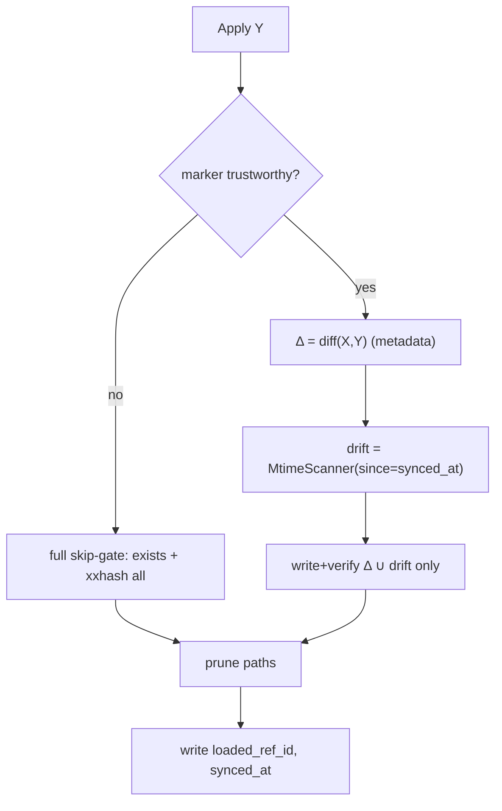

# 046 — Hash the diff, not the tree (change-proportional apply & commit)

**Date:** 2026-06-05
**Status:** Draft
**Related:** [[035-publish-local-changes]] (the `MtimeScanner` dirty-prober this generalises), [[036-skip-sync-session]] (skip-sync ⇒ dirty workdir; same predicate), [[044-untruthy-idle-state]] (§B `settings.loaded_ref_id` — the applied-head pointer this needs), [[038-restore-previous-version]] (Restore moves workdir without moving HEAD — a `loaded_ref_id` writer), [[031-bidirectional-sync]] (Download/Upload flows that call Apply/Commit). Amends `docs/superpowers/specs/2026-04-19-fast-sync-v2.1-design.md` §Integrity-Model, §Apply-ACID, §Commit-ACID.

## Background

Sync is content-addressed (`refs/{id}.json` manifests → `objects/{xxhash}` blobs), four verbs: pull / apply / commit / push (spec §The-Four-Verbs). The fast-sync v2.1 spec's Integrity Model (§802) is **content-verified end to end** — every check point hashes actual bytes, never trusts metadata:

```
∀ (path, hash) ∈ M.objects : xxhash(instance/<path>) == hash      (§811)
```

`MtimeScanner` (`internal/adapters/mtimescanner.go`) already implements stat-gated hashing — hash only files with `mtime > since`, carry the rest forward from a `previous` map. It is wired to **exactly one** caller: the `LocalDirtyProber` (`internal/gui/control/control.go:123`, [[035]]), which answers "is the workdir ≠ local HEAD?" for the IDLE "Unpublished changes" cue and [[036]] skip-sync recovery. Both `Applier` and `Committer` instead get a `FullScanner` (`cmd/gui/main.go:368`) that re-hashes the **whole tree**.

## Problem

Apply and commit do O(tree) work regardless of how little changed. Measured from a real idle restart (`ritualdev/logs/20260605153656.log`, `plan pull files=0` — nothing changed):

- **Apply skip-gate** (`apply.go:135` `existingMatchesHash`): 1182 files, **1.2 GB re-read, 2456 ms** summed I/O — to conclude "everything already matches."
- **Apply prune** (`apply.go:156` → `FullScanner.Scan`): re-hashes the **same tree again** to enumerate prune candidates — but `prune` only reads the resulting **keys** (`apply.go:160-166`), never `.Hash`. The hashes are **dead work**. (This pass reads via `fs.FS`, so it is invisible to the `storage.*` logs — real per-start hashing is ~2× the 1.2 GB the log shows.)
- **Commit walk** (`commit.go:178` → `FullScanner`): hashes the whole tree on every snapshot, even after a session that touched 30 region files.

So an idle restart pays **~2.4 GB of reads to do nothing**, and that scales linearly with world size. The spec called this cost "negligible: ~10 ms/10 MB" (§848) — the measurement refutes that at real world-sizes.

## Questions and Answers

**Q1. Trust model — how much do we trust "workdir == applied head X"?**
**A. Trust an explicit local marker, fall back to full rescan when it is absent or stale.** The verbs already do not re-derive truth from nothing — `control.go:142` establishes the precedent: *"Un-parseable id → re-hash everything (since = zero time). Safe: over-hashing only costs CPU, never a false clean."* Apply adopts the same sentinel. No marker / crash / unparseable ⇒ today's full-tree behaviour. The fast path is an optimisation gated on a trustworthy marker, never the only path.

**Q2. Can the dirty-prober's `since = ref-timestamp` anchor drive apply too?**
**A. No — that is the load-bearing trap.** Commit *reads* files (shared-read), so a committed file keeps `mtime ≤ commit-time` and the next commit carries it forward — mtime tracks **local writes**, which is its charter. **Apply *writes* files** from blobs, stamping `mtime = apply-time`. A workdir materialised by pull+apply of a ref committed elsewhere at `T_X` has every file at `mtime = T_apply > T_X`; seeding `since = T_X` flags **everything** as modified ⇒ full re-hash, zero gain. There are **two anchors**, not one:
  - `last-commit-time` — commit's gate (the [[035]] dirty-prober's existing `since`). Sound by construction.
  - `last-sync-time` — apply's drift-guard, a **locally persisted wall-clock** stamped at apply-completion. Threshold is after apply's own writes, so it is meaningful.

**Q3. The full re-hash is also an at-rest scrub. What replaces it?**
**A. Nothing — drop it, per [[025]] precedent.** Today's every-apply re-hash incidentally heals a resting workdir file that rotted (bad sector, mtime-preserving external edit) by rewriting from blob (§821). That heal was an **accidental side effect** of the skip-gate, never a designed guarantee — no design log proposes workdir at-rest verification, and the integrity conversation everywhere ([[004]] `integrityReadCloser`, [[019]] scrub, [[037]] self-naming, [[041]] move re-verify) is **blob-scoped**, not workdir. Three reasons it's safe to drop:
  1. **Canonical data is never at risk.** The source of truth is the manifest + blobs; blobs self-verify on read (§820) and live on R2. A rotted *workdir* file is a stale local copy, recoverable by re-Download/Restore.
  2. **mtime-commit can't launder rot into history.** A file that rots at rest keeps its old mtime ⇒ commit carries the **known-good** hash forward and never re-reads the corrupt bytes (the opposite of today's full-hash commit, which *would* capture rot). Corruption stays local and never reaches a ref.
  3. **The MC server is its own detector.** A broken region file crashes/glitches the server ⇒ the user re-syncs. Recovery already exists.

  Precedent: [[025]] dropped a per-blob `Exists` gate on the same logic — "content-addressed keys make it idempotent… cost of the gate dwarfs the cost of the race." A per-apply workdir scrub is the same trade: per-operation cost defending a failure content-addressing + re-Download already cover.

  **Note on §826:** the spec's `[should-have] Startup sample-verify` is **blob-scoped, optional, and unimplemented** (an unchecked box at spec line 2809) — it does **not** mandate a workdir scrub. An earlier draft of this log mis-cited it; corrected here. If slow CAS bit-rot is ever a concern, §826's *blob* sample-verify is the right, separate answer — orthogonal to this log.

**Q4. mtime lies sometimes. What guards correctness?**
**A. Size co-guard + racy-second rule.** `MtimeScanner` uses strict `After(since)` (`mtimescanner.go:83`), so a same-second or mtime-preserving content change reads as clean — git's "racy clean." On the commit side this is a **data-loss** path: stale hash → `storeOneBlob` may skip storing the new bytes (`commit.go:212`) → manifest points at old content. Guard: compare **size** too (already statable, free) and treat `mtime == since` as dirty (force re-hash). This hardens **all three** mtime consumers at once (dirty-prober, commit, apply), not just the new ones.

**Q5. dirty + remote-moved — what does apply do?**
**A. Steamroll + emit a conflict signal** (user, 2026-06-05). Today apply re-materialises the target wholesale and silently overwrites a dirty workdir ([[036]] Q3b, accepted consequence). A clean/dirty-aware apply can now *detect* "remote moved AND I edited locally" for the first time — so keep the overwrite (no behaviour change this log) but **emit a conflict event** so a later log can build UX on it without re-plumbing detection.

**Q6. Where does the applied-head marker live?**
**A. `settings.LoadedRefID` (already shipped, [[044]]) + a new `settings.SyncedAt`.** Applied-head X already exists and is maintained: `domain.Settings.LoadedRefID` (`settings.go:33`) is written by the `loadedref` subsystem (`internal/subsystems/loadedref/loadedref.go`) on **every** `pulling.HeadResolvedInfo` (apply success, `pulling/strategy.go:137`) and `committing.CommittedInfo`. So X is the apply-side pointer for free. **046 adds only one field:** a sibling `SyncedAt` (local wall-clock, stamped at the same two edges) for the drift-guard `since`. No new store; rides operational `settings.json`.

**Q7. `loadedref` declares `LoadedRefID` a best-effort hint, "never a load-bearing invariant" (`loadedref.go:18`). Apply now wants to trust it — contradiction?**
**A. No — the Q1 fallback reconciles it.** A failed/skipped best-effort write simply leaves `LoadedRefID`/`SyncedAt` un-advanced (pointing at an older ref). Apply then sees a marker that does not match target Y, or a stale `SyncedAt`, and takes the **full-rescan path** — never a false "clean." So the field stays best-effort *for correctness* (a missed write costs CPU, never integrity) while becoming *load-bearing for the fast path* (a present, fresh marker unlocks the skip). The contract widens from "badge hint" to "badge hint **and** fast-path enabler, fail-safe in both"; update `loadedref.go`'s doc comment to say so.

## Design

Three changes, one principle: **hash bytes when they move, never bytes at rest.** In-motion verification (write-time streaming xxhash §822, blob read-verify §820, commit hash-naming §823) is untouched. Only redundant at-rest re-hashing is removed.

### 1. Prune hash-free (zero ACID impact)

`prune` needs a path listing, not hashes. Give the `Applier` a hash-free walk (a `DirectoryScanner` variant returning keys with empty/zero `FileEntry`, or a dedicated `ListPaths`). Spec step 4 (§1059) is defined purely over paths; the scope invariants (§1075-1077) are path-membership. This removes one full-tree hash pass and brings code *toward* the spec.

### 2. Commit via MtimeScanner (commit-side anchor)

Swap the `Committer`'s `FullScanner` for the same `MtimeScanner` closure the dirty-prober uses (`main.go:413` pattern), seeded `since = last-commit-time`, `previous = parent ref.Objects`:

```go
sc, _ := adapters.NewMtimeScanner(rootPath, lastCommitTime, parentRef.Objects)
matched, _ := sc.Scan(ctx, targets)   // hashes only session-touched files
```

Plus the Q4 guard (size + racy-second) inside `MtimeScanner`. This is the "post-run gate" mtime was built for.

### 3. Diff-driven apply (apply-side anchor + marker)

Apply stops re-hashing the tree. It diffs manifests and trusts the marker:

```
X  = settings.LoadedRefID          // applied head (what the workdir reflects, [[044]])
Y  = target ref id                  // what we are applying
Δ  = diff(X.Objects, Y.Objects)     // pure metadata: added / removed / hash-changed

if marker absent/stale (no SyncedAt, crash sentinel, X unreadable):
    → FULL behaviour (today's exists+xxhash skip-gate)   // Q1 fallback
else:
    drift = MtimeScanner(since = SyncedAt, previous = X.Objects)    // Q2/Q4 guard
    for path in (Δ ∪ drift):
        write from blob + streaming xxhash verify (KEPT)            // §822
    // untouched paths: no read, no hash, no scrub (Q3 — dropped)
    prune (hash-free)                                               // change 1
on success: settings.LoadedRefID = Y ; settings.SyncedAt = now()
```



### Integrity Model amendment (spec §802)

| Property | Before | After |
|---|---|---|
| In-motion verify (write / blob read / commit name) | content-true | **content-true (unchanged)** |
| At-rest workdir verify | full re-hash every apply (incidental) | **dropped** — canonical data is content-addressed + re-fetchable ([[025]] precedent) |
| Recovery Principle (§842) "every failure heals on re-run" | true for all corruption | true for in-motion corruption; **mtime-invisible at-rest workdir drift is no longer auto-healed** — recovery is re-Download/Restore (a stale local copy, not lost data) |
| Commit hash source (§1123) | xxhash(current bytes) | xxhash(current bytes) for changed; carried-forward for `mtime ≤ since ∧ size ==` |

## Implementation Plan

- **Phase 1 — prune hash-free.** Add hash-free path walk; point `Applier.prune` at it. No marker, no ACID change. Independently shippable. *(tests: prune still deletes orphans, touches nothing in-scope-referenced.)*
- **Phase 2 — commit MtimeScanner + Q4 guard.** Swap committer scanner; add size + racy-second guard to `MtimeScanner`. *(tests: racy-clean file is re-hashed and stored; same-size content change detected.)*
- **Phase 3 — marker.** `LoadedRefID` already shipped ([[044]] `loadedref` subsystem). Add only `settings.SyncedAt`, stamped in the same `loadedref` handler (it already fires on `HeadResolvedInfo` + `CommittedInfo`); widen `loadedref.go`'s doc comment per Q7. *(tests: crash before stamp ⇒ stale `SyncedAt` ⇒ next apply takes full path.)*
- **Phase 4 — diff-driven apply.** Diff path, drift scan, fallback sentinel, conflict signal (OQ1). *(tests: X==Y clean ⇒ zero reads; 5-path Δ ⇒ 5 writes; missing marker ⇒ full path; dirty+remote-moved ⇒ steamroll + conflict event emitted.)*

Write tests first per CLAUDE.md; append Implementation Results as phases land.

## Examples

✅ **Idle restart, X==Y, clean** → `Δ=∅`, drift scan finds nothing modified since `SyncedAt`, prune walks paths. **~0 GB read** (was 2.4 GB).

✅ **Pull brings 5 region files** → `Δ` = 5 paths from manifest compare; write+verify those 5; 1177 untouched. Reads ≈ 5 files.

✅ **Commit after a session, 30 regions touched** → MtimeScanner hashes the ~30 with advanced mtime, carries 1152 forward. Reads ≈ 30 files (was 1.2 GB).

❌ **Trusting `since = ref-timestamp` for apply** → freshly-pulled files all have `mtime > T_X` ⇒ everything re-hashed ⇒ zero gain (Q2). Use `synced_at`.

❌ **Carrying forward on mtime alone** → racy-clean content change keeps stale hash ⇒ new bytes never stored (Q4). Use size + racy-second guard.

## Trade-offs

**Gain:** boot/apply I/O O(tree)→O(change) (idle 2.4 GB→~0); commit same; one clean/dirty predicate instead of three; conflict-detection capability (Q5) falls out; mostly deletion + rewiring of existing machinery.

**Pay:** the incidental at-rest workdir scrub is gone (recovery for a rotted local copy is re-Download/Restore — canonical data is never at risk, [[025]] precedent); correctness leans on mtime + two anchors + a persisted marker (mandatory full-rescan fallback); spec amendment debt (this log). The lost behaviour was accidental, not a designed guarantee; the trust surface (mtime) is one the product already stands on for the dirty-cue and skip-sync recovery.

## Verification

How we know it solves the original problem:

1. **Perf:** instrument an idle restart (X==Y, clean) — apply reads ~0 bytes (no untouched-file reads), not the full tree. Compare against the logged 1.2 GB / 2456 ms baseline.
2. **Proportionality:** a pull of N changed files triggers exactly N write+verify ops, not 1182.
3. **Integrity preserved (in-motion):** every written file still streaming-xxhash verified; corrupt blob still caught on read.
4. **Rot stays local:** an out-of-band corrupted resting file (unchanged mtime) is NOT captured by the next commit (carries the good hash forward) — corruption never reaches a ref; recovery is re-Download/Restore.
5. **Fallback:** with `SyncedAt` cleared/absent, apply reproduces today's full-tree behaviour bit-for-bit.
6. **Racy guard:** a same-second, same-size-impossible content change is re-hashed and stored by commit (no silent loss).

## Open Questions

- **OQ1 (Q5 policy): resolved — steamroll + emit signal** (user, 2026-06-05). Keep today's overwrite behaviour; emit a conflict event for a later log to build UX on. No behaviour change now; unblocks Phase 4.
- **OQ2 (sample rate): resolved — N/A.** At-rest sample-verify dropped (Q3); there is no rate to size.
- **OQ3 (marker on skip-sync): resolved — `SyncedAt` does not advance.** [[036]]'s chain is `Checking → Running → Done` — no Pulling, no Committing, so neither `HeadResolvedInfo` nor `CommittedInfo` fires, and `loadedref` never writes. The marker keeps pointing at the pre-skip-sync ref with its old `SyncedAt`. The next *normal* apply therefore drift-scans (files the session touched have advanced mtime ⇒ re-hashed) and otherwise diffs — composing cleanly with [[036]]'s "recover via Publish (dirty)" story. No new work; just verify in an integration test.
- **OQ4 (hash-free scanner shape):** new `ListPaths` on the port vs a `FullScanner` flag vs a separate adapter — pick the one that keeps the `DirectoryScanner` port honest.
