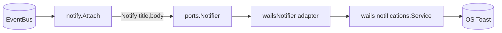

# 047 — OS notifications on critical lifecycle moments

## Background

The GUI surfaces run state inside the window (dial, addresses, logs). When the
window is backgrounded or minimised — the normal case while a server runs — the
operator has no signal that the server came up, came down, or fell over.

Wails v3 (`alpha.77`, pinned) ships a cross-platform notification service:
`github.com/wailsapp/wails/v3/pkg/services/notifications`. On Windows it emits
native Toast notifications; macOS/Linux are handled with the same API. No
third-party dependency is needed.

## Problem

Surface the **critical** server lifecycle transitions as native OS
notifications, without touching the webview and without adding UI logic to the
composition root.

Scope (user directive): **only criticals** —
1. **Start** — the server is actually up and accepting connections.
2. **After stop** — the server session ended cleanly.
3. **Failure** — a run failed.

Explicitly *out of scope*: per-flow chatter (Download/Upload/Restore/Revert/
RetentionApply completions), progress, livesync ticks.

## Permissions

- **Windows** (the target): no runtime permission prompt. The Wails service
  self-registers an AppUserModelID + CLSID under `HKCU` on `Startup`
  (`notifications_windows.go:90`). Toasts then just appear; only the user's own
  Focus Assist / per-app notification setting can suppress them — nothing we
  request in code.
- **macOS** (future): requires a signed, bundled app and an explicit
  `RequestNotificationAuthorization()`. Not wired now; the port keeps that door
  open.

So this is **offloaded entirely to the Go backend** — the webview has no role
and there is no browser permission to grant. (See the discussion in this
session: the webview sandbox has no system-info / notification APIs anyway.)

## Questions and Answers

**Q1 — Which event is "start"?**
`running.ServerReadyInfo{}` (`internal/core/stages/running/events.go:11`), fired
once the TCP readiness probe succeeds (`strategy.go:190`). This is the only flow
that boots a server, so it is the honest "server is up" signal — not the earlier
session-start. ✅

**Q2 — Which event is "after stop"?**
`lifecycle.StatusChanged{Status: Done}` (`lifecycle.go:247`). But `Done` also
fires for Download/Upload/Restore/Revert/RetentionApply, which are *not* server
sessions. To honour "criticals only", gate the stop toast on **whether
`ServerReadyInfo` fired during this run** (a `sawReady` latch reset on every
`ritual.FlowStartedInfo`). So: stop toast iff the server had actually started.
✅

**Q3 — Which event is "failure"? All flows, or only server sessions?**
`lifecycle.StatusChanged{Status: Failed, Err: …}`. **Proposed: notify on every
`Failed`, regardless of flow.** A failed Download/Upload/Restore is itself
exceptional and worth surfacing — the user said "error on failures" without
qualification, and failures are rare by nature (low noise risk). The `Err`
string (when present) goes in the body. — **Confirmed: any failure stage / all
flows.**

**Q4 — Dedup / notification ID?**
Wails validates `ID` and `Title` non-empty (`notifications.go:206`). Reusing one
ID coalesces/replaces on Windows. We want each event to stand alone, so derive a
per-event ID: `"ritual-" + kind + "-" + runSeq`, where `runSeq` increments on
each `FlowStartedInfo`. Deterministic, no clock, test-friendly.

**Q5 — Suppress when the window is focused?**
The operator may be staring at the dial. **Proposed: no suppression** for v1 —
keeps the subsystem free of window-state coupling, and a redundant toast is
cheaper than a missed critical one. Revisit if noisy. — **Confirmed: always
notify.**

**Q6 — Threading?**
One consumer goroutine over a bus subscription (mirrors `lifecycle.Attach`). The
actual `SendNotification` (Windows COM/registry path) is dispatched in a
detached goroutine so a slow toast never backs up the bus drain — same
"never block the producer" stance as `wailsViewEmitter` (`main.go:649`).

## Design

A new subsystem `internal/subsystems/notify` with a narrow port, plus a thin
Wails adapter wired at the composition root. Notifications become a **pure
projection of the bus** — no UI logic in `main.go`, no Wails import in the
subsystem (so it unit-tests with a fake notifier).



### Port

```go
// internal/subsystems/notify/notify.go
package notify

// Notifier sends one OS notification. Title is required; body may be empty.
// id de-duplicates / replaces on platforms that key by id.
type Notifier interface {
    Notify(id, title, body string) error
}
```

### Subsystem

```go
// Attach subscribes a consumer to the bus and translates critical lifecycle
// events into OS notifications until ctx is cancelled. Returns a stop func.
func Attach(ctx context.Context, bus ports.EventBus, n Notifier) func()
```

Event mapping (consumer goroutine):

| Bus event                                  | Gate                | Toast                                   |
|--------------------------------------------|---------------------|-----------------------------------------|
| `ritual.FlowStartedInfo`                   | —                   | (no toast) `sawReady=false`, `runSeq++` |
| `running.ServerReadyInfo`                  | —                   | `sawReady=true`; "Server started"       |
| `lifecycle.StatusChanged{Done}`            | `sawReady == true`  | "Server stopped"                        |
| `lifecycle.StatusChanged{Failed, Err}`     | —                   | "Run failed" + `Err` in body            |

- `Title` is always the product name (`config.ProductName`).
- ID: `fmt.Sprintf("ritual-%s-%d", kind, runSeq)`.
- The first `StatusChanged{Idle}` at attach and `Dismissed`/`Idle` transitions
  are ignored.
- Each `Notify` call is fired in `go func()` so a slow OS call can't stall the
  consumer.

### Adapter (composition root, `cmd/gui`)

```go
type wailsNotifier struct{ svc *notifications.NotificationService }

func (w *wailsNotifier) Notify(id, title, body string) error {
    return w.svc.SendNotification(notifications.NotificationOptions{
        ID: id, Title: title, Body: body,
    })
}
```

### Wiring in `main.go`

```go
notifSvc := notifications.New()
wailsApp := application.New(application.Options{
    Services: []application.Service{
        application.NewService(controlSvc),
        application.NewService(notifSvc),   // registers Startup → HKCU AppUserModelID
    },
    ...
})
...
stopNotify := notify.Attach(ctx, runtime.bus, &wailsNotifier{svc: notifSvc})
defer stopNotify()
```

The service must be registered in `Services` so its `ServiceStartup` runs the
Windows registration before any toast is sent.

## Implementation Plan

1. **Port + subsystem** — `internal/subsystems/notify/notify.go`
   (`Notifier`, `Attach`, the consumer loop with `sawReady`/`runSeq`).
2. **Tests** — `notify_test.go` with a fake `Notifier` (records calls): assert
   start→stop emits two toasts; Download Done emits none (gate); Failed emits
   one with the error in the body; `runSeq` increments per `FlowStartedInfo`.
3. **Adapter + wiring** — `wailsNotifier` in `cmd/gui` (own file, e.g.
   `notify.go`), register `notifications.New()` in `Services`, `notify.Attach`
   after `ctx := wailsApp.Context()`.
4. **Manual verify** on Windows — start a session, confirm "Server started"
   toast on ready; stop, confirm "Server stopped"; force a failure, confirm the
   failure toast carries the error.

## Verification Criteria

- Backgrounded window: a server reaching ready produces exactly one OS toast;
  clean stop produces exactly one; a failed run produces exactly one with the
  cause.
- A Download/Upload/Restore round-trip produces **no** start/stop toast (only a
  failure toast if it fails — pending Q3).
- `go test ./internal/subsystems/notify/...` green; full suite unaffected.
- No Wails import under `internal/subsystems/notify`.

## Trade-offs

- **Latch-based stop gate** ties "stop" to "server actually started" rather than
  to a dedicated stop event. Cheap and correct for the current FSM; if a real
  `ServerStoppedInfo` lands later, switch to it and drop the latch.
- **No focus suppression / no rate-limit** (Q5) keeps it simple; acceptable
  because the mapped events are inherently low-frequency.
- **Per-event goroutine** for `Notify` trades strict ordering of toasts for a
  guarantee that the bus consumer never blocks. Toast ordering is not
  user-meaningful here.

## Implementation Results

Shipped as designed (commit `39f1531`).

- **Subsystem** — `internal/subsystems/notify/notify.go`: `Notifier` port +
  `Attach` consumer with the `sawReady`/`runSeq` latches per the §Design table.
  No Wails import (verified — unit-tested against a fake notifier).
- **Adapter + wiring** — `cmd/gui/notify.go` (`wailsNotifier`); `notifications.New()`
  registered in `Services` and `notify.Attach(ctx, runtime.bus, …)` after
  `wailsApp.Context()`.
- **Q3 / Q5 confirmed** as proposed: notify on **any** flow failure; **no**
  focus suppression.
- **Tests** — `notify_test.go`: start→stop emits two toasts; Download `Done`
  emits none (gate); `Failed` emits one with the error in the body; `runSeq`
  increments per `FlowStartedInfo`. `go test ./internal/subsystems/notify/...`
  + `./cmd/gui/...` green.

### Adjacent fix — close-hook drain skip (out of original scope)

While wiring the `ctx`-subscription consumer, the same bus-consumer pattern
exposed a pre-existing shutdown bug, fixed in the same region of `main.go`:

- **Symptom** — closing the window always blocked the full 20s `waitTerminal`
  budget before quitting; the app looked like it ignored the close.
- **Cause** — the close hook published `StopRequested` and waited for a terminal
  `StatusChanged`. Outside `Running`, `lifecycle.stop()` is a no-op and publishes
  nothing, so `waitTerminal` only ever returned on the 20s timeout.
- **Fix** — a `lifecycleRunning atomic.Bool` mirrored from `StatusChanged`
  (every flow transits `Running`, lifecycle.go:160-165, so the latch means "any
  flow in flight"). The close hook now quits immediately when the latch is false
  and only runs the graceful drain when a flow is actually live. The mirror
  goroutine subscribes before `lifecycle.Attach` so the initial `Idle` leaves the
  flag false.

### Deviations

None from the 047 design. The close-hook drain skip above is an adjacent
shutdown-correctness fix, not a change to the notifications design.
