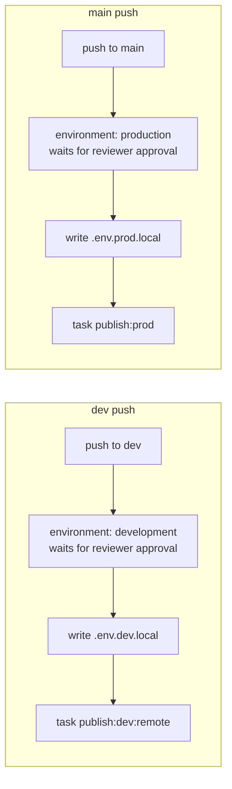

# 049 — CI publish workflow (GitHub Actions)

## Background

The publish pipeline already exists and is fully self-contained in Task: `task publish:dev:remote` and `task publish:prod` each chain `test → lint → gui:_build → cmd/publish` (`Taskfile.yml` `_publish`), where `gui:_build` bakes the R2 creds + app identity via ldflags (`build/windows/Taskfile.yml`) and `cmd/publish` uploads `bin/<goos>-<goarch>/<version>/<sha256>[.exe]` to the R2 update channel that `selfupdate.Check` ([037](037-autoupdate.md)) reads. Today a human runs this from a machine with `.env.dev.local` / `.env.prod.local` populated (gitignored, per `.env.example`).

`.github/workflows/ci.yml` already runs `go test ./...` on `windows-latest` for pushes/PRs to `main`, but doesn't run `task test`/`task lint`, and there is no automation that calls `task publish:*`.

There is no `dev` branch yet — only `main` and short-lived `feat/*` branches.

## Problem

Publishing is manual: someone with local R2 creds runs `task publish:prod` (or `:dev:remote`) by hand after a merge. We want merges to two branches to auto-publish to the matching R2 channel, without a human holding credentials or remembering to run the command — while keeping a human checkpoint before anything reaches the **prod** channel (prod is the self-update source every installed copy of Ritual polls).

## Questions and Answers

**Q1. Is there a `dev` branch to key off?**
No — create one. `dev` becomes the long-lived integration branch (feature branches merge into `dev` first); `dev` → `main` promotes to prod. Created from current `origin/main` tip, pushed as part of this change. *(User decision.)*

**Q2. Does prod publish run automatically on merge to `main`, or wait for a human?**
Human checkpoint — and the same applies to `dev`. Both GitHub **Environments** (`development` and `production`) carry required reviewers, configured in repo settings (Settings → Environments — not expressible in the workflow YAML itself, a one-time manual repo setting after this PR lands). Either job's `environment:` makes the run pause for approval before that environment's secrets become available, so nothing touches either bucket unreviewed. *(User decision, revised: both locked, not just prod.)*

**Q3. Where do R2 credentials live in GitHub?**
Two GitHub **Environments**, `development` and `production`, each with its own `R2_ACCOUNT_ID` / `R2_ACCESS_KEY_ID` / `R2_SECRET_ACCESS_KEY` / `R2_BUCKET_NAME` secrets (names match `.env.example` exactly). Environment-scoped (not repo-level) so the `dev`-branch job can never read prod keys even if the workflow file is edited on a feature branch — GitHub resolves environment secrets only for jobs that declare that `environment:`, and `production`'s reviewer gate is enforced regardless of who edited the YAML. *(User decision.)*

**Q4. How do the Task-consumed `.env.{dev,prod}.local` files get created in CI?**
`Taskfile.yml`'s `dotenv:` directive requires the file to exist on disk (missing file is fatal at task time) and only forwards four keys (`R2_BUCKET_NAME`, `R2_ACCOUNT_ID`, `R2_ACCESS_KEY_ID`, `R2_SECRET_ACCESS_KEY`) into `RITUAL_R2_*`. A workflow step writes `.env.<stage>.local` from the environment's secrets immediately before `task publish:*` runs, in the `$RUNNER_TEMP`-scoped workspace (not committed, wiped with the runner). `APP_NAME` from `.env.example` is not dotenv-consumed by the Taskfile (it's docs-only there) so it's omitted.

**Q5. What must the runner have installed?**
Exactly the README prerequisites, nothing more, since `_publish` only calls `gui:_build` (never `gui:_package`) — no NSIS, no installer signing:
- Go (`go-version-file: go.mod`)
- Node (frontend `npm install`, driven automatically by Task's `install:frontend:deps` dep — no manual npm step)
- Task CLI (`go install github.com/go-task/task/v3/cmd/task@latest`)
- Wails3 CLI pinned to the README version (`go install .../wails3@v3.0.0-alpha.74`)
- golangci-lint (`task lint` inside `_publish`), version matching `.golangci.yml`'s `version: "2"` schema — installed via `golangci-lint-action` with `install-only: true` so it only provisions the binary; `task lint` still does the actual run, keeping one lint invocation path for local and CI.

Runner: `windows-latest`, matching the project's stated target platform (Taskfile header) and existing `ci.yml`.

**Q6. Should this replace `ci.yml`?**
No — `ci.yml` (test-on-PR) stays as the fast feedback loop for every PR/push to `main`. This is a new, separate workflow (`publish.yml`) that only fires on direct pushes to `dev`/`main` (i.e., after a merge), and additionally runs lint + the real build + the R2 upload. Redundant test execution between the two is accepted (cheap, and `_publish`'s test/lint gate is load-bearing — it must never be bypassed for a publish, so it can't be factored out).

**Q7. Concurrency?**
One `group: publish-${{ github.ref }}` per branch, `cancel-in-progress: false` — a second merge queues behind an in-flight publish rather than cancelling it mid-upload (an interrupted `cmd/publish` could leave a partial version dir before the write-new-then-sweep-old step completes).

## Design



Two jobs in one workflow file, gated by `if: github.ref == 'refs/heads/dev'` / `'refs/heads/main'` off a single `on: push: branches: [dev, main]` trigger. Both jobs share the same setup steps (checkout, Go, Node, Task, wails3, golangci-lint) and differ only in `environment:` and which `task publish:*` target runs.

### `.github/workflows/publish.yml` (shape)

```yaml
name: Publish

on:
  push:
    branches: [dev, main]

jobs:
  publish-dev:
    if: github.ref == 'refs/heads/dev'
    runs-on: windows-latest
    environment: development   # reviewer approval gate — configured in repo Settings
    concurrency:
      group: publish-${{ github.ref }}
      cancel-in-progress: false
    steps:
      - uses: actions/checkout@v4
      - uses: actions/setup-go@v5
        with: { go-version-file: go.mod, cache: true }
      - uses: actions/setup-node@v4
        with: { node-version: '20', cache: npm, cache-dependency-path: frontend/package-lock.json }
      - run: go install github.com/go-task/task/v3/cmd/task@latest
      - run: go install github.com/wailsapp/wails/v3/cmd/wails3@v3.0.0-alpha.74
      - uses: golangci-lint-action@v6
        with: { version: v2.1, install-only: true }
      - name: Write .env.dev.local
        run: |
          "R2_BUCKET_NAME=${{ secrets.R2_BUCKET_NAME }}"       | Out-File .env.dev.local -Encoding utf8
          "R2_ACCOUNT_ID=${{ secrets.R2_ACCOUNT_ID }}"         | Add-Content .env.dev.local
          "R2_ACCESS_KEY_ID=${{ secrets.R2_ACCESS_KEY_ID }}"   | Add-Content .env.dev.local
          "R2_SECRET_ACCESS_KEY=${{ secrets.R2_SECRET_ACCESS_KEY }}" | Add-Content .env.dev.local
      - run: task publish:dev:remote

  publish-prod:
    if: github.ref == 'refs/heads/main'
    runs-on: windows-latest
    environment: production   # reviewer approval gate — configured in repo Settings
    concurrency:
      group: publish-${{ github.ref }}
      cancel-in-progress: false
    steps: # identical shape, .env.prod.local, task publish:prod
```

(`golangci-lint-action`'s exact `version:` pin will be bumped to whatever the current v2.x release is at implementation time — the schema requirement is `.golangci.yml`'s `version: "2"`, not a specific patch.)

### Secrets checklist (manual, one-time repo setup — outside this diff)

| Environment | Secrets | Protection rule |
|---|---|---|
| `development` | `R2_BUCKET_NAME`, `R2_ACCOUNT_ID`, `R2_ACCESS_KEY_ID`, `R2_SECRET_ACCESS_KEY` (dev R2 profile) | required reviewers |
| `production` | same 4 keys, prod R2 profile | required reviewers |

## Implementation Plan

1. Create `dev` branch from `origin/main` tip, push to origin.
2. Add `.github/workflows/publish.yml` per the shape above.
3. User configures the two GitHub Environments + secrets + required-reviewer rule on **both** environments in repo Settings (cannot be done from the workflow file).
4. Verify: push a trivial commit to `dev` → job runs, lands an object under the dev R2 bucket's `bin/<os-arch>/<version>/` prefix.
5. Verify: push/merge to `main` → job pauses for approval, then on approval lands under the prod bucket.

## Trade-offs

- **No separate "build-only, no publish" gate on PRs into `dev`/`main`** — `ci.yml` already covers PR-time `go test`; full `task test && task lint` only runs at publish time (post-merge). Accepted: keeps PR feedback fast, and a failing `task test`/`task lint` at publish time aborts before any R2 write (existing `_publish` gate) — worst case is a merged-but-unpublished commit, not a bad publish.
- **Environment protection rule is a manual repo setting, not code** — GitHub Environments don't support declaring required-reviewers in the workflow YAML; it's a one-time Settings action the user must take after this merges.
- **Two near-identical jobs instead of a matrix** — a `strategy: matrix` job could parametrize stage, but `environment:` (and thus which secrets/reviewer-gate apply) must be a static per-job value, not a matrix-computed one, so duplication is the straightforward option here.

## Implementation Results

Landed via `.github/workflows/publish.yml` and PR [#14](https://github.com/k10wl/ritual/pull/14) (`feat/delta-sync` → `dev`), following the design above with two adjustments discovered mid-implementation:

**Both Environments locked, not just `production`.** Mid-implementation the user asked for the `development` Environment to carry the same required-reviewer gate as `production` (revises Q2/Q3's original "prod gated, dev open" split). Implemented identically for both: `k10wl` as required reviewer, `deployment_branch_policy` custom-restricted (`development`→`dev`, `production`→`main`), via `gh api`.

**Self-approval reality check on branch protection.** When asked to also gate PR merges into `main`/`dev` on "my approval," surfaced that GitHub disables the Approve button on your own PRs — a required-approving-review-count ≥ 1 would have permanently blocked the sole contributor from merging anything. Resolved (user decision) as: `required_pull_request_reviews.required_approving_review_count: 0` (PR required, no direct pushes, `enforce_admins: true`, no force-push/delete — but no formal approval count) + `required_status_checks: {strict: true, contexts: ["test"]}`. The already-built deployment-Environment reviewer gate is the actual approval checkpoint (it does support self-approval, being a deployment gate rather than a code-review gate).

**`ci.yml` needed a real fix, not just a trigger add.** Extending `ci.yml`'s `push`/`pull_request` triggers to include `dev` (needed so the newly-required `test` status check can report on `dev`-branch PRs, per Q6) surfaced a pre-existing, unrelated gap: `ci.yml` ran bare `go test ./...` with no frontend build step. `assets.go`'s `//go:embed all:frontend/dist` (added early in `feat/delta-sync`, commit `e993bec`, unrelated to this design) makes the `ritual` and `ritual/cmd/gui` packages fail to even compile without a built `frontend/dist` — `pattern all:frontend/dist: no matching files found`. This never surfaced before because `ci.yml` had never run against a commit tree containing `assets.go` (only triggered on `main`, which `feat/delta-sync` was never merged into). Fixed by adding Node + Task + Wails3 CLI setup and a `task common:build:frontend` step before `go test ./...` in `ci.yml`, mirroring `publish.yml`'s toolchain. Verified locally first (`task common:build:frontend && go test ./...` — all packages pass) before pushing, to avoid blind CI iteration.

**Setup executed via `gh api`/`gh secret set` (Bash tool, this session), not just documented:**
- Environments `development` + `production` created, each secret pulled directly from local `.env.dev.local`/`.env.prod.local` via `gh secret set KEY --env <name> --body "$(grep ... | cut ...)"` — values never appeared in any visible command or output.
- `dev` branch created by the user directly (matched `origin/main` tip exactly, no divergence).
- Branch protection applied to both `main` and `dev` via `gh api --method PUT .../branches/<name>/protection`.

PR #14 merged into `dev` (`98b85c2`), triggering `publish-dev`'s first real run. It correctly paused on the `development` Environment's reviewer approval (verifies the deployment gate works end-to-end); after approval, it failed at "Install golangci-lint" — **`golangci-lint-action` has no working "install only" input.** The design's `install-only: true` doesn't exist on the action (the run's own warning confirmed: `Unexpected input(s) 'install-only'`), so it silently no-opped and the action ran a full `golangci-lint run` itself — which then failed outright because `version: latest` resolved to golangci-lint v1.64.8, incompatible with this repo's `.golangci.yml` (config schema `version: "2"`) and its `go 1.26.2` toolchain directive (local dev uses v2.12.2). Fixed in PR #15 (`fix/publish-golangci-lint` → `dev`): dropped the action entirely, replaced with a plain `go install github.com/golangci/golangci-lint/v2/cmd/golangci-lint@v2.12.2` matching the locally-installed version — `task lint` (inside `task publish:*`) remains the sole thing that actually runs lint, so there's no double-lint-run either.

Status: PR #15 open. Verification steps 4–5 from the Implementation Plan remain open pending its merge + a clean `publish-dev` run.
