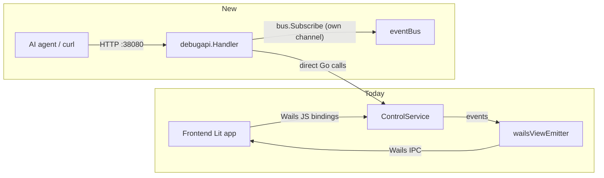

# 052 — Debug REST control API (full ControlService parity, dev builds only)

**Date:** 2026-07-19
**Status:** Superseded by [[053-cdp-webview-inspection]] — never approved/implemented. User opted to attach Chrome DevTools Protocol (via Wails' own `AdditionalBrowserArgs: ["--remote-debugging-port"]`) directly to the real WebView2 window instead: it observes and drives the actual window in the actual failing code path (including the exact one 051 is about), where this log's REST wrapper would only ever see `ControlService`'s backend truth, not the frontend/WebView2 side.
**Related:** [[051-view-emitter-terminal-freeze]] (the investigation that surfaced the need — reproducing GUI bugs currently requires manually clicking through the real window and eyeballing DevTools), [[048-local-storage-build-variant]] (existing dev-build-variant precedent this reuses), [[037-autoupdate]]/[[043-server-logs-runstage-only]] (existing `internal/gui/control.ControlService` surface this mirrors).

## Background

Investigating [[051]] required: finding the user's actual session log by hand, correlating byte counts between a log file and a clipboard screenshot, and having the user manually open DevTools and run a JS one-liner (`document.querySelector('ritual-app').vm`) to read live frontend state. That worked, but only because a human was present at the keyboard. An AI agent (or any automated harness) driving this repo has no way to start a session, drive it to a specific stage, or read live backend/frontend state without a human relaying screenshots and console output by hand — there is no non-GUI control surface at all today. Every control action (`Start`, `Stop`, `Upload`, `Restore`, …) is a method on `internal/gui/control.ControlService`, reachable only via Wails-generated JS bindings running inside the WebView2 render process (`frontend/src/wails-api.ts` → `frontend/bindings/.../controlservice.ts`).

## Problem

Make GUI bugs (like [[051]]) reproducible **programmatically**, by exposing the same control surface the frontend already uses, over a transport an agent's ordinary tools (`curl`/HTTP) can reach directly — without going through the WebView2 IPC bridge at all. As a side effect, this also gives an **independent** verification channel: since a REST handler would read `Projection.Snapshot()` directly rather than through `wailsViewEmitter`, it can prove the backend's true live state even when the GUI's own event delivery is wedged (exactly the class of bug 051 is about) — much like the DevTools trick, but scriptable.

## Questions and Answers

**Q1.** Should this exist in production builds, or dev only?
**A.** **Dev builds only — both `gui:build:dev:local` and `gui:build:dev:remote` ([[048]]), never in the `ritual` (prod) binary.** Confirmed by user 2026-07-19. Gate via `config.AppName == "ritualdev"` (existing mechanism, already branches `DisplayName()` — no new build tag needed) checked once in `buildRuntime()`/`main()`: the HTTP server is simply never started when `AppName == "ritual"`.

**Q2.** What should it expose — read-only introspection, or full control?
**A.** **Full parity with the existing `ControlService` action surface.** Confirmed by user. Concretely, mirror every user-facing method already bound to the frontend (`frontend/src/wails-api.ts`) — `Start, Stop, Dismiss, Download, Upload, Revert, ApplyRetentionNow, CheckForUpdate, GetSyncStatus, ListVersions, Restore, GetSnapshot, GetPrep, SendConsole, ShowLogs, ReadServerLog, OpenRootFolder, GetRetentionRules, SetRetentionRules, GetLocalStorageStats, DeleteLocalVersion, DeleteRemoteVersion`. Excluded: `ControlService`'s internal wiring setters (`SetLogsWindowFactory`, `SetVersionDeleter`, `SetRemoteVersionDeleter`, `SetLocalStatsFn`, `SetConsoleReader`) — these are composition-time dependency injection, not user/agent-facing actions, and Wails doesn't bind them to the frontend either.

**Q3.** Should 051 specifically get a synthetic/fake trigger (fake an 800-file push instantly) to force the exact race on demand?
**A.** **No — explicitly rejected by user 2026-07-19: "no synth we need real app working."** Reproduction must drive a real session (real `Start`, a real transfer, real `Stop`) through this API, not a fabricated shortcut. This raises the bar for reproducing timing-sensitive bugs like 051 (no guaranteed instant repro), but keeps the tool honest — it's a general-purpose control surface, not a bug-specific stub.

**Q4.** How does an agent observe *live* state changes through this API, not just point-in-time snapshots?
**A.** Proposed (not yet confirmed): in addition to a `GET /debug/snapshot` (wraps `GetSnapshot()`), add `GET /debug/events` as a chunked/SSE stream that taps the bus directly via its own `bus.Subscribe()` — a subscriber independent of `wailsViewEmitter`, so it keeps reporting correctly even if the Wails-facing emitter is wedged (per 051, that's the whole point: an independent channel that can't share the same failure). Frames would carry the same `Snap{ViewModel}` shape already flowing to the file logger.

**Q5.** Transport / binding specifics?
**A.** Proposed: plain `net/http`, JSON bodies, bound to `127.0.0.1` only (never `0.0.0.0`) — no auth needed since it's loopback-only and dev-only, matching the trust model of "a human or agent already has a shell on this machine." Fixed port (e.g. `38080`, needs a real pick free of collision with anything else in the stack) or `0` (OS-assigned) printed to the log/console on startup so a driving script can discover it. Open: exact port and whether to read it from an env var for scripting convenience.

**Q6.** Where does this live in the codebase?
**A.** Proposed: new `internal/gui/debugapi` package — a thin `net/http.Handler` wrapping the existing `*control.ControlService` (no duplicated logic, just marshal/unmarshal + method dispatch), wired up in `cmd/gui/main.go` alongside the existing `application.NewService(controlSvc)` registration, started only when `config.AppName == "ritualdev"`.

**Q7.** Does Wails v3 already provide this, making a custom implementation redundant?
**A.** Partially — it has a real headless **"server mode"** (`pkg/application/application_server.go`, `//go:build server`): a genuine `net/http` server exposing a generic `POST /wails/runtime` RPC endpoint (`{object, method, args}`, dispatches to any bound `application.Service` — including our real `ControlService` unmodified) plus a `/wails/events` WebSocket broadcasting every event. If usable, it would make most of this log unnecessary. Tested empirically, not just read: `go build -tags server ./cmd/gui` **fails to compile on Windows** against our pinned `github.com/wailsapp/wails/v3 v3.0.0-alpha.77` — several Windows-specific files (`clipboard_windows.go`, `dialogs_windows.go`, `systemtray_windows.go`, `webview_window_windows.go`, `single_instance_windows.go`, `events_common_windows.go`, `mainthread_windows.go`) lack the `!server` build-constraint exclusion that `application_windows.go` itself has, causing duplicate-declaration errors (`newClipboardImpl redeclared`, `undefined: windowsApp`, etc.) — looks like an incomplete part of this alpha for the Windows target specifically. **More fundamentally, even a working server mode couldn't reproduce 051**: its event delivery goes through a plain `WebSocketBroadcaster`, an entirely different code path from `wailsViewEmitter` → `a.Event.Emit` → WebView2 IPC. Server mode has no WebView2 involved at all, so the exact stall under investigation structurally cannot occur there — it bypasses the very component this log exists to observe. Conclusion: server mode is a fine tool for other headless regression-testing of business logic, but not a substitute for this log's plan, which specifically needs to run inside the same process as the real windowed app.

## Design



The debug API is a second front door onto the same `ControlService` — not a parallel implementation. It adds no new business logic, only marshalling + routing + its own independent bus subscription for the event stream.

## Implementation Plan

Not started — pending approval. Concrete plan below.

### Package layout

- `internal/gui/debugapi/debugapi.go` — `func New(cs *control.ControlService, bus ports.EventBus) http.Handler`. Pure handler construction; owns no listener (main.go owns the `*http.Server` lifecycle, matching how every other subsystem here is wired: constructed, then started/stopped by `main()`/`buildRuntime()`, never self-starting).
- `internal/gui/debugapi/routes.go` — one small handler func per route, JSON in/out, thin marshal/unmarshal + direct delegation to the matching `*control.ControlService` method. No new business logic.
- `internal/gui/debugapi/events.go` — the SSE handler (`GET /debug/events`): `bus.Subscribe()`, filter for `projection.Snap`, write `data: <json>\n\n` per event, unsubscribe on `r.Context().Done()`.
- `internal/gui/debugapi/debugapi_test.go` (+ maybe split per file above) — `httptest.NewRecorder`/`httptest.NewServer` per route, reusing the existing fakes already in `internal/gui/control/*_test.go` (e.g. the SnapshotSource/SyncProber/VersionLister test doubles) rather than inventing new ones.

### Route table

Read-only (Phase A):

| Method | Path | ControlService call |
|---|---|---|
| GET | `/debug/snapshot` | `GetSnapshot()` |
| GET | `/debug/events` | SSE tap on `bus.Subscribe()`, no direct method |
| GET | `/debug/prep` | `GetPrep()` |
| GET | `/debug/sync-status` | `GetSyncStatus()` |
| GET | `/debug/retention` | `GetRetentionRules()` |
| GET | `/debug/versions?scope=local\|remote` | `ListVersions(scope)` |
| GET | `/debug/storage-stats` | `GetLocalStorageStats()` |
| GET | `/debug/server-log` | `ReadServerLog()` |

Control actions (Phase B):

| Method | Path | Body | ControlService call |
|---|---|---|---|
| POST | `/debug/start` | `{port, memoryMB, skipSync}` | `Start(port, memoryMB, skipSync)` |
| POST | `/debug/stop` | — | `Stop()` |
| POST | `/debug/dismiss` | — | `Dismiss()` |
| POST | `/debug/download` | — | `Download()` |
| POST | `/debug/upload` | — | `Upload()` |
| POST | `/debug/revert` | — | `Revert()` |
| POST | `/debug/restore` | `{refID}` | `Restore(refID)` |
| POST | `/debug/retention/apply` | — | `ApplyRetentionNow()` |
| POST | `/debug/retention` | `{local, remote}` | `SetRetentionRules(local, remote)` |
| POST | `/debug/check-update` | — | `CheckForUpdate()` |
| POST | `/debug/console` | `{line}` | `SendConsole(line)` |
| POST | `/debug/show-logs` | — | `ShowLogs()` |
| POST | `/debug/open-root-folder` | — | `OpenRootFolder()` |
| DELETE | `/debug/versions/local/{refID}` | — | `DeleteLocalVersion(refID)` |
| DELETE | `/debug/versions/remote/{refID}` | — | `DeleteRemoteVersion(refID)` |

Excluded (internal wiring, not user/agent actions): `SetLogsWindowFactory`, `SetVersionDeleter`, `SetRemoteVersionDeleter`, `SetLocalStatsFn`, `SetConsoleReader` — matches Q2.

### Wiring (`cmd/gui/main.go`)

Right after `controlSvc` construction (currently line 68-74), before `wailsApp` is built:

```go
if config.AppName == "ritualdev" {
    dbgSrv := &http.Server{Addr: "127.0.0.1:38080", Handler: debugapi.New(controlSvc, runtime.bus)}
    go func() {
        if err := dbgSrv.ListenAndServe(); err != nil && !errors.Is(err, http.ErrServerClosed) {
            log.Printf("debugapi: %v", err)
        }
    }()
    defer dbgSrv.Close()
    log.Printf("debugapi: listening on %s", dbgSrv.Addr)
}
```

Matches the existing `defer stopX()` idiom already used throughout `main()` for every other subsystem (`stopLogFile`, `stopNotify`, `stopParent`, `stopLiveSync`, `stopDispatcher`, `stopLifecycle`, `stopLoadedRef`).

### Sequencing

Gating is baked into Phase A's first commit, not deferred — there's no intermediate state where the server is reachable ungated, even transiently:

1. **Phase A** — read-only routes + SSE + the `config.AppName` gate + its own test (assert no listener when `AppName` is temporarily reassigned to `"ritual"`, restored after — `AppName` is a plain `var`, reassignable in tests). Unlocks the "verify backend truth independent of the GUI" capability that closes out [[051]]'s Q6 investigation path immediately.
2. **Phase B** — the fourteen action routes, table-driven tests per route (assert correct delegation, reusing existing control-package fakes/spies).
3. No separate "Phase C" — wiring + gating tests are part of Phase A, not bolted on after.

## Verification

- `config.AppName == "ritual"` (prod) build: no listener starts, no port opened — assert via a test that constructs the runtime with `AppName` forced to `"ritual"` and checks no server is running.
- Dev build: `curl localhost:<port>/debug/snapshot` returns the same shape as the Wails `GetSnapshot()` binding.
- A real end-to-end repro of [[051]]-class bugs becomes scriptable: start a real session via `POST /debug/start`, drive it through a real Push, and poll `/debug/snapshot` / watch `/debug/events` to compare backend-truth against whatever the actual GUI window shows — without any manual DevTools step.

## Trade-offs

- **New local attack surface, even loopback-only.** Any other local process (in principle, malware) could hit this port while a dev build is running. Mitigated by: dev-only, loopback-only bind, and this only ever matters on a developer's own machine, never an end user's — the `ritual` prod binary never compiles it in.
- **Duplicate front door.** Two paths now trigger the same actions (Wails bindings + REST). Acceptable per explicit user direction (Q2) — the value (agent-scriptable repro) outweighs the minor surface duplication, and there's no new business logic to keep in sync, only routing.
- **No synthetic repro shortcut for 051 (Q3).** Means the original bug may still take a real multi-minute session to reproduce even with this API. Accepted trade-off — user wants fidelity over speed.
