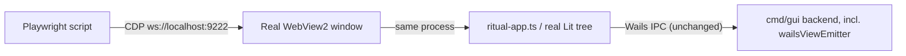

# 053 — Live WebView2 inspection via Chrome DevTools Protocol (dev builds only)

**Date:** 2026-07-19
**Status:** Draft — awaiting approval before implementation
**Related:** [[052-debug-control-rest-api]] (superseded by this log — see its Status line), [[051-view-emitter-terminal-freeze]] (the motivating investigation), [[048-local-storage-build-variant]] (existing dev-build-variant precedent this reuses).

## Background

[[052]] proposed a custom `internal/gui/debugapi` HTTP wrapper around `control.ControlService` so an agent could drive/inspect the app without a human at the keyboard. Before building it, we checked whether Wails already solves this (it doesn't cleanly — see 052 §Q7/§Q8) and then asked a different question: can an external tool attach to the *actual* WebView2 window the real app already opens, rather than adding a parallel API surface?

It can. `application.Options.Windows.AdditionalBrowserArgs []string` (Wails v3, `pkg/application/application_options.go:283`) is documented for exactly this — its own doc comment gives `"--remote-debugging-port=9222"` as the example. WebView2 is Chromium under the hood and fully implements the Chrome DevTools Protocol (CDP) when that flag is set. Any CDP client — Playwright's `chromium.connectOverCDP(url)`, Puppeteer, or a raw WebSocket client — can then attach to the live window: evaluate JS in the real page (`document.querySelector('ritual-app').vm`, exactly what we did by hand via manual DevTools in [[051]]), capture `console.log` output, and drive the UI via real clicks (`page.click(...)`) that exercise actual DOM hit-testing and event listeners, not a side-channel API call.

## Problem

Give an agent (or automated harness) the same capability a human had in [[051]] — read live frontend state, watch console output, drive the app through its real UI — without a parallel/duplicate API surface, and without replacing the very WebView2 code path that bug 051 lives in (the flaw that ruled out Wails' server mode, 052 §Q8).

## Questions and Answers

**Q1.** Why is this better than 052's REST wrapper?
**A.** 052 only ever sees `ControlService`'s backend truth (`GetSnapshot()`, bus taps) — useful, but blind to the frontend/WebView2 side, which is exactly where 051 lives. CDP attaches to the real page: it can read the real `<ritual-app>` Lit component's actual in-memory state, capture real console output, and click real buttons — one mechanism covers both "observe" and "drive," in the exact code path under investigation, with no new backend package.

**Q2.** Does this replace 052's "drive Start/Stop/Upload from a shell script" use case too?
**A.** Yes, via `page.click()`/`page.evaluate()` against real DOM elements, exercising the actual click handlers the frontend wires up (`wails-api.ts` `start()`/`stop()`/etc. bound to on-page controls) — more faithful than a REST shortcut that bypasses UI entirely, at the cost of needing selectors/element handles instead of a stable JSON contract.

**Q3.** Dev-only, matching 052's Q1 decision?
**A.** Yes — same reasoning applies, arguably more so: an open CDP port is a more powerful remote-control surface than a REST API scoped to `ControlService`'s methods (CDP can execute arbitrary JS in the page, not just call bound methods). Gate `AdditionalBrowserArgs` behind `config.AppName == "ritualdev"`, identical mechanism to 052 §Q1. CDP's own default binds to `127.0.0.1` only (not `0.0.0.0`), matching the loopback-only posture 052 also wanted.

**Q4.** What port?
**A.** Proposed `9222` — the conventional Chrome/CDP default, distinct from the existing Vite dev-server port (`9245`, `Taskfile.yml:60`), so no collision with the current dev toolchain. Should be overridable via an env var for flexibility (e.g. a script running two instances side-by-side).

**Q5.** What CDP client?
**A.** **Decided (user, 2026-07-19): Playwright, but as an OS-level/operational tool driven from the CLI (`npx playwright`) — not a `frontend/package.json` devDependency.** It never becomes a project dependency, never ships in any build, and isn't part of the repo at all; it's tooling on the machine doing the investigating, invoked ad hoc the same way `curl` or `go run` would be. Any driving script lives outside the repo (session scratchpad), not committed.

**Q6.** Does this need Wails or app-code changes beyond the one flag?
**A.** No new package, no new routes. The only production-code change is threading `Windows: application.WindowsOptions{AdditionalBrowserArgs: []string{"--remote-debugging-port=9222"}}` into the existing `application.New(application.Options{...})` call (`cmd/gui/main.go:82-95`), gated by the same `config.AppName == "ritualdev"` check, e.g. building the `Options` value conditionally before the `application.New(...)` call.

## Design

No parallel surface — the agent is just another DevTools client attached to the one real window, the same way a human's F12 DevTools was in [[051]].

## Implementation Plan

Not started — pending approval.

1. **Wire the flag** in `cmd/gui/main.go`: gate `Windows: application.WindowsOptions{AdditionalBrowserArgs: []string{"--remote-debugging-port=9222"}}` on `config.AppName == "ritualdev"`, building the `application.Options` conditionally before `application.New(...)`.
2. **Use Playwright via `npx playwright`** at the OS/CLI level (per Q5) — no `frontend/package.json` change, no repo dependency; any driving script stays in the session scratchpad, not committed.
3. **Smoke-test the attach**: launch a dev build, connect via CDP, run `document.querySelector('ritual-app').vm` remotely, confirm it matches what manual DevTools showed — proves the mechanism before relying on it for anything else.
4. **Use it to close [[051]]'s open Q6** (why does `a.Event.Emit` block): drive a real session to the terminal Push→Done boundary, watch console/CDP output live across the exact moment the freeze would occur, capture whatever CDP surfaces about the stalled call (network/timing panels, `page.on('console')`, etc.).
5. **Implemented (2026-07-19): permanent, always-on Wails IPC echo to the devtools console, both directions.** User directive — not temporary/removable instrumentation, a standing feature. `frontend/src/wails-api.ts`:
   - **IN**: wraps `window._wails.dispatchWailsEvent` (the exact function native Go code calls into the JS engine for every event, on every window) so every event that actually reaches the JS engine logs unconditionally, before any app-level listener runs — `console.log("[wails-event IN <ts>] <name>", data)`.
   - **OUT**: a `Proxy` (`echoCalls`) over the generated `ControlService` bindings namespace logs every outgoing call (`[wails-call OUT <ts>] Control.<Method>", args`) and its eventual result/error (`RESULT`/`ERROR`) as a passive `.then()` subscription — the original return value (a `CancellablePromise`, including `.cancel()`) is handed back to the caller completely unmodified; only observed, never replaced. Covers every existing `Control.X(...)` call transparently (no per-method wiring) and any future binding automatically.
   - Verified: `npx tsc --noEmit` clean; no caller anywhere in `frontend/src` relies on `.cancel()` (grepped), and the wrapper preserves it regardless since it returns the original object identity.

## Verification

- Attaching via CDP to a dev build and reading `document.querySelector('ritual-app').vm` returns the same live value a human would see in manual DevTools — proves the client can observe real state.
- A scripted `page.click()` on the real Start affordance produces the same real session as a human clicking it (confirmed via the session log).
- No CDP port opens when `config.AppName == "ritual"` (prod) — same gating discipline as every other dev-only surface in this repo.

## Trade-offs

- **Open CDP port is a strong remote-control surface** (arbitrary JS execution in the page) — mitigated by dev-only + loopback-only binding, same trust model as 052 would have had.
- **Selector/element-handle brittleness**: driving via real UI clicks is more faithful but more fragile to markup changes than a stable JSON API would have been. Accepted — the faithfulness is the point here (052 already covered the "stable API" case and is superseded).
- **No new repo/tooling dependency** (Q5) — Playwright runs at the OS level via `npx`, never touches `frontend/package.json` or any build.
