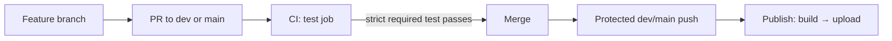

# 054 — PR-only CI and post-merge publish

## Background

GitHub branch protection prohibits direct pushes to `dev` and `main`, requires a pull request, and requires the strict `test` status check. Thus every mergeable branch tip has already passed CI against its target branch.

Current workflow cost repeats checks after merge:

- `.github/workflows/ci.yml` runs its 8-step `test` job on both `pull_request` and `push` to `dev`/`main`.
- `.github/workflows/publish.yml` runs an 11-step publish job after each branch push.
- `Taskfile.yml` `_publish` runs `task test → task lint → task gui:_build → cmd/publish`; `task test` includes Go helper/unit tests plus frontend browser and Node tests.

A merged `dev` or `main` commit therefore runs CI's Go tests and then the fuller `task test` suite again before deployment.

## Problem

Post-merge testing consumes Windows runner time and delays deployment without adding a distinct safety boundary: branch protection guarantees a passing PR check before a merge can create either protected-branch push.

## Questions and Answers

**Q1. Which events run tests?**
Only `pull_request` events targeting `dev` or `main`. `ci.yml` must remove its `push` trigger. *(User directive.)*

**Q2. Should deployment run tests again?**
No. `_publish` must no longer invoke `task test`; `publish.yml` continues to publish only on protected-branch pushes. *(User directive.)*

**Q3. Where do lint and the full test suite run?**
On the PR only. `ci.yml` runs `task test` (Go helper/unit plus frontend browser and Node tests) and `task lint`; it retains the frontend build prerequisite for Go's embedded `frontend/dist`. *(User decision.)*

**Q4. What runs during deployment?**
Only GUI build and upload. `_publish` becomes `task gui:_build → cmd/publish`; it invokes neither `task test` nor `task lint`. *(User decision.)*

**Q5. What if branch protection is weakened later?**
Publish would no longer be safe to assume a green PR. The deployment workflow itself cannot prove GitHub's branch-rule state. Operational invariant: do not remove the required strict `test` check or the direct-push prohibition while this design is active.

## Design



### Workflow contracts

```yaml
# .github/workflows/ci.yml
on:
  pull_request:
    branches: [dev, main]
```

```yaml
# Taskfile.yml
_publish:
  cmds:
    - task: gui:_build
    - cmd/publish ...

# PR CI runs, after the frontend build prerequisite:
# task test
# task lint
```

`publish.yml` retains its `push: [dev, main]` trigger, environment approval gates, per-branch concurrency, frontend prebuild, and R2 credential handling. The prebuild remains necessary because `assets.go` embeds `frontend/dist` and `_publish` builds only after the environment-specific `.env` file is written.

## Implementation Plan

1. Update tests first: add a repository-level workflow-contract check if one exists; otherwise validate the YAML trigger and Task invocation changes by inspection.
2. In `.github/workflows/ci.yml`, remove `push` under `on`, retain the named `test` job/status check, install golangci-lint, and run `task test` plus `task lint` after the frontend build prerequisite.
3. In `Taskfile.yml`, remove `task: test` and `task: lint` from `_publish`; revise its comments and publish task descriptions so they no longer claim that publishing tests or linting.
4. Do not alter `publish.yml` beyond comments if they become inaccurate.
5. Validate YAML parsing, Task target inspection, and confirm `test` remains the protected required check for `dev` and `main` through `gh api`.

## Examples

✅ A feature PR to `dev` builds frontend assets, runs the full test suite and lint, then satisfies the required `test` status check; after merge, deployment builds and uploads only.

✅ A PR to `main` is current with `main`, passes tests and lint, then its merge deploys through the protected production environment.

❌ A direct push bypasses the PR test. Branch protection must continue to reject it.

❌ A publish task invokes `task test` after this design; that restores the duplicate execution.

## Trade-offs

- Removes the post-merge test safety net. Safety relies on GitHub branch protection remaining enforced.
- PR duration increases because frontend tests and lint move into the required check; the same work is removed from post-merge deployment, where it would otherwise delay release.
- Deployment has no independent test or lint safety net. Safety relies on GitHub branch protection remaining enforced.

## Verification Criteria

- A pull request to `dev` or `main` creates exactly one `Test CI` test job; a direct protected-branch push cannot be used as a normal test trigger.
- The PR `test` job builds frontend assets, runs `task test`, and runs `task lint`.
- A protected-branch merge starts the applicable publish job without invoking `task test` or `task lint`.
- `_publish` executes GUI build and `cmd/publish` in that order.
- GitHub branch protection for `dev` and `main` still requires the strict `test` status check and disallows direct pushes.

## Implementation Results

Implemented 2026-07-26.

- `.github/workflows/ci.yml` now triggers only for PRs to `dev` and `main`; its retained `test` job builds frontend assets, runs `task test`, then runs `task lint`.
- `Taskfile.yml` `_publish` now runs only `task gui:_build` and `cmd/publish`; `publish:dev:remote` and `publish:prod` descriptions match.
- `.github/workflows/publish.yml` no longer installs golangci-lint or pre-builds frontend assets. This is a deliberate reduction beyond the initial plan: `gui:_build` already depends on `common:build:frontend` through `build/windows/Taskfile.yml`, so retaining the workflow-level prebuild would have performed the GUI build input twice.
- Validation: both workflow YAML files parse; `task test` passed; `task lint` passed with 0 issues; live branch-protection queries confirm strict required `test` checks remain on `dev` and `main`.

### Deviations

The initial design retained the publish workflow's frontend prebuild. Removed it after implementation inspection because the GUI build owns that dependency. Deployment still builds frontend once, as part of `gui:_build`.
