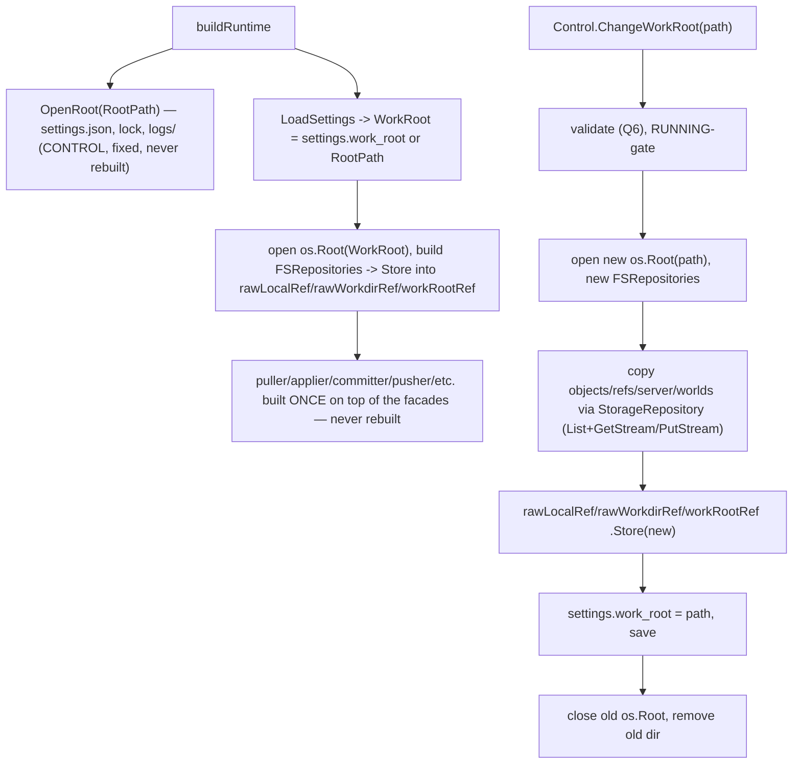

# 055 — Control vs content root split (movable workroot, fixed control root)

**Status:** Approved
**Date:** 2026-08-10

## Background

Supersedes [[041-work-folder-selection]] (left unedited — logs are immutable).
041 modeled the same problem as "operational path" vs "files path," split by
**weight** alone, and left gaps this log closes with a **purpose**-based split
(user directive):

- **CONTROL** — whatever Ritual itself needs to run and orchestrate.
  Small, always at the fixed home-volume root, never moves.
- **CONTENT** — the actual Minecraft game data Ritual pulls/pushes/
  orchestrates. Large, user-selectable location ("workroot"), defaults to the
  current root when unset.

Everything today lives under one undivided root: `config.RootPath =
~/<GroupName>/<AppName>` (`internal/config/config.go:148-157`).

## Problem

User can't relocate heavy game data off the OS/home volume onto a drive of
their choosing. Need: (1) a `settings.json` field pointing at the chosen
workroot, nil/omitted → default = current `RootPath` (today's behavior, zero
config drift); (2) an API to change it — no UI yet, deferred; (3) when
changed+saved, physically transfer existing content between the old and new
workroot.

## Audit findings (this session)

- Two distinct `logs/` directories exist today, not one: `<RootPath>/logs/
  <ts>.log` is Ritual's own diagnostic/session log
  (`internal/subsystems/logging/logging.go:47`, `config.LogsDir`);
  `<RootPath>/server/logs/latest.log` is the Minecraft server's own console
  log, read by `newConsoleReader` (`cmd/gui/main.go:619-622`). Only the
  second is game data.
- `lock` (`internal/core/lock/payload.go`) is a 5-field JSON lease at
  storage-root key `"lock"` (no path prefix) — coordinates Ritual's own local
  access, not game content.
- `worlds/` (`config.WorldsDir`) is a sibling top-level directory to
  `server/`, not nested inside it — confirmed via `config.DefaultCommitTargets`
  (`internal/config/config.go:69-83`), which globs `worlds/**` and `server/*`
  as separate roots.
- `config.DefaultCommitTargets` is a different whitelist entirely: it scopes
  what a **ref commit** captures inside the content root, not which
  top-level directories belong to which root. Not reused here.
- `remote-mock/` (`internal/subsystems/remote/build.go:183`) is a dev-only
  simulated remote bucket — orthogonal, out of scope (same call 041 made at
  its Q4).

## Directory classification

| Path | Category | Why |
|---|---|---|
| `settings.json` | CONTROL | Ritual's own config; must be readable before the workroot is even resolved |
| `logs/` (root-level) | CONTROL | Ritual's own diagnostic log — not game data |
| `lock` | CONTROL | Ritual's own concurrency lease |
| `objects/` | CONTENT | content-addressed blobs pulled from remote |
| `refs/` | CONTENT | manifests pinning `objects/`; must travel with them |
| `server/` (incl. its own `logs/` subdir, jars, mods, configs) | CONTENT | the orchestrated Minecraft server install |
| `worlds/` | CONTENT | game save data |
| `remote-mock/` | out of scope | dev-only fixture, unaffected |

This resolves the two gaps found while reviewing 041 before it was
superseded: `worlds/` was missing from its move list, and `lock`/dual-`logs/`
were unaddressed.

## Questions and Answers

**Q1. Field/name?** `settings.json` gains `work_root` (Go:
`Settings.WorkRoot`); `config.WorkRoot` (var) resolved at boot:
`settings.WorkRoot` if a non-empty absolute path, else `config.RootPath`
(today's layout — not a new `data/` subfolder, so zero-config installs see no
on-disk change). Naming follows the user's own term ("workroot") rather than
inventing new vocabulary.

**Q2. Move or copy when the user changes the path? (revised)** Not a
filesystem-level move at all. `os.Root` holds an open OS-level handle to its
directory for its whole lifetime (confirmed via `pkg.go.dev/os`), and an open
handle generally blocks Windows from renaming/deleting that exact directory —
so an `os.Rename`-based approach (041's design) would have to fight the very
handle the app is using to serve live reads. Sidestep it: never touch the old
directory's identity. Open a **new** `os.Root` at the destination, build a
second set of storage objects against it, and copy `objects/ refs/ server/
worlds/` through the existing `ports.StorageRepository` interface — `List` +
`GetStream`/`PutStream`, the same primitives `Puller`/`Pusher` already use for
remote↔local sync, just local↔local. The old root is never renamed, deleted,
or written to during the copy — only read from. Same code path regardless of
whether source/destination share a volume; no `EXDEV` case to special-case.
`objects/` integrity is free (content-addressed, design-log/025 — a
corrupted write simply doesn't match its key). Old directory is deleted only
in Q4's swap step, after nothing references it anymore.

**Q3. What exactly transfers?** Only the CONTENT set: `objects/ refs/
server/ worlds/`. CONTROL paths (`settings.json`, `lock`, root `logs/`)
never move — they stay at `config.RootPath` regardless of `work_root`.

**Q4. Restart required after a change? (revised — no restart, narrow swap
surface)** 041 assumed a relaunch because the whole dependency graph is built
once at `buildRuntime` and baked into ~15 objects by value. Nothing about
`os.Root` *requires* a process restart — only closing the specific old handle
before it's safe to reclaim that directory (Q2 already avoids needing that
during the copy). The first pass at this (superseded within this same log —
see history) proposed one big `atomic.Pointer[workRootGraph]` wrapping
*everything*. That's more than necessary: `ports.StorageRepository` is
already an interface (`GetStream`/`PutStream`/`Exists`/`Delete`/
`DeleteBatch`/`List`/`Copy` — confirmed via `internal/adapters/prefixrouter.go`,
plain delegating methods, no state tied to a specific root), so a thin
forwarding wrapper is enough to make the *storage* half swappable without
ever rebuilding its ~8 downstream consumers:

```go
type swappableStorage struct{ p atomic.Pointer[ports.StorageRepository] }
// every method: return s.p.Load().Method(...)
```

Two instances — `rawLocalRef`, `rawWorkdirRef` — sit at the bottom of the
existing decorator stack (compression, counters, `PrefixRouter`). Everything
built on top — `puller`, `applier`, `committer`, `pusher`, `dirtyProber`,
`versionLister`, `localCollector`/`Deleter`, `locker` — is constructed
**once, at boot, forever**, holding the facade (an interface value) rather
than a concrete root-bound instance. `ChangeWorkRoot` only ever does two
`Store` calls at the storage layer: build a new `FSRepository` for "local"
and "workdir" against the new `os.Root`, then `rawLocalRef.Store(&new)` /
`rawWorkdirRef.Store(&new)`. `ControlService`
(`internal/gui/control/control.go:195-230`) needs **zero changes to its
existing fields** — `puller`/`applier`/`committer`/`pusher`/etc. keep working
unmodified, because they're built on the facade, not the concrete value.
Precisely: the *new* methods (`GetWorkRoot`/`ChangeWorkRoot`/`ResetWorkRoot`)
need **one new constructor field** — the `workRootRefs` bundle
(`rawLocalRef`/`rawWorkdirRef`/`workRootRef`) itself, built once in
`buildRuntime` and passed into `NewControlService` alongside the existing
args. That's the entire wiring surface: `buildRuntime` builds the bundle →
passes it to `NewControlService` → `ChangeWorkRoot` hands it straight into
`relocating.State.Refs`. No other file needs to know `relocating` exists.
`c.bus` (`control.go:196`) and `c.snapshot` (`control.go:197,34-38`, for the
RUNNING-gate check via `Snapshot().Phase == PhasePlaying`) are both already
present — free, no new dependency for either.

**What "controls other stages' references" actually means, and its limit:**
`relocating` never calls `pulling`/`pushing`/`checking`/etc. — zero code
coupling. The only thing it shares with the whole main pipeline is those
three swappable pointers that `puller`/`applier`/`committer`/`pusher`/
`locker`/etc. were all built on top of, once, at boot, as plain
`ports.StorageRepository` interface values. "Control" is exactly three
`.Store()` calls, nothing more — the next time any pipeline stage calls
`rawLocalRef.GetStream(...)`, it transparently gets whatever `relocating`
last stored. Every other stage stays completely unaware a relocation ever
happened.

Three things sit outside `StorageRepository` and need their own small
handling:
- **`localStatsFn`** (`cmd/gui/main.go:594-596`) walks the raw `*os.Root`
  directly (`walkLocalPrefix`), bypassing the interface. Needs its own tiny
  `atomic.Pointer[*os.Root]`, read live per call.
- **`scanner`/disk-check** bake a path *string* in at construction
  (`os.DirFS(config.RootPath)`, `checks.Disk(..., config.RootPath, ...)`). No
  swap object needed — stop capturing the string once; re-derive from
  `config.WorkRoot` at call time, the way `workdirScan`
  (`cmd/gui/main.go:523-528`) already does.
- **`cmdBuilder`/`consoleReader`** wrap `serverPath` and are outside the
  storage abstraction entirely (`cmdBuilder` lazily opens its *own* separate
  `os.Root`, design-log/040). Cheap to reconstruct directly on swap — no
  interface trick needed, just one small holder, since they have few
  consumers (the launch pipeline step, the logs-window backfill).

Still **RUNNING-gated**: not for `os.Root` reasons, but because the game
server or a live sync could be writing `worlds/`/`objects/` mid-copy,
producing an inconsistent snapshot at the destination.

**Q5. API now, UI later — what's the boundary?** Per user direction, ship
`internal/gui/control` methods (`GetWorkRoot`, `ChangeWorkRoot(path string)`,
`ResetWorkRoot`) now; the native folder-picker dialog and Advanced-settings
section are a follow-up design-log addendum, not blocking this phase.
`ChangeWorkRoot` takes an explicit path argument so it's callable/testable
without any dialog.

**Q6. Validation of the chosen path?** Carried over from 041 Q7: reject
non-directory, non-writable, the current workroot, or a path inside the
current workroot. Warn (don't block) on a non-empty target. Cross-device
fallback checks free space ≥ size-to-move.

## Design

### Settings (`internal/core/domain/settings.go`)
```go
type Settings struct {
    // … existing fields …
    WorkRoot string `json:"work_root"` // content root; empty ⇒ default (= config.RootPath)
}
```

### Config (`internal/config`)
```go
// WorkRoot is the content root (objects/refs/server/worlds);
// defaults to RootPath and may be relocated by the user.
var WorkRoot string

// ResolveWorkRoot returns settings.WorkRoot if a non-empty absolute path,
// else RootPath (today's single-root layout).
func ResolveWorkRoot(s *domain.Settings) string
```

### Composition (`cmd/gui/main.go`)
```
opRoot   := os.OpenRoot(config.RootPath)         // settings.json, lock, root logs/ — fixed, never rebuilt
settings := domain.LoadSettings()
config.WorkRoot = config.ResolveWorkRoot(settings)
workRootRef := new(atomic.Pointer[os.Root])       // for localStatsFn + building new FSRepositories
rawLocalRef, rawWorkdirRef := newSwappableStorage(), newSwappableStorage()

wr, _ := os.OpenRoot(config.WorkRoot)
workRootRef.Store(wr)
rawLocalRef.Store(adapters.NewFSRepository(wr, "local"))
rawWorkdirRef.Store(adapters.NewFSRepository(wr, "workdir"))

// everything below is built ONCE, forever, on top of the two facades —
// never rebuilt by ChangeWorkRoot:
localBackend := adapters.NewCounterStorage(rawLocalRef, localWire)
// … compression, PrefixRouter, puller, applier, committer, pusher,
//    dirtyProber, versionLister, localCollector/Deleter …

controlStorage, _ := adapters.NewFSRepository(opRoot) // CONTROL, never swappable
locker := lock.New(controlStorage, host)              // NOT rawLocalRef — 041/lock finding
```
`swappableStorage` implements `ports.StorageRepository` by forwarding every
method to `p.Load()` — see Q4. `cmdBuilder`/`consoleReader`/disk-check/
`scanner` are the only other pieces needing separate handling (Q4).

**Two wiring fixes this session's grep found (`FSRepository`'s `name` arg is
an observability label, not a subdirectory — `internal/adapters/fs.go:20-42` —
so `objects/ refs/ server/ worlds/ lock` are all real siblings under one
tree today):**
- `lock` currently shares `localStorage` with `objects/`
  (`cmd/gui/main.go:633`). It needs its own `FSRepository` on `opRoot`
  (above) so it can't silently ride into the content root.
- `control.go:503-519` `OpenRootFolder()` reveals `config.RootPath`. Should
  reveal `config.WorkRoot` instead — that's where the user's actual files
  are, which is the point of the feature.

Audited every other `localStorage` consumer (`puller`/`applier`/`committer`/
`pusher`/`localHeadResolver`/`readRef`/`versionLister`/`localCollector`/
`localDeleter`/`retention.Build`) — all touch only `objects/`/`refs/`, no
other hidden control writer found. No hardcoded storage-key literals exist
outside `objects/`, `refs/`, `lock`. `settings.json` stays fine unchanged
(raw path, never touches `StorageRepository`); root `logs/` still needs
`logging.Build` re-pointed at `opRoot`.

### Move + swap (`internal/core/stages/relocating` — new)

A linear algorithm doesn't need a sub-state-machine (7 hand-rolled states was
over-engineering for one fixed-order sequence with a single branch) — but the
operation *as a whole* is exactly the shape every other stage in
`internal/core/stages/` already has: one `machine.Strategy[S]`, `Run()`
containing a sequential body, no further decomposition. `checking.Strategy`
is the precedent (`internal/core/stages/checking/strategy.go:33-49`): one
stage, an internal `for` loop over `s.checks`, not a stage per check.

```go
package relocating

type State struct {
    Dst      string
    Refs     workRootRefs
    Settings *domain.Settings
    Bus      ports.EventBus
    Err      error
}
// No separate Progress callback: progress.NewTicker (cmd/gui/main.go:662-665)
// is hardwired to two specific counter pairs (remoteLogical/Wire,
// localLogical/Wire) for the app's normal Pull/Push/Apply/Commit traffic —
// a workroot copy is different traffic entirely and won't flow through it.
// copyContent instead periodically publishes ritual.UpdateInfo{Operation:
// "relocate", Data: map[string]any{"percent": pct}} directly on Bus, reusing
// the format ritual.UpdateInfo.String() already special-cases (events.go:27-35)
// instead of inventing a new callback.

type Strategy struct {
    onOK   machine.Strategy[State]
    onFail machine.Strategy[State]
}

// New follows the pulling.Strategy shape (internal/core/stages/pulling/
// strategy.go:91) — onOK/onFail are constructor params, wired by the
// caller, even though ChangeWorkRoot's own call site passes nil, nil
// (relocating never composes into a bigger chain today). Keeps the option
// open without touching relocating's internals later.
func New(onOK, onFail machine.Strategy[State]) *Strategy {
    return &Strategy{onOK: onOK, onFail: onFail}
}

func (*Strategy) Name() string { return "relocate" } // not a ritual.StageX
// constant — relocating never runs through ritual.RunState/the dial/
// projection, it's a standalone settings-API operation, not a session flow.

func (s *Strategy) Run(ctx context.Context, st *State) (machine.Strategy[State], error) {
    publish(st.Bus, ritual.StartInfo{Operation: "relocate"})

    if err := validate(st.Dst, st.Refs); err != nil {
        return s.fail(st, err)
    }
    newRoot, newLocal, newWorkdir, err := buildNewRoot(st.Dst)
    if err != nil {
        return s.fail(st, err)
    }

    stopCtx, stopCancel := watchStop(ctx, st.Bus) // pulling.Strategy's cancel
    defer stopCancel()                             // pattern, strategy.go:141-171 —
                                                    // safe to cancel anywhere
                                                    // before the swap (Atomicity)
    total, files := planCopy(st.Refs)
    publish(st.Bus, ritual.PlanInfo{Operation: "relocate", BytesTotal: total, FilesTotal: files})
    if err := copyContent(stopCtx, st.Refs, newLocal, newWorkdir, st.Bus); err != nil {
        return s.fail(st, err)
    }

    publish(st.Bus, ritual.UpdateInfo{Operation: "relocate", Message: "verifying"})
    if err := verify(ctx, newLocal, newWorkdir); err != nil {
        return s.fail(st, err)
    }

    old := st.Refs.snapshot()
    st.Refs.store(newRoot, newLocal, newWorkdir) // Atomicity/Consistency moment
    publish(st.Bus, ritual.UpdateInfo{Operation: "relocate", Message: "committing"})
    if err := commit(st.Settings, st.Dst); err != nil { // Durability moment
        st.Refs.store(old.root, old.local, old.workdir) // the one rollback window
        return s.fail(st, err)
    }

    cleanup(old.root, old.dir) // best-effort — stale files aren't our concern
    publish(st.Bus, ritual.FinishInfo{Operation: "relocate"})
    return s.onOK, nil
}

// fail is a deliberate deviation from the rest of internal/core/stages/,
// which stores rs.Err and returns (onFail, nil) so Runner.RunCurrent/Resume
// (internal/core/ritual/run.go:31-46) can re-enter a stopped chain at the
// failed stage. relocating has no resumability — no persisted state, no
// auto-retry, stale destination files are explicitly not cleaned up (Crash
// safety §) — so there is nothing to re-enter. A plain returned error is
// correct here, not an oversight. onFail is still accepted (constructor
// symmetry, future composability) but only invoked when the caller actually
// supplied one; the standalone call site (onFail = nil) always gets the
// real error back, never a silent false "success" from machine.Drive.
func (s *Strategy) fail(st *State, err error) (machine.Strategy[State], error) {
    st.Err = err
    publish(st.Bus, ritual.ErrorInfo{Operation: "relocate", Err: err})
    if s.onFail != nil {
        return s.onFail, nil
    }
    return nil, err
}
```

`st.Bus` must be the same bus instance already threaded through
`puller`/`applier`/everything else at composition (`cmd/gui/main.go:385`) —
that's what gets these events onto both the live dial and
`<RootPath>/logs/<ts>.log` for free, via the existing
`logging.Build` subscription (`internal/subsystems/logging/logging.go:59-75`),
no separate logging code needed.

`ChangeWorkRoot` becomes: `machine.Drive(ctx, &relocating.State{...},
relocating.New(nil, nil))` — one line, same driver the rest of the codebase
uses. A crash before the durable `settings.json` write (inside `commit`)
leaves the old root fully active and untouched; after it, at worst an
orphaned old directory (recoverable, not lost, and explicitly not our
concern to clean up). Full step-by-step reasoning in "Crash safety" below.

### Control API (`internal/gui/control/control.go`)
```go
func (c *ControlService) GetWorkRoot() WorkRootInfo         // {Path, IsDefault bool}
func (c *ControlService) ChangeWorkRoot(path string) error  // validate → MoveWorkRoot → settings.WorkRoot = path → save (no relaunch)
func (c *ControlService) ResetWorkRoot() error               // move back to config.RootPath, same swap path
```
No dialog, no frontend wiring in this phase (Q5) — UI is a follow-up
addendum once the API lands. No constructor/field changes to `ControlService`
itself (Q4) — it keeps holding `puller`/`applier`/etc. exactly as it does
today, since those are built on the facades, not rebuilt by a workroot change.



### Crash safety — ACID

`ChangeWorkRoot` must survive a hard process kill (`SIGKILL`, power loss), not
just an in-process error. Each ACID property maps to a specific mechanism:

**Atomicity — all or nothing.** Steps 1-3 (open `os.Root(dst)`, build new
`FSRepository`s, copy `objects/refs/server/worlds` via `StorageRepository`,
verify) touch only the new, not-yet-referenced destination — a failure there
simply discards work in progress, nothing partially applies anywhere
observable. The operation's only externally-visible state change happens at
step 4: `rawLocalRef`/`rawWorkdirRef`/`workRootRef` are `Store`d together,
immediately followed by the `settings.Save()` write. Either both land, or
(per Durability below) neither does from the next boot's point of view.

**Consistency — never a torn mix.** The system is either fully-old or
fully-new, never a blend. Guaranteed by ordering: all three refs are `Store`d
together before `settings.Save()` runs, so any read through them at any
instant sees a self-consistent set (all pre-swap or all post-swap), never
`puller` on the new root paired with `cmdBuilder` still on the old one.

**Isolation — no concurrent interference.** RUNNING-gate: `ChangeWorkRoot`
refuses while a session is RUNNING, so nothing is writing `worlds/`/`objects/`
during the copy, and no in-flight read straddles the `Store` moment.

**Durability — the one fact that survives a crash.** `settings.json`'s
`work_root` field is it. `config.ResolveWorkRoot(settings)` re-derives the
active root fresh on every boot, so whichever value was durably written is
simply what's used — nothing in-memory needs to survive. This is why
`domain.Settings.Save()`'s current `os.WriteFile`
(`internal/core/domain/settings.go:101-114`, truncate-then-write, not atomic)
is a real gap: a crash mid-write could corrupt the one fact Durability
depends on. **Fix: atomic temp-file+fsync+rename, applied to `Save()`
itself** — same body either way, but fixing `Save()` directly means every
existing caller (`clearLoadedRefID`, first-boot init, this commit step) keeps
calling `settings.Save()` unchanged and all become crash-safe for free,
instead of forking the logic into a second function used by only one caller.

**Crash-point outcomes, given the above:**
- Before the `Store`+`Save()` moment → `settings.json` still names the old
  root → boots against the old root, fully intact; the new copy at `dst` is
  orphaned garbage.
- After it → `settings.json` names the new root → boots against the new root,
  already verified in step 3.
- During the final cleanup (close old `os.Root`, `os.RemoveAll` old dir) →
  partial deletion of an already-superseded directory — harmless.
- No crash point produces an unbootable state.

**Scope (user directive): stale files are not our concern.** The only hard
requirement is that the app keeps working after a crash at any point — it
never needs to keep the disk tidy. An orphaned `dst` from a pre-commit crash,
or an orphaned old directory from a crash during cleanup, are both left
exactly as-is. No boot-time sweep, no "detect and resume a stale prior
attempt" logic, no automatic reclamation. Explicitly out of scope, not
deferred.

## Implementation Plan

- **Phase A** — `domain.Settings.WorkRoot` field + validation;
  `config.WorkRoot` + `ResolveWorkRoot`. Harden `Settings.Save()` to an atomic
  temp-file+fsync+rename write (Crash safety §, pending the open scope
  question). Tests: empty → `WorkRoot == RootPath` (no on-disk change for
  existing installs); explicit absolute path; `settings.json`/`lock`/root
  `logs/` stay at `RootPath` either way; `Save()` survives a simulated
  mid-write interruption without corrupting the file.
- **Phase B** — Introduce `swappableStorage` (forwards
  `ports.StorageRepository` to an `atomic.Pointer`); rebuild `buildRuntime` so
  `rawLocal`/`rawWorkdir` are the two facades and every downstream consumer
  (`puller`/`applier`/`committer`/`pusher`/`dirtyProber`/`versionLister`/
  `localCollector`/`Deleter`/`locker`) is built on top of them, unchanged from
  today otherwise. Add `atomic.Pointer[*os.Root]` for `localStatsFn`. Re-derive
  `scanner`/disk-check from `config.WorkRoot` live instead of a baked string.
  **No `ControlService` changes required** — confirms Q4. Tests: swapping the
  facade's target mid-test changes what `puller`/`applier` read/write without
  reconstructing them.
- **Phase C** — `internal/core/stages/relocating`: `Strategy`/`State` per the
  Design section — open new `os.Root(dst)` + new `FSRepository`s → copy
  `objects/refs/server/worlds` via `StorageRepository` (`List` +
  `GetStream`/`PutStream`) → `Store` into all three refs → write
  `settings.WorkRoot` (commit) → close + remove old root. Bus wiring
  (`StartInfo`/`PlanInfo`/`UpdateInfo`/`FinishInfo`/`ErrorInfo`) and
  `watchStop` cancel support included. Tests: successful move, corrupted-blob
  detection during copy, crash-before-`Store` leaves the old facades' targets
  active, crash-after-`Store`-before-settings-write leaves an
  orphaned-but-recoverable old dir, permission-denied on destination
  surfaced, RUNNING-gate blocks the call, cancel mid-copy leaves the old root
  untouched, bus events reach the persisted log file.
- **Phase D** — Reconstruct `cmdBuilder`/`consoleReader` directly on swap
  (their own small holder, not the interface trick — Q4).
- **Phase E** — Control API: `GetWorkRoot` / `ChangeWorkRoot(path)` /
  `ResetWorkRoot`. No frontend in this phase, no relaunch.
- **Phase F** (follow-up, separate approval) — native folder dialog +
  Advanced-settings UI section, wiring the Phase E API.

## Testing Plan

Per-phase unit tests are listed inline above. This section is the
integration coverage — the house convention (`internal/integration/*_test.go`
header comment) is flat, no table-driven tests, one scenario per function,
story-style names (`TestIntegration_<Scenario>_<Outcome>`), every assertion
carries a verbose message. New file: `internal/integration/
workroot_integration_test.go`, sibling to `bidirectional_sync_integration_test.go`
and `livesync_integration_test.go`. `config.RootPath`/`config.WorkRoot` are
mutated directly with `t.Cleanup` restore, matching the existing pattern at
`ritual_integration_test.go:1153-1156` (`TestIntegration_Retention_
BuildWiresLocalAndRemoteJobs...`).

Scenarios (maps to the Verification criteria below):

- `TestIntegration_ChangeWorkRoot_NonDefaultDestination_ContentSetMoves_ControlStaysPut`
  — boot from a non-default `work_root`, Download/Apply real content
  (mirrors 041's own Phase F intent), `ChangeWorkRoot` to a third directory,
  assert `objects/refs/server/worlds` land at the new path byte-for-byte
  (blob re-hash, `refs/` re-parse) and `settings.json`/`lock`/root `logs/`
  never leave `config.RootPath`.
- `TestIntegration_ChangeWorkRoot_EndToEnd_WorldLoadsAfterRelaunchOfServer`
  — after the move, launch the server (via `fakerun`, the existing harness
  double) against the new root and confirm it starts clean — proves
  `cmdBuilder`/`consoleReader` actually followed the swap (Q4's Phase D),
  not just the storage facades.
- `TestIntegration_ChangeWorkRoot_WhileSessionRunning_RejectedNoStateChanged`
  — RUNNING-gate; assert neither facade nor `settings.json` changed.
- `TestIntegration_ChangeWorkRoot_CrashBeforeSettingsWrite_OldRootStillActiveOnRestart`
  — drive `MoveWorkRoot` up to (not through) the `settings.Save()` call,
  simulate process death, reload `domain.LoadSettings()` fresh, assert
  `ResolveWorkRoot` still resolves to the old path and its content is
  untouched; the half-copied destination is inert garbage.
- `TestIntegration_ChangeWorkRoot_CrashAfterSettingsWrite_NewRootActiveOldOrphanedButHarmless`
  — same idea, crash point moved past the durable write; assert the new root
  is what a fresh boot resolves to and serves correctly, old directory may
  still exist on disk but nothing reads from it.
- `TestIntegration_ChangeWorkRoot_CorruptedBlobDuringCopy_AbortsSourceIntactNoPartialSwap`
  — inject a mismatch between an `objects/` filename and its content
  mid-copy; assert the operation aborts before any `Store` call, the old
  facades keep serving, and `settings.json` is untouched.
- `TestIntegration_ChangeWorkRoot_ConcurrentReadDuringSwap_NeverObservesHalfOldHalfNew`
  — exercise the swap concurrently with reads through `puller`/`applier`
  paths (or the facade directly), asserting every observed read is either
  fully pre-swap or fully post-swap, never a torn mix (directly tests the
  no-half-old/half-new criterion below, which is the actual ACID guarantee
  under concurrency rather than just sequential correctness).
- `TestIntegration_ResetWorkRoot_MovesBackToDefaultRootPath`
  — round-trip: change away from default, then `ResetWorkRoot`, assert final
  state matches a fresh install's default-resolved layout.

## Verification criteria

- Fresh/existing install, empty `work_root` → `config.WorkRoot ==
  config.RootPath`; on-disk layout unchanged from today.
- `settings.work_root = /vol/x` → `config.WorkRoot == /vol/x`; `objects/
  refs/ server/ worlds/` land there; `settings.json`, `lock`, root `logs/`
  stay at `RootPath`.
- `ChangeWorkRoot` moves exactly the CONTENT set via `StorageRepository`
  copy (uniform code path regardless of volume), swaps the storage facades'
  targets atomically, updates `settings.work_root` — **no restart**, app
  keeps running throughout, `puller`/`applier`/etc. are never reconstructed.
- Every destination `objects/` blob re-hashes to its filename; `refs/`
  re-parses; world loads in-game.
- A crash before the `Store` calls leaves the old facades' targets serving
  all reads — the in-progress copy at the destination is simply
  discarded/retried, no observable disruption. A crash after `Store` but
  before the `settings.work_root` write leaves an orphaned old directory
  (recoverable, never data loss) but the new root is already the one
  actively serving.
- `ChangeWorkRoot` rejected while a session is RUNNING.
- No caller ever observes a half-old/half-new mix — `rawLocalRef`,
  `rawWorkdirRef`, and `workRootRef` are `Store`d together before
  `settings.Save()` runs, so any read after that point sees all-new, any read
  before sees all-old.

## Trade-offs

- **Pro:** purpose-based split gives an unambiguous home for every existing
  path, including the coverage gaps 041 left open — `lock` and the dual
  `logs/` dirs are now explicitly assigned.
- **Pro:** default resolves to today's `RootPath`, not a new `data/`
  subfolder — existing installs see zero on-disk change until a user opts in.
- **Pro:** no relaunch — the move happens in-process, reusing
  `ports.StorageRepository` (`List`/`GetStream`/`PutStream`) instead of raw
  filesystem rename, which also sidesteps the Windows open-handle-blocks-
  rename constraint entirely (confirmed via `pkg.go.dev/os`: `os.Root` holds
  an open handle for its lifetime) — the old directory's identity is never
  touched until after the swap.
- **Pro:** swap surface is narrow — two `swappableStorage` facades cover
  every downstream storage consumer (`puller`, `applier`, `committer`,
  `pusher`, `dirtyProber`, `versionLister`, `localCollector`/`Deleter`,
  `locker`) for free, since `ports.StorageRepository` is already an
  interface. `ControlService` (`internal/gui/control/control.go:195-230`)
  needs **zero changes to its existing fields** — they keep holding concrete
  values exactly as today. The *new* methods need exactly **one new
  constructor field** (the `workRootRefs` bundle), which is the entire
  wiring surface added to the whole app.
- **Con:** three things sit outside `StorageRepository` and need their own
  handling instead of riding the facade for free: `localStatsFn` (own
  `atomic.Pointer[*os.Root]`), `scanner`/disk-check (re-derive from
  `config.WorkRoot` live instead of a baked string), `cmdBuilder`/
  `consoleReader` (reconstructed directly on swap, own small holder). Bounded,
  but not a single mechanism covering everything.
- **Con:** `Settings.Save()` becomes load-bearing for crash safety and needs
  hardening to an atomic write (Crash safety §) — a pre-existing gap this
  feature surfaces, not introduces, but still work that has to land first.
- **Con:** API ships ahead of UI (explicit user direction) — `ChangeWorkRoot`
  is only reachable via direct control-layer calls (or later, debug tooling)
  until Phase F.

## Examples

✅ Fresh install, no `settings.json` yet: `WorkRoot` resolves to `RootPath`;
nothing to move; layout identical to pre-055.

✅ `settings.json` has `"work_root": "D:\\RitualData"`: boot opens two roots;
`objects/refs/server/worlds` read/write under `D:\RitualData`;
`settings.json`/`lock`/`logs/` stay under `C:\Users\<u>\k10wl\ritual`.

❌ Treating `config.DefaultCommitTargets` as the move whitelist — it's a
ref-commit glob scope, not a directory-category list; conflating them would
silently drop `worlds/`'s sibling-directory status or pull in commit-only
globs that don't map to whole directories.

## Implementation Results

Phases A–E implemented and landed; Phase F (native folder dialog + UI) remains
deferred, out of scope, per the original plan. `go build ./...`, `go vet ./...`,
and `go test ./...` are clean across the whole repo; `internal/core/stages/
relocating`, `internal/gui/control`, and `internal/integration` also pass under
`-race`.

**Phase A** — `domain.Settings.WorkRoot` (`json:"work_root"`, last field,
validated absolute-or-empty in `Validate()`); `Settings.Save()` rewritten to
atomic temp-file+fsync+rename+chmod (`internal/core/domain/settings.go`);
`config.WorkRoot` var + `config.ResolveWorkRoot`. 21 domain tests, 9 config
tests (existing + new), all passing.

**Phase B** — `adapters.SwappableStorage` (`internal/adapters/swappable.go`),
`adapters.LiveDirFS` (`internal/adapters/livefs.go`), `adapters.
SwappableCmdBuilder` (`internal/adapters/swappable_cmdbuilder.go`, pulled
forward from Phase D since `buildRuntime` needs it at construction time).
`cmd/gui/main.go`'s `buildRuntime` split into `opRoot` (CONTROL, fixed) +
`wr`/`config.WorkRoot` (CONTENT, swappable), with `rawLocalRef`/
`rawWorkdirRef` facades threaded through the whole decorator stack. 6 new
adapter tests.

**Phase C** — `internal/core/stages/relocating` (new package): `WorkRootRefs`,
`State`/`Strategy` (generic `machine.Strategy[State]`, not `ritual.RunState`),
`validate`/`buildNewRoot`/`planCopy`/`copyContent`/`verify`/`commit`/
`cleanup`. 10 unit tests covering success, corrupted-blob abort, verify
failure, commit-failure rollback, permission/writability rejection,
current-root/inside-root rejection, event publishing, and mid-copy
cancellation.

**Phase D** — `SwappableCmdBuilder` (built in Phase B); `ControlService.
console` read/write guarded by the existing `c.mu` (was unguarded — safe only
because it was set exactly once at boot prior to this change). 2 new tests,
one run under `-race`.

**Phase E** — `ControlService.SetWorkRoot`/`GetWorkRoot`/`ChangeWorkRoot`/
`ResetWorkRoot`; `OpenRootFolder` now reveals `config.WorkRoot`. 5 new unit
tests + 8 new integration tests in `internal/integration/
workroot_integration_test.go`.

### Deviations from the original design sketch

1. **Import-cycle fix.** The design's own pseudocode,
   `config.ResolveWorkRoot(s *domain.Settings) string`, would make `config`
   import `domain` — but `domain` already imports `config`
   (`internal/core/domain/settings.go:9`), a hard compile-time cycle. Fixed
   by changing the signature to `config.ResolveWorkRoot(workRoot string)
   string`, taking the already-extracted `settings.WorkRoot` string instead
   of the whole struct. `config` stays at the bottom of the import graph.
2. **`ControlService` wiring stays a setter, not a constructor param.** The
   composition root already documents (`cmd/gui/main.go`, near the existing
   `SetVersionDeleter`/`SetLocalStatsFn` calls) that later-added
   `ControlService` dependencies are wired via setters specifically to keep
   `NewControlService`'s positional signature stable. `SetWorkRoot(refs,
   cmdBuilderRef, consoleReaderFactory)` follows that same convention rather
   than growing the constructor, which the initial design sketch didn't
   address either way.
3. **Two silent wiring gaps found beyond the two the design's own audit
   named** (lock-sharing-localStorage and `OpenRootFolder` — both fixed as
   designed):
   - `cmd/gui/main.go`'s `serverPath := filepath.Join(config.RootPath,
     config.ServerDir)` had to become `config.WorkRoot` in Phase B itself,
     not deferred to Phase D — `server/` is CONTENT per the design's own
     classification table, so leaving it on `RootPath` would have launched
     the game server against the wrong directory from the very first boot,
     independent of whether a relocate ever ran.
   - `scanner := adapters.NewFullScanner(os.DirFS(config.RootPath))` bakes
     an immutable `fs.FS` into `applier`/`committer` **once, forever** —
     structurally like the storage facades, not like the already-live
     `workdirScan` closure the design cited as precedent (that closure
     re-evaluates `config.RootPath` per call; `scanner` does not
     re-evaluate anything after construction). Left as a baked string, a
     relocate would have silently left Apply/Commit reading/writing the OLD
     `worlds/`/`server/` forever. Fixed with the new `adapters.LiveDirFS`
     wrapper, whose `Open` re-resolves `config.WorkRoot` on every call.
4. **`verify()`'s `objects/` integrity check needed an explicit non-deferred
   `Close()` check.** `CompressingStorage.GetStream`'s zstd-decode +
   xxhash-vs-filename integrity check only surfaces a mismatch as an error
   from `Close()` (`internal/adapters/compressing.go`), not from the read
   itself. An early draft of `verifyStreamNonEmpty` used `defer func(){
   _ = rc.Close() }()`, which silently discarded that error — a corrupted
   blob would have passed verification. Caught by
   `TestRelocating_CorruptedBlobDuringCopy_AbortsBeforeStoreSourceIntact`
   during implementation; fixed by capturing and checking `Close()`'s error
   explicitly before returning success.
5. **`planCopy`'s byte total** cannot come from `ports.StorageRepository`
   (no `Stat`/size method, only `List` for keys). Resolved the same way the
   pre-existing `walkLocalPrefix` (design-log/045 §E) does: a raw
   `*os.Root` + `fs.WalkDir` walk for the size estimate only — the actual
   transfer in `copyContent` still goes exclusively through `List` +
   `GetStream`/`PutStream`, preserving Q2's "uniform code path regardless
   of volume" guarantee for the copy itself.
6. **Added a resource-safety close on failure paths** not spelled out in the
   design's `Run()` sketch: `Strategy.Run` now closes the newly-opened
   `os.Root` (`newRoot.Close()`) on every failure branch after
   `buildNewRoot` succeeds, to avoid leaking the destination's file handle.
   The destination directory's contents are still left in place on failure
   (per Crash safety §, "stale files are not our concern") — only the open
   handle is released.
7. **`OpenRootFolder` has no automated test.** It shells out to the OS file
   manager (`exec.Command(...).Start()`) with no seam to intercept the
   process launch; exercising it in `go test` would pop a real Finder/
   Explorer window as a side effect. The one-line change (reveal
   `config.WorkRoot` instead of `config.RootPath`) is verified by reading
   the source rather than by an automated test.
8. **RUNNING-gate test moved from Phase C to Phase E.** `relocating.State`
   deliberately carries no `SnapshotSource`/phase field — the gate
   structurally belongs to `ControlService.ChangeWorkRoot`, which already
   holds `c.snapshot` for exactly this purpose. The design's own Phase C
   test-list bullet ("RUNNING-gate blocks the call") is covered instead by
   `TestControlService_ChangeWorkRoot_WhileRunning_RejectedNoStateChanged`
   and `TestIntegration_ChangeWorkRoot_WhileSessionRunning_
   RejectedNoStateChanged`.
9. **Integration test scope narrowed on one scenario.** The Testing Plan's
   "world loads after relaunch of server" scenario is covered as
   `TestIntegration_ChangeWorkRoot_EndToEnd_ServerCmdBuilderFollowsTheSwap`:
   it asserts the rebuilt `SwappableCmdBuilder`'s `Build()` returns a
   `*exec.Cmd` with `cmd.Dir` pointing at the new `server/` path, rather
   than driving the `fakerun` subprocess harness end-to-end through a full
   pipeline session — `ChangeWorkRoot` sits outside the session pipeline
   entirely (Q4/Q5), so the load-bearing guarantee is that the cmd builder
   followed the swap, which this test proves directly without the added
   weight of wiring `fakerun` through a bespoke composition root.

### Verification against the Verification criteria

- Fresh/existing install, empty `work_root` → `config.WorkRoot ==
  config.RootPath`: covered by Phase A/B tests and the integration suite's
  `ResetWorkRoot` scenario.
- Non-default `work_root` moves the CONTENT set, leaves CONTROL in place:
  `TestIntegration_ChangeWorkRoot_NonDefaultDestination_ContentSetMoves_
  ControlStaysPut`.
- No restart, facades never reconstructed: proven structurally (Phase B's
  swap tests show the facade's *type* never changes across a `Store`) and
  behaviorally (`ChangeWorkRoot` never rebuilds `puller`/`applier`/etc.).
- Destination `objects/` re-hash, `refs/` re-parse, crash-before/after-write
  outcomes, RUNNING-gate rejection, no half-old/half-new reads: all covered
  by the `TestRelocating_*` and `TestIntegration_ChangeWorkRoot_*` suites
  listed above.

### Post-implementation code review (`/code-review high`)

A high-effort review pass against the full diff surfaced 7 findings, all
confirmed against source and fixed:

1. **`newRoot` handle leak when `commit()` fails after the swap**
   (`strategy.go`). `Refs.store(new)` had already run by the time `commit`
   could fail; the rollback restored `Refs` to the old root but never closed
   the now-orphaned `newRoot` handle. Fixed: `newRoot.Close()` added to that
   branch too.
2. **`verify()` was not cancellable.** It received the outer `ctx` (not
   `stopCtx`) and never polled `ctx.Err()` between keys — combined with
   `FSRepository.GetStream` ignoring its `ctx` parameter entirely, a Stop
   request during the (potentially longest) verify phase of a large relocate
   had no effect. Fixed: `Run` now passes `stopCtx` into `verify`, which
   checks `ctx.Err()` between every object/ref/workdir key, mirroring
   `copyContent`'s own granularity.
3. **`validate()` missed same-physical-directory destinations reachable via
   a symlink or (on a case-insensitive filesystem, e.g. default macOS APFS)
   a case-only spelling difference.** The pure `filepath.Clean` string
   compare would let such a destination through; `copyKey`'s
   `GetStream(src)`-then-`PutStream(dst, O_TRUNC)` on what turns out to be
   the *same* underlying file would then truncate the source while it was
   still being read — real data loss. Fixed: `sameDirectory` resolves both
   paths via `os.Stat` (follows symlinks, resolves case-insensitively) and
   compares via `os.SameFile` (device+inode / file index), checked
   alongside the existing string-based checks.
4. **The RUNNING-gate was narrower than the design's own stated intent.**
   `ChangeWorkRoot` only rejected `PhasePlaying`, but the design text says
   "the game server **or a live sync** could be writing worlds/objects
   mid-copy" — a Pull/Apply/Commit in flight during Downloading/Preparing/
   Wrapping/Saving is exactly that hazard, and `config.WorkRoot` is a plain
   package-level `string` read by live-rederivation call sites
   (`adapters.LiveDirFS`'s `pathFn`, `checks.Disk`) from those same worker
   goroutines with no synchronization — a real data race under those phases,
   not just a logical inconsistency. Fixed: the gate now rejects any phase
   other than `PhaseIdle`/`PhaseFailed`.
5. **No mutual exclusion between overlapping `ChangeWorkRoot` calls, or
   between a relocate and `Start`.** Two concurrent `ChangeWorkRoot` calls
   could interleave their `snapshot()`/`store()`/`cleanup()` calls over the
   same `WorkRootRefs`; and because `Start` is fire-and-forget (just
   publishes `StartRequested`, no gate of its own), a `Start` issued
   immediately after `ChangeWorkRoot`'s one-time phase check could still
   land while the copy was in flight. Fixed: `ControlService` gained
   `relocateInFlight atomic.Bool`, set via `CompareAndSwap` at the top of
   `ChangeWorkRoot` (second caller gets a new `ErrRelocateInProgress`) and
   checked by `Start`. **Residual, accepted risk**: because phase
   transitions arrive asynchronously over the event bus, a `Start` issued in
   the instant *before* `ChangeWorkRoot`'s phase check but not yet reflected
   in `c.snapshot` is not closed by this fix — pre-existing to this
   event-driven architecture generally, not introduced by this change, and
   judged out of scope for this pass.
6. **`ChangeWorkRoot` silently swallowed the cmdBuilder-rebuild error.** On
   `adapters.NewServerCmdBuilder` failure post-relocate, the old code just
   skipped `Store`, leaving `cmdBuilderRef` pointing at a builder whose
   `server/` directory `relocating`'s `cleanup()` had already
   `os.RemoveAll`'d — the next `Start` would silently launch against a path
   that no longer exists. Fixed: the error now returns from `ChangeWorkRoot`
   (the relocate itself already committed by this point, so this is
   reported as a partial-failure error, not masked as full success).
7. Regression tests added for all of the above except #6 (`NewServerCmdBuilder`
   only fails on empty `serverPath`/`startScript`/nil runtime — all
   unreachable post-relocate given `domain.LoadSettings`'s own
   defaulting, so a dedicated failure-injection test would need to be
   fairly contrived; the fix itself is a straightforward
   don't-swallow-the-error change, verified by reading).

`go build`/`go vet`/`go test ./...` clean after these fixes; `relocating`,
`gui/control`, and `integration` re-verified under `-race`.

## Addendum: relocate progress on the dial (StageRelocating/PhaseRelocating)

Follow-up session. Trigger: relocate had no representation in
`projection.ViewModel` at all — worse, `relocating.Strategy` was publishing
the generic `ritual.PlanInfo{Operation:"relocate",...}` event, and
`projection.fold()`'s `case ritual.PlanInfo:` switches on concrete type
alone with **no `Operation` check** (`PlanInfo`'s own doc comment scopes it
to pull/push). A relocate running today would have overwritten the live
session's `BytesTotal`/`FilesTotal`/`Progress` mid-transfer and emitted a
spurious Wails IPC push + session-log line. Confirmed harmless *today* only
by accident: `PHASE_VIEW[PhaseIdle]` (`frontend/src/ritual-app.ts`) hardcodes
`arc: () => 0` and ignores `vm.progress`/`vm.bytesTotal`, and relocate never
emits `StateChangedInfo` so `Phase` never leaves `PhaseIdle` for its
duration — a coincidence of the RUNNING-gate (fix #4 above), not a
guarantee.

**Fix, step one — stop the collision at the source.** Rather than teach the
shared `projection.fold()`/`case ritual.PlanInfo:` about an `Operation`
field (touches established pull/push code every session flow depends on),
`relocating` was given its own event vocabulary
(`internal/core/stages/relocating/events.go`: `RelocateStarted`,
`RelocatePlanned{BytesTotal,FilesTotal}`,
`RelocateProgress{FilesDone,FilesTotal}`, `RelocateVerifying`,
`RelocateCommitting`, `RelocateFinished`, `RelocateFailed{Err}`), each with
its own `String()` — the exact shape `internal/adapters/observed`'s
`Update*` events already use for autoupdate (design-log/037 §Q8): dedicated
per-feature types can't collide with the session's generic ones by
construction, and `logging.Build`'s existing `default: fmt.Fprintf("%v")`
branch logs them via `Stringer` with zero changes to `logging.go`.

**Fix, step two — give relocate somewhere real to land.** Added
`StageRelocating`/`PhaseRelocating` to the JSON-stable enums
(`internal/gui/projection/viewmodel.go`) and `foldRelocate`
(`internal/gui/projection/projection.go`), reached via the same
default-branch delegate chain `foldUpdate` already uses — an additive
one-line change (`default: if p.foldRelocate(evt) {...}`) rather than a new
case in the switch pull/push/PlanInfo already share. `RelocateProgress`
carries `FilesDone`/`FilesTotal` (not a pre-computed percent) since that's
the only counter `copyContent` actually tracks (file count, not a byte
stream — relocate has no per-file-size-weighted progress or speed rate);
`Progress`/`BytesDone` are derived proportionally from the file ratio so
`arcFromBytes`/`SizeDoneText` stay consistent. `RelocateVerifying`/
`RelocateCommitting` plateau `Progress`/`FilesDone` to 100%/`FilesTotal`
explicitly (not trusted to already be there after integer-rounding on the
last `RelocateProgress`) — the frontend's copying→tail handoff detection
(`vm.filesDone >= vm.filesTotal`) mirrors `PhaseSaving`'s existing
`bytesDone>=bytesTotal ⇒ "Almost done"` pattern.

**Frontend.** `Phase.PhaseRelocating` added to `PHASE_VIEW`
(`frontend/src/ritual-app.ts`): `state: "prep"` (reuses the neutral busy
ring colour downloading/preparing already use — no new design token),
glyph `folder-input` (new; lucide `FolderInput`, added to
`dial-glyphs.ts` — download/upload's arrows are network-direction and
would misrepresent a local-to-local move), label "Moving files", no
`telemetry` underSlot (relocate has no speed/rate to show there — new
`relocateSub` renders "`N of M files`" / "Finishing up" directly as the
dial's sub-line instead, `etaSub`'s counterpart). `task gui:bindings`
regenerated `frontend/bindings` (gitignored) to pick up the new enum
values.

Storybook: `PhaseRelocating`/`PhaseRelocatingTail` added to
`ritual-dial.stories.ts`, same shape as the existing `PhaseDownloading`/
`PhaseSavingTail` pair — verified rendering in a live Storybook session
(orange "prep" ring, `folder-input` glyph, file-count sub-line; full ring +
"Finishing up" for the tail beat).

**Deviations from the original design/first pass.** This addendum
supersedes the "publish `ritual.PlanInfo`/`UpdateInfo`" approach taken
earlier in the same implementation session — that first fix (Operation-gate
inside `projection.fold()`) was rejected in favor of not touching the
shared/established file at all; the dedicated-event-type approach here
achieves the same isolation from the relocate side only, matching
`observed`'s existing precedent instead of inventing a new pattern.

Regression coverage: `strategy_test.go`'s
`TestRelocating_PublishesStartPlanUpdateFinishEventsOnBus` updated to assert
the new dedicated types; `projection_test.go` gained 8 new tests including
`TestProjection_RelocateEventsDuringIdleSession_DoNotResurrectStaleSessionType`,
the direct regression test for the collision this addendum fixes. `go
build`/`go vet`/`go test ./...` clean; frontend `tsc --noEmit` clean; `npm
test` (182 tests) clean.

## Addendum: root `logs/` reclassified CONTROL → CONTENT (moves with the workroot)

Follow-up session (2026-08-11), during [[056-work-root-folder-dialog-ui]]'s
live design review. Trigger: user direction — "we should also move logs with
the workfolder." This directly reverses this log's own §Directory
classification table, which put root-level `logs/` in CONTROL ("Ritual's own
diagnostic log — not game data") after an explicit audit. Recorded here as an
addendum rather than edited into the original table (house rule: initial
sections are immutable once implementation has started — this log is already
Implemented).

**Why this isn't a one-line reclassification.** Every other CONTENT item
(`objects/refs/server/worlds`) is copied by `relocating.copyContent` through
the `ports.StorageRepository` facades (`WorkRootRefs.local`/`.workdir`,
`List`+`GetStream`/`PutStream`) — the same mechanism the rest of the app
already reads/writes through, so the copy step needed no bespoke code for
them. Root `logs/` is structurally different: `logging.Build(bus, opRoot)`
(`cmd/gui/main.go:735`) opens one raw `*os.File` at boot
(`logging.CreateLogFile`) and keeps a single long-lived `Attach` goroutine
writing to it for the *entire process lifetime* — outside
`ports.StorageRepository` entirely, like the three things §Q4 already
carved out (`localStatsFn`, `scanner`/disk-check, `cmdBuilder`/
`consoleReader`). Two problems compound:

1. **It's the log of the relocate itself.** Every `RelocateStarted`/
   `RelocatePlanned`/`RelocateProgress`/`RelocateCommitting` event the move
   emits is currently written live to this exact file while the move is in
   flight — closing it mid-copy would lose the audit trail of the operation
   that's happening.
2. **Open-handle-blocks-move**, the same Windows constraint this log's own
   §Q2 designed the whole storage-copy approach around for CONTENT, applies
   here too: the live file can't be relocated while still open for writes.

**Decision: swap the log sink only after the durable commit point, not
during the copy.** The relocate's own events keep logging normally to the
*old* location through validate/copy/verify — nothing about that phase
changes. Only **after** `commit()` succeeds (`Strategy.Run`'s
`st.Refs.store(...)` + `domain.Settings.Save()` — the same ACID commit
point §Q4/Crash-safety already treats as the line between "old root still
authoritative" and "new root now authoritative") does `ControlService.
ChangeWorkRoot`:

1. Stop the current log attach (`stopLogFile()`, closing the old file) —
   mirrors the `cmdBuilder`/`consoleReader` swap already happening at this
   exact point (§Q4 Phase D).
2. Best-effort copy the old root's historical `logs/*.log` files into the
   new root's `logs/` — a plain `os.ReadDir` + file copy, not through
   `ports.StorageRepository` (these aren't content-addressed keys, and nothing
   else needs to read them through that interface).
3. `logging.Build(bus, newRoot)` — opens a fresh timestamped file at the new
   location; the relocate's own tail events (`RelocateFinished`) and
   everything after log there.

**Crash safety, mapped onto the existing ACID framing:**
- Crash before `commit()`: identical to today — old root (incl. `logs/`)
  fully intact and active, log file never touched.
- Crash after `commit()` but before the log-swap steps above: `settings.
  WorkRoot` already durably points at the new root, so the next boot resolves
  `config.WorkRoot` there and opens a fresh log fine; the *historical* log
  files from the old root simply weren't copied — an orphaned-but-harmless
  old `logs/` directory, the exact same tolerance already accepted for a
  crash during cleanup (§Crash safety, "stale files are not our concern").
  No data loss, just a gap in log continuity for that one relocate — judged
  acceptable rather than adding new machinery to make the historical-log
  copy itself transactional.
- This treats the historical-log copy as best-effort/non-durable by design,
  matching the "stale files are not our concern" scope decision already made
  for everything else in this log — no new crash-safety mechanism needed.

**Directory classification table (superseding just this one row):**

| Path | Category | Why |
|---|---|---|
| `logs/` (root-level) | ~~CONTROL~~ **CONTENT** | Ritual's own diagnostic log; now travels with the user-chosen workroot per this addendum, closing/reopening around the swap rather than being copied through `ports.StorageRepository` like the rest of CONTENT |

**Scope note.** `server/logs/` (the Minecraft server's own console log) was
already CONTENT before this addendum — it lives under `server/`, which
`relocating` already copies via `WorkRootRefs.workdir`. This addendum only
changes the root-level `<RootPath>/logs/<ts>.log` (Ritual's own session log).

**Status: Draft.** Not yet implemented — captured here per user direction
ahead of the [[056-work-root-folder-dialog-ui]] Phase F UI work landing.
Implementation touches: `config` (root `logs/` no longer resolves off
`RootPath` alone once moved — `logging.Build`'s call site moves from
`opRoot` to the live `WorkRoot`), `cmd/gui/main.go` (wire the close/copy/
reopen sequence into `ChangeWorkRoot`'s post-commit step, alongside the
existing `cmdBuilder`/`consoleReader` swap), and a new small helper
(tentatively `internal/subsystems/logging.CopyHistorical(oldRoot, newRoot
*os.Root) error`) for the best-effort historical-file copy.
