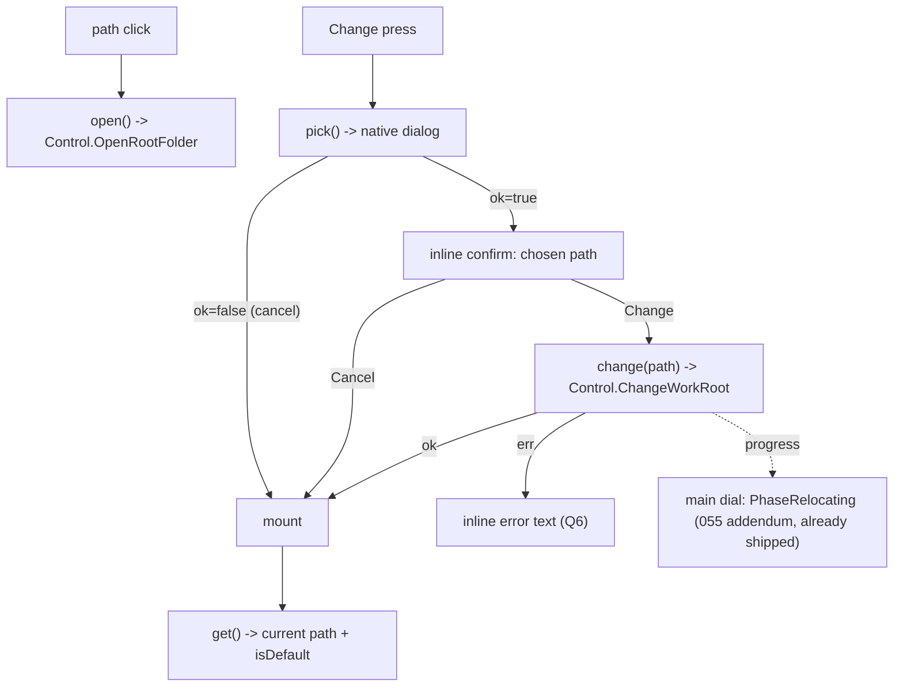

# 056 — Work root: native folder dialog + Advanced UI (Phase F of #055)

**Status:** Draft
**Date:** 2026-08-11

## Background

[[055-operational-functional-root-split]] shipped the whole content-root
relocation mechanism (`ControlService.GetWorkRoot`/`ChangeWorkRoot(path
string)`/`ResetWorkRoot`, the swappable-storage swap, ACID crash safety) but
explicitly deferred its own Phase F: "native folder dialog + Advanced-settings
UI section, wiring the Phase E API" (055 §Q5, "API now, UI later — per user
direction"). No frontend surface exists today — the only caller of
`ChangeWorkRoot` is Go tests and `internal/integration`.

## Problem

User asked for native folder selection for the workroot in the Settings UI.
This is Phase F itself: reachable only via direct backend calls today, no way
for a user to change their workroot without editing `settings.json` by hand.

## Verified externals (this session)

**Wails v3 alpha.77 dialog API**, `pkg/application`:
```go
app.Dialog.OpenFileWithOptions(&application.OpenFileDialogOptions{
    CanChooseDirectories: true,
    CanChooseFiles:       false,
    CanCreateDirectories: true,
    Title:                "Choose a folder",
    Directory:            config.WorkRoot, // start at current
}).PromptForSingleSelection() // (string, error)
```
Read `dialogs.go` + `dialogs_darwin.go` (macOS is the dev platform) directly:
on **Cancel**, macOS's `NSOpenPanel` completion handler skips
`openFileDialogCallback` entirely and calls only
`openFileDialogCallbackEnd`, which `close()`s the response channel without
ever sending — so `PromptForSingleSelection()` returns `("", nil)` on cancel,
**not an error**. Callers must treat empty-path-and-nil-error as "user
cancelled," distinct from a real dialog failure (non-nil `err`).

`application.Get()` returns the process-wide `*App` singleton (set by
`application.New()` in `cmd/gui/main.go`), which carries the same `Dialog
*DialogManager` field — no window handle strictly required
(`OpenFileDialogOptions.Window` is optional; unset shows an unattached panel).

## Design constraints from the existing codebase

- **`internal/gui/control` never imports `wails/v3/pkg/application`** (0 hits
  today) — it stays a plain Go driving adapter, testable without a real Wails
  app. `cmd/gui/main.go` is the only place that constructs `application.App`
  and wires Wails-specific callbacks into `ControlService` via setters
  (`wailsViewEmitter.bind`, `SetLocalStatsFn`, `SetConsoleReader`,
  `SetWorkRoot` itself). The dialog must be wired the same way: a plain Go
  function type injected via a new setter, not a direct `application` import
  in `control.go`.
- **house UX rule (sync-view.ts, versions-view.ts doc comments): no modal
  confirmation dialogs for destructive actions** — "inline two-step reveal…
  no dialog, no popup, no toast." `ChangeWorkRoot`/`ResetWorkRoot` are
  data-moving and slower than the existing Restore/Delete/Revert actions they
  sit beside, but the confirm affordance should follow the same inline
  pattern, not a native `<dialog>`.
- **Advanced pane composition** (`advanced-view.ts`): flat `<section>`s,
  host injects async thunks as `@property`, child re-emits typed
  `CustomEvent`s the host (`ritual-app.ts`) wires to `wails-api` calls. New
  `<work-root>` section follows the same shape as `<retention-rules>`
  (staged value + explicit action, not autosave) and `<versions-view>`
  (inline confirm reveal for a consequential action).

## Questions and Answers

**Q1. Does the picker call belong on `ControlService`, or should the
frontend call Wails' own generated dialog binding directly?**
**A: `ControlService` gains a new method, `PickWorkRootFolder() (path
string, ok bool)`.** Keeps the frontend on the single `wails-api.ts` surface
(house convention — every other backend call goes through `Control.*`), and
keeps validation/business rules server-side. `ok=false` means cancelled (no
error to surface); a real OS-level dialog failure is logged server-side and
also returns `ok=false` (dialog failures are not actionable by the user —
same treatment as `revealFolder`'s ignored `cmd.Start()` errors elsewhere in
this file). Wired via a new setter `SetDirectoryPicker(fn func(dir string)
(string, error))`, following the `SetConsoleReader`/`SetLocalStatsFn`
convention — `cmd/gui/main.go` supplies the real closure:
```go
controlSvc.SetDirectoryPicker(func(dir string) (string, error) {
    return wailsApp.Dialog.OpenFileWithOptions(&application.OpenFileDialogOptions{
        CanChooseDirectories: true,
        CanChooseFiles:       false,
        CanCreateDirectories: true,
        Title:                "Choose workroot folder",
        Directory:            dir,
    }).PromptForSingleSelection()
})
```
A nil picker (unset, e.g. in tests) makes `PickWorkRootFolder` return
`("", false)` immediately — same "degrade explicitly" convention the struct
doc comment already states for `sync`/`dirty`/`versions`.

**Q2. One combined "pick + change" call, or two round-trips (pick, then a
separate change with the chosen path)?**
**A: Two separate calls**, mirroring `ChangeWorkRoot(path string)`'s own
existing signature (055 §Q5: "takes an explicit path argument so it's
callable/testable without any dialog"). Frontend flow: `PickWorkRootFolder()`
→ if cancelled, stop; else show the chosen path + Change/Cancel inline
confirm → on confirm, `ChangeWorkRoot(path)`. Keeps the two concerns
(picking vs. committing) independently testable, and lets the UI show the
chosen path before committing to the move.

**Q3. What does the UI show while `ChangeWorkRoot` runs?**
**A: The existing relocate telemetry already on the dial.** [[055]]'s
addendum wired `StageRelocating`/`PhaseRelocating` into `projection.ViewModel`
— the main dial already renders "Moving files" + `N of M files` for any
in-flight relocate, sourced from `onView`. The new Advanced section itself
only needs a **pending/error** local state around the `ChangeWorkRoot` call
(disable the button, show its error inline) — it does not need to duplicate
progress polling; the dial is already the progress surface, exactly as it is
for Download/Upload today.

**Q4. RUNNING-gate / relocate-in-flight — does the frontend need its own
guard, or does the backend's existing gate suffice?**
**A: Backend gate suffices — surface its error.** `ChangeWorkRoot` already
returns `ErrSessionRunning`/`ErrRelocateInProgress` (055 post-review fixes
#4/#5). The UI's only job is to disable the path click + `Change` affordance
while `!isIdle` (same `canUpdate`-style phase gate `advanced-view.ts`
already uses for "Check for update"), and render whatever error string comes
back verbatim if a race slips through.

**Q5. "Use default" (Reset) affordance in this UI pass?**
**A (revised, live design review 2026-08-11): dropped.** `ResetWorkRoot`
stays a real, tested Control-layer method (055 §Q5) but this pass ships no
UI entry point for it — a user who wants the default back can `Change` to it
like any other folder. Simplifies the section to two affordances (path,
Change) instead of three. Can be reinstated later without any backend work
if it turns out to be missed.

**Q5b. Path affordance and button label — separate "Open folder" button and
"Change folder…" label, or something tighter?**
**A (revised, live design review 2026-08-11): the displayed path itself is
the "open folder" control** (click → `OpenRootFolder`) — no separate button.
The relocate action is a single-word **`Change`** button, not "Change
folder…" — the section is already labelled "Work folder" (advanced-view.ts's
`<p class="label">`), so the button doesn't need to repeat "folder."

**Q6. Error surface for `ChangeWorkRoot` failures (validation rejects,
permission errors, corrupted-blob abort)?**
**A: Inline error text under the section**, same placement as
`sync-view.ts`'s `case "error":` branch (`Try again` button + message) —
house convention, no toast/banner component exists elsewhere in this
codebase for this class of error.

## Design

### Backend (`internal/gui/control`)

```go
// control.go — new field + setter, same convention as SetConsoleReader
directoryPicker func(dir string) (string, error) // nil ⇒ PickWorkRootFolder degrades to (‑, false)

func (c *ControlService) SetDirectoryPicker(fn func(dir string) (string, error)) {
    c.mu.Lock(); defer c.mu.Unlock()
    c.directoryPicker = fn
}

// PickWorkRootFolder opens the native OS directory picker, seeded at the
// current WorkRoot. ok=false covers both user-cancel and an unset/failing
// picker — neither is user-actionable, so callers show nothing rather than
// an error (mirrors OpenRootFolder's ignored exec error).
func (c *ControlService) PickWorkRootFolder() (path string, ok bool) {
    c.mu.Lock(); fn := c.directoryPicker; c.mu.Unlock()
    if fn == nil {
        return "", false
    }
    p, err := fn(config.WorkRoot)
    if err != nil || p == "" {
        return "", false
    }
    return p, true
}
```

`cmd/gui/main.go`: after `wailsApp := application.New(appOptions)`, call
`controlSvc.SetDirectoryPicker(...)` (the Q1 closure) alongside the existing
`SetWorkRoot`/`SetConsoleReader` wiring block.

### Frontend

**`wails-api.ts`** — three new thin exports, same shape as the existing
`getWorkFolder`-style calls (naming follows the Go method names 1:1, as
every other export in this file already does). No `resetWorkRoot` export
(Q5 — no UI entry point in this pass):
```ts
export const getWorkRoot = () => Control.GetWorkRoot();
export const pickWorkRootFolder = () => Control.PickWorkRootFolder();
export const changeWorkRoot = (path: string) => Control.ChangeWorkRoot(path);
```

**New `frontend/src/ui/work-root.ts`** (`<work-root>`), presentational like
`sync-view.ts`/`versions-view.ts` — no `wails-api` import, thunks injected:
```ts
export interface WorkRootInfo { path: string; isDefault: boolean }

@customElement("work-root")
class WorkRootEl extends LitElement {
  @property({ attribute: false }) get: () => Promise<WorkRootInfo>;
  @property({ attribute: false }) open: () => Promise<void>; // path-click target
  @property({ attribute: false }) pick: () => Promise<{ path: string; ok: boolean }>;
  @property({ attribute: false }) change: (path: string) => Promise<void>;
  @property({ type: Boolean }) idle = false; // gate, Q4

  @state() private _info: WorkRootInfo | null = null;
  @state() private _pendingPath: string | null = null; // picked, awaiting confirm (Q2)
  @state() private _phase: "loading" | "idle" | "confirm" | "busy" | "error" = "loading";
  @state() private _error = "";
}
```
Render: current path, itself a clickable control (`<button class="path">`,
Q5b) → `openRootFolder`; ellipsised via plain CSS `text-overflow: ellipsis`
(a tail-truncating `direction: rtl` variant was tried and dropped — it
reorders leading/trailing path separators under the bidi algorithm when the
text doesn't actually overflow, confirmed live in Storybook: `/Users/…`
rendered as `Users/…/`). Single **`Change`** button (Q5b) →
`pick` → inline confirm bar with the chosen path → Change/Cancel (Q2/Q6).
Disabled whenever `!idle` (Q4). No reset affordance (Q5).

**`advanced-view.ts`**: new `<section><p class="label">Work folder</p>
<work-root .get=... .open=... .pick=... .change=... ?idle=${...}>` sibling
of the existing sections, `idle` threaded down the same way `canUpdate`
already is.

**`ritual-app.ts`**: wires `getWorkRoot`/`openRootFolder`/
`pickWorkRootFolder`/`changeWorkRoot` from `wails-api.ts` into the new props,
`idle` derived from the same phase check `canUpdate` already uses.



## Implementation Plan

- **Phase A** — `ControlService.PickWorkRootFolder` + `SetDirectoryPicker`;
  `cmd/gui/main.go` wiring with the verified `OpenFileWithOptions` call.
  Tests: nil picker degrades to `("", false)`; injected picker returning
  `("", nil)` (cancel) also degrades to `("", false)`; injected picker
  returning a path passes through; injected picker error degrades to
  `("", false)`.
- **Phase B** — `wails-api.ts` exports; `work-root.ts` component + story
  (mirrors `sync-view.stories.ts`'s verdict-matrix approach: idle/default,
  idle/non-default, picking, confirm-pending, busy, error) + behavior tests
  (`@web/test-runner`).
- **Phase C** — `advanced-view.ts` section + `ritual-app.ts` wiring.
  Manual verify (per `frontend/CLAUDE.md`, "start the dev server… test the
  golden path and edge cases"): Change to a real second folder, confirm the
  dial shows `PhaseRelocating`, confirm the section reflects the new path
  after; RUNNING-gate rejection surfaces its error text; path click reveals
  the folder in the OS file manager.

## Verification criteria

- Native OS folder picker opens seeded at the current workroot; Cancel
  returns to the section unchanged, no error shown.
- Choosing a folder shows an inline confirm with the chosen path before any
  data moves.
- Confirming triggers `ChangeWorkRoot`; the main dial shows the existing
  `PhaseRelocating` progress (055 addendum) for the duration; on success the
  section reflects the new path and `isDefault=false`.
- A rejection (`ErrSessionRunning`, `ErrRelocateInProgress`, validation,
  permission, corrupted-blob abort) renders inline error text; no partial UI
  state (path unchanged).
- Clicking the displayed path reveals the workroot in the OS file manager
  (`OpenRootFolder`).
- Path click and Change are both disabled whenever the session is not idle.

## Trade-offs

- **Pro:** all business logic (validation, ACID swap, RUNNING-gate) already
  landed in 055 — this phase is purely a thin dialog adapter + presentational
  component, no new backend risk surface.
- **Pro:** reuses the dial's existing `PhaseRelocating` telemetry instead of
  building a second progress UI inside Advanced.
- **Con:** two round-trips (pick, then change) instead of one combined
  dialog-and-commit call — deliberate (Q2), trades one extra IPC call for
  independently testable pick/commit and a visible pre-commit confirm.
- **Con:** `PickWorkRootFolder`'s `ok=false` conflates "user cancelled" with
  "dialog failed to open" — accepted (Q1): a dialog-open failure is not
  something the user can act on differently than a cancel, and Wails itself
  doesn't distinguish the failure mode further on macOS (empty channel close
  either way).
